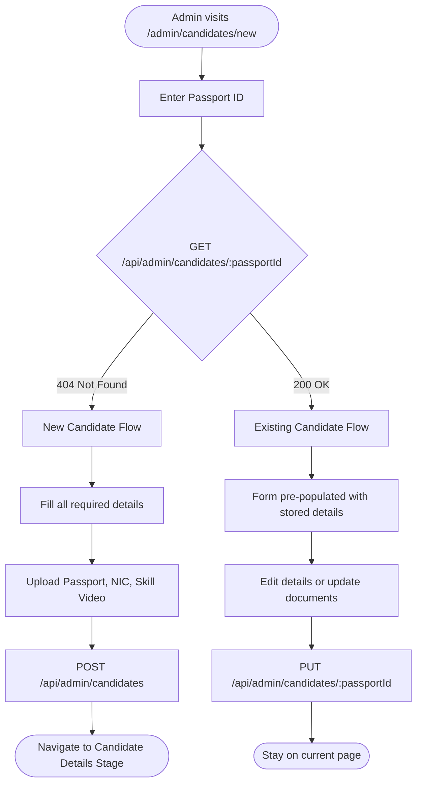
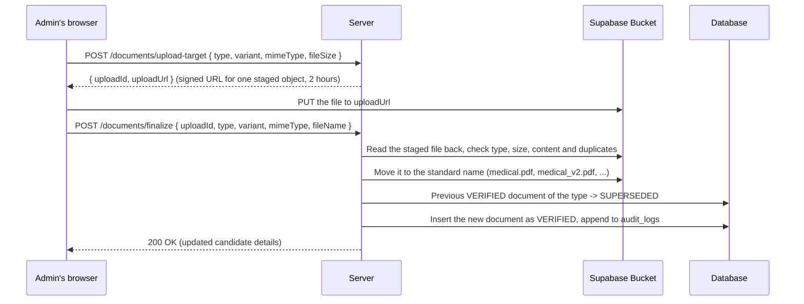

# Candidate Management

Status: **Implemented and verified. Applies to all active admin and reviewer accounts.**

This document covers the Candidate Management feature introduced after Phase 10: how candidates are registered, how their six-stage deployment process works, how documents are uploaded, and what the recent bug-fix release (C1, D1, E1) changed.

---

## 1. Overview

**Candidate Management** is a section of the admin dashboard (`/admin/candidates`) for managing deployment candidates — people being prepared for overseas deployment. It is separate from the main WhatsApp-driven document review workflow (clients).

A candidate is stored as a row in the `candidate` table (named `users` before migration `20261008120000_rename_candidate_user_tables`) identified by their **passport ID**. The same table is used for WhatsApp clients; a candidate who later sends documents via WhatsApp is the same row.

| | |
|---|---|
| URL | `/admin/candidates` |
| Add candidate | `/admin/candidates/new` |
| Candidate detail | `/admin/candidates/:passportId?stage=…` |
| Who can read | Any active admin |
| Who can write | Reviewer role or above |
| Search | By name, passport ID, NIC, or WhatsApp number |
| Uniqueness | Passport ID and NIC are unique. WhatsApp number is unique per candidate (DB-level partial index). |

---

## 2. File Structure

### Backend

| File | Purpose |
|---|---|
| `src/services/candidateService.js` | All candidate business logic: registration, stage updates, document uploads, validation, uniqueness checks |
| `src/services/candidateAdditionalDetailsService.js` | Additional details: validation, read with suggestions, save with audit |
| `src/routes/admin.js` | Express routes for `/api/admin/candidates/*` |

### Frontend (admin/)

| File | Purpose |
|---|---|
| `admin/src/pages/CandidatesPage.tsx` | Candidates list with search, pagination |
| `admin/src/pages/CandidateRegistrationPage.tsx` | Add / edit candidate form |
| `admin/src/pages/CandidateDeploymentPage.tsx` | Six-stage deployment view per candidate |
| `admin/src/components/candidate/CandidateFields.tsx` | Shared form fields (all candidate detail inputs) |
| `admin/src/components/candidate/StagePanels.tsx` | Stage-specific panel components |
| `admin/src/components/candidate/DocumentRow.tsx` | Per-document upload row (used in both registration and stage 2) |
| `admin/src/components/candidate/CandidateStepper.tsx` | Progress stepper shown across the top of the deployment page |
| `admin/src/components/candidate/CallLogDialog.tsx` | Admin call log dialog |
| `admin/src/components/candidate/AdditionalDetailsPanel.tsx` | Additional Details tab: sections, conditional fields, sizes, save |
| `admin/src/api/candidates.ts` | Typed frontend API wrappers for all candidate endpoints |

### Database

| Table | Purpose |
|---|---|
| `candidate` | One row per candidate (same table used for WhatsApp clients) |
| `candidate_stages` | One row per stage per candidate: completion, notes, timestamps |
| `documents` | All uploaded files (passport, NIC, skill video, medical, police report, scan) |
| `candidate_additional_details` | At most one row per candidate: the Additional Details tab (primary key and foreign key `passport_id`) |
| `audit_logs` | Candidate, stage, document and additional-details changes are appended here |

---

## 3. Registration (`/admin/candidates/new`)

The **Add candidate** page (`CandidateRegistrationPage`) works in two modes depending on whether the entered passport ID is already on record:



### 3.1 New candidate

1. The admin enters a passport ID (6–9 alphanumeric characters, must include at least one digit).
2. On field blur (or form submit), the frontend calls `GET /api/admin/candidates/:passportId`.
3. If the response is **404**, the passport ID is new. The admin fills in the full details form and uploads:
   - **Passport** (required, PDF/JPG/PNG, ≤ 50 MB)
   - NIC document (optional)
   - Skill video (optional, `video/mp4`, `video/quicktime`, `video/webm`)
4. On submit, `POST /api/admin/candidates` creates the `candidate` row and stage rows, then documents are uploaded one by one.
5. On success the admin is navigated to the candidate's deployment page at `CANDIDATE_DETAILS` stage.

**Fields collected at registration:**

| Field | Required | Notes |
|---|---|---|
| Passport ID | ✓ | Normalized to uppercase, 6–9 letters and digits with at least one digit (hint `!` beside the label) |
| Surname | ✓ | |
| Other names | ✓ | |
| NIC | ✓ | 9 digits + V/X, or 12 digits |
| Address | | Optional everywhere (registration, saving details, completing Candidate details) |
| Job types | ✓ | Up to 10 chips; Enter or comma to add |
| Job experience | ✓ | |
| Nationality | | |
| Sex | | M / F / X (as on ICAO passports) |
| Date of birth | | |
| Place of birth | | |
| Passport issue date | ✓ | Before the expiry date (hint `!`) |
| Passport expiry date | ✓ | After the issue date (hint `!`) |
| WhatsApp number | ✓ | Fixed `+94` prefix; the user types the 9-digit mobile number (e.g. `771234567`). Stored as `94771234567`. Locked once saved (see §5.1) (hint `!`) |
| Contact number | | |
| Comment | | Internal note, saved to `CANDIDATE_DETAILS` stage |

### 3.2 Existing candidate

If `GET /api/admin/candidates/:passportId` returns **200**, the candidate already exists. The form is pre-populated with their stored details. The admin can:

- Edit any field (except the passport ID and a locked WhatsApp number — see §5.1).
- Replace or add their **Passport**, **NIC document**, or **Skill video** via the live `DocumentRow` upload controls (same versioning as WhatsApp documents: a new upload becomes `VERIFIED`, the previous one becomes `SUPERSEDED`).
- Update the `CANDIDATE_DETAILS` stage comment.

On save, the form calls `PUT /api/admin/candidates/:passportId` and, if the comment changed, `PUT /api/admin/candidates/:passportId/stages/CANDIDATE_DETAILS`.

---

## 4. Seven-Stage Deployment Process

Each candidate has exactly **seven stages**, always in this order:

```mermaid
flowchart LR
    S1[1. Test Details\n(Admin)] --> S2[2. Candidate Details\n(Automatic)]
    S2 --> S3[3. Document Submission\n(Automatic)]
    S3 --> S4[4. IVS Interview\n(Admin)]
    S4 --> S5[5. Visa Submission\n(Admin)]
    S5 --> S6[6. Visa Approval\n(Admin)]
    S6 --> S7[7. Finalizing Job\n(Admin)]
    
    classDef auto fill:#e1bee7,stroke:#8e24aa,stroke-width:2px,color:#000;
    classDef manual fill:#bbdefb,stroke:#1976d2,stroke-width:2px,color:#000;
    
    class S1,S4,S5,S6,S7 manual;
    class S2,S3 auto;
```

| # | Stage key | Label | Completed by |
|---|---|---|---|
| 1 | `TEST_DETAILS` | Test details | Admin (checkbox) |
| 2 | `CANDIDATE_DETAILS` | Candidate details | Automatically — when required fields and passport are present |
| 3 | `DOCUMENT_SUBMISSION` | Document submission | Automatically — when all 5 required documents are present |
| 4 | `IVS_INTERVIEW` | IVS interview | Admin (checkbox) |
| 5 | `VISA_SUBMISSION` | Visa submission | Admin (checkbox) |
| 6 | `VISA_APPROVAL` | Visa approval | Admin (checkbox) |
| 7 | `FINALIZING_JOB` | Finalizing the job | Admin (checkbox) |

The progress stepper on the candidate page shows Test details, Candidate details, Additional details, Document submission, Visa submission and Visa approval. IVS interview and Finalizing the job have no circle (their data and `?stage=` links are unchanged). The candidate list's progress counts all seven stages (`x/7`).

Stages are independent: any stage can be opened and edited in any order. The URL uses `?stage=<key>` to select which panel is shown; the default is the first incomplete stage.

### 4.1 Automatic stages (2 and 3)

**Stage 2 — Candidate details** is marked complete when the following required fields are filled **and** a `PASSPORT` document is uploaded:

- Surname, other names, NIC, passport issue date, passport expiry date, one or more job types, job experience, WhatsApp number. The address is **not** needed.

Candidates saved before the passport dates were required still load; their Candidate details shows the dates as missing until they are filled in (they must be, to save the details again).

The panel shows what is still missing (`Missing: …`) until complete.

**Stage 3 — Document submission** is marked complete when all five required documents are on record:

- PASSPORT, MEDICAL, POLICE_REPORT, SCAN.

A checklist of the five documents is shown at the top of the panel.

### 4.2 Notes stages (1, 4, 5, 6, 7)

Each has a free-text **Notes** field and a **Stage completed** checkbox. Changes are saved with **Save changes** / discarded with **Cancel**. The `PUT /api/admin/candidates/:passportId/stages/:stage` endpoint accepts `{ notes, completed }`.

### 4.3 Call log

Every candidate page has a **Call log** button (top right). The dialog shows a chronological log of admin call notes and allows adding new ones (`POST /api/admin/candidates/:passportId/call-logs`).

### 4.4 Additional Details tab

Every candidate page has two tabs: **Deployment** (the six stages) and **Additional Details** (`?tab=additional`). Every role that manages candidates can edit it, REGISTRATION_DESK included.

| Section | Fields |
|---|---|
| Passport & Personal Details | Passport number (read-only: the candidate's passport ID), name according to passport, permanent address, birthday |
| Clothing & Sizes | T-shirt size (XS–XXL), pant size (28–46 or custom), shoe size (UK 5–13 or custom) |
| Father Details | Is father alive? If Yes: full name (required), birthday |
| Mother Details | Is mother alive? If Yes: full name (required), birthday |
| Marital & Family Details | Marital status; if Married: wife full name (required), wife birthday; 1st–3rd child names |
| Employment / Skills | Other job skills |

- **Always the existing candidate**: the passport number is the candidate's own passport ID and can't be edited, so a duplicate candidate can't be created from here. The API resolves the passport ID to the existing record and returns 404 for an unknown one.
- **Auto-fill**: a form with nothing saved yet is pre-filled from the candidate's record (name, address, date of birth), with a note saying so. Those values are stored only when **Save additional details** is pressed.
- **The candidate's own record is never changed** from this tab; the details live in `candidate_additional_details`.
- Hidden details are cleared on save: father details when he is not alive, and the same for the mother and for the wife when not married.
- Every change appears in Audit Logs (`CREATE_ADDITIONAL_DETAILS` / `UPDATE_ADDITIONAL_DETAILS`) with only the changed fields. Saving without changes writes nothing.

---

## 5. Bug-Fix Release (2026-10-01)

The following issues were fixed in a single release. The stage order, completion logic, and overall UI layout were not changed.

### 5.1 C1 — WhatsApp uniqueness race condition

**Problem:** Two near-simultaneous registrations could both pass the application-level WhatsApp duplicate check and save the same number.

**Fix:**

- A **partial unique index** was added to the database:

  ```sql
  -- prisma/migrations/20261001140000_whatsapp_unique_constraint/migration.sql
  CREATE UNIQUE INDEX "users_whatsapp_number_key" ON "users"("whatsapp_number")
  WHERE "whatsapp_number" IS NOT NULL AND "whatsapp_number" != '+94771581916';
  ```

  Historical SQL: migration `20261008120000_rename_candidate_user_tables` later renamed the table to `candidate` and this index to `candidate_whatsapp_number_key`.

  The exclusion covers one pre-existing duplicate that cannot be cleaned up without business input. All new registrations are enforced at the database level.

- `src/services/candidateService.js` was updated in `createCandidate` and `updateCandidateDetails` to catch Prisma's `P2002` error (unique constraint violation) and throw a friendly `CandidateError` with code `WHATSAPP_EXISTS` (HTTP 409) instead of letting a raw database error surface.

> The application-level check in `candidateService.js` is kept so admins still see a friendly validation message before the request reaches the database.

**Note on the known duplicate:** `+94771581916` is associated with two existing rows (`P0124960` and `P1215209`). It was excluded from the index. Do **not** silently delete, merge, or modify either row; resolve it with the business team.

---

### 5.2 D1 — WhatsApp field read-only for existing candidates

**Problem:** When an admin edited an existing candidate's details, the WhatsApp field appeared editable. But the server silently ignored any change to it (by design — the number must not change once registered). This caused confusion.

**Fix (UI only):** In `admin/src/components/candidate/CandidateFields.tsx`, when `whatsappLocked` is `true` (i.e. a WhatsApp number is already stored), the field renders as `readOnly` and a hint is shown below it:

```
Registered WhatsApp numbers cannot be changed.
```

The `whatsappLocked` prop is passed from both `CandidateDetailsStage` (deployment page) and `CandidateRegistrationPage` (registration form) as:

```tsx
whatsappLocked={Boolean(details.candidate.whatsappNumber)}
```

No API change was needed.

---

### 5.3 E1 — Stale state when navigating between candidates

**Problem:** Navigating from Candidate A's page directly to Candidate B's page (e.g. via breadcrumb → list → another row) could briefly show Candidate A's data in Candidate B's URL. React's local state was not reset on route parameter change.

**Fix** (`admin/src/pages/CandidateDeploymentPage.tsx`):

1. A `useEffect` dependent on `passportId` now clears the locally updated copy (`setUpdated(null)`) and closes the call log dialog (`setCallLogOpen(false)`) whenever the route changes.
2. The candidate data is gated: if `details.candidate.passportId` does not match the current URL `passportId`, the loading spinner is shown instead of stale data:

```tsx
if (!details || details.candidate.passportId.toUpperCase() !== passportId.toUpperCase()) {
    return <Card><LoadingState label="Loading candidate…" /></Card>;
}
```

---

### 5.4 Search retry stale results

**Problem:** When a candidate search failed and the admin clicked **Try again** (via `ErrorState`'s retry), the previous search results would flash briefly on screen before the new request completed.

**Fix** (`admin/src/pages/CandidatesPage.tsx`): A `useRef` flag tracks whether the last settled state was an error. During a retry (`status === "loading"` while `wasErrorRef.current` is `true`), `data` is forced to `null` so no stale rows are displayed:

```tsx
const wasErrorRef = useRef(false);
if (list.status === "error") wasErrorRef.current = true;
if (list.status === "success") wasErrorRef.current = false;
const data = (list.status === "error" || (list.status === "loading" && wasErrorRef.current)) ? null : list.data;
```

Normal pagination is unaffected: rows from the previous page remain visible while the next page loads.

---

## 6. Document Uploads

### Accepted file types

| Document type | Accepted MIME types |
|---|---|
| Passport, NIC, Medical, Police Report, Scan, Visa submission | `image/jpeg`, `image/png`, `application/pdf` |
| Skill video | `video/mp4`, `video/quicktime`, `video/webm` |

Size limits: **50 MB** for a skill video, **10 MB** for every other document. They are checked when the upload is requested, again on the stored file, and by the Supabase bucket (its file size limit must be at least 50 MB).

**Production note:** the Supabase bucket must stay private, and its **Allowed MIME types** must include the six types above (`video/mp4`, `video/quicktime`, `video/webm` for skill videos). This is set in the Supabase Dashboard under **Storage → Bucket Settings**, not in the source code.

### Upload flow (browser → Supabase, never through the API)

The file goes straight from the admin's browser to Supabase Storage; the API only receives two small JSON requests. On Vercel this keeps large files (videos) clear of the request body limit.



- The new file becomes `VERIFIED`; the previous `VERIFIED` file becomes `SUPERSEDED` (kept, not deleted) — the same rule as WhatsApp-submitted documents (`clientDocumentService.js`).
- A refused file (wrong type, too large, duplicate) is removed from storage and nothing is recorded.
- An upload never finalized (tab closed mid-way) stays as `upload_<uuid>` and is removed the next time that document type is uploaded for the candidate, once it is over an hour old.
- An upload or replacement is saved as soon as it finishes; the document row then shows **Saved**. **Save changes** is only for the form's fields.

### Removing a document

**Remove** (on a document row with a stored file; admins and reviewers) permanently deletes the candidate's current document of that type: its `documents` row and its file in storage.

- A reason is required; the removal is written to `audit_logs` (`REMOVE_DOCUMENT`, previous status, reason, type, checksum) and the entry is kept after the document is gone.
- Only the current document can be removed. Earlier versions (`SUPERSEDED`) stay as history, and the slot is left empty, not rolled back to the previous version.
- The file is kept if another record still points at it.
- Stage completion follows: removing the passport makes Candidate details incomplete again.
- The same file can be uploaded again afterwards.

This is one of two places that delete documents; the other is Remove from Review. A guard test (`test/adminReviewRemoveStored.test.js`) fails if any other code deletes a document.

### Document variants

| Document | Variants |
|---|---|
| Police Report | `SL_VERIFIED`, `ROMANIA`, `SL_NORMAL` |

| Others | None |

---

## 7. API Reference

All routes are mounted under `/api/admin/candidates` by `src/routes/admin.js`.

| Method | Path | Role | Description |
|---|---|---|---|
Every route below allows the same roles (`CANDIDATE_STAFF`): ADMIN, MANAGER, ANALYST, REGISTRATION_DESK. Any other role gets 403.

| Method | Path | Description |
|---|---|---|
| `GET` | `/candidates` | List candidates (paginated, searchable) |
| `POST` | `/candidates` | Register a new candidate |
| `GET` | `/candidates/:passportId` | Get a single candidate (also used for the registration lookup) |
| `PUT` | `/candidates/:passportId` | Update candidate details |
| `PUT` | `/candidates/:passportId/stages/:stage` | Update a stage (notes, completed) |
| `POST` | `/candidates/:passportId/documents/upload-target` | Check a file's description; returns a signed upload URL (JSON only) |
| `POST` | `/candidates/:passportId/documents/finalize` | Check the uploaded file and record it (JSON only) |
| `POST` | `/candidates/:passportId/documents/:documentId/remove` | Delete the current document and its file; `{ reason }` required |
| `GET` | `/candidates/:passportId/call-logs` | List call log entries |
| `POST` | `/candidates/:passportId/call-logs` | Add a call log entry |
| `GET` | `/candidates/:passportId/additional-details` | Additional details, or suggestions from the candidate record when none are saved |
| `PUT` | `/candidates/:passportId/additional-details` | Save additional details (full replacement; audited; never creates a candidate) |

### Error codes

`CandidateError` is thrown by `candidateService.js` and returned as `{ message, code }` by the route handler.

| Code | HTTP | Meaning |
|---|---|---|
| `NOT_FOUND` | 404 | Passport ID does not exist |
| `CANDIDATE_EXISTS` | 409 | Passport ID is already registered |
| `NIC_EXISTS` | 409 | NIC is already in use by another candidate |
| `WHATSAPP_EXISTS` | 409 | WhatsApp number is already registered to another candidate |
| `WHATSAPP_LOCKED` | 409 | A different WhatsApp number was sent for a candidate who already has one |
| `AUTOMATIC_STAGE` | 409 | Completion was set by hand on a stage completed by its data (Candidate details, Document submission) |
| `FILE_REJECTED` | 422 | Wrong file type, empty, too large, or content not matching its type |
| `DUPLICATE_FILE` | 409 | This exact file is already stored for the candidate |
| `UPLOAD_NOT_FOUND` | 404 | Finalize found no uploaded file for that upload ID, candidate and type |
| `DOCUMENT_NOT_FOUND` | 404 | Remove: not the candidate's current document (already removed or replaced) |
| `TRY_AGAIN` | 503 | Registration could not get a free unique ID; retry |

An unknown stage key returns 404 `Stage not found`; malformed input returns 400 with `errors`.

### Query parameters — `GET /candidates`

| Parameter | Type | Default | Description |
|---|---|---|---|
| `page` | integer >= 1 | 1 | Page number |
| `pageSize` | integer | 25 | Results per page |
| `search` | string | — | Search by name, passport ID, NIC, WhatsApp number |

### Upload request bodies

No route accepts a file body; both upload requests are small JSON.

| Request | Body |
|---|---|
| `upload-target` | `{ type, variant?, mimeType, fileSize, fileName? }` (`variant` required for Police Report) |
| `finalize` | `{ uploadId, type, variant?, mimeType, fileName? }` (`uploadId` from `upload-target`) |
| `remove` | `{ reason }` (1–500 characters) |

---

## 8. Validation Rules

These are enforced by `parseCandidateBody` in `candidateService.js` (server) and `validateDetails` in `CandidateFields.tsx` (client):

| Field | Rule |
|---|---|
| Passport ID | `/^[A-Z0-9]{6,9}$/` with at least one digit |
| Surname, other names | Required, <= 100 characters |
| NIC | `/^(\d{9}[VX]|\d{12})$/` |
| Address | Optional everywhere, <= 500 characters |
| Job types | At least 1, at most 10; each <= 60 characters |
| Job experience | Required, <= 2000 characters |
| Nationality | Optional, <= 60 characters |
| Sex | `M`, `F`, or `X` (ICAO) |
| Dates | `YYYY-MM-DD`; passport issue and expiry dates **required** (registration and every save), issue date before expiry date |
| WhatsApp | Required. Form: fixed `+94` prefix plus 9 digits starting with 7 (a leading `0` or a pasted `+94…` / `0094…` is taken off). Stored as international digits without `+` (`94771234567`), the server's existing format (`normalizePhoneNumber`). A number already on record is read-only and kept as stored |
| Contact | If given: 8–15 digits (after removing spaces, dashes, `+`, leading `00`) |
| Comment | Optional, <= 2000 characters |

### 8.1 Additional details

Enforced by `parseAdditionalDetailsBody` in `candidateAdditionalDetailsService.js` (server) and `validateAdditionalDetails` in `AdditionalDetailsPanel.tsx` (client). Every field is optional unless stated.

| Field | Rule |
|---|---|
| Name according to passport, parent / wife / child names | <= 150 characters |
| Permanent address | <= 500 characters |
| Other job skills | <= 1000 characters |
| Birthdays | `YYYY-MM-DD`, a real date, from 1900-01-01, not in the future |
| T-shirt size | `XS`, `S`, `M`, `L`, `XL`, `XXL` |
| Pant / shoe size | A preset or a custom value: up to 10 letters, digits, spaces, `.`, `/`, `-` |
| Father / mother alive | `true` / `false` / not recorded; full name required when `true`; name and birthday refused otherwise |
| Marital status | `SINGLE`, `MARRIED`, `DIVORCED`, `WIDOWED`, `SEPARATED`; wife full name required when `MARRIED`; wife details refused otherwise |
| Children | In order: no 2nd without a 1st, no 3rd without a 2nd |

---

## 9. Debugging Utility

A script was used during the C1 investigation to check for duplicate WhatsApp numbers in the database:

```js
// check-duplicates.cjs  (CommonJS — run with: node check-duplicates.cjs)
const { PrismaClient } = require('./generated/prisma');

async function main() {
    const prisma = new PrismaClient();
    try {
        // Candidates are prisma.candidate (the model was named User when this
        // script was first written; prisma.user is now the staff table).
        const users = await prisma.candidate.findMany({
            where: { whatsappNumber: { not: null } }
        });
        const counts = {};
        for (const u of users) {
            counts[u.whatsappNumber] = (counts[u.whatsappNumber] || 0) + 1;
        }
        const duplicates = Object.keys(counts).filter(k => counts[k] > 1);
        console.log("Duplicates:", duplicates);
    } finally {
        await prisma.$disconnect();
    }
}
main();
```

This file lives at the project root as `check-duplicates.cjs` and is a one-off diagnostic tool; it is not part of the application.
