# Google Sheets Candidate Operational Mirror
## Architecture & Project-Scope Specification

- **Feature Name:** Google Sheets Candidate Operational Mirror (operational fallback)
- **Document Version:** 1.2.0
- **Status:** DRAFT / PROPOSED — SCOPE FREEZE CANDIDATE (aligned with confirmed Google Sheet provisioning and 41-column legacy-compatible schema; awaiting business confirmation on legacy field mappings [D-18] and row identity [D-17] before implementation)
- **Author:** System Architecture Team
- **Development Branch:** `dev` (this document and all development happen on `dev`)
- **Feature Version Branch:** `version/google-sheet-sync` (preserves the completed feature; see Section 19)
- **Integration / Preview Branch:** `stage` (Vercel Preview testing only; never a development base)
- **Production Branch:** `main` (not touched by this feature without explicit approval)
- **Repository audited:** `dev` branch, read-only inspection. Where a fact exists only on `stage`, it is labelled.
- **Confirmed Target Spreadsheet ID:** `1-11g-0tQruJbgVslH0nzCzG_JRr-4LahSCU8ZJirMpE`
- **Confirmed Target Tab Name:** `Emlynk Candidate Operational Mirror`
- **Confirmed Dedicated Service Account:** `emlynk-sheet-sync@project-aa11e15e-a951-4e1b-a65.iam.gserviceaccount.com` (Editor on the operational spreadsheet)
- **Confirmed Authentication Direction:** Cloud Run runtime service identity with keyless Google authentication / Application Default Credentials (ADC); no downloaded service-account JSON key files
- **Operational Sheet Constraint:** The target spreadsheet is the **real operational Sheet** (no separate dev/test spreadsheet exists by business decision); strict environment write-gating is mandatory
- **Settings Requirement (confirmed):** a visible **Settings** item after Change Roles in the existing Admin Console sidebar, route `/admin/settings`, with **Google Sheet Sync** as a section of that page (Section 12). This overrides any older recommendation to hide the page or make it direct-URL-only.

### How to read this document

| Label | Meaning |
| :--- | :--- |
| **Confirmed** | Proven by the current repository or explicitly confirmed by business/infrastructure stakeholders. |
| **Corrected** | A statement in an earlier revision that the repository or confirmed configuration contradicts; this document replaces it. |
| **Proposed** | A design decision of this document. It does not exist yet. |
| **Needs confirmation** | Cannot be proven from the repository, or is an unresolved business/operational decision. Listed in Section 23. |

Proposed infrastructure (a new Cloud Run service, Cloud Scheduler jobs, new tables) is never described as existing.

---

## 1. Executive Summary & Purpose

The Google Sheets Candidate Operational Mirror is a **one-way, eventually consistent copy** of candidate operational data from PostgreSQL (Supabase) into a private Google Spreadsheet (`1-11g-0tQruJbgVslH0nzCzG_JRr-4LahSCU8ZJirMpE`, tab `Emlynk Candidate Operational Mirror`), so operational staff can keep working from a readable copy if the main application is unavailable.

- **Source of truth:** PostgreSQL/Supabase. The Sheet is an operational fallback/mirror.
- **Not a backup:** it does not replace PostgreSQL backups, point-in-time recovery, `pg_dump` or disaster recovery, and it holds no document files.
- **Direction:** strictly `Database -> Backend Sync System -> Google Sheets`. Nothing ever flows from Google Sheets to the database. A manual edit in the Sheet is overwritten by the next sync or by the daily reconciliation.
- **Isolation:** a Google outage, quota error or misconfiguration must never block or fail a valid candidate write.
- **Self-healing:** near-real-time incremental sync (durable outbox) plus a daily full reconciliation that repairs any drift.
- **Operational Data Safety:** because the target Sheet is the live operational Sheet, test and development executions must never pollute or overwrite operational data.

---

## 2. Project Scope Contract

### IN SCOPE

- One-way candidate operational mirror (PostgreSQL -> Google Sheets).
- Incremental candidate synchronization driven by a durable outbox.
- Daily reconciliation (plus on-demand runs and guarded staging checks).
- Candidate fields approved in Section 6: exactly 41 business-visible columns (A through AO) preserving the legacy Excel operational layout (columns 1 to 26) plus appended candidate details, stage statuses, and mirror metadata, plus a technical row identity key (recommended Column AP).
- Document **statuses** only (never files).
- Candidate stage statuses.
- Preservation of rows for candidates that disappear from the application, marked `DELETED / INACTIVE`.
- Google authentication for the backend sync service using keyless ADC / Cloud Run service identity.
- Retry, recovery and self-healing.
- Operational status/testing interface: the **Settings** sidebar item and its **Google Sheet Sync** section (Section 12).
- Secure scheduling (Cloud Scheduler -> authenticated Cloud Run endpoint).
- Tests, monitoring and structured logging with complete credential/PII redaction.

### OUT OF SCOPE

- Google Sheet -> database writes of any kind.
- Document binary backup (no PDFs, images, videos or passport/NIC/medical files).
- Full PostgreSQL disaster recovery.
- Candidate Pool redesign (the Candidate Pool UI stays untouched).
- Unrelated Admin redesign (the only Admin UI change is appending one Settings sidebar item and its page).
- OCR redesign, WhatsApp workflow redesign, candidate matching redesign, Manual Review redesign.
- Mirroring call logs, `temporary_data` submissions, audit logs or admin accounts (Needs confirmation if ever wanted).
- Merging to `main` without explicit approval.

### NON-NEGOTIABLE INVARIANTS

1. PostgreSQL is authoritative.
2. A Google failure cannot block or fail a valid candidate database write.
3. No credentials in the frontend, in Git, in API responses or in logs. The Vercel deployment holds no Google credentials.
4. No Sheet edit ever writes to the database.
5. **There is only ONE `SCAN`.** No separate Agreements, Affidavits or legacy scan categories.
6. No historical Sheet row is ever deleted.
7. Duplicate candidate rows must be prevented.
8. Reconciliation must repair drift (including manual Sheet edits and missing rows).
9. The Candidate Pool remains untouched.
10. Absence-based `DELETED / INACTIVE` marking only ever happens from a complete, successful database snapshot.
11. **Real Operational Sheet Safeguards:** The target Sheet is the single real operational spreadsheet. There is NO separate dev/test Sheet by business decision. Development, test and preview environments must never pollute or destructively alter real operational rows. Sync writes are strictly environment-gated (`SHEET_SYNC_ENABLED=false` by default).

---

## 3. Repository Verification & Corrections to v1.0.0

Evidence column names the file inspected. Business/infrastructure items that the repository cannot prove are in Section 23.

| # | Topic | v1.0.0 claim | Finding | Evidence |
| :-: | :--- | :--- | :--- | :--- |
| 1 | Stale-row test | `users.updated_date > sheet.last_synced_at` detects change | **Corrected.** `updated_date` is Prisma `@updatedAt` and changes only on writes to the `users` row itself. Stage, document and document-variant changes do not touch it, yet they change the Sheet row (and automatic stages are derived from documents). Not usable for drift detection. | `prisma/schema.prisma` (`User`), `candidateService.js` (`updateStage`, `storeCandidateDocument`) |
| 2 | `unique_id` | unique, immutable, monotonic | **Confirmed unique and NOT NULL** (`@unique`, non-optional). **Confirmed never updated** by application code. **Corrected "monotonic"**: it is generated as highest numeric existing value + 1 (4-digit zero-padded, growing past 9999), retried on a unique-constraint conflict; non-numeric legacy values are ignored by the generator. | `schema.prisma`, `candidateService.js` (`nextUniqueId`, `createCandidate`) |
| 3 | Passport ID rule | `/^[A-Za-z0-9]{1,20}$/` | **Corrected.** That pattern is only the URL-parameter check. Registration normalizes with `normalizePassportId`: uppercase, spaces/hyphens/MRZ filler removed, 6-9 `A-Z0-9` with at least one digit. Update requests do not accept a passport ID. The database key is `passport_id` (primary key, `ON UPDATE CASCADE` on child tables), so it is application-immutable but not database-immutable. | `utils/passportId.js`, `candidateService.js`, migrations |
| 4 | Document statuses | `VERIFIED, REVIEW_REQUIRED, SUPERSEDED, NOT_UPLOADED/MISSING, REMOVED` | **Corrected.** Stored `verification_status` values are only `VERIFIED`, `REVIEW_REQUIRED`, `SUPERSEDED`. `MISSING` is a generated mirror value. `REMOVED` exists only as an audit-log value (removed documents' rows are deleted). `NOT_UPLOADED` is a Police Workflow computed status, not a document status. | `clientDocumentService.js` (`VERIFICATION_STATUS`), `candidateService.js`, `policeCountdownService.js` |
| 5 | Document Submission stage | needs PASSPORT, MEDICAL, POLICE_REPORT (SL_VERIFIED and ROMANIA), SCAN "verified" | **Corrected.** Needs MEDICAL, POLICE_REPORT variant `SL_VERIFIED`, POLICE_REPORT variant `ROMANIA`, and SCAN; "present" means not `SUPERSEDED` (so `REVIEW_REQUIRED` counts). The passport document belongs to the Candidate Details stage. | `candidateService.js` (`automaticStageMissing`) |
| 6 | Stage values | `PASS/FAIL/PENDING` on each stage | **Corrected.** Stages are `completed` booleans (automatic stages are derived, not stored); `PASS`/`FAIL` exist only as `test_result` on `TEST_DETAILS`. | `schema.prisma` (`CandidateStage`), `candidateService.js` |
| 7 | One SCAN | one `SCAN` only | **Confirmed.** `CANDIDATE_DOCUMENT_TYPES` has `PASSPORT, NIC, SKILL_VIDEO, MEDICAL, POLICE_SLIP, POLICE_REPORT, SCAN`; only `POLICE_REPORT` accepts variants. The UI hint says the single scan file combines the agreement and affidavits; that is UI text, not separate types. A schema comment still mentions affidavit variants as history. | `candidateService.js`, `StagePanels.tsx`, `schema.prisma` |
| 8 | Phone format | `+94...` | **Corrected.** Stored as digits only (E.164 without the plus), via `normalizePhoneNumber`. The Sheet mirrors the stored value. | `utils/phoneNumber.js` |
| 9 | Hosting | one Cloud Run container runs the API and the worker from `src/app.js` | **Corrected.** The API and WhatsApp webhook run on Vercel (`api/index.js -> src/httpHandler.js`, `maxDuration` 60 s). The submission worker is a **separate Cloud Run service** (`emlynk-submission-worker`, `node src/worker.js`, min and max instances 1, CPU not throttled, private) exposing only `GET /health`. `src/app.js` is the local/Docker entry. The OCR worker is another private Cloud Run service. | `vercel.json`, `Dockerfile`, `Docs/08-cloud-deployment.md`, `src/worker.js`, `src/workerProcess.js` |
| 10 | Database access | "Prisma Accelerate / Pooler" | **Corrected.** `@prisma/adapter-pg` over Supabase's Supavisor **session-mode** pooler (needed for interactive transactions and row locks); per-instance pool size defaults to 3 (`DATABASE_POOL_MAX`). | `config/prisma.js`, `Docs/08-cloud-deployment.md` |
| 11 | Cloud Scheduler | assumed | **Not present.** No Cloud Scheduler job or internal HTTP endpoint exists. The worker process serves only `/health`; Vercel rewrites only `/auth`, `/api`, `/whatsapp`, `/health`. Everything scheduler-related is **Proposed**. | repo-wide search, `workerProcess.js`, `vercel.json` |
| 12 | Log redaction | `safeLog` redacts private keys, spreadsheet IDs | **Corrected.** `safeLog` redacts quoted values, storage paths, e-mail addresses, passport-like IDs and long digit runs only. It does not recognise PEM private keys, bearer tokens or spreadsheet IDs. Google credential redaction **must be added and verified during implementation**. | `src/utils/safeLog.js` |
| 13 | Google quota | "300 requests per minute per project" | **Removed.** Not verified; the design relies on batching, backoff and configurable batch sizes. | n/a |
| 14 | Candidate deletion | none exists | **Confirmed.** No candidate-delete path in `src/`. `documents` -> `users` is `ON DELETE RESTRICT`; `candidate_stages` and `candidate_call_logs` cascade. Only `scripts/e2e-supabase-storage.mjs` deletes (test data). | `candidateService.js`, migrations, `scripts/` |
| 15 | Settings page | hidden / standalone | **Superseded** by the confirmed requirement (Section 12). | n/a |
| 16 | Branch base | develop from `stage` | **Corrected** (Section 19): development is on `dev`; `stage` is integration/Preview only. | team workflow |
| 17 | Reconcile schedule | in-app `SHEET_SYNC_RECONCILE_SCHEDULE` cron | **Corrected.** The application must not schedule itself; the schedule belongs to Cloud Scheduler job configuration. | Section 11 |
| 18 | Role documentation | n/a | Minor: `Docs/07-backend-development.md` still lists `REVIEWER`/`VIEWER`; the code defines `ADMIN, MANAGER, ANALYST, REGISTRATION_DESK`. | `requireRole.js` |

---

## 4. Business Rules & Data Audit

### 4.1 Candidate Validation Rules (Current)

Registration and the Candidate Details stage are **different concepts** and must not be mixed.

**A. Initial registration (`POST /api/admin/candidates`, `parseCandidateBody(creating)`)**

| Field | Rule |
| :--- | :--- |
| Passport ID | Required; normalized (`normalizePassportId`); becomes the primary key; never changes afterwards |
| Surname (`other_name`) | Required, at most 100 characters |
| Other names (`first_name`) | Required, at most 100 characters |
| NIC | Required, at most 12; uppercase, spaces removed; `9 digits + V/X` or `12 digits`; unique across candidates |
| WhatsApp number | Required at registration; normalized digits (8-15); unique among candidates (partial unique index); locked once set |
| Job type(s) | Required, 1-10 items, each at most 60 characters, no commas; stored comma-separated in `users.job` |
| Job experience | Required, at most 2000 characters |
| Address | **Optional** at registration (at most 500) |
| Date of birth, place of birth, nationality, sex (`M`/`F`/`X`), passport issue and expiry dates, contact number | Optional; issue date must precede expiry date; contact number normalized |
| Comment | Optional, at most 2000; stored as the `CANDIDATE_DETAILS` stage note |
| Passport file / NIC file / skill video | Optional at registration; uploaded afterwards (video at most 50 MB, other documents 10 MB) |

**B. Candidate Details stage completion (derived, `automaticStageMissing`)**

`CANDIDATE_DETAILS` is complete only when all of these are present: surname, other names, **address**, NIC, at least one job type, job experience, WhatsApp number, and a **passport document** (not `SUPERSEDED`). Address and the passport document are therefore not required to register, only to complete the stage.

### 4.2 Documents

- Types mirrored: `PASSPORT`, `NIC`, `SKILL_VIDEO`, `MEDICAL`, `POLICE_SLIP`, `POLICE_REPORT` (variants `SL_VERIFIED`, `ROMANIA`, `SL_NORMAL`), `SCAN`.
- A candidate's **current** document of a type (or variant) is the newest `VERIFIED` one, otherwise the newest non-`SUPERSEDED` one (`currentOf`). `SUPERSEDED` never counts.
- A police report without a variant (for example received over WhatsApp) is not shown in a variant column; the stage logic does not count it either. **Needs confirmation** whether a fourth "untyped" column is wanted.
- Documents waiting in `temporary_data` (unmatched or pending) are not part of a candidate and are not mirrored.
- `police_submitted_date` (on the `POLICE_SLIP` document) is mirrored; derived countdown statuses (`PENDING`, `DUE_SOON`, ...) are not (Needs confirmation if wanted).

**Sheet document status vocabulary**

| Sheet value | Origin | Meaning |
| :--- | :--- | :--- |
| `VERIFIED` | Database value | Current document is verified |
| `REVIEW_REQUIRED` | Database value | Current document waits for admin review |
| `MISSING` | **Generated** | No current (non-superseded) document of that type/variant |

### 4.3 Candidate Stages

| Stage | Source | Sheet value |
| :--- | :--- | :--- |
| `TEST_DETAILS` | Stored (`candidate_stages.completed`) plus `job_id`, `test_result` (`PASS`/`FAIL`), `test_date` | `COMPLETED`/`INCOMPLETE` plus the three detail columns |
| `CANDIDATE_DETAILS` | **Derived** from `users` + `documents` (4.1 B) | `COMPLETED`/`INCOMPLETE` |
| `DOCUMENT_SUBMISSION` | **Derived** from `documents` (medical, SL Verified and Romania police reports, scan) | `COMPLETED`/`INCOMPLETE` |
| `IVS_INTERVIEW`, `VISA_APPROVAL`, `FINALIZING_JOB` | Stored | `COMPLETED`/`INCOMPLETE` |

`COMPLETED`/`INCOMPLETE` are **generated presentation values** of a boolean. Because two stages are derived from `users` and `documents`, a document upload can change a stage without any `candidate_stages` or `users` write. The mapper must reuse the application's own derivation functions (`stageList`, `automaticStageMissing`, `currentOf`) so the Sheet can never disagree with the Admin UI.

### 4.4 Every Write Path That Changes Mirrored Data (Confirmed)

| # | Path | File | Tables written | In a transaction? |
| :-: | :--- | :--- | :--- | :--- |
| 1 | Register candidate | `candidateService.createCandidate` | `users`, `candidate_stages` (comment) | Yes |
| 2 | Edit candidate details | `candidateService.updateCandidateDetails` | `users` | **No** (single statement) |
| 3 | Save a stage | `candidateService.updateStage` | `candidate_stages` | **No** (single statement) |
| 4 | Admin document upload | `candidateService.finalizeUpload` / `storeCandidateDocument` | `documents` (supersede + create), `audit_logs` | Yes |
| 5 | Remove candidate document | `candidateService.removeCandidateDocument` | `documents` (delete), `audit_logs` | Yes |
| 6 | WhatsApp document stored | `clientDocumentService.storeClientDocument` | `documents` | Insert accepts a transaction handle |
| 7 | Review actions (approve, replace, keep as version, remove) | `adminReviewActionService` | `documents`, `audit_logs` | Yes |
| 8 | Police date correction | `adminCorrectionService.setPoliceSubmittedDate` | `documents` | Yes |
| 9 | OCR field reconciliation (fills empty `users` columns from a passport) | `fieldReconciliationService` | `users` (`updateMany` per column) | **No** |

(`candidate_call_logs` is written by `addCallLog` but is out of scope.) Nine writer paths across five services, three of them single non-transactional statements. This directly shapes the change-capture decision in Section 8.

### 4.5 Candidate Aggregate

The unit of synchronization is the **candidate aggregate**: the `users` row, all its `candidate_stages` rows, and its `documents` rows of the seven candidate document types. Everything the Sheet shows is a pure function of that aggregate. Call logs, `temporary_data`, audit logs are not part of it.

---

## 5. High-Level Architecture

### 5.1 Principles

1. **Decoupled asynchrony.** Candidate database writes never call Google. The Google API is never called inside a candidate mutation transaction.
2. **Durable outbox.** A change records "candidate X needs synchronization" durably, atomically with the change whenever feasible (Section 8).
3. **Current-state sync, not event replay.** The worker re-reads the candidate's current aggregate and writes the current row.
4. **Single immutable row key.** Rows are keyed by `unique_id` (Section 7).
5. **Whole-aggregate reconciliation.** A daily full comparison of every mirrored cell against freshly generated rows repairs drift (Section 9).
6. **Credentials live only in the sync service.** Vercel, the browser and the Admin API hold no Google credentials (Sections 11, 14).
7. **One mapper.** Incremental sync and reconciliation use the same candidate-to-row mapper and normalization.

### 5.2 Diagram 1 — System Context

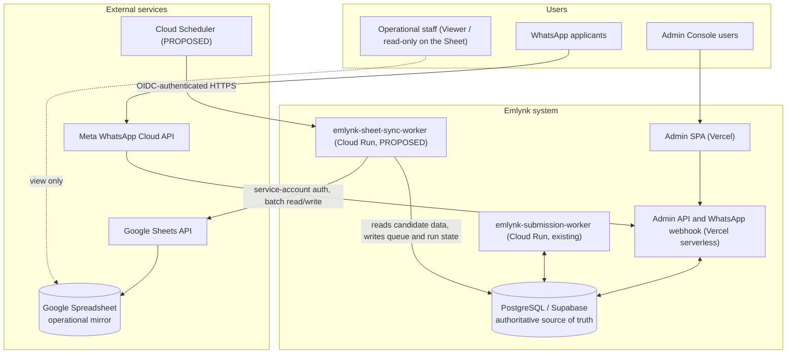

### 5.3 Diagram 2 — Component Architecture

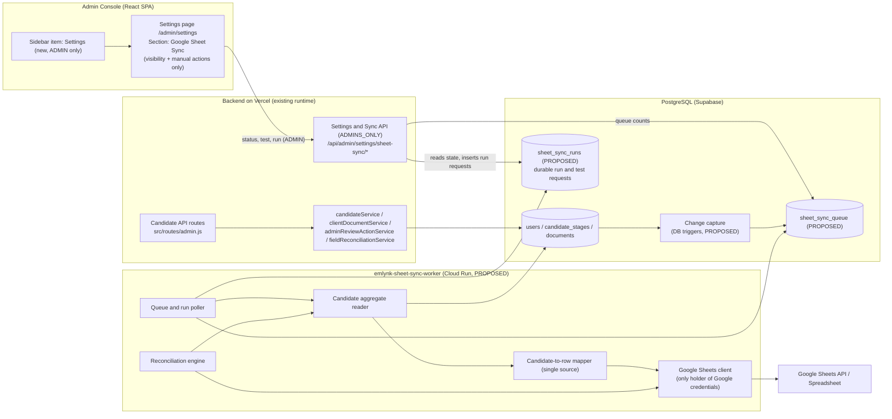

---

## 6. Google Sheet Schema (41 Business-Visible Columns + Recommended Row Key Column)

The operational Sheet layout is based on an **existing Excel operational format** used by staff. Rather than forcing an artificial reorganization, the architecture **preserves the existing Excel format and order first (Columns 1–26)**, and appends necessary operational detail, stage status, and mirror metadata fields after it (Columns 27–41).

This produces **41 business-visible columns**, `A` through `AO`, in four logical groups:

| Group | Name | Columns | Column Letters |
| :-: | :--- | :-: | :-: |
| 1 | Legacy Excel operational format (verbatim order & text) | 26 | `A` – `Z` |
| 2 | Appended candidate identity / detail fields | 6 | `AA` – `AF` |
| 3 | Candidate deployment stage statuses | 6 | `AG` – `AL` |
| 4 | Operational mirror metadata | 3 | `AM` – `AO` |
| | **Total Business-Visible Columns** | **41** | **`A` – `AO`** |
| *(Tech)* | *Recommended immutable row identity key (Section 7)* | *1* | *`AP`* |

> [!IMPORTANT]
> **Strict Layout Invariants:**
> 1. The first 26 legacy Excel columns are preserved in **exact order and verbatim header text**.
> 2. No legacy header may be silently renamed or reordered.
> 3. Duplicate header strings (`PASSPORT COPY`, `POLICE REP SRI LANKA`, `POLICE REP ROMANIA`) are **intentionally preserved** from the business spreadsheet; they must NOT be merged or removed.
> 4. **There is only ONE `SCAN` (Column 17 / `Q`).** No separate agreements or affidavits.

### 6.1 Complete 41-Column Operational Layout & Field Mapping Table

Kind legend: **Auth** = authoritative value copied verbatim from PostgreSQL; **Derived** = computed from authoritative database records (same logic as Admin UI); **Gen** = generated by the sync system.

| # | Col | Exact Header Text | Source (Database / Model Field) | Kind | Format | Blank / Missing Behavior | Audit Status | Technical Notes |
| :-: | :-: | :--- | :--- | :--- | :--- | :--- | :--- | :--- |
| 1 | **A** | `TEST NUMBER` | `CandidateStage.job_id` (`TEST_DETAILS`) *[Unconfirmed]* | Auth | text | Empty cell | **NEEDS BUSINESS CONFIRMATION** | Ambiguous: DB has `job_id` (e.g. `JOB-2026-014`) on `TEST_DETAILS`, but no `test_number` field. See Audit §6.2. |
| 2 | **B** | `PASSPORT NUMBER` | `User.passport_id` | Auth | text | Never empty | **CONFIRMED** | Primary key in database; normalized uppercase string. |
| 3 | **C** | `FIRST NAME` | `User.first_name` | Auth | text | Never empty | **CONFIRMED** | Given name(s) of candidate. |
| 4 | **D** | `OTHER NAME` | `User.other_name` | Auth | text | Never empty | **CONFIRMED** | Surname / family name of candidate. |
| 5 | **E** | `TEST DATE` | `CandidateStage.test_date` (`TEST_DETAILS`) | Auth | `YYYY-MM-DD` | Empty cell | **CONFIRMED** | Date the candidate sat the trade test; empty if not sat. |
| 6 | **F** | `BIRTHDAY` | `User.date_of_birth` | Auth | `YYYY-MM-DD` | Empty cell | **CONFIRMED** | Candidate date of birth. |
| 7 | **G** | `PP EX DATE` | `User.passport_expiry_date` | Auth | `YYYY-MM-DD` | Empty cell | **CONFIRMED** | Passport expiration date. |
| 8 | **H** | `JOB` | `User.job` | Auth | text | Empty cell | **CONFIRMED** | Comma-separated job categories (e.g. `Construction Worker, Caregiver`). |
| 9 | **I** | `ID NUMBER` | `User.nic` | Auth | text | Empty cell | **CONFIRMED** | National Identity Card number (9 digits + V/X or 12 digits). |
| 10 | **J** | `ADDRESS` | `User.address` | Auth | text | Empty cell | **CONFIRMED** | Candidate residential / postal address. |
| 11 | **K** | `WHATSAPP NUM` | `User.whatsapp_number` | Auth | digits (text) | Never empty | **CONFIRMED** | Stored normalized digits (no `+` prefix). |
| 12 | **L** | `CONTACT NUM` | `User.contact_number` | Auth | digits (text) | Empty cell | **CONFIRMED** | Secondary contact phone digits (no `+` prefix). |
| 13 | **M** | `PASSPORT COPY` | Current `PASSPORT` document status *[Unconfirmed]* | Derived | status | Empty / `MISSING` | **NEEDS BUSINESS CONFIRMATION** | Duplicate header with Col 18. Appears in submission checklist group (13–17). See Audit §6.2. |
| 14 | **N** | `POLICE REP SRI LANKA` | `POLICE_REPORT` variant `SL_VERIFIED` *[Unconfirmed]* | Derived | status | Empty / `MISSING` | **NEEDS BUSINESS CONFIRMATION** | Duplicate header with Col 23. Appears in submission checklist group. See Audit §6.2. |
| 15 | **O** | `POLICE REP ROMANIA` | `POLICE_REPORT` variant `ROMANIA` *[Unconfirmed]* | Derived | status | Empty / `MISSING` | **NEEDS BUSINESS CONFIRMATION** | Duplicate header with Col 24. Appears in submission checklist group. See Audit §6.2. |
| 16 | **P** | `MEDICAL` | Current `MEDICAL` document status | Derived | status | `MISSING` | **CONFIRMED** | `VERIFIED` / `REVIEW_REQUIRED` / `MISSING`. |
| 17 | **Q** | `SCAN` | Current `SCAN` document status | Derived | status | `MISSING` | **CONFIRMED** | **The one and only scan column.** `VERIFIED` / `REVIEW_REQUIRED` / `MISSING`. Combines agreement & affidavits. |
| 18 | **R** | `PASSPORT COPY` | Current `PASSPORT` document status *[Unconfirmed]* | Derived | status | Empty / `MISSING` | **NEEDS BUSINESS CONFIRMATION** | Duplicate header with Col 13. Appears in document catalog group (18–26). See Audit §6.2. |
| 19 | **S** | `DRIVING LICIAN` | *Unmapped / not stored in database* | n/a | text | Empty cell | **NEEDS BUSINESS CONFIRMATION** | Zero matches in repository. No driving license document or field exists. Must remain empty. See Audit §6.2. |
| 20 | **T** | `NATIONAL ID` | Current `NIC` document status *[Unconfirmed]* | Derived | status | Empty / `MISSING` | **NEEDS BUSINESS CONFIRMATION** | Distinct from Col 9 (`ID NUMBER` = `User.nic`). Likely NIC document status. See Audit §6.2. |
| 21 | **U** | `POLICE REPORT APPLIED` | Current `POLICE_SLIP` document status *[Unconfirmed]* | Derived | status | Empty / `MISSING` | **NEEDS BUSINESS CONFIRMATION** | Police clearance application slip status. See Audit §6.2. |
| 22 | **V** | `SUBMIT DATE` | `Document.police_submitted_date` of current slip | Auth | `YYYY-MM-DD` | Empty cell | **CONFIRMED** | Date police clearance application was submitted. |
| 23 | **W** | `POLICE REP SRI LANKA` | `POLICE_REPORT` variant `SL_NORMAL` *[Unconfirmed]* | Derived | status | Empty / `MISSING` | **NEEDS BUSINESS CONFIRMATION** | Duplicate header with Col 14. Likely general SL police report. See Audit §6.2. |
| 24 | **X** | `POLICE REP ROMANIA` | `POLICE_REPORT` variant `ROMANIA` *[Unconfirmed]* | Derived | status | Empty / `MISSING` | **NEEDS BUSINESS CONFIRMATION** | Duplicate header with Col 15. See Audit §6.2. |
| 25 | **Y** | `POLICE REP FM` | *Ambiguous / unmapped variant* | Derived | status | Empty cell | **NEEDS BUSINESS CONFIRMATION** | "FM" does not exist in code or DB. May mean Foreign Ministry / Foreign Mission. See Audit §6.2. |
| 26 | **Z** | `VIDEOS` | Current `SKILL_VIDEO` document status *[Unconfirmed]* | Derived | status | `MISSING` | **NEEDS BUSINESS CONFIRMATION** | Verification status of `SKILL_VIDEO`. See Audit §6.2. |
| 27 | **AA** | `PLACE OF BIRTH` | `User.place_of_birth` | Auth | text | Empty cell | **CONFIRMED** | Town / city of birth. |
| 28 | **AB** | `SEX` | `User.sex` | Auth | `M` / `F` / `X` | Empty cell | **CONFIRMED** | Sex as recorded on passport. |
| 29 | **AC** | `NATIONALITY` | `User.nationality` | Auth | text | Empty cell | **CONFIRMED** | Candidate nationality. |
| 30 | **AD** | `PASSPORT ISSUE DATE` | `User.passport_issue_date` | Auth | `YYYY-MM-DD` | Empty cell | **CONFIRMED** | Date passport was issued. |
| 31 | **AE** | `JOB EXPERIENCE` | `User.job_experience` | Auth | text | Empty cell | **CONFIRMED** | Free-text candidate work history. |
| 32 | **AF** | `CANDIDATE DETAILS NOTE` | `CandidateStage.notes` (`CANDIDATE_DETAILS`) | Auth | text | Empty cell | **CONFIRMED** | Registration comment / Candidate Details stage note. Sensitive PII controls apply. |
| 33 | **AG** | `TEST DETAILS STATUS` | `CandidateStage.completed` (`TEST_DETAILS`) | Derived | `COMPLETED` / `INCOMPLETE` | `INCOMPLETE` | **CONFIRMED** | Stored stage completion flag. |
| 34 | **AH** | `CANDIDATE DETAILS STATUS` | Derived stage logic (Section 4.1 B) | Derived | `COMPLETED` / `INCOMPLETE` | `INCOMPLETE` | **CONFIRMED** | Automatic stage derived from required details and valid passport document. |
| 35 | **AI** | `DOCUMENT SUBMISSION STATUS` | Derived stage logic (Section 4.2) | Derived | `COMPLETED` / `INCOMPLETE` | `INCOMPLETE` | **CONFIRMED** | Automatic stage derived from medical, police reports (SL verified & Romania), and scan. |
| 36 | **AJ** | `IVS INTERVIEW STATUS` | `CandidateStage.completed` (`IVS_INTERVIEW`) | Derived | `COMPLETED` / `INCOMPLETE` | `INCOMPLETE` | **CONFIRMED** | Stored stage completion flag. |
| 37 | **AK** | `VISA APPROVAL STATUS` | `CandidateStage.completed` (`VISA_APPROVAL`) | Derived | `COMPLETED` / `INCOMPLETE` | `INCOMPLETE` | **CONFIRMED** | Stored stage completion flag. |
| 38 | **AL** | `FINALIZING JOB STATUS` | `CandidateStage.completed` (`FINALIZING_JOB`) | Derived | `COMPLETED` / `INCOMPLETE` | `INCOMPLETE` | **CONFIRMED** | Stored stage completion flag. |
| 39 | **AM** | `RECORD STATUS` | Generated operational mirror status | Gen | `ACTIVE` / `DELETED / INACTIVE` / `DUPLICATE ROW` | Never empty | **CONFIRMED** | Mirror row state at a glance. |
| 40 | **AN** | `REGISTERED AT` | `User.created_date` | Auth | ISO-8601 UTC (`YYYY-MM-DDTHH:mm:ssZ`) | Never empty | **CONFIRMED** | Exact timestamp candidate was registered. |
| 41 | **AO** | `LAST MIRRORED AT` | Generated timestamp | Gen | ISO-8601 UTC (`YYYY-MM-DDTHH:mm:ssZ`) | Never empty | **CONFIRMED** | Timestamp row was mirrored to Sheet; excluded from drift comparison. |

---

### 6.2 Critical Mapping Audit of the 12 Ambiguous / Duplicate Legacy Fields

A comprehensive audit of the repository (`prisma/schema.prisma`, `candidateService.js`, `policeWorkflowService.js`, `policeCountdownService.js`, `adminReviewActionService.js`, `StagePanels.tsx`) was conducted for each ambiguous legacy column. None of these may be guessed during implementation. Each is classified below with its exact repository findings and required business decision:

#### 1. `TEST NUMBER` (Column 1 / `A`)
- **Repository Evidence:** The database table `candidate_stages` for `TEST_DETAILS` stores `job_id` (string, max 50, e.g. `JOB-2026-014`), `test_result` (`PASS` / `FAIL`), and `test_date` (`Date`). The UI label in `StagePanels.tsx` is "Job ID". There is **no field named `test_number`** anywhere in the schema, database, or application code.
- **Ambiguity:** Does `TEST NUMBER` expect the trade test `job_id`, or is it an external physical test serial number not currently captured by Emlynk?
- **Status:** **NEEDS BUSINESS CONFIRMATION (Decision D-18.1).** Default until decided: map to `CandidateStage.job_id` where `stage = 'TEST_DETAILS'`.

#### 2 & 5. The Two `PASSPORT COPY` Columns (Column 13 / `M` vs Column 18 / `R`)
- **Repository Evidence:** The system defines exactly one document type `PASSPORT` (`CANDIDATE_DOCUMENT_TYPES.PASSPORT`). It stores uploaded passport images/PDFs with verification status (`VERIFIED`, `REVIEW_REQUIRED`, `SUPERSEDED`).
- **Context Analysis:**
  - Column 13 (`M`) sits directly inside the **Document Submission checklist group** (Cols 13–17: `PASSPORT COPY`, `POLICE REP SRI LANKA`, `POLICE REP ROMANIA`, `MEDICAL`, `SCAN`), matching the required submission documents.
  - Column 18 (`R`) sits at the head of the **general document intake group** (Cols 18–26: `PASSPORT COPY`, `DRIVING LICIAN`, `NATIONAL ID`, `POLICE REPORT APPLIED`, `SUBMIT DATE`, etc.).
- **Ambiguity:** Why does the legacy spreadsheet hold two separate passport copy columns? Does Column 13 reflect whether a passport copy was attached for foreign submission, while Column 18 reflects the initial registration passport copy? Or should both mirror the current `PASSPORT` verification status?
- **Status:** **NEEDS BUSINESS CONFIRMATION (Decision D-18.2).** Under no circumstances should code guess.

#### 3 & 9. The Two `POLICE REP SRI LANKA` Columns (Column 14 / `N` vs Column 23 / `W`)
- **Repository Evidence:** Document type `POLICE_REPORT` supports three variants (`POLICE_REPORT_VARIANTS`): `SL_VERIFIED`, `ROMANIA`, and `SL_NORMAL`.
- **Context Analysis:**
  - Column 14 (`N`) is in the Document Submission group. In `candidateService.js` (`automaticStageMissing`), the submission stage strictly requires variant `SL_VERIFIED`.
  - Column 23 (`W`) is in the secondary document catalog group alongside `POLICE REP ROMANIA` (Col 24) and `POLICE REP FM` (Col 25).
- **Ambiguity:** Is Column 14 strictly `POLICE_REPORT` variant `SL_VERIFIED`, and Column 23 `POLICE_REPORT` variant `SL_NORMAL`?
- **Status:** **NEEDS BUSINESS CONFIRMATION (Decision D-18.3).**

#### 4 & 10. The Two `POLICE REP ROMANIA` Columns (Column 15 / `O` vs Column 24 / `X`)
- **Repository Evidence:** Only one `ROMANIA` variant exists for `POLICE_REPORT` (`variant === 'ROMANIA'`).
- **Context Analysis:** Column 15 is in the submission group; Column 24 is in the document catalog group.
- **Ambiguity:** What distinguishes Column 15 from Column 24? If both mirror the single `ROMANIA` police report, should both display identical status, or does one represent physical dispatch?
- **Status:** **NEEDS BUSINESS CONFIRMATION (Decision D-18.4).**

#### 6. `DRIVING LICIAN` (Column 19 / `S`)
- **Repository Evidence:** Zero occurrences across the entire codebase, migrations, and documentation. The application does not collect, upload, verify, or store driving licenses.
- **Status:** **NEEDS BUSINESS CONFIRMATION (Decision D-18.5).** Invariant: The system will **never invent a driving license field**. Column 19 will be mapped to emit an empty cell until the business either removes the column or defines a new data collection requirement.

#### 7. `NATIONAL ID` (Column 20 / `T`)
- **Repository Evidence:** Column 9 (`ID NUMBER`) maps to `User.nic` (the candidate's NIC string, e.g. `199012345678` or `123456789V`). In addition, `CANDIDATE_DOCUMENT_TYPES` defines document type `NIC`, representing the uploaded scan/copy of the identity card.
- **Ambiguity:** Does Column 20 (`NATIONAL ID`) represent the **verification status of the `NIC` document** (`VERIFIED` / `REVIEW_REQUIRED` / `MISSING`), or is it a duplicate display of the NIC number?
- **Status:** **NEEDS BUSINESS CONFIRMATION (Decision D-18.6).** Recommended default: Column 9 is `User.nic` (text value), Column 20 is `NIC` document verification status.

#### 8. `POLICE REPORT APPLIED` (Column 21 / `U`)
- **Repository Evidence:** When a candidate applies for police clearance in Sri Lanka, the police issue a receipt slip. The system models this as document type `POLICE_SLIP` (`Document.documentType === 'POLICE_SLIP'`). Column 22 (`SUBMIT DATE`) mirrors `Document.police_submitted_date`.
- **Ambiguity:** Does `POLICE REPORT APPLIED` represent the document status of `POLICE_SLIP` (`VERIFIED` / `REVIEW_REQUIRED` / `MISSING`), or a boolean indicator (`YES` / `NO`) indicating whether an application slip exists?
- **Status:** **NEEDS BUSINESS CONFIRMATION (Decision D-18.7).**

#### 11. `POLICE REP FM` (Column 25 / `Y`)
- **Repository Evidence:** `POLICE_REPORT_VARIANTS` in `candidateService.js` contains exactly `SL_VERIFIED`, `ROMANIA`, `SL_NORMAL`. No variant named "FM" exists anywhere in the repository or migration history.
- **Ambiguity:** Does "FM" stand for "Foreign Ministry" (consular attestation), "Foreign Mission", or another external authority? Is it synonymous with `SL_VERIFIED` or an obsolete legacy category?
- **Status:** **NEEDS BUSINESS CONFIRMATION (Decision D-18.8).** Must remain empty until clarified.

#### 12. `VIDEOS` (Column 26 / `Z`)
- **Repository Evidence:** Document type `SKILL_VIDEO` exists in `CANDIDATE_DOCUMENT_TYPES` (`{ video: true }`). It accepts video MIME types up to 50 MB.
- **Ambiguity:** Does `VIDEOS` display the `SKILL_VIDEO` verification status (`VERIFIED` / `REVIEW_REQUIRED` / `MISSING`), a count of videos, or a link?
- **Status:** **NEEDS BUSINESS CONFIRMATION (Decision D-18.9).** Recommended default: emit status (`VERIFIED` / `REVIEW_REQUIRED` / `MISSING`).

---

### 6.3 Formatting Rules (Deterministic)

| Concern | Rule |
| :--- | :--- |
| Dates (date-only) | `YYYY-MM-DD`, produced via `toISOString().slice(0, 10)` |
| Timestamps | ISO-8601 UTC with `Z` suffix (`YYYY-MM-DDTHH:mm:ssZ`), whole seconds |
| Phone numbers | Stored normalized digits only (`94700000001`); no `+` prefix is added |
| Null / missing | An empty cell (`""`), never the text `null`, `undefined`, `N/A`, or `-` |
| Stage statuses | `COMPLETED` / `INCOMPLETE` |
| Document status | `VERIFIED` / `REVIEW_REQUIRED` / `MISSING` |
| Writing mode | Values are written with `valueInputOption=RAW` into columns formatted as **plain text** so Google Sheets never coerces phone numbers, NICs, or zero-padded IDs into scientific numbers or dates |
| Comparing mode | Reconciliation reads values as displayed strings and compares them with freshly generated strings using the exact same normalization |

---

### 6.4 Sheet Layout, Schema Version & Positional Validation

- **Target Spreadsheet ID:** `1-11g-0tQruJbgVslH0nzCzG_JRr-4LahSCU8ZJirMpE`
- **Target Worksheet Tab Name:** `Emlynk Candidate Operational Mirror`
  - Row 1: The 41 operational headers (Columns `A` through `AO`) + technical key (Column `AP`), frozen.
  - Rows 2+: Mirrored candidate records.
- **Meta Tab:** `Mirror_Meta`
  - Holds `schema_version` (e.g. `2.0.0-legacy-41col`) and the non-destructive write-probe cell for connection testing (`B2`).
  - This tab is completely isolated from candidate operational data.

#### Positional Validation Requirement (Critical)
Because identical header strings exist at multiple column positions (`PASSPORT COPY` at Cols 13 & 18, `POLICE REP SRI LANKA` at Cols 14 & 23, `POLICE REP ROMANIA` at Cols 15 & 24):
1. **Header validation MUST NOT use header-name dictionary lookups.** Looking up an index by header string is ambiguous and invalid.
2. Before every batch write or reconciliation run, the worker reads row 1 (`A1:AP1`) as an **ordered array** and performs an exact positional comparison:
   $$\text{expectedHeaders}[i] === \text{actualHeaders}[i] \quad \text{for } i \in [0, 41]$$
3. Any missing header, reordered column, unexpected header, or renamed column immediately halts synchronization with **`CONFIG_ERROR`**, logs `sheet_sync.schema_mismatch`, and surfaces the mismatch in the Settings UI.
4. The system **never** modifies or deletes headers automatically. Correcting a sheet layout is an explicit administrative action.

---

## 7. Row Identity, Key Conflict & Duplicate Prevention

### 7.1 The Row Key Conflict: Analysis & Decision

In the v1.1.0 architecture, `Candidate ID` (`User.unique_id`) occupied Column A and served as the visible, immutable row key.
However, the business-requested legacy Excel layout **does not contain a Candidate ID column**.

#### Why Natural Keys Were Evaluated and Rejected:
- **`PASSPORT NUMBER` (Column B) as Row Key? REJECTED.**
  - `User.passport_id` is the database primary key, but child tables are configured with `ON UPDATE CASCADE`.
  - Registration normalizes passport numbers, but admin manual corrections can update passport IDs to fix typos.
  - If a passport number is corrected in the database, keying on passport number would orphan the existing Sheet row and append a duplicate row.
- **`ID NUMBER` / `NIC` (Column I) as Row Key? REJECTED.**
  - National Identity Cards are user-entered and subject to format changes (old 9-digit + V/X format vs new 12-digit format).
  - NIC can be updated or corrected, making it unsuitable as an immutable key.

#### Architectural Evaluation of Solutions:

| Option | Architecture | Pros | Cons | Recommendation |
| :--- | :--- | :--- | :--- | :--- |
| **Option 1: Appended Technical Column `AP`** | Append `_SYSTEM_CANDIDATE_ID` at Column 42 (`AP`), formatted as plain text, protected and optionally hidden in the Sheet UI. | 1. 100% preserves the 41 business columns (`A`–`AO`) untouched.<br/>2. Uses the immutable, non-nullable, unique `User.unique_id`.<br/>3. Easily inspected, debugged, and audited.<br/>4. Immune to staff sorting or filtering. | Adds one technical column to the right of business data. | **RECOMMENDED (Proposed Decision D-17)** |
| **Option 2: Google Sheets Developer Metadata API** | Store `User.unique_id` inside row-level Developer Metadata via Sheets API. | Invisible in the sheet grid. | **Extremely fragile:** manual row insertions, row sorting, copy-pasting, or Excel downloads by operational staff strip or misalign Developer Metadata without warning. | **REJECTED** |
| **Option 3: Switch key to `PASSPORT NUMBER`** | Use Column B (`PASSPORT NUMBER`) as the Sheet row key. | No extra column needed. | Breaks row identity on passport correction; risks creating duplicate rows. | **REJECTED** |

> [!CAUTION]
> **BLOCKING IMPLEMENTATION DECISION (D-17):**
> Implementation **must not begin** until stakeholders approve Option 1: appending Column 42 (`AP`) with header `_SYSTEM_CANDIDATE_ID` (or `Candidate ID (System Key)`). This column holds `User.unique_id` as plain text, is protected against manual editing, and may be hidden in the Google Sheet view so operational staff see only Columns 1–41 (`A` through `AO`).

### 7.2 How Duplicates Are Prevented

| Scenario | Architectural Protection |
| :--- | :--- |
| Retry of failed batch | Every sync reads the key column (Column `AP`), builds `unique_id -> rowNumber`, and updates in place. Appends happen only if the key is absent. |
| Duplicate delivery / worker restart | Queue claims use compare-and-swap leases (Section 8.5); updates are idempotent. |
| Concurrent candidate events | Coalesced into a single pending queue row per candidate. |
| Concurrent workers | **Single-writer rule:** Cloud Run deployment enforces `max-instances = 1` plus an exclusive PostgreSQL writer lease (Section 9.5). Racing appends cannot occur. |
| Passport or NIC correction | Because the key is `User.unique_id` in Column `AP`, the row is located and the Passport Number / NIC cells are updated in place without duplicate creation. |
| Duplicate keys detected | Reconciliation reads all keys in Column `AP`. If duplicate keys are found, `sheet_sync.duplicate_key_detected` is logged, the first row is maintained as canonical, and later copies are labeled `DUPLICATE ROW` in Column `AM` (`RECORD STATUS`) without deletion. |
| Staff sorting or filtering | Row numbers are **never stored permanently**; keys are re-read from Column `AP` on every write batch. |
---

## 8. Incremental Sync Architecture

### 8.1 Change Capture: How a Candidate Change Becomes a Sync Event

Section 4.4 shows nine write paths across five services, three of them single non-transactional statements, plus stage values derived from documents. The capture mechanism must therefore catch every writer, including future ones.

| Option | Description | Assessment |
| :--- | :--- | :--- |
| **A. Application-level enqueue** | Call an enqueue helper from each of the nine writer paths; wrap #2, #3 and #9 in transactions so the enqueue is atomic with the write | Matches the repo's test style (in-memory fakes). But it edits WhatsApp intake, OCR reconciliation and Manual Review code (high regression surface), and any new or forgotten writer silently skips the Sheet until the next reconciliation |
| **T. Database triggers (Proposed)** | Row-level triggers on `users`, `candidate_stages`, `documents` insert or coalesce a queue row in the same transaction/statement as the change | Catches every writer (application, scripts, manual SQL, cascades) by construction; atomic by construction; touches none of the WhatsApp/OCR/Manual Review code. Costs: logic lives in a SQL migration; verification needs a real PostgreSQL (not the in-memory fakes). Precedent: the repo already ships a trigger migration (`audit_logs_reject_change`) |
| **P. Polling** | Periodically scan for changes | Cannot see stage/document changes cheaply; it is just reconciliation run more often. Rejected for incremental sync |
| **W. Supabase database webhooks** | Trigger an external HTTP call | Needs a public ingress endpoint with signature handling and has no coalescing. Rejected |
| **Rejected from v1.0.0** | Calling Google inside the request; unawaited promises on Vercel; in-memory emitters | A serverless function freezes after the response; events would be lost |

**Recommendation (Proposed, decision D-2 in Section 23): Option T.** If the team prefers application-level code, Option A is an acceptable fallback provided the three non-transactional writers are wrapped and a test enumerates every writer. Either way the daily reconciliation remains the safety net.

Trigger scope (conceptual): `users` (insert, update, delete -> `unique_id` of the new/old row), `candidate_stages` and `documents` (insert, update, delete -> `unique_id` looked up from `passport_id`; documents of types outside the seven candidate types are ignored). Behaviour of triggers during `ON UPDATE CASCADE` and bulk operations must be verified in the Phase 3 spike.

### 8.2 The Queue: `sheet_sync_queue` (Proposed)

A new dedicated table remains the right fit. Reusing existing tables was re-checked and rejected: `temporary_data` is the WhatsApp submission queue and carries OCR/storage semantics; `audit_logs` is append-only (a database trigger rejects updates and deletes) while queue rows need status changes; `rate_limits` is an expiring key/counter store.

An event means **"candidate X needs synchronization"**, not a data snapshot.

| Required by the architecture | Purpose |
| :--- | :--- |
| Candidate key (`unique_id`) | Identity of the row to synchronize |
| Status: `PENDING`, `PROCESSING`, `COMPLETED`, `FAILED` | Lifecycle; `FAILED` = dead letter after bounded attempts |
| Attempt count | Bounded retries |
| Next-attempt time | Backoff scheduling |
| Lease owner / lease expiry | Safe claiming and recovery after a crash |
| Created / updated timestamps | Ordering, pruning, status counts |
| Last error **class** (a code, never a message) | Classification; no PII |
| Row-delete hint | Marks events caused by a candidate row being deleted |

| Possible implementation fields (not frozen) | Notes |
| :--- | :--- |
| Priority, source table, claiming instance id, completed-at, batch id, sanitized error detail | Decide during implementation |

Structural requirements: at most **one `PENDING` row per candidate** (a partial unique index on the key where status is `PENDING`); an index supporting the claim query; row-level security enabled and `anon`/`authenticated` privileges revoked, exactly like every other table in the repo's migrations; `COMPLETED` rows pruned after a configurable retention; `FAILED` rows kept until a later successful sync resolves them.

Because pending rows are coalesced, the queue is bounded by the number of candidates even if Google is down for days.

### 8.3 Durable Run Requests: `sheet_sync_runs` (Proposed)

Reconciliations, Test Connection and "Sync Now" requests need durable, queryable records (Section 11.5, Section 13). A second small table records each run: kind (`RECONCILE` or `TEST_CONNECTION`), trigger (`SCHEDULER` or `ADMIN`), requesting admin id (nullable), status (`QUEUED`, `RUNNING`, `SUCCEEDED`, `FAILED`, `SKIPPED`), timestamps, a summary of counts (no PII) and an error class. The integration's operational state (configured, `CONFIG_ERROR`, last success/failure, last test result) is derived from these records or kept in one state row; this is an implementation choice. The run record is what a returned `jobId` refers to.

### 8.4 Transaction Boundaries

- With triggers, the queue insert is part of the same transaction as the candidate change by construction. For single-statement writers (#2, #3, #9) it is part of that statement's implicit transaction.
- With application-level enqueue, #2, #3 and #9 must be wrapped in a transaction so change and event commit atomically.
- **The Google API is never called inside a candidate mutation transaction or inside a trigger.**
- A failure to enqueue is a failure of the same transaction (the change rolls back as a unit); a Google failure can never roll back a candidate change because Google is not involved at that point.

### 8.5 Coalescing, Stale-Event Safety and Eventual Latest State

Rapid changes to one candidate (phone update, stage update, medical verification, another stage update) produce **one** pending queue row, because later changes find a `PENDING` row for the key and only refresh it. The worker never replays historical snapshots: it reads the candidate's **current** aggregate when it processes the event.

Guarantee (eventual latest state): the worker marks only the row it claimed as `COMPLETED`. A change that commits after the worker read the aggregate finds no `PENDING` row (the claimed one is `PROCESSING`) and inserts a new `PENDING` row, so another sync that starts after the change is guaranteed. Therefore the Sheet always converges to the latest committed state, regardless of event order.

**Worker claim and lease (Proposed, modelled on the existing `submissionQueue.js`):** claim a batch of due `PENDING` rows with a compare-and-swap update that sets `PROCESSING` and a lease; completion and failure writes are conditional on still owning the lease; an expired lease makes the row claimable again; on `SIGTERM` leases are released (pattern in `shutdown.js`). Batch size and poll interval are configurable.

### 8.6 Google Sheets Write Model (Upsert, Never Blind Append)

For each batch of claimed candidates:

1. **Read once:** the header row (`A1:AP1`) and the key column (Column `AP`) in a single batch read. Validate the header by exact positional match (Section 6.4); on mismatch stop with `CONFIG_ERROR`.
2. **Build an in-memory map** `candidate key (unique_id from Col AP) -> current row number` for this batch only. No persistent row mapping is kept: staff may sort or insert rows, so stored row numbers would go stale, and the key column is cheap to re-read.
3. **Read the current candidates** from the database (batched queries, not one `getCandidate` per candidate) and map each to a row of 41 business values + 1 technical key value with the shared mapper.
4. **Existing key -> update** that row's cells (`A{row}:AP{row}`) in a single `batchUpdate`. **Missing key -> append** the row exactly once. Writes use `RAW` input into plain-text columns.
5. **Append-race protection:** only one sync instance writes at a time (Section 9.5), so two appends for one key cannot race. A crash between append and queue completion is harmless: the retry finds the key in Column `AP` and updates.
6. **Candidate absent from the database** (the event carried a delete hint and the targeted read succeeded and returned no row) -> set Column `AM` (`RECORD STATUS`) to `DELETED / INACTIVE`, stamp Column `AO` (`LAST MIRRORED AT`), keep every other cell.
7. **Mark the queue rows `COMPLETED`** only after Google confirms the write; otherwise schedule a retry (8.7).
8. Reconciliation detects duplicate keys and repairs or reports them (Section 9.3).

Batch sizes are configurable and requests are grouped to respect Google quotas; no quota number is asserted here.

### 8.7 Failure Model & Retry Classification

| Class | Examples | Behaviour |
| :--- | :--- | :--- |
| **Retryable** | HTTP 429 / rate-limit reasons, 408, selected 5xx (500, 502, 503, 504), network resets, timeouts, DNS failures | Exponential backoff with jitter and a cap; bounded attempts (configurable; example schedule 5 s, 20 s, 60 s, 300 s, 900 s). After the bound the queue row becomes `FAILED`; reconciliation heals it later |
| **Configuration / permanent** | Invalid spreadsheet ID, tab missing, **schema mismatch**, invalid or revoked credentials, permission denied (a 403 that is not a rate-limit reason), spreadsheet not found | **Not retried endlessly.** The integration enters `CONFIG_ERROR`: the worker stops claiming candidate events (they stay `PENDING`, bounded by coalescing), the state is shown in Settings and logged. It resumes after an admin Test Connection or Sync Now succeeds, or after a successful scheduled reconciliation |
| **Permanent data error (one candidate)** | A value Google rejects (for example an oversize cell) | That candidate's queue row becomes `FAILED` with an error class; other candidates continue |

Candidate database operations always succeed independently of all of the above. After any outage the daily reconciliation (Section 9) is the self-healing path.

### 8.8 Diagram 3 — Incremental Sync Sequence

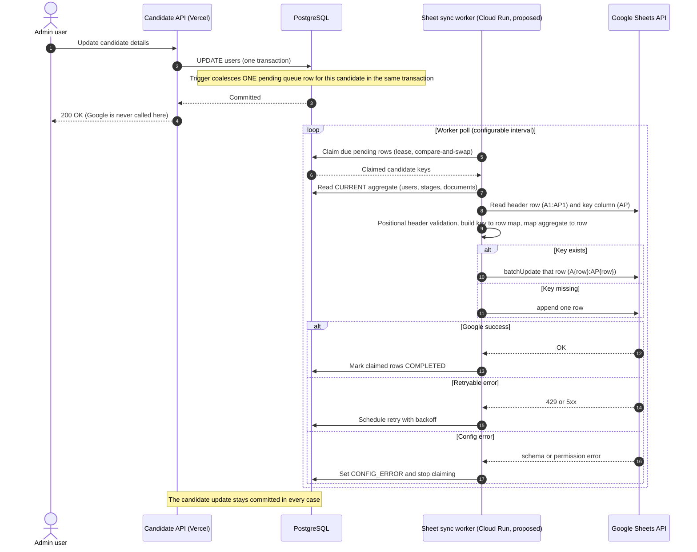

### 8.9 Diagram 5 — Failure and Retry Flow

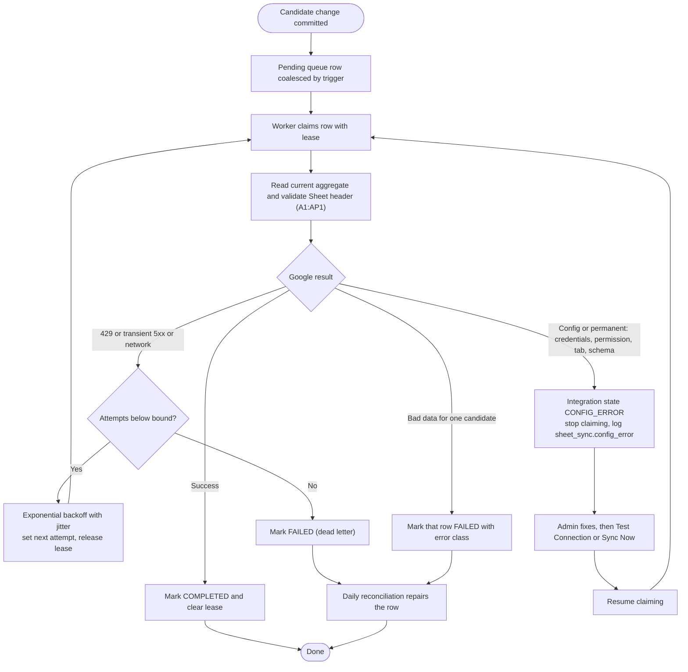

---

## 9. Reconciliation Architecture

### 9.1 Purpose and Execution Modes

Incremental sync handles the normal flow. Reconciliation guarantees **convergence** after dropped events, outages, manual Sheet edits, deleted rows, schema mistakes or any gap in change capture. It repairs: missing candidate rows, stale candidate fields, stale stage fields, stale document statuses, stale document variants, manually edited cells, missing or incomplete incremental events, and candidates absent from the database but still `ACTIVE` in the Sheet.

| Mode | Trigger | Frequency |
| :--- | :--- | :--- |
| **Production scheduled** | Cloud Scheduler (Section 11.3) | **Once per day**; the exact clock time is a Scheduler job setting and does not need to be 12 PM |
| **Staging scheduled** | A separate Cloud Scheduler job, or an explicit manual trigger | About every 5 minutes (testing only; never part of production logic or code) |
| **Manual** | "Sync Now / Reconcile Now" on the Settings page (Section 12) | On demand |

All three create a durable `sheet_sync_runs` record and use the same engine.

### 9.2 Drift Detection — Options Evaluated

| Option | Mechanism | Verdict |
| :--- | :--- | :--- |
| **A. Fingerprint** | Hash a normalized aggregate; store the hash; compare to a recomputed hash | Detects *database* changes but not *Sheet* edits (editing a cell does not change a stored hash) unless the hash is recomputed from the Sheet's cells, which is Option B. Adds a stored artifact to keep consistent |
| **B. Full-cell comparison (Selected)** | Generate every row fresh from the database and compare each mirrored cell with the Sheet's cell | Detects every kind of drift (stale data, manual edits, missing rows, missing events) with no extra stored state and no dependency on any timestamp. Cost is O(candidates x columns) per run, acceptable for an operational candidate list |
| **C. Aggregate version/updated timestamp** | A column bumped whenever any component changes | Needs schema changes and a change in every writer (the problem of 4.4), and still misses manual Sheet edits. Rejected |

**Selected: Option B.** `users.updated_date` is not used. Column `AO` (`LAST MIRRORED AT`) is excluded from the comparison. **Needs confirmation:** the current candidate count; if it grows very large the same comparison can be run in key-ordered chunks without changing the design.

### 9.3 Reconciliation Algorithm

1. **Create/claim the run** (`sheet_sync_runs`), acquire the reconciliation lock (9.5). If it is held, record the run as `SKIPPED` and log `sheet_sync.reconcile_skipped`.
2. **Validate the Sheet:** tab `Emlynk Candidate Operational Mirror` exists, header row `A1:AP1` matches exact positional schema (6.4). On mismatch -> `CONFIG_ERROR`, stop, no writes.
3. **Read the Sheet** completely (`A2:AP`) as displayed strings; build `unique_id (from Col AP) -> row`, noting duplicate keys, blank keys and unknown rows.
4. **Read the complete database snapshot** in one read-only `REPEATABLE READ` transaction (users with their stages and candidate documents), verifying the row count equals the count query. Any failure aborts the run (9.4).
5. **Generate the expected row for every database candidate** with the shared mapper (41 business columns + Column AP).
6. **Classify and repair:**
   - key missing from the Sheet -> **append**;
   - key present and any compared cell (Cols 1–40 / `A`–`AN`, plus `AP`) differs -> **rewrite that row** (an unchanged row is not written, so a normal run writes almost nothing);
   - duplicate key in Col `AP` -> keep the first row canonical, label later copies `DUPLICATE ROW` in Col `AM`, log `sheet_sync.duplicate_key_detected`;
   - Sheet row `ACTIVE` whose key is absent from the **complete** snapshot -> mark `DELETED / INACTIVE` in Col `AM` (subject to 9.4);
   - row already `DELETED / INACTIVE` whose key exists again in the database -> restore to `ACTIVE`, refresh data;
   - blank-key or unknown rows -> reported, not modified.
7. **Write in chunks** (`batchUpdate`, configurable chunk size), classify errors as in 8.7.
8. **Housekeeping:** prune completed queue rows past retention; finish the run record with counts (no PII); release the lock.

The snapshot is not a point-in-time view of live traffic. A change committed during the run is also queued by capture (8.1) and corrected by the next incremental sync, so the run is convergent, not atomic.

### 9.4 Deletion / Inactive Safety (Mandatory)

Absence-based `DELETED / INACTIVE` marking requires **all** of:

1. the database snapshot was read **completely and successfully** (single transaction, row count verified, no error, no timeout);
2. the Sheet read was complete and the header validated;
3. the number of rows that would be marked inactive in one run does not exceed a configurable guard (an absolute count and/or fraction of rows). Above it the run still repairs everything else, **skips the marking**, logs `sheet_sync.reconcile_deletion_guard`, and surfaces the condition in Settings for an admin decision (**Needs confirmation:** threshold and override procedure).

A failed, partial or timed-out database query can therefore never mark candidates inactive. For the event path, a single candidate is marked inactive only when the event carries a row-delete hint and the targeted read succeeded and returned no row.

### 9.5 Locking and Concurrency

- **Writer exclusivity.** One sync instance writes to the Sheet at a time: deployment keeps `max-instances = 1` and the worker also holds an exclusive database writer lease while writing, so scaling mistakes cannot create racing appends.
- **Reconciliation lock.** Overlapping reconciliations are prevented with a PostgreSQL advisory lock whose identity is a **deterministic named key** (for example the name `emlynk:sheet-sync:reconcile`) converted to the integer key PostgreSQL requires (for example `hashtextextended(name, 0)`), or an equivalent documented, configurable, stable ID. No magic constant is part of the architecture.
- **Acquisition:** `pg_try_advisory_lock` on a **dedicated database connection** held for the run. This matters because production uses the Supavisor *session-mode* pooler and Prisma's pool may use different connections for consecutive queries, which would make a session-level lock unreliable. **Needs confirmation (Phase 7 spike):** behaviour and idle timeouts of a held session-pooler connection; the fallback is a lease row in `sheet_sync_runs`.
- **If the lock is held:** the new run is recorded as `SKIPPED`; nothing else happens.
- **Release:** in a `finally` block (`pg_advisory_unlock`, then close the connection).
- **Connection loss:** PostgreSQL releases session locks when the connection drops; the run detects the error, records `FAILED`, and a later run safely repeats the work because reconciliation is idempotent.

### 9.6 Manual Edits to the Sheet

The Sheet is **not a collaborative data-entry surface**. Because PostgreSQL is authoritative, a manual edit never reaches the database; incremental sync restores the cells if that candidate changes again, and the daily reconciliation restores all cells. A manually deleted row is re-appended. Staff should be given **Viewer** access; only the sync service account has write access (Section 14).

### 9.7 Diagram 4 — Daily Reconciliation Sequence

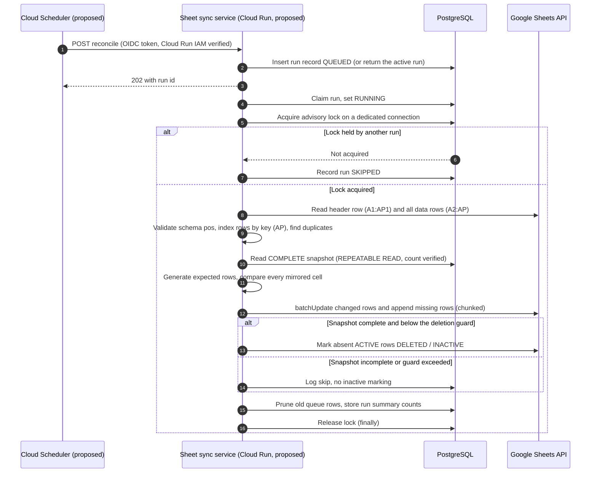

---

## 10. Candidate Lifecycle & Deletion

### 10.1 Current Deletion Behaviour (Confirmed)

- The application has **no candidate deletion** (no endpoint, no service function, no soft-delete column on `users`).
- `documents.passport_id` references `users` with `ON DELETE RESTRICT`, so a candidate with documents cannot be deleted; `candidate_stages` and `candidate_call_logs` cascade. A candidate with no documents could only be removed by hand in SQL or by a script.
- The architecture therefore does **not** invent a delete endpoint. It handles deletion safely if it ever happens.

### 10.2 Rules

1. A Sheet row is **never physically deleted**.
2. A candidate that disappears from the database has its row set to `Record Status = DELETED / INACTIVE` with `Inactive Detected At`; every other cell keeps its last known value (historical operational information is retained).
3. Detection: the event path (delete hint plus a successful targeted read) or the reconciliation path (complete snapshot, deletion guard 9.4).
4. If the same `unique_id` reappears (for example restored from a backup) the row returns to `ACTIVE` and is refreshed.
5. **Future recommendation (Needs confirmation):** if candidate deletion is added to the product it should be a soft delete (`deleted_at`) so the event path is exact.

### 10.3 Diagram 6 — Candidate Lifecycle

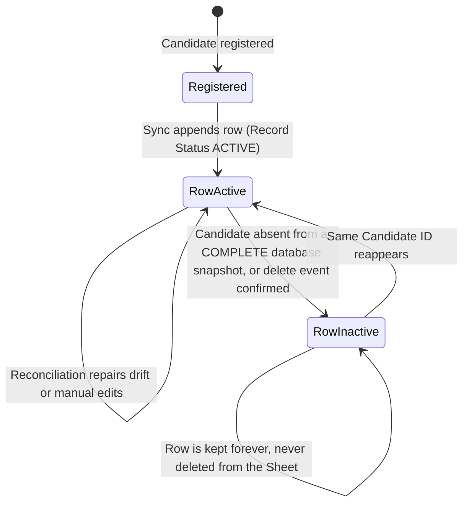

---

## 11. Hosting, Scheduler & Deployment Architecture

### 11.1 Existing Infrastructure vs Proposed Infrastructure

| Component | Status | Evidence / note |
| :--- | :--- | :--- |
| Admin SPA + Admin API + WhatsApp webhook on Vercel (`api/index.js -> src/httpHandler.js`, region `hnd1`, `maxDuration` 60 s) | **Existing** | `vercel.json`, `Docs/08-cloud-deployment.md` |
| `emlynk-submission-worker` on Cloud Run (`node src/worker.js`, asia-northeast1, private, min and max 1, CPU not throttled, `GET /health` only) | **Existing** | `Docs/08-cloud-deployment.md`, `src/workerProcess.js` |
| `emlynk-ocr-worker` on Cloud Run (asia-south1, private, IAM invoker) | **Existing** | `Docs/08-cloud-deployment.md` |
| Existing GCP service account `emlynk-backend@<GCP_PROJECT>` for the workers; no key files | **Existing** | `Docs/08-cloud-deployment.md` |
| Supabase PostgreSQL via Supavisor session-mode pooler; Supabase Storage | **Existing** | `Docs/08-cloud-deployment.md` |
| `emlynk-sheet-sync-worker` Cloud Run service | **Proposed** | not created |
| Cloud Scheduler jobs | **Proposed** | not created; no usage in the repo |
### 11.1 Existing Infrastructure vs Proposed Infrastructure

| Component | Status | Evidence / note |
| :--- | :--- | :--- |
| Admin SPA + Admin API + WhatsApp webhook on Vercel (`api/index.js -> src/httpHandler.js`, region `hnd1`, `maxDuration` 60 s) | **Existing** | `vercel.json`, `Docs/08-cloud-deployment.md` |
| `emlynk-submission-worker` on Cloud Run (`node src/worker.js`, asia-northeast1, private, min and max 1, CPU not throttled, `GET /health` only) | **Existing** | `Docs/08-cloud-deployment.md`, `src/workerProcess.js` |
| `emlynk-ocr-worker` on Cloud Run (asia-south1, private, IAM invoker) | **Existing** | `Docs/08-cloud-deployment.md` |
| Existing GCP service account `emlynk-backend@<GCP_PROJECT>` for the workers; no key files | **Existing** | `Docs/08-cloud-deployment.md` |
| Supabase PostgreSQL via Supavisor session-mode pooler; Supabase Storage | **Existing** | `Docs/08-cloud-deployment.md` |
| Target Google Spreadsheet (`1-11g-0tQruJbgVslH0nzCzG_JRr-4LahSCU8ZJirMpE`) | **Confirmed / Provisioned** | Real operational spreadsheet |
| Dedicated Google service account (`emlynk-sheet-sync@project-aa11e15e-a951-4e1b-a65.iam.gserviceaccount.com`) | **Confirmed / Provisioned** | Has Editor access to the target operational spreadsheet |
| `emlynk-sheet-sync-worker` Cloud Run service | **Proposed** | not created |
| Cloud Scheduler jobs | **Proposed** | not created; no usage in the repo |
| Tables `sheet_sync_queue`, `sheet_sync_runs`, change-capture triggers | **Proposed** | not created |

### 11.2 Where the Sheet Sync Runs (Future Deployment Target)

| Criterion | A. Add to the existing submission worker | B. Dedicated `emlynk-sheet-sync-worker` (Selected) |
| :--- | :--- | :--- |
| Failure isolation | Google outages, quota stalls or Sheet-size memory use would share a process with WhatsApp/OCR intake | Intake and OCR cannot be affected |
| Deployment coupling | Any Sheet change redeploys the intake worker | Independent deploy and rollback |
| Least privilege | The intake worker holds exactly 5 environment variables today; Google access would be added to it | Google credentials exist only in the new service |
| Resources | Shares 1 CPU / 1 GiB with OCR orchestration | Sized separately |
| Operational simplicity | One fewer service | One more service, but same image and the same worker-process pattern (`worker.js`/`workerProcess.js`) |

**Recommendation (Selected; decision D-3): B**, a separate Cloud Run service built from the same repository image with its own entry file, its own environment-variable validation subset (database plus Google settings only), `min-instances = max-instances = 1`, CPU always allocated (its poll loop runs between requests), private ingress.

**Runtime Identity & Authentication (Confirmed; decision D-4):**
- Cloud Run service is configured with the dedicated runtime service account:
  `emlynk-sheet-sync@project-aa11e15e-a951-4e1b-a65.iam.gserviceaccount.com`.
- Uses **Application Default Credentials (ADC) / keyless authentication** natively supported by Google Cloud client libraries (`google-auth-library`).
- **No downloaded service-account JSON key files** are stored, committed, or injected via Secret Manager.

### 11.3 Scheduler Architecture (Frozen Design)

```
Google Cloud Scheduler (durable, external)
        |  HTTPS POST, OIDC token of a dedicated scheduler service account
        v
Authenticated Cloud Run endpoint (emlynk-sheet-sync-worker, private)
        |  creates a durable run record, returns 202 + run id
        v
Reconciliation service (same process worker loop)
        +--> PostgreSQL / Supabase
        +--> Google Sheets API
```

- Vercel functions are not durable schedulers; Cloud Run instances can restart, scale down or scale out; `setInterval` or an in-process cron is not a durable trigger. Cloud Scheduler is the external durable trigger.
- **Production:** one job, once per day, time configurable in the job.
- **Staging/testing:** a separate job at about every 5 minutes, or a manual trigger. The 5-minute value is never hard-coded in application logic.
- The application contains **no schedule configuration** (v1.0.0's `SHEET_SYNC_RECONCILE_SCHEDULE` is removed).

### 11.4 Authentication of the Internal Reconciliation Endpoint

| Option | Assessment |
| :--- | :--- |
| **Platform identity: OIDC + Cloud Run IAM (Selected)** | The service is private (no public access). The Scheduler job uses a dedicated service account that has only `roles/run.invoker` on this service; Cloud Run rejects any request without a valid token before the application sees it. This is the same pattern the repo already uses between backend and OCR worker (private service, `run.invoker`, Google identity tokens). Defense in depth: the endpoint may additionally verify the caller identity/audience with `google-auth-library` (already a dependency) |
| Static bearer secret (fallback only) | Acceptable only if IAM cannot be used. It must live in Secret Manager, be rotated, be compared in constant time, and never appear in logs, the frontend or Git |

No internal endpoint may be executable without authentication. The endpoint only **creates a run request** and returns; the work runs in the worker loop, so no HTTP request has to stay open for the run.

### 11.5 Manual "Sync Now" / "Test Connection" — Durable Design

The Settings page cannot call Google (Vercel holds no Google credentials, and a serverless function would freeze after responding, so "return 202 and keep running an unawaited promise" is **not** allowed). The design:

1. An ADMIN presses **Sync Now / Reconcile Now** or **Test Connection**.
2. The Admin API (Vercel; authenticated, ADMIN-only, existing CSRF and rate limiting) inserts a `sheet_sync_runs` record (`QUEUED`) and returns `202` with that run's id. If an equivalent run is already queued or running it returns that run's id instead (no pile-up). The `jobId` always corresponds to a real durable record.
3. The sheet-sync worker picks the record up on its next poll, executes it, and writes the result to the record.
4. The Settings page polls the status endpoint and shows the outcome. Closing the browser changes nothing.

A synchronous bounded command was rejected: the Admin API runtime has no Google credentials and a 60-second limit.

**Diagram 10 — Sync Now / Manual Reconciliation Flow**

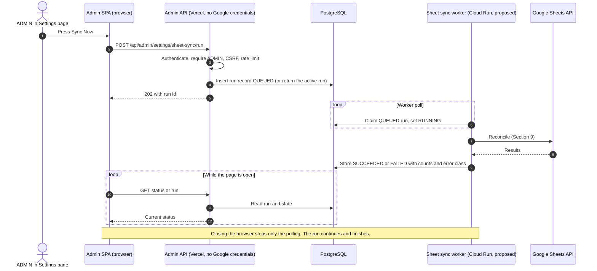

### 11.6 Confirmed Configuration & Real Operational Sheet Safeguards

#### A. Confirmed Production Environment Configuration
The backend sync worker requires the following exact configuration:

```bash
# Confirmed Operational Google Sheet target
SHEET_SPREADSHEET_ID=1-11g-0tQruJbgVslH0nzCzG_JRr-4LahSCU8ZJirMpE
SHEET_TAB_NAME=Emlynk Candidate Operational Mirror

# Dedicated service account (runtime identity on Cloud Run via keyless ADC)
SHEET_SYNC_SERVICE_ACCOUNT=emlynk-sheet-sync@project-aa11e15e-a951-4e1b-a65.iam.gserviceaccount.com

# Feature enablement & operational tunables
SHEET_SYNC_ENABLED=true
SHEET_SYNC_POLL_INTERVAL_MS=10000
SHEET_SYNC_BATCH_SIZE=25
SHEET_SYNC_MAX_RETRIES=5
SHEET_SYNC_DELETION_GUARD_MAX=10
```

#### B. Explicit Safeguards for the Single Real Operational Sheet
> [!CAUTION]
> **No Separate Test Spreadsheet:** By business decision, there is no second or dummy spreadsheet. The target spreadsheet is the **live operational Sheet**. The system must enforce the following architectural safeguards:

1. **Environment Write-Gating (`SHEET_SYNC_ENABLED`):**
   - In all non-production environments (local development, test scripts, PR previews), `SHEET_SYNC_ENABLED` defaults to `false`.
   - The sync worker must actively verify that `process.env.SHEET_SYNC_ENABLED === 'true'` before issuing any mutating Sheets API request. If disabled, candidate writes remain in PostgreSQL, and the worker logs an operational skip.
2. **Local & CI Tests Strictly Mocked:**
   - Unit tests (`18.1`) and integration tests (`18.2`) MUST use in-memory fakes or mocked HTTP clients for Google Sheets API. Under no circumstances may `npm test` or Vitest communicate with `1-11g-0tQruJbgVslH0nzCzG_JRr-4LahSCU8ZJirMpE`.
3. **Non-Destructive Test Connection:**
   - The "Test Connection" button in Admin Settings writes ONLY to cell `Mirror_Meta!B2` on the meta tab. It is architecturally forbidden from modifying cell ranges on `Emlynk Candidate Operational Mirror`.
4. **No Destructive Mass Operations:**
   - The sync worker never issues `Clear`, `DeleteDimension`, or `DeleteSheet` requests.
   - Rows absent from PostgreSQL are marked `DELETED / INACTIVE` in Column `AM` (subject to the Section 9.4 deletion guard), retaining all historical candidate data.

### 11.7 Diagram 7 — Deployment Architecture

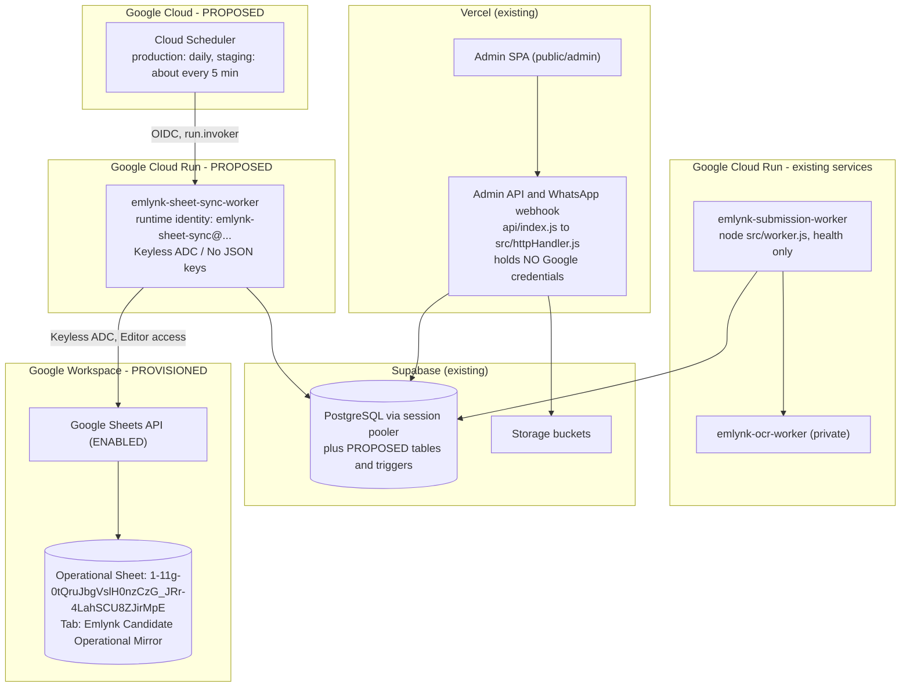

---

## 12. Settings / Test UI Architecture

> **Confirmed requirement (supersedes the earlier "hidden page / direct URL only" recommendation):** the Google Sheet feature adds ONE visible **Settings** item to the EXISTING Admin Console sidebar. The Google Sheet management UI is a section of the Settings page, not a separate sidebar item and not a hidden standalone page.

### 12.1 Current State (Observed in the Repository)

These are observations of the application as it exists today, not the target:

- `admin/src/layout/navigation.ts` (`NAV_ITEMS`) defines the sidebar in this order: **Overview, Documents, Review Queue, Candidates, Missing Documents, Police Workflow, Daily Report, Invite Admin, Change Roles.** Its header comment states "There is no Settings page." There is no `/settings` route in `admin/src/App.tsx` and no `settings` entry in the icon registry (`admin/src/components/Icon.tsx`, `ICONS`).
- `NavItem` already has an `adminOnly?: boolean` flag. `Sidebar.tsx` filters the list with it (`!item.adminOnly || admin?.role === "ADMIN"`); **Invite Admin** and **Change Roles** use it. The header breadcrumb (`Header.tsx`, `currentSectionLabel`) resolves its label from the same `NAV_ITEMS` list.
- The Candidate Pool (`/candidates`) and every other existing page are separate from this feature and are not touched by it.
- Role model (`src/middleware/requireRole.js`): `ADMIN`, `MANAGER`, `ANALYST`, `REGISTRATION_DESK`. Backend tiers in `src/routes/admin.js`: `ALL_ACTIVE` / `ANALYSTS_UP` (ADMIN, MANAGER, ANALYST), `MANAGERS_UP` (ADMIN, MANAGER), `ADMINS_ONLY` (ADMIN). `ADMINS_ONLY` already guards admin-account management (`/invitations`, `/admins`, role changes).
- Frontend page protection today: `RequireAuth` protects every route behind sign-in. Role restriction for admin-only pages is done **inside the page** (Invite Admin and Change Roles render an "Access Restricted" card and request no data when the role is not `ADMIN`). There is no separate route-level role guard component for them.
- Registration Desk isolation exists on the `stage` branch (commit `1e486a8`): `navItemsFor(role)` returns a single "Add Candidate" entry for `REGISTRATION_DESK`, and `RegistrationDeskGate` redirects every other route to `/candidates/new`. This is **not yet on `dev`**. Settings must be compatible with it on both branches.
- The header **Sync** button (`SyncProvider`) means "reload the data shown on this page from the server". It is unrelated to Google Sheets.

### 12.2 Target Navigation Architecture

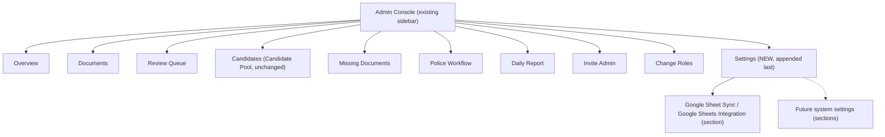

Rules:

1. **One** new sidebar entry, **Settings**, appended after **Change Roles**. There is no sidebar item specifically for Google Sheets.
2. No existing item is removed, renamed, reordered, redesigned or changed in behavior. The sidebar's visual design is unchanged: Settings uses the same typography, spacing, icon style, hover and active-state behavior as the other items, rendered by the same `Sidebar` component from the same `NAV_ITEMS` list (an additional `NavItem` with `adminOnly: true`).
3. The icon must come from the same icon registry and style as the existing entries (the registry has no settings icon today; one is added in the same style at implementation time).
4. Because the header breadcrumb reads `NAV_ITEMS`, the breadcrumb shows "Settings" on the Settings page without a separate mechanism.
5. Future system configuration is added as further **sections of the Settings page** (or sub-routes under `/admin/settings`), never as extra sidebar entries.

### 12.3 Recommended Route

- **Route:** `/admin/settings` (the React route is `/settings` under the existing `basename="/admin"`).
- One page with one section for now. Sections are stacked cards on the same page, so the sidebar active state is a simple prefix match (`/settings`, also correct if sub-routes are added later).
- Deep links and refresh already work: `vercel.json` rewrites `/admin/(.*)` to the admin `index.html`, and the Express static router serves `index.html` for any `/admin/*` path. The API lives under a different prefix (`/api/admin/settings/sheet-sync/*`, Section 13), so the two do not collide.
- The page must follow the existing data-loading and layout conventions of the Admin pages (same page container, cards, loading/error states).

### 12.4 Google Sheet Sync Section (Content)

A clearly separated card titled **Google Sheet Sync** (or "Google Sheets Integration"). It exposes visibility and manual controls only:

| Element | Purpose | Data source |
| :--- | :--- | :--- |
| Integration status | Enabled / disabled | `GET .../status` |
| Configuration state | Configured / Not configured | `GET .../status` |
| Connection status | Last known Google connection result | `GET .../status` |
| Target spreadsheet / tab status | Target present, tab present (identifier shown masked, never credentials) | `GET .../status` |
| Last successful sync | Time of the last successful candidate sync | `GET .../status` |
| Last failed sync | Time and error class of the last failure (no candidate PII) | `GET .../status` |
| Last reconciliation | Time and summary of the last reconciliation run | `GET .../status` |
| Pending / failed sync counts | Queue depth and dead-lettered items | `GET .../status` |
| **Test Connection** (action) | Verifies Google access without changing data | `POST .../test` |
| **Sync Now / Reconcile Now** (action) | Requests an on-demand run | `POST .../run` |
| Operational error / status panel | Non-sensitive operational messages | `GET .../status` |

UX notes:

- Use clear labels such as "Sync Now" / "Reconcile Now" on the card. The header **Sync** button only reloads page data and must not be reused or confused with the Google Sheet action.
- Not-configured and configuration-error states are shown explicitly. No secret value, private key, token or full spreadsheet ID is ever rendered.
- Loading the status must not affect, and must not be affected by, any other Admin page.

### 12.5 The Settings UI Is Not the Sync Engine (Invariant)

The Settings page is a **visibility and management interface only**:

- The browser never performs synchronization, never holds Google credentials, and never calls Google.
- Closing the Settings page or the browser has **zero effect** on incremental sync, queue processing, retries, reconciliation or scheduled synchronization. These remain backend responsibilities exactly as designed in the earlier sections.

### 12.6 Authorization Architecture

**Findings from the repository**

| Finding | Evidence |
| :--- | :--- |
| Backend authorization is the real boundary; the UI only mirrors it. | `requireRole(...)` per route in `src/routes/admin.js` |
| The existing tier for administrative/system management is `ADMINS_ONLY` (ADMIN). | `/invitations`, `/admins`, `/admins/:id/role` |
| Sidebar visibility for admin-only entries uses `adminOnly`. | `navigation.ts`, `Sidebar.tsx` |
| Admin-only pages guard themselves and request no data for other roles. | `InvitationsPage.tsx`, `AdminRolesPage.tsx` |
| `REGISTRATION_DESK` is limited to registering new candidates and is redirected away from every other route (on `stage`). | `navItemsFor`, `RegistrationDeskGate`, backend tiers |
| All mutating `/api/admin` calls already pass through the existing rate limiter and CSRF protection. | `createAdminRouter` |

**Target policy (recommended; this reuses the existing `ADMINS_ONLY` tier and weakens nothing)**

| Capability | ADMIN | MANAGER | ANALYST | REGISTRATION_DESK | Enforced at |
| :--- | :---: | :---: | :---: | :---: | :--- |
| See the Settings sidebar item | Yes | No | No | No | `adminOnly: true` (UI only) |
| Open `/admin/settings` | Yes | "Access Restricted" card, no data requested | Same as MANAGER | Redirected to Add Candidate (existing desk gate) | Page guard (UI); backend decides data access |
| `GET .../sheet-sync/status` | Yes | 403 | 403 | 403 | `requireRole(ADMINS_ONLY)` |
| `POST .../sheet-sync/test` (Test Connection) | Yes | 403 | 403 | 403 | `requireRole(ADMINS_ONLY)` |
| `POST .../sheet-sync/run` (Sync Now / Reconcile Now) | Yes | 403 | 403 | 403 | `requireRole(ADMINS_ONLY)` |

Rules:

- Hiding the sidebar item or the page content is never sufficient: every Settings API route is enforced by `requireRole` on the backend with the role re-read from the database, like all other `/api/admin` routes.
- A direct visit to `/admin/settings` by a non-ADMIN user must not render Settings content and must not call the Settings APIs.
- `REGISTRATION_DESK` must never see or reach Settings; its navigation allow-list and redirect gate must remain intact when Settings is added. (Because the desk navigation is an explicit allow-list, adding Settings to the normal list does not add it for the desk.)
- Existing authorization (including `ADMINS_ONLY`, `MANAGERS_UP`, `ANALYSTS_UP`) is not changed.

**Needs confirmation (business policy):**

1. Whether `MANAGER` should be allowed a **read-only** view of the Google Sheet status (this would need a status-only tier; Test Connection and Sync Now would remain ADMIN-only). Until approved, the policy above (ADMIN only) applies.
2. Whether Sync Now / Reconcile Now should require any additional confirmation step in the UI.

### 12.7 Scope Protection

Adding Settings must not modify: Overview, Documents, Review Queue, Candidates / Candidate Pool, Missing Documents, Police Workflow, Daily Report, Invite Admin, Change Roles, candidate registration, candidate stages, document handling, the WhatsApp workflow, OCR, Manual Review, candidate matching, or any Google Sheet synchronization decision in this document. The only existing files expected to change are the navigation list and the admin route table, to append one entry and one route.

### 12.8 Delivery Order

1. **Backend first:** implement and test the Settings API (`status`, `test`, `run`, `runs/:id`) with authorization tests (Section 13, Phase 9).
2. **Then the UI:** the Settings sidebar entry, the `/admin/settings` route and the Google Sheet Sync section (Phase 10), with the Admin tests in Section 18.5.

---

## 13. Backend API Design (Settings / Google Sheet Sync)

All endpoints live under `/api/admin/settings/sheet-sync`, run on the existing Admin API (Vercel), and require an **active admin token** with `role === "ADMIN"` (the existing `ADMINS_ONLY` tier). They inherit the existing API rate limiter, `Cache-Control: no-store`, and CSRF protection for cookie-authenticated mutating requests. The Settings page (Section 12) is the UI for these endpoints; the role policy and its open question (MANAGER read-only view, **Needs confirmation**) are in Section 12.6.

**Important design point:** the Admin API holds no Google credentials. It never calls Google. It reads state from PostgreSQL and inserts durable run requests that the sheet-sync worker executes (Section 11.5).

| Method | Path | Role | Effect |
| :--- | :--- | :--- | :--- |
| `GET` | `/status` | ADMIN | Reads integration state, queue counts and recent runs from PostgreSQL |
| `POST` | `/test` | ADMIN | Creates a durable `TEST_CONNECTION` run request; returns `202` and its `runId` |
| `POST` | `/run` | ADMIN | Creates a durable reconciliation run request; returns `202` and its `runId` |
| `GET` | `/runs/:runId` | ADMIN | Status and result of one run |

Non-ADMIN callers receive `403 { "message": "Insufficient permissions" }`.

### 13.1 `GET /api/admin/settings/sheet-sync/status`

Never contains credentials, tokens, the private key, candidate data or the full spreadsheet identifier.

```json
{
  "enabled": true,
  "state": "OK",
  "configured": true,
  "target": {
    "spreadsheetTitle": "Example Candidate Mirror",
    "tabFound": true,
    "headerValid": true,
    "spreadsheetIdHint": "...a1b2c3"
  },
  "queue": { "pending": 0, "processing": 0, "failed": 0 },
  "lastSuccessfulSync": { "at": "2026-10-05T13:45:20Z" },
  "lastFailedSync": null,
  "lastReconciliation": {
    "status": "SUCCEEDED",
    "finishedAt": "2026-10-05T03:00:15Z",
    "rowsAppended": 4,
    "rowsUpdated": 12,
    "rowsMarkedInactive": 0
  },
  "activeRun": null,
  "lastConnectionTest": { "status": "SUCCEEDED", "at": "2026-10-05T09:10:00Z" },
  "lastError": null
}
```

`state` is one of `OK`, `NOT_CONFIGURED`, `DISABLED`, `CONFIG_ERROR`, `DEGRADED` (retrying). Values shown are synthetic.

### 13.2 `POST /api/admin/settings/sheet-sync/test` (Test Connection)

Creates a `TEST_CONNECTION` run. The sheet-sync worker performs, **without modifying any candidate data**:

1. Authenticate with Google (token can be obtained).
2. Read spreadsheet metadata (the spreadsheet exists and is reachable).
3. Confirm the configured tab exists.
4. Confirm the service account can read the tab and that the header row `A1:AN1` matches the expected schema and version (Section 6.8).
5. Confirm write permission with a **non-destructive write probe** limited to a single cell on the **meta tab** (never the candidate tab); an alternative that adds a narrow Drive read-only scope to check the account's edit capability is possible. **Needs confirmation (decision D-14).**

Response: `202 { "runId": "...", "status": "QUEUED" }`. The result appears on the run record and in `GET /status`. A successful test also clears a previous `CONFIG_ERROR`.

### 13.3 `POST /api/admin/settings/sheet-sync/run` (Sync Now / Reconcile Now)

Creates a reconciliation run request (the on-demand equivalent of the scheduled run). There is no separate "incremental" mode: incremental sync runs continuously by itself.

```json
{ "runId": "synthetic-run-id", "status": "QUEUED" }
```

- `202 Accepted` always refers to a **real durable run record**.
- If a run is already queued or running, the existing run's id is returned (no duplicate runs).
- If the integration is `DISABLED` or `NOT_CONFIGURED`, the response is `409` with a clear, non-sensitive message.
- The work is done by the worker whether or not the browser stays open.

### 13.4 `GET /api/admin/settings/sheet-sync/runs/:runId`

Returns `status` (`QUEUED`, `RUNNING`, `SUCCEEDED`, `FAILED`, `SKIPPED`), timestamps, kind, summary counts and an error class (no PII). The Settings page polls this (or `/status`) after an action.

---

## 14. Security, Privacy & Trust Boundaries

### 14.1 Two Distinct Access Models

| Principal | Access to the Google Sheet | Purpose |
| :--- | :--- | :--- |
| **Operational staff** | **Viewer / read-only** (preferred); named users only | Use the Sheet as a fallback/reference when the app is unavailable. Staff do **not** edit it |
| **Backend sync service account** | Narrowly scoped **write** permission (Editor) on the **one** target spreadsheet only; no broad Drive or domain-wide access | Used only by the sheet-sync worker |

"Read-only" describes the **staff** model and the mirror's role; it does not describe the service account, which must be able to write.

### 14.2 Google Authentication & Secret Design

- Credentials / tokens exist **only** in the `emlynk-sheet-sync-worker` environment. The browser, the Vercel Admin API, API responses, Git and logs never see them.
- Scope: `https://www.googleapis.com/auth/spreadsheets` (narrow Sheets API scope; no broad Drive scope).
- The service uses the **confirmed dedicated** Google service account: `emlynk-sheet-sync@project-aa11e15e-a951-4e1b-a65.iam.gserviceaccount.com`, granted Editor access to spreadsheet `1-11g-0tQruJbgVslH0nzCzG_JRr-4LahSCU8ZJirMpE`.
- **Authentication method (CONFIRMED / RESOLVED — D-4):**
  - **Keyless Google Authentication / Application Default Credentials (ADC):** The proposed Cloud Run sheet-sync worker runs with the runtime service account identity of `emlynk-sheet-sync@project-aa11e15e-a951-4e1b-a65.iam.gserviceaccount.com`. Google Cloud client libraries automatically acquire short-lived OAuth2 tokens via ADC.
  - **Zero Key Files:** No long-lived service-account JSON key files may be created, downloaded, saved to disk, committed to Git, or stored in Secret Manager.
- **Google credential redaction must be added/verified during implementation:** the current `safeLog` does not recognise PEM private keys, bearer tokens or spreadsheet IDs (Section 3, row 12). Tests must prove that keys/tokens/IDs never reach logs, error text, run records or API responses.

### 14.3 PII and Privacy

The Sheet holds significant candidate PII: **passport number, NIC, date of birth, names, address, WhatsApp number, contact number** (plus personal data such as place of birth, sex, nationality, passport dates, job experience, test date, and the free-text Candidate Details note in Column `AF`). It must be treated as sensitive operational information.

Mandatory controls:

1. Private spreadsheet; **never** "anyone with the link".
2. Named-user access only; staff on **Viewer**; sharing options that let viewers download, print or copy are disabled where the workspace allows.
3. Service account limited to the one spreadsheet, least privilege.
4. Periodic access review (owner and cadence **Needs confirmation**).
5. No secrets, credentials or tokens in the Sheet.
6. **No document binaries** (no PDFs, images, videos, passport/NIC/medical files, no file names, paths or links).
7. No PII beyond the fields approved in Phase 0 (Section 6).
8. No organisation-specific compliance certification is claimed or implied by this design.

### 14.4 Authorization of the Settings Features

Defined once in Section 12.6 (ADMIN-only; backend `requireRole` is the real boundary; `REGISTRATION_DESK` never reaches Settings). Existing authorization is not weakened.

### 14.5 Diagram 8 — Security & Trust Boundary

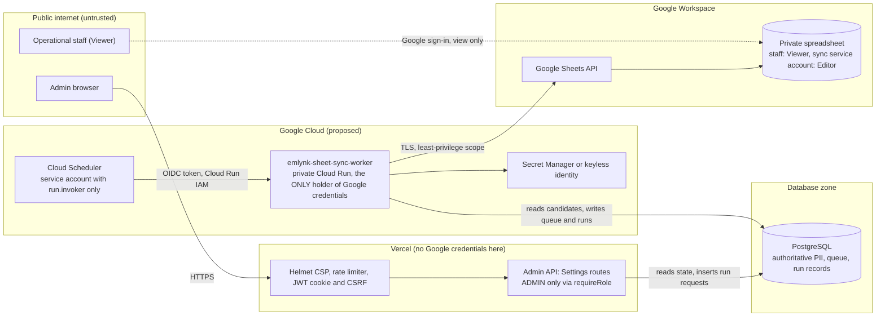

---

## 15. Observability & Monitoring

Structured log events (JSON). Fields are limited to non-sensitive identifiers.

| Event | Severity | Typical fields |
| :--- | :--- | :--- |
| `sheet_sync.enqueued` | INFO (sampled) | `candidateRef`, `source` |
| `sheet_sync.started` | INFO | `runId` or `batchId`, `batchSize` |
| `sheet_sync.completed` | INFO | `batchId`, `durationMs`, `rowsUpdated`, `rowsAppended` |
| `sheet_sync.retry_scheduled` | WARN | `batchId`, `attempt`, `errorClass`, `retryInMs` |
| `sheet_sync.failed` | ERROR | `batchId`, `errorClass`, `attempts` |
| `sheet_sync.config_error` | ERROR | `errorClass` (credentials, permission, tab, spreadsheet) |
| `sheet_sync.reconcile_started` | INFO | `runId`, `trigger` |
| `sheet_sync.reconcile_completed` | INFO | `runId`, counts (appended, updated, marked inactive, duplicates), `durationMs` |
| `sheet_sync.reconcile_skipped` | INFO | `runId`, reason (`LOCK_HELD`, `DISABLED`) |
| `sheet_sync.reconcile_deletion_guard` | WARN | `runId`, `wouldMarkInactive` (count only) |
| `sheet_sync.schema_mismatch` | ERROR | `runId` or `batchId`, mismatch kind |
| `sheet_sync.duplicate_key_detected` | WARN | `runId`, count |

**Never logged:** names, NIC, passport numbers, addresses, full phone numbers, Google private keys, access tokens, internal secrets, Google API response bodies (which may echo ranges, IDs or values), or spreadsheet IDs. `candidateRef` is the internal `unique_id` only, never a passport/NIC; **Needs confirmation (D-13)** that using it in logs is acceptable.

The current logging utilities do **not** yet guarantee this for Google data (Section 14.2); redaction and tests are an implementation requirement. The Settings status (Section 13.1) is the operator-facing view of the same health information.

---

## 16. Architecture Decision Records

| ADR | Decision | Status |
| :--- | :--- | :--- |
| 001 | PostgreSQL is the single source of truth; the Sheet is an operational mirror, not DR | Frozen requirement |
| 002 | Synchronization is strictly one-way; Sheet edits never reach the database | Frozen requirement |
| 003 | Candidate writes never wait for Google; a durable outbox decouples them | Frozen requirement |
| 004 | Row identity is `unique_id`, retained via appended technical Column `AP` (`_SYSTEM_CANDIDATE_ID`); natural keys (Passport/NIC) rejected | Proposed, **Blocking Decision (D-17)** |
| 005 | Rows are never deleted from the Sheet; absent candidates become `DELETED / INACTIVE`, only from a complete snapshot | Frozen requirement |
| 006 | Two mechanisms: incremental sync plus daily reconciliation | Proposed |
| 007 | Scheduling is external (Cloud Scheduler -> private Cloud Run); the app has no internal cron | Proposed |
| 008 | Google credentials exist only in the sheet-sync service; Vercel holds none | Frozen requirement |
| 009 | Dedicated tables `sheet_sync_queue` and `sheet_sync_runs` | Proposed |
| 010 | Google calls are batched with backoff and configurable sizes; no quota number is asserted | Proposed |
| 011 | Change capture via database triggers (application-level enqueue is the fallback) | Proposed, decision D-2 |
| 012 | Drift detection by full-cell comparison against freshly generated rows; `updated_date` is not used | Proposed |
| 013 | A dedicated `emlynk-sheet-sync-worker` Cloud Run service | Proposed, decision D-3 |
| 014 | "Sync Now" and "Test Connection" are durable run requests, never unawaited promises | Proposed |
| 015 | The Google Sheet UI is a section of one visible **Settings** sidebar item at `/admin/settings` | **Confirmed requirement** |
| 016 | Target layout preserves 26 legacy Excel columns verbatim first + 15 appended operational/stage fields (41 business-visible cols) | **Confirmed requirement** |
| 017 | Dedicated service account `emlynk-sheet-sync@...` authenticated via keyless ADC on Cloud Run (zero JSON keys) | **Confirmed (D-4)** |
| 018 | Real operational Sheet (`1-11g-0tQruJbgVslH0nzCzG_JRr-4LahSCU8ZJirMpE`) with strict environment write-gating; no separate test sheet | **Confirmed (D-9)** |

---

## 17. Risk Analysis & Mitigation Matrix

| Risk | Likelihood | Impact | Mitigation |
| :--- | :---: | :---: | :--- |
| Google outage or rate limiting | Medium | Low | Candidate writes unaffected; bounded retries with backoff; coalesced queue stays bounded; daily reconciliation catches up |
| Revoked credentials / lost permission | Low | Medium | `CONFIG_ERROR` stops retries; shown in Settings; admin Test Connection |
| Duplicate rows | Low | Medium | Immutable `unique_id` in Column `AP`, key re-read per batch, single writer, duplicate detection and labelling |
| Missed change (a writer path not captured) | Low (triggers) / Medium (app-level) | Low | Trigger capture; daily full comparison repairs anything missed |
| Mass false "inactive" marking | Low | High | Complete-snapshot requirement, row-count verification, deletion guard (9.4) |
| Schema/tab tampering in the Sheet | Medium | Medium | Positional header validation before writes (`A1:AP1`); `CONFIG_ERROR`; no auto-rebuild |
| Duplicate header collision in validation | Medium | Medium | Positional index-based validation instead of dictionary name lookup (6.4) |
| Manual edits by staff | Medium | Low | Viewer access; reconciliation restores authoritative values |
| PII exposure through the Sheet | Low | High | Private sheet, named Viewers, least privilege, access review, no public link |
| PII or secrets in logs | Medium | High | Allow-listed log fields; add and test Google credential redaction (current `safeLog` is insufficient) |
| Concurrent reconciliations / writers | Medium | Medium | Named advisory lock on a dedicated connection; writer lease; max 1 instance |
| Session-pooler lock behaviour | Medium | Medium | Dedicated connection; Phase 7 spike; lease-row fallback |
| Trigger overhead or defect on hot tables | Low | Medium | Minimal trigger body; coalescing; verify under bulk writes; rollback by dropping triggers |
| Real operational Sheet pollution by dev/test | Medium | Critical | Strict environment write-gating (`SHEET_SYNC_ENABLED=false` by default; requires explicit production flag); all tests mocked; probe restricted to meta tab |
| Settings exposed to non-admins | Low | Medium | `adminOnly` entry, page guard, backend `requireRole`, tests (18.5) |
| Candidate Pool regression | Low | High | Scope contract; regression tests; no Candidate Pool code changes |

---

## 18. Testing Strategy & Validation Plan

The implementation is **not complete** until every group below passes. Existing conventions: backend tests run with `npm test` (`node --test`, mostly in-memory fakes); Admin tests with `npm --prefix admin test` (Vitest); build with `npm run admin:build`. Trigger and lock behaviour cannot be proven with in-memory fakes and needs a real throwaway PostgreSQL (the repo's testing guide already describes one).

### 18.1 Unit Tests

- **Mapper** (`candidateSheetMapper`): all 41 operational columns in exact legacy order + technical column `AP`; formatting rules (6.3); null -> empty; phone digits unchanged; dates; `COMPLETED`/`INCOMPLETE`; document status vocabulary (`VERIFIED`/`REVIEW_REQUIRED`/`MISSING`); **exactly one `SCAN` column and no agreement/affidavit columns**; parity with the Admin UI's `getCandidate` output for the same fixtures.
- **Positional header validation:** exact 42-element array match; tolerates duplicate header strings at distinct positions (`PASSPORT COPY` at 13 and 18, `POLICE REP SRI LANKA` at 14 and 23, `POLICE REP ROMANIA` at 15 and 24); detects missing, swapped or unexpected headers.
- **Normalization and aggregate comparison:** identical input -> identical row; comparison ignores `LAST MIRRORED AT`; whitespace/format edge cases.
- **Retry classification:** 429, 408, 5xx, network errors -> retryable; 401, 403 (non-rate-limit), 404, invalid ID, schema mismatch -> config/permanent.
- **Backoff:** exponential growth, jitter bounds, cap, attempt bound.
- **Event coalescing:** many changes for one candidate -> one pending row; a change during processing -> a new pending row.
- **Row identity:** key is `unique_id` in Column `AP` as an opaque string; leading zeros preserved; passport/NIC change keeps the row.

### 18.2 Integration Tests

- **Outbox transaction behaviour** (real PostgreSQL): every writer in 4.4 (including `updateCandidateDetails`, `updateStage`, `fieldReconciliationService`, document supersede/remove, review actions, police date correction) produces or coalesces a queue row **in the same transaction**; a rolled-back change leaves no event; cascades and bulk writes behave as designed; queue size stays bounded.
- **Queue claiming:** compare-and-swap lease, expiry recovery, fenced completion, `SIGTERM` release.
- **Google client (mocked):** header read, key-column read (Col `AP`), `batchUpdate`, `append`, 429/5xx/network, 401/403/404, malformed responses.
- **Row update vs append:** existing key in Col `AP` updates; missing key appends once; retry after a simulated crash between append and completion does not duplicate.
- **Duplicate prevention:** concurrent events, two workers (writer lease), reconciliation with duplicate keys.
- **Schema mismatch:** tab renamed/deleted, header missing/reordered, blank/duplicate keys in Col `AP`, manually inserted rows -> `CONFIG_ERROR`, no writes.
- **Auth failure and quota/rate limit** behaviour.
- **Reconciliation:** missing rows, stale candidate fields, stale stage fields, stale document statuses and variants, manually edited cells, missing events, absent candidates; unchanged rows are not rewritten; chunking; lock held -> `SKIPPED`; lock released on error; connection loss.
- **Deletion safety:** complete snapshot -> marks inactive; failed/partial/timed-out snapshot, count mismatch or guard exceeded -> **no** inactive marking.
- **Log redaction:** private keys, tokens, spreadsheet IDs, candidate PII never appear in logs, run records or API responses.
- **Run requests:** `POST /test` and `POST /run` create durable records; duplicates return the active run; `jobId` always resolvable.
- **Environment gate tests:** verify that when `SHEET_SYNC_ENABLED !== 'true'`, worker refuses to write and emits no external HTTP calls.

### 18.3 Guarded Staging & Dry-Run Tests (Operational Sheet Safe)

> [!WARNING]
> Because there is no dummy spreadsheet, E2E validation against `1-11g-0tQruJbgVslH0nzCzG_JRr-4LahSCU8ZJirMpE` must follow these guard rules:
> 1. Local tests and CI use mock adapters exclusively.
> 2. Initial connection verification executes ONLY the non-destructive write probe against `Mirror_Meta!B2`.
> 3. Initial candidate sync is verified on pre-agreed synthetic test candidate records (`unique_id` range specified in runbook).
> 4. Reconciliation dry-run verifies row mapping and cell comparison without issuing `batchUpdate` until signed off.

### 18.4 Regression Tests

Existing candidate registration; Candidate Pool; document uploads; the WhatsApp workflow and webhook response timing; OCR; Manual Review; Admin authentication and authorization (including `REGISTRATION_DESK` isolation); the existing submission worker; the Admin build.

### 18.5 Settings Navigation & UI Tests

Admin (Vitest) and backend tests must cover:

1. The **Settings** sidebar item renders for the authorized role (ADMIN).
2. Unauthorized roles (MANAGER, ANALYST, REGISTRATION_DESK) do not see it and do not gain access.
3. Direct navigation to `/admin/settings` is authorization-protected: a non-ADMIN sees no Settings content and no Settings API call is made; REGISTRATION_DESK is still redirected to Add Candidate.
4. The existing sidebar items are unchanged (same labels, same order, Settings appended last).
5. Existing navigation behavior is unchanged (links, active state of the other items, breadcrumb).
6. The Settings active state works (item highlighted on `/settings`; breadcrumb shows "Settings").
7. The Google Sheet status loads without affecting other Admin pages, and a failing status request shows an error only inside the Settings section.
8. **Test Connection** requires correct authorization (backend 403 for MANAGER, ANALYST, REGISTRATION_DESK; success path for ADMIN).
9. **Sync Now / Reconcile Now** requires correct authorization (same matrix as Test Connection).
10. The Candidate Pool (`/candidates`, `/candidates/new`, candidate details) is unchanged.
11. Closing the Settings page or the browser does not affect backend synchronization (the queue is still drained, retried and reconciled with no browser connected).

---

## 19. Branch & Delivery Strategy

### 19.1 Agreed Workflow

- **Development currently happens on `dev`.** This architecture document is prepared on `dev`. `stage` is **not** a development base.
- When the feature state is complete on `dev`:
  - **`version/google-sheet-sync`** preserves the completed feature/version and is prepared for review/PR according to the team's feature review workflow.
  - **`stage`** is the integration / Vercel Preview branch: the appropriate completed `dev` changes are merged into `stage` and `stage` is pushed to trigger/serve the Vercel Preview workflow.
- **`main`** is production/release controlled. This feature does not modify or merge to `main` unless explicitly approved later.
- Observed: `version/google-sheet-sync` does not exist yet. Precedent in the history: `version/Admin-dashboard` was merged into `dev`. The PR target for `version/google-sheet-sync` therefore **Needs confirmation (D-8)**.
- A Vercel Preview of `stage` exercises only the Admin SPA and Admin API (Settings page, status, run requests). The Cloud Run sheet-sync worker is deployed separately.

### 19.2 Diagram 9 — Git / Delivery Flow

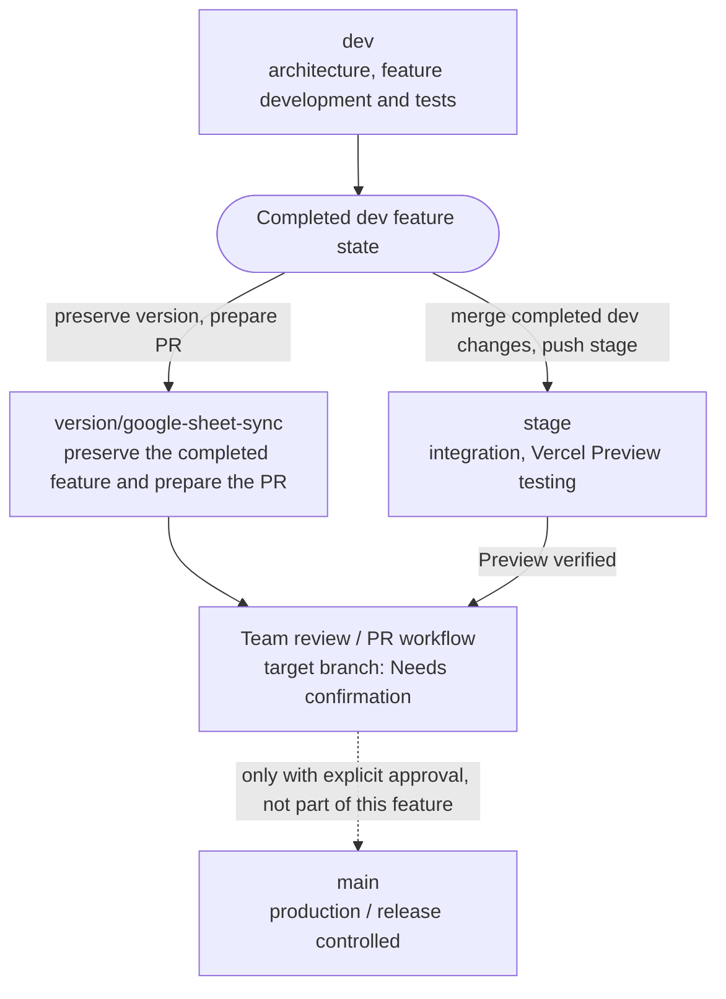

### 19.3 Commit Categories

- `feat(sheets): add sheet sync queue and run tables with change-capture triggers`
- `feat(sheets): add Google Sheets client with keyless ADC configuration`
- `feat(sheets): add candidate aggregate to 41-column legacy-compatible mapper`
- `feat(sheets): add sheet sync worker with leases, coalescing and retries`
- `feat(sheets): add reconciliation engine with lock and deletion guard`
- `feat(sheets): add secure scheduler trigger endpoint`
- `feat(settings): add sheet sync status, test and run APIs`
- `feat(ui): add Settings navigation item and Google Sheet Sync section to the Admin Console`
- `test(sheets): add unit, integration and regression tests`
- `docs(sheets): add runbook and update architecture`

### 19.4 Pull Request Checklist

- [ ] No candidate database write waits on Google; no Google call inside a transaction or trigger.
- [ ] No credentials, keys or tokens committed, logged or present in Vercel; redaction tests pass.
- [ ] Exactly 41 business-visible columns (`A` to `AO`) preserving legacy Excel format (Cols 1–26) + technical key column `AP` mapped exactly; one `SCAN` only.
- [ ] Positional schema validation handles duplicate header names correctly.
- [ ] Capture covers every writer in 4.4 (test enumerates them).
- [ ] Reconciliation never marks inactive from an incomplete snapshot.
- [ ] Settings is ONE appended sidebar item; no existing sidebar item was removed, renamed, reordered or restyled.
- [ ] Settings content and Settings APIs are ADMIN-only on the backend; a direct `/admin/settings` visit by another role shows no Settings data.
- [ ] No changes or regressions to the Candidate Pool.
- [ ] `npm test`, `npm --prefix admin test` and `npm run admin:build` are green.
- [ ] Operational sheet write-gating verified (`SHEET_SYNC_ENABLED`).
- [ ] Documentation and runbook updated.

### 19.5 Release Flow

`dev` (develop, test) -> completed state -> `version/google-sheet-sync` (preserved, PR prepared) and `stage` (Preview verified) -> team review -> release decision. Nothing reaches `main` without explicit approval.

---

## 20. Phased Implementation Plan (Gated)

**No phase may start until Phase 0 is accepted.** Each phase ends with its acceptance criteria and tests green before the next begins.

### Phase 0 — Architecture Scope Freeze & Blocking Decisions
- **Objective:** approve this document, resolve **Decision D-17** (Row Identity technical column `AP`), and resolve **Decision D-18** (Business sign-off on 12 ambiguous/duplicate legacy fields).
- **Components:** this document only.
- **Acceptance:** approved column mapping, confirmed row key approach, scope contract accepted.
- **Tests:** none. **Rollback:** n/a. **Depends on:** nothing.

### Phase 1 — Google Cloud & Target Sheet Verification (Provisioned)
- **Objective:** verify the already provisioned service account (`emlynk-sheet-sync@project-aa11e15e-a951-4e1b-a65.iam.gserviceaccount.com`) on target spreadsheet (`1-11g-0tQruJbgVslH0nzCzG_JRr-4LahSCU8ZJirMpE`), setup `Mirror_Meta` tab with `schema_version`, and verify keyless ADC connectivity via probe cell `B2`.
- **Components:** infrastructure and throwaway verification script (no application code).
- **Acceptance:** probe cell writable on `Mirror_Meta`; `Emlynk Candidate Operational Mirror` read successfully; no service account JSON keys used.
- **Tests:** manual verification checklist. **Rollback:** revoke sharing. **Depends on:** Phase 0.

### Phase 2 — Google Sheets Client & Secure Configuration
- **Objective:** Google Sheets client (auth via ADC, positional header/key read, batch update/append, error classification) and configuration validation.
- **Components (likely):** new `src/services/googleSheetsClient.js`, `src/config/env.js`, `src/utils/safeLog.js` (credential redaction), `google-auth-library`.
- **Acceptance:** classification table (8.7) implemented; positional header validation proven; credential redaction proven.
- **Tests:** unit + mocked integration (18.1, 18.2). **Rollback:** feature flag off / revert. **Depends on:** Phase 1.

### Phase 3 — Persistent Outbox Migration
- **Objective:** tables `sheet_sync_queue`, `sheet_sync_runs`, row-level security/privilege hardening, and change-capture triggers (Option T).
- **Components:** new Prisma migration, `prisma/schema.prisma`.
- **Acceptance:** applies on throwaway database and through `prisma migrate deploy`; capture proven for all writers in 4.4; coalescing verified.
- **Tests:** real-PostgreSQL integration tests. **Rollback:** drop triggers and tables. **Depends on:** Phase 0.

### Phase 4 — Candidate Aggregate 41-Column Mapper
- **Objective:** shared candidate-to-row mapper (41 business values + Column `AP` key) and batched aggregate reader.
- **Components:** new `src/services/candidateSheetMapper.js`.
- **Acceptance:** parity with Admin UI view; 41 legacy-aligned columns; one `SCAN`; deterministic formatting rules.
- **Tests:** unit tests (18.1). **Rollback:** revert. **Depends on:** Phase 2.

### Phase 5 — Incremental Enqueue Integration
- **Objective:** confirm capture is active and verified across all nine mutation paths.
- **Components:** tests; verification of outbox triggers.
- **Acceptance:** each writer creates/coalesces queue rows atomically.
- **Tests:** 18.2 outbox tests + 18.4. **Rollback:** disable capture triggers. **Depends on:** Phases 3, 4.

### Phase 6 — Background Sheet Worker
- **Objective:** `emlynk-sheet-sync-worker` process: claim/lease, coalescing, upsert via Column `AP`, retry, `CONFIG_ERROR`, graceful shutdown, environment write-gating.
- **Components:** new worker entry file and `src/services/sheetSyncQueue.js`.
- **Acceptance:** incremental sync scenarios pass; no duplicate rows; Google failure never affects candidate writes.
- **Tests:** unit + mocked integration. **Rollback:** scale service to zero / flag off. **Depends on:** Phases 2–5.

### Phase 7 — Reconciliation Engine
- **Objective:** full-cell comparison (Cols 1–40 + Col `AP`), repairs, deletion safety, locking.
- **Components:** new `src/services/sheetReconciliationService.js`.
- **Acceptance:** 9.3 and 9.4 behaviours; advisory lock on session pooler.
- **Tests:** integration (18.2), deletion-safety tests. **Rollback:** disable runs. **Depends on:** Phase 6.

### Phase 8 — Cloud Scheduler & Secure Trigger
- **Objective:** private reconciliation endpoint that creates run records, OIDC/IAM authentication, daily production schedule (disabled until Phase 13).
- **Components:** worker HTTP surface, IAM, Scheduler configuration.
- **Acceptance:** unauthenticated requests rejected; scheduled runs recorded.
- **Tests:** endpoint auth tests. **Rollback:** pause/delete jobs. **Depends on:** Phase 7.

### Phase 9 — Admin Settings / Test API
- **Objective:** `status`, `test`, `run`, `runs/:id` (Section 13) on Admin API.
- **Components:** `src/routes/admin.js`, services.
- **Acceptance:** ADMIN-only on backend (403 for others); durable run records; no Google credentials on Vercel.
- **Tests:** API and authorization tests. **Rollback:** revert routes. **Depends on:** Phases 3, 6, 7.

### Phase 10 — Settings Sidebar Item, Page & Google Sheet Sync Section
- **Objective:** append visible **Settings** item after Change Roles, route `/admin/settings`, with Google Sheet Sync section (Section 12).
- **Components:** `admin/src/layout/navigation.ts`, `admin/src/App.tsx`, Settings page, icon registry.
- **Acceptance:** Section 18.5 passes; existing sidebar items unchanged; Candidate Pool unchanged; `REGISTRATION_DESK` isolated.
- **Tests:** Admin Vitest suite (18.5). **Rollback:** revert UI commit. **Depends on:** Phase 9.

### Phase 11 — Guarded Operational Sheet Dry-Run Verification
- **Objective:** prove behaviour end-to-end against the operational Sheet using synthetic test candidate rows and non-destructive meta probes.
- **Acceptance:** Section 18.3 scenarios pass; probe verified; operational rows untouched.
- **Rollback:** flag off. **Depends on:** Phases 6–10.

### Phase 12 — Full Regression & E2E
- **Objective:** whole-system confidence.
- **Acceptance:** `npm test`, `npm --prefix admin test`, `npm run admin:build` green; regression group 18.4 green; secrets scan clean.
- **Rollback:** n/a. **Depends on:** Phase 11.

### Phase 13 — Production Enablement
- **Objective:** enable `SHEET_SYNC_ENABLED=true` on production worker, enable daily Cloud Scheduler job.
- **Acceptance:** first live sync verified; first scheduled run verified.
- **Rollback:** disable job and flag. **Depends on:** Phase 12 and sign-off.

### Phase 14 — Version Branch, PR & Review
- **Objective:** preserve completed feature in `version/google-sheet-sync`, verify `stage` Preview, prepare PR.
- **Acceptance:** Definition of Done met; PR checklist complete.
- **Rollback:** n/a. **Depends on:** Phase 13.

---

## 21. Definition of Done

- [ ] Architecture approved with Blocking Decisions D-17 and D-18 resolved (Phase 0).
- [ ] Exact 41-column operational mapping + technical key column `AP` approved.
- [ ] Sheet schema validated (exact positional headers, versioning, plain-text formatting).
- [ ] Credentials secure (keyless ADC runtime identity on Cloud Run; zero JSON keys; redaction verified).
- [ ] Database migration applied safely.
- [ ] Incremental sync works using Column `AP` row identity.
- [ ] Stage sync works (including derived stages).
- [ ] Document status sync works (including variants).
- [ ] Positional schema validation handles duplicate header names without ambiguity.
- [ ] Operational Sheet safeguards active (`SHEET_SYNC_ENABLED` gate).
- [ ] Retry and recovery work.
- [ ] Reconciliation works (all repair classes).
- [ ] Duplicate prevention verified.
- [ ] Deletion / inactive behavior verified with incomplete-snapshot safety.
- [ ] Daily production schedule prepared.
- [ ] Settings sidebar item and Google Sheet Sync section work (visible after Change Roles; ADMIN-only; Test Connection and Sync Now durable).
- [ ] Full backend tests green.
- [ ] Full Admin tests green.
- [ ] Admin build green.
- [ ] Regression checks green; Candidate Pool untouched.
- [ ] WhatsApp, OCR and Manual Review unaffected.
- [ ] No secrets committed.
- [ ] Documentation updated.
- [ ] Completed feature preserved in `version/google-sheet-sync`.
- [ ] `stage` Preview verified.
- [ ] PR prepared according to team workflow.

---

## 22. Requirements Traceability Matrix

| Requirement | Architecture component | Data source | Trigger | Failure behavior | Test coverage | Status |
| :--- | :--- | :--- | :--- | :--- | :--- | :--- |
| Candidate registration sync | Change capture -> queue -> worker -> mapper -> Sheets client | `users`, `candidate_stages` | Registration transaction | Retry/backoff; reconciliation repairs | 18.2 outbox, 18.3 | Proposed |
| Candidate update sync | Same | `users` (and OCR field fills) | Update / reconciliation fill | Same | 18.2, 18.3 | Proposed |
| Legacy Excel 1–26 order preservation | Mapper Columns `A` through `Z` | Database aggregate | Any sync write | Schema validation fails if reordered | 18.1 positional test | **Confirmed requirement** |
| Candidate Details Note mirrored | Mapper column `AF` (Col 32) | `candidate_stages.notes` (`CANDIDATE_DETAILS`) | Note edit / registration | Normal sync; sensitive PII controls apply | 18.1 (Col AF) | **Confirmed requirement** |
| Stage sync (incl. derived stages) | Mapper Columns `AG` through `AL` | `candidate_stages`, `users`, `documents` | Component change | Same | 18.1 parity | Proposed |
| One SCAN rule | Mapper Column `Q` (Col 17) | `documents` (`SCAN`) | n/a | Only one scan column mirrored | 18.1 (no affidavits) | **Confirmed requirement** |
| Immutable row identity without visible ID | Technical Column `AP` (`_SYSTEM_CANDIDATE_ID`) | `User.unique_id` | Every write / reconcile | Key re-read per batch; updates in place | 18.1, 18.2 duplicate | Proposed (D-17) |
| Duplicate header handling | Positional array validation (6.4) | `A1:AP1` | Before every write batch | Positional mismatch flags `CONFIG_ERROR` | 18.1 positional test | Proposed |
| Keyless authentication | Cloud Run ADC runtime identity | GCP metadata server | Continuous | 401/403 flags `CONFIG_ERROR` | Phase 1 checklist | **Confirmed (D-4)** |
| Real operational sheet safeguard | Environment write gate (`SHEET_SYNC_ENABLED`) | `process.env` | Worker start & sync | Non-prod writes blocked | 18.2 gate test | **Confirmed (D-9)** |
| Google outage never blocks DB writes | Outbox decoupling | n/a | Google error | Candidate write unaffected; `FAILED`/retry | 18.3 | **Confirmed requirement** |
| Reconciliation repairs drift | Reconciliation engine, full-cell comparison | DB snapshot vs Sheet | Scheduler or Sync Now | Run `FAILED` retried next run; lock `SKIPPED` | 18.2 | Proposed |
| Deleted/inactive handling | Event path + guarded reconciliation | Complete snapshot | Delete event / reconcile | Incomplete snapshot -> no marking | 18.2 | Proposed |
| Settings sidebar item and page | Admin SPA navigation and `/admin/settings` | n/a | ADMIN opens Settings | Non-ADMIN sees no Settings data | 18.5 | **Confirmed requirement** |
| Settings Test Connection | Durable `TEST_CONNECTION` run | `Mirror_Meta!B2` probe | ADMIN action | Probe failure flags `CONFIG_ERROR` | 18.2, 18.5 | Proposed |
| Candidate Pool unchanged | Scope contract | n/a | n/a | n/a | 18.4, 18.5 | **Confirmed requirement** |

---

## 23. Assumptions, Unknowns (Needs Confirmation) & Non-Goals

### Assumptions

1. The Google Workspace organization maintains Sheets API access for `emlynk-sheet-sync@project-aa11e15e-a951-4e1b-a65.iam.gserviceaccount.com`.
2. At 42 columns (41 operational + 1 technical), spreadsheet capacity easily exceeds current candidate volume.
3. The Cloud Run platform can host the private `emlynk-sheet-sync-worker` service using the dedicated service account identity.

### Decisions and Facts Requiring Confirmation

| ID | Item | Status / Decision |
| :-: | :--- | :--- |
| **D-1** | Settings role policy: may MANAGER get a read-only status view? | ADMIN only (Section 12.6) until approved |
| **D-2** | Change capture: database triggers vs application-level enqueue | Triggers (Section 8.1) |
| **D-3** | Hosting: dedicated `emlynk-sheet-sync-worker` vs existing submission worker | Dedicated Cloud Run service (Section 11.2) |
| **D-4** | Google authentication method on Cloud Run | **CONFIRMED / RESOLVED:** Dedicated service account `emlynk-sheet-sync@project-aa11e15e-a951-4e1b-a65.iam.gserviceaccount.com` using **keyless ADC**. No long-lived JSON keys. |
| **D-5** | Candidate Details Note inclusion | **CONFIRMED / RESOLVED:** Included at Column 32 (`AF`). |
| **D-6** | Timestamp zone: UTC vs Asia/Colombo | UTC (`Z` suffix) |
| **D-7** | Deletion guard threshold | Enabled; default 10 rows or 5% of candidate base |
| **D-8** | PR target branch for `version/google-sheet-sync` | Precedent: merge into `dev` |
| **D-9** | Environment isolation for Google Sheet | **CONFIRMED / RESOLVED:** Single real operational spreadsheet (`1-11g-0tQruJbgVslH0nzCzG_JRr-4LahSCU8ZJirMpE`, tab `Emlynk Candidate Operational Mirror`). Guarded by `SHEET_SYNC_ENABLED` and mock test suites (Section 11.6). |
| **D-10** | Production data checks: `unique_id` formats, lowercase passport IDs | Audit before Phase 3 |
| **D-11** | Duplicate-row policy | Label `DUPLICATE ROW` in Col `AM`, never delete |
| **D-13** | Log `unique_id` as `candidateRef` | Allowed |
| **D-14** | Connection-test write probe location | Cell `Mirror_Meta!B2` on the meta tab |
| **D-15** | Production reconciliation time of day | Off-peak (e.g. 02:00 UTC / 07:30 Sri Lanka time) |
| **D-16** | Spreadsheet access review cadence | Quarterly |
| **D-17** | **BLOCKING DECISION: Row Identity Implementation** | **Proposed Decision:** Approve Option 1 (appended technical Column 42 / `AP` labeled `_SYSTEM_CANDIDATE_ID` storing `User.unique_id`, protected and hidden in UI) to enable immutable keying without breaking the 41-column layout (Section 7.1). |
| **D-18** | **BLOCKING DECISION: Business Sign-Off on Ambiguous Legacy Fields** | Stakeholder sign-off required for the 12 audited legacy fields (Section 6.2):<br/>- **D-18.1:** `TEST NUMBER` -> confirm mapping to `CandidateStage.job_id` or leave blank.<br/>- **D-18.2:** Two `PASSPORT COPY` cols (13 vs 18) -> confirm business distinction.<br/>- **D-18.3:** Two `POLICE REP SRI LANKA` cols (14 vs 23) -> confirm variant mappings (`SL_VERIFIED` vs `SL_NORMAL`).<br/>- **D-18.4:** Two `POLICE REP ROMANIA` cols (15 vs 24) -> confirm business distinction.<br/>- **D-18.5:** `DRIVING LICIAN` (Col 19) -> confirm emitting empty cell (not captured in DB).<br/>- **D-18.6:** `NATIONAL ID` (Col 20) -> confirm mapping to `NIC` document verification status (vs Col 9 `ID NUMBER` = `User.nic`).<br/>- **D-18.7:** `POLICE REPORT APPLIED` (Col 21) -> confirm mapping to `POLICE_SLIP` status.<br/>- **D-18.8:** `POLICE REP FM` (Col 25) -> clarify "FM" or confirm emitting empty cell.<br/>- **D-18.9:** `VIDEOS` (Col 26) -> confirm mapping to `SKILL_VIDEO` document status. |

### Non-Goals

1. **Bidirectional sync:** Sheet -> PostgreSQL is strictly out of scope.
2. **Binary media mirroring:** no documents, PDFs, or videos in Google Drive or Sheets.
3. **Disaster recovery replacement:** the mirror does not replace PostgreSQL backups or point-in-time recovery.
4. **Any redesign** of the Candidate Pool, OCR, WhatsApp workflow, candidate matching or Manual Review.
