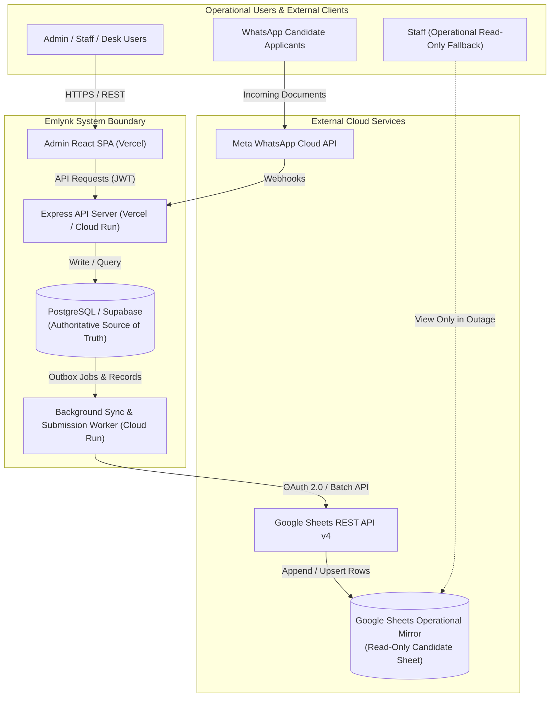
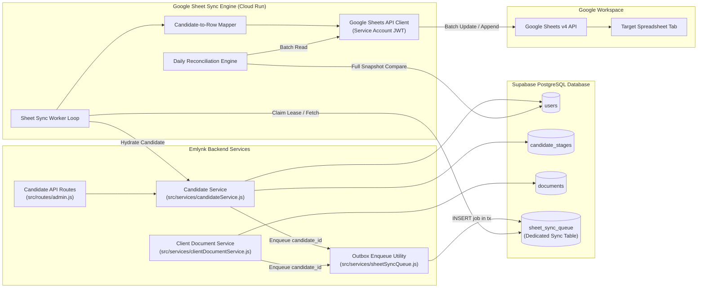
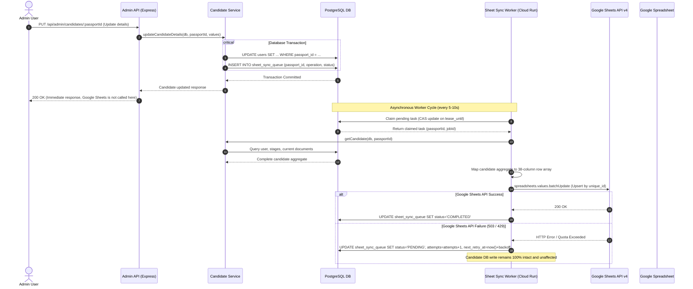
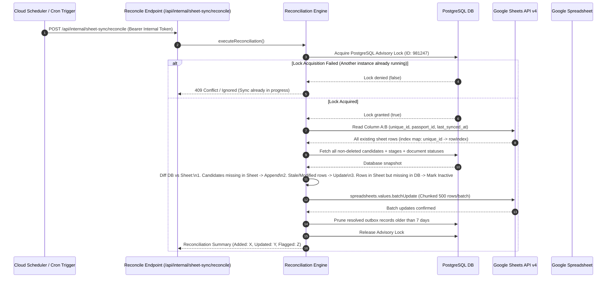
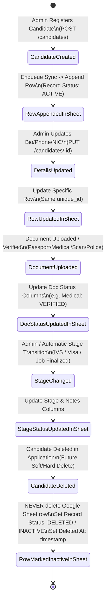
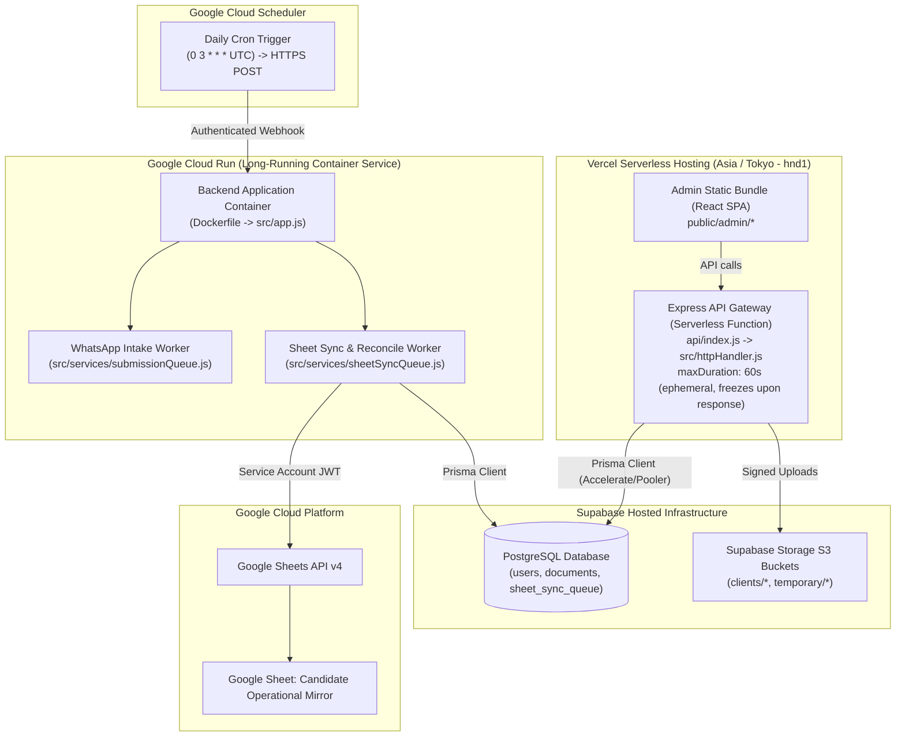
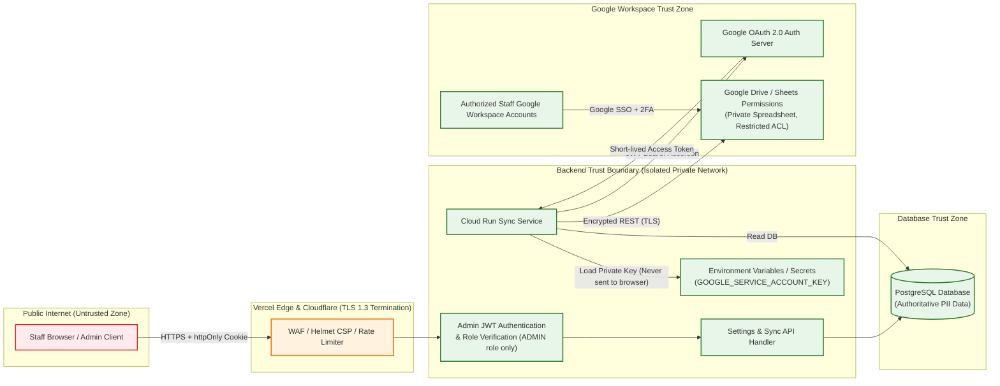

# Google Sheets Candidate Operational Mirror / Backup
## Production-Grade Architecture & Technical Specification

- **Feature Name:** Google Sheets Candidate Operational Mirror / Backup
- **Document Version:** 1.0.0
- **Status:** DRAFT / PROPOSED (Architecture & Documentation Only)
- **Author:** System Architecture Team
- **Target Branch:** `version/google-sheet-sync`
- **Recommended Base Branch:** `stage`

---

## 1. Executive Summary & Purpose

The **Google Sheets Candidate Operational Mirror / Backup** provides a continuous, automated, one-way synchronization pipeline from the primary PostgreSQL (Supabase) database to a secure Google Spreadsheet.

### Crucial Architectural Clarification:
- **System of Record:** PostgreSQL (Supabase) is the single authoritative source of truth for all candidate records, stages, document statuses, and call logs.
- **Operational Fallback (NOT Database Disaster Recovery):** The Google Spreadsheet is strictly an **operational read-only fallback**. If the primary web application, Vercel frontend, or Cloud Run backend experiences downtime, operational and administrative staff can continue viewing up-to-date candidate contact, stage, and document readiness information in Google Sheets to conduct interviews, follow-ups, and field deployments.
- **Directionality:** Strictly **one-way** (`PostgreSQL` $\rightarrow$ `Backend Sync Service` $\rightarrow$ `Google Sheets API` $\rightarrow$ `Google Spreadsheet`). Edits made directly in the Google Sheet **never** propagate back to the database.

---

## 2. Business Requirements & Codebase Discoveries

### 2.1 Candidate Registration Data Discovered

An exhaustive audit of `prisma/schema.prisma` (`User` model), `src/services/candidateService.js` (`parseCandidateBody`, `createCandidate`, `updateCandidateDetails`, `getCandidate`), `src/routes/admin.js`, and the frontend components `admin/src/pages/CandidateRegistrationPage.tsx` and `admin/src/components/candidate/CandidateFields.tsx` confirms the exact candidate fields:

| Field Name (Code/API) | Database Column (`users`) | Frontend Label | Data Type | Validation & Constraints | PII Level |
| :--- | :--- | :--- | :--- | :--- | :--- |
| `passportId` | `passport_id` (PK) | Passport Number | `String` (PK) | 6–9 alphanumeric characters (`/^[A-Za-z0-9]{1,20}$/`), normalized uppercase, immutable after creation | **High** |
| `uniqueId` | `unique_id` (Unique) | Candidate ID / Ref | `String` (Unique) | 4+ digit numeric string (`0001`, `0002`, ...), auto-generated via sequential calculation, immutable | **Low** |
| `firstName` | `first_name` | Other Names | `String` | Required, $\le 100$ chars | **Medium** |
| `otherName` | `other_name` | Surname | `String?` | Required at registration, $\le 100$ chars | **Medium** |
| `nic` | `nic` (Unique) | NIC | `String?` (Unique) | Required at registration; Sri Lankan NIC format (9 digits + V/X, or 12 digits: `/^(\d{9}[VX]\|\d{12})$/`), normalized uppercase | **High** |
| `dateOfBirth` | `date_of_birth` | Date of Birth | `DateTime?` (`@db.Date`) | Optional at creation, format `YYYY-MM-DD` | **High** |
| `placeOfBirth` | `place_of_birth` | Place of Birth | `String?` | Optional, $\le 100$ chars | **Medium** |
| `sex` | `sex` | Sex | `String?` | Optional, enum values: `M`, `F`, `X` | **Low** |
| `nationality` | `nationality` | Nationality | `String?` | Optional, $\le 60$ chars (default "Sri Lankan") | **Low** |
| `passportIssueDate`| `passport_issue_date`| Issue Date | `DateTime?` (`@db.Date`) | Optional, must be earlier than `passportExpiryDate` | **Medium** |
| `passportExpiryDate`| `passport_expiry_date`| Expiry Date | `DateTime?` (`@db.Date`) | Optional, format `YYYY-MM-DD` | **Medium** |
| `whatsappNumber` | `whatsapp_number` | WhatsApp Number | `String?` (Indexed) | Required at registration; normalized E.164 without plus (e.g. `94771234567`), locked once set | **High** |
| `contactNumber` | `contact_number` | Contact Number | `String?` | Optional; normalized phone number format | **High** |
| `address` | `address` | Address | `String?` | Optional at registration, required to complete Candidate Details stage, $\le 500$ chars | **High** |
| `job` / `jobTypes` | `job` | Job Types | `String?` | Comma-separated list parsed to/from array $\le 10$ items, each $\le 60$ chars | **Low** |
| `jobExperience` | `job_experience` | Job Experience | `String?` | Required at registration, text description $\le 2000$ chars | **Low** |
| `comment` | `candidate_stages.notes` | Comment | `String?` | Saved into `candidate_stages` with `stage = 'CANDIDATE_DETAILS'` upon registration | **Medium** |
| `createdDate` | `created_date` | Registered Date | `DateTime` | Auto-set `now()` on insertion | **Low** |
| `updatedDate` | `updated_date` | Last Updated | `DateTime` | Auto-updated on record mutation | **Low** |

### 2.2 Document Model & Status Information Discovered

Inspection of `src/services/candidateService.js` (`CANDIDATE_DOCUMENT_TYPES`), `src/services/clientDocumentService.js` (`VERIFICATION_STATUS`), and `prisma/schema.prisma` (`Document` model) identifies:

1. **Document Types in Scope:**
   - `PASSPORT`: Candidate's travel passport.
   - `NIC`: National Identity Card document scan.
   - `SKILL_VIDEO`: Candidate trade skill demonstration video ($\le 50$ MB).
   - `MEDICAL`: Medical fitness examination report.
   - `POLICE_SLIP`: Police clearance submission slip (triggers 21-day countdown).
   - `POLICE_REPORT`: Final police certificate with mandatory variants:
     - `SL_VERIFIED`: Sri Lankan Ministry of Foreign Affairs verified report.
     - `ROMANIA`: Romanian translation / embassy specification report.
     - `SL_NORMAL`: Standard Sri Lankan police certificate.
   - `SCAN`: General candidate document scan pack.
   - **Crucial Rule Confirmed:** As strictly specified in current business rules, there is **only ONE `SCAN`**. Older separate agreements, affidavits, or contracts are **not** present in `CANDIDATE_DOCUMENT_TYPES` and must **never** be reintroduced.

2. **Document Statuses Mirrored:**
   - `VERIFIED`: Approved and valid active document.
   - `REVIEW_REQUIRED`: Uploaded or received via WhatsApp but flagged for admin review.
   - `SUPERSEDED`: Archived historical version replaced by a newer upload.
   - `NOT_UPLOADED` / `MISSING`: No active document on record for this type.
   - `REMOVED`: Document deleted by an admin with logged audit reason.

3. **Storage & Privacy Rule:**
   - **No binary files, PDFs, images, or videos are uploaded to Google Sheets.**
   - Only operational metadata is mirrored: Document Status, Received Date, Police Submitted Date, and Document Variant.

### 2.3 Candidate Stages Discovered

Candidate deployment tracking is modeled across six sequential or parallel stages in `candidate_stages`:
1. `TEST_DETAILS`: Admin-evaluated trade test (`completed`, `jobId`, `testResult`: `PASS`/`FAIL`, `testDate`, `notes`).
2. `CANDIDATE_DETAILS`: Automatic stage; completes when required biographical details and passport are on record.
3. `DOCUMENT_SUBMISSION`: Automatic stage; completes when `PASSPORT`, `MEDICAL`, `POLICE_REPORT` (SL_VERIFIED & ROMANIA), and `SCAN` are verified.
4. `IVS_INTERVIEW`: Stage completed by admin (`completed`, `completedAt`, `notes`).
5. `VISA_APPROVAL`: Stage completed by admin (`completed`, `completedAt`, `notes`).
6. `FINALIZING_JOB`: Stage completed by admin (`completed`, `completedAt`, `notes`).

---

## 3. High-Level System Architecture

### 3.1 Core Architecture Principles

1. **Decoupled Asynchrony:** Database writes in the candidate application flow **never** synchronously await calls to the Google Sheets API. A Google network timeout, quota rejection, or outage must never prevent a candidate from registering or updating.
2. **Transactional Outbox:** Candidate data changes write a lightweight event row to a dedicated PostgreSQL queue (`sheet_sync_queue`) inside the same database transaction.
3. **Lease-Based Queue Worker:** An asynchronous background worker claims pending sync tasks using a compare-and-swap lease pattern identical to the project's existing `submissionQueue.js`.
4. **Idempotent Row Mapping:** Every row in Google Sheets is anchored to an immutable internal candidate reference key (`unique_id`), guaranteeing zero duplicate rows.
5. **Periodic Self-Healing Reconciliation:** A scheduled daily reconciliation engine scans PostgreSQL and Google Sheets, resolving any dropped events, rate-limit pauses, or stale cells.

---

## 4. Mermaid Architectural Diagrams

### 4.1 Diagram 1: System Context Diagram



---

### 4.2 Diagram 2: Component Architecture Diagram



---

### 4.3 Diagram 3: Incremental Sync Sequence Diagram



---

### 4.4 Diagram 4: Daily Reconciliation Sequence Diagram



---

### 4.5 Diagram 5: Failure and Retry Flow Diagram

```mermaid
flowchart TD
    Start([Sync Task Triggered]) --> Enqueue[Enqueue in sheet_sync_queue\nstatus: PENDING]
    Enqueue --> WorkerClaim[Worker Claims Task via CAS Lease]
    WorkerClaim --> CallGoogle[Call Google Sheets API]

    CallGoogle --> Result{API Response}

    Result -->|200 OK Success| MarkDone[Set status: COMPLETED\ncompleted_at: now\nClear Lease]
    MarkDone --> EndSuccess([Task Finished])

    Result -->|401/403 Auth Error| AlertAuth[Set status: CONFIG_ERROR\nCircuit Breaker Trips\nLog Alert: Credentials Invalid]
    AlertAuth --> EndFail([Halted - Human Alert])

    Result -->|429 Quota Exceeded| QuotaPause[Rate Limit Delay\nCalculate Jittered Backoff\nnext_retry_at = now + 60s]
    QuotaPause --> ResetLease[Reset lease\nattempts remains same]

    Result -->|5xx Network / Outage| CheckRetry{attempts < maxAttempts (5)}
    CheckRetry -->|Yes| CalcBackoff[Calculate Exponential Backoff\n5s, 20s, 60s, 300s, 900s]
    CalcBackoff --> ScheduleRetry[Set next_retry_at\nstatus: PENDING\nRelease Lease]
    ScheduleRetry --> WorkerClaim

    CheckRetry -->|No (Exceeded 5)| DeadLetter[Set status: FAILED\nLog Error Context]
    DeadLetter --> NightlySafety[Nightly Daily Reconciliation\nCatches and heals row automatically]
    NightlySafety --> EndSuccess
```

---

### 4.6 Diagram 6: Candidate Lifecycle Diagram



---

### 4.7 Diagram 7: Deployment Architecture Diagram



---

### 4.8 Diagram 8: Security & Trust Boundary Diagram



---

## 5. Incremental / Change Sync Architecture

### 5.1 Comparison of Sync Approaches

| Pattern | Architectural Characteristics | Fit for EmlynkWABot | Selected? |
| :--- | :--- | :--- | :--- |
| **A. Synchronous Inline Call** | Calling Google Sheets API directly inside `POST /api/admin/candidates` or `PUT /candidates/:id`. | **FATAL FLAW:** Violates requirement #3. If Google is down or slow, candidate registration fails or times out. Extends serverless HTTP latency. | **REJECTED** |
| **B. Node.js In-Memory Event / Promise** | Firing `events.emit('candidate.updated')` or unawaited promise in Express route. | **FATAL FLAW:** On Vercel serverless, process execution freezes immediately when HTTP response ends. Unhandled crashes drop sync events silently. | **REJECTED** |
| **C. Supabase Webhook / Database Triggers** | PostgreSQL triggers firing HTTP webhooks to an external endpoint. | **HIGH COMPLEXITY:** Requires public ingress endpoint, signature verification, and doesn't handle batched rate limiting smoothly. | **REJECTED** |
| **D. Transactional Outbox Queue Table** | Atomic PostgreSQL table write (`sheet_sync_queue`) inside candidate database transaction. Asynchronous Cloud Run worker claims and drains jobs. | **EXCELLENT:** Matches existing repo worker pattern (`temporary_data` in `submissionQueue.js`). 100% resilient to crashes, restarts, and third-party outages. | **SELECTED (RECOMMENDED)** |

### 5.2 Safe Integration Points (Trigger Points)

Every backend mutation path affecting candidate data enqueues a sync record:

1. **Candidate Creation (`createCandidate` in `src/services/candidateService.js`):**
   - Inside the transaction creating `tx.user.create()`:
     ```javascript
     await tx.sheetSyncQueue.create({
         data: {
             passportId: values.passportId,
             uniqueId: uniqueId,
             operation: 'UPSERT',
             status: 'PENDING'
         }
     });
     ```
2. **Candidate Bio / Details Update (`updateCandidateDetails` in `src/services/candidateService.js`):**
   - Triggered upon `tx.user.update()` in `updateCandidateDetails`.
3. **Stage Updates (`updateStage` in `src/services/candidateService.js`):**
   - Triggered upon `tx.candidateStage.upsert()`.
4. **Document Direct Upload Finalization (`finalizeUpload` / `storeCandidateDocument` in `src/services/candidateService.js`):**
   - Triggered when an admin uploads or verifies a candidate document.
5. **Document Removal (`removeCandidateDocument` in `src/services/candidateService.js`):**
   - Triggered when an admin deletes a document from a candidate's record.
6. **WhatsApp Pipeline Document Intake (`storeClientDocument` in `src/services/clientDocumentService.js`):**
   - When a WhatsApp document matches an existing candidate and commits to `documents`.

---

## 6. Daily Reconciliation Engine

### 6.1 Purpose & Execution Modes

Even with a resilient transactional outbox, edge cases (such as prolonged network partitions, human edits in the sheet, or unexpected database rollbacks) can introduce minor drift. The daily reconciliation engine guarantees **eventual consistency**.

- **Production Schedule:** Once per day at a configurable off-peak time (default: `03:00 UTC` / `08:30 IST`), configured via `SHEET_SYNC_RECONCILE_SCHEDULE="0 3 * * *"`.
- **Development & Testing Schedule:** Capable of running every 5 minutes in non-production environments when configured with `SHEET_SYNC_RECONCILE_SCHEDULE="*/5 * * * *"`.
- **Runtime Guard:** The scheduler frequency is strictly driven by an environment variable; the 5-minute test schedule is never hard-coded into production artifacts.

### 6.2 Reconciliation Algorithm

```
Step 1: Acquire PostgreSQL Advisory Lock (advisory_lock_id = 981247)
Step 2: Read Spreadsheet Key Index:
        Fetch range "Candidates_Mirror!A2:C" (Columns: Unique ID, Passport ID, Last Synced)
        Construct in-memory Map: uniqueId -> { rowIndex, passportId, lastSyncedAt }
Step 3: Stream all active candidates from PostgreSQL:
        SELECT passport_id, unique_id, updated_date, ... FROM users
Step 4: Diffing & Classification:
        - Candidate in DB but NOT in Sheet Map -> Queue for APPEND
        - Candidate in DB and in Sheet Map, but (DB.updated_date > Sheet.lastSyncedAt) -> Queue for UPDATE
        - Candidate in Sheet Map with Record Status = ACTIVE, but NOT found in DB -> Queue to mark as DELETED/INACTIVE
Step 5: Execute Chunked Batch Updates:
        Send batchUpdate requests in chunks of 500 rows to Google Sheets API to respect quota
Step 6: Release Advisory Lock and log structured summary report
```

### 6.3 Overlap Prevention & Concurrency

To prevent two overlapping reconciliation tasks from executing simultaneously:
1. **PostgreSQL Advisory Locks:** `SELECT pg_try_advisory_lock(981247)`. If false, exit immediately with structured log: `Reconciliation skipped: prior job currently running`.
2. **Worker Lease Timeout:** If an instance crashes while holding a lock, PostgreSQL automatically clears connection-bound advisory locks when the connection drops.

---

## 7. Deleted Candidates & Row Identity Strategy

### 7.1 Analysis of Current Deletion Behavior

**Critical Architectural Finding from Repository Inspection:**
- Currently, the EmlynkWABot database schema and `candidateService.js` have **NO candidate deletion endpoint** and **NO soft-delete columns** (`deleted_at` or `is_active`) on the `users` table.
- In `prisma/schema.prisma`:
  - `CandidateStage` and `CandidateCallLog` have `onDelete: Cascade`.
  - However, `Document` has a foreign key to `User` without cascade (`onDelete: Restrict` by default), preventing direct deletion of candidates who possess documents.
- If a candidate were hard-deleted directly via a raw database query:
  - The record vanishes from `users`.
  - Incremental sync triggers would receive no `User` record to read.

### 7.2 Safe Deletion Handling Strategy

1. **Never Delete in Google Sheets:** Under no circumstances will a row be deleted from the Google Sheet.
2. **Status Column Update:** When a candidate is deleted or detected as missing during daily reconciliation, their row is updated:
   - `Record Status` $\rightarrow$ `DELETED / INACTIVE`
   - `Deleted At` $\rightarrow$ Timestamp of detection/event
3. **Architectural Recommendation for Candidate Deletion:**
   - If candidate deletion is introduced into the application, it must use **soft deletion** (`deleted_at DateTime?` on `users`), allowing incremental sync to cleanly set `Record Status = DELETED / INACTIVE`.
   - In the absence of a soft-delete column, the Daily Reconciliation Engine serves as the authoritative safety net: any row present in Google Sheets whose `unique_id` is absent from `users` is updated to `DELETED / INACTIVE`.

### 7.3 Row Identity Strategy

- **Primary Sync Key:** `uniqueId` (Unique ID, e.g. `0001`, `0002`).
  - *Why not Passport ID?* Passports expire, renew, or may have typographical errors corrected during admin review. In contrast, `uniqueId` is an immutable, monotonically increasing sequential internal business identifier.
- **Handling Passport ID or NIC Changes:**
  - If an admin edits a candidate's passport number or NIC, the sync worker locates the existing row in Google Sheets by matching the immutable `uniqueId` in Column A.
  - The worker updates Column B (`Passport Number`) and Column E (`NIC`) in place.
  - **Result:** No duplicate rows are ever created.

---

## 8. Google Sheets Connection & Credentials Architecture

### 8.1 Authentication Model

The integration utilizes **Google Cloud Service Account Server-to-Server Authentication** via OAuth 2.0 JWT Bearer flow:
- Uses Google APIs Client Library (`google-auth-library` or `googleapis`).
- Scopes: Least-privilege scope: `https://www.googleapis.com/auth/spreadsheets` (does not request full Google Drive access).

### 8.2 Credentials & Secret Management

- **Strict Isolation:** Service account private keys are stored **server-side only** in environment variables or cloud secret managers (Google Secret Manager / Supabase Vault).
- **Zero Frontend Exposure:** Credentials and private keys are **never** exposed to the browser, never bundled in the React frontend, and never returned in API payloads.
- **Git & Logs Protection:** The `.gitignore` excludes all `.json` credential files. The project's `safeLog.js` sanitizes any string containing RSA private keys (`BEGIN PRIVATE KEY`), client emails, or spreadsheet IDs before logging.

### 8.3 Required Environment Variables

```bash
# Feature Enable / Disable Toggle
GOOGLE_SHEETS_SYNC_ENABLED="true"

# Target Google Spreadsheet Configuration
GOOGLE_SHEETS_SPREADSHEET_ID="1BxiMVs0XRA5nFMdKvBdBZjgmUUqptlbs74OgvE2upms"
GOOGLE_SHEETS_TAB_NAME="Candidates_Mirror"

# Service Account Authentication (Choose Base64 OR Individual Vars)
GOOGLE_SERVICE_ACCOUNT_EMAIL="emlynk-sheet-sync@emlynk-production.iam.gserviceaccount.com"
# Base64 encoded JSON key file to prevent multiline formatting errors in container envs
GOOGLE_SERVICE_ACCOUNT_KEY_BASE64="eyJob3N0IjoiaHR0cHM6Ly9hY2NvdW50cy5nb29nbGUuY29tLy4uLiJ9"

# Schedules
SHEET_SYNC_WORKER_POLL_INTERVAL_MS="5000"
SHEET_SYNC_RECONCILE_SCHEDULE="0 3 * * *" # Daily 03:00 UTC (Test: */5 * * * *)

# Internal Worker / Webhook Secret (For Cloud Scheduler trigger)
SHEET_SYNC_INTERNAL_KEY="sec_internal_sync_token_random_64_chars"
```

---

## 9. Google Spreadsheet Schema & Column Layout

The Google Sheet tab `Candidates_Mirror` will be structured with **frozen Header Row 1** and exact column mappings:

| Col | Header Name | Source Field | Example Format / Values | Notes |
| :---: | :--- | :--- | :--- | :--- |
| **A** | **Candidate Ref (Unique ID)** | `users.unique_id` | `0042` | **PRIMARY SYNC KEY (Unique)** |
| **B** | **Passport Number** | `users.passport_id` | `N1234567` | Normalized uppercase |
| **C** | **Surname** | `users.other_name` | `Perera` | Required |
| **D** | **Other Names** | `users.first_name` | `Kamal Sunimal` | Required |
| **E** | **NIC Number** | `users.nic` | `199212345678` | Unique |
| **F** | **Record Status** | Generated | `ACTIVE` / `DELETED / INACTIVE` | Deletion indicator |
| **G** | **Date of Birth** | `users.date_of_birth` | `1992-05-14` | YYYY-MM-DD |
| **H** | **Place of Birth** | `users.place_of_birth` | `Colombo` | Text |
| **I** | **Sex** | `users.sex` | `M` / `F` / `X` | Code |
| **J** | **Nationality** | `users.nationality` | `Sri Lankan` | Text |
| **K** | **Passport Issue Date** | `users.passport_issue_date` | `2020-01-10` | YYYY-MM-DD |
| **L** | **Passport Expiry Date** | `users.passport_expiry_date` | `2030-01-09` | YYYY-MM-DD |
| **M** | **WhatsApp Number** | `users.whatsapp_number` | `+94771234567` | Phone format |
| **N** | **Contact Number** | `users.contact_number` | `+94112345678` | Phone format |
| **O** | **Residential Address** | `users.address` | `No 12, Temple Road, Colombo` | Text |
| **P** | **Job Types** | `users.job` | `Construction Worker, Mason` | Comma-separated list |
| **Q** | **Job Experience** | `users.job_experience` | `5 years overseas experience` | Text |
| **R** | **Candidate Details Notes** | `candidate_stages.notes` | `Candidate willing to travel` | From CANDIDATE_DETAILS stage |
| **S** | **Passport Document Status** | `documents(PASSPORT)` | `VERIFIED` / `REVIEW_REQUIRED` / `MISSING` | Document operational status |
| **T** | **NIC Document Status** | `documents(NIC)` | `VERIFIED` / `MISSING` | Document operational status |
| **U** | **Medical Status** | `documents(MEDICAL)` | `VERIFIED` / `MISSING` | Document operational status |
| **V** | **Police Slip Status** | `documents(POLICE_SLIP)` | `VERIFIED` / `MISSING` | Document operational status |
| **W** | **Police Slip Submitted Date** | `police_submitted_date` | `2026-09-15` | Starts 21-day countdown |
| **X** | **Police Report (SL Verified)** | `documents(POLICE_REPORT)` | `VERIFIED` / `MISSING` | Variant `SL_VERIFIED` |
| **Y** | **Police Report (Romania)** | `documents(POLICE_REPORT)` | `VERIFIED` / `MISSING` | Variant `ROMANIA` |
| **Z** | **Police Report (SL Normal)** | `documents(POLICE_REPORT)` | `VERIFIED` / `MISSING` | Variant `SL_NORMAL` |
| **AA** | **Scan Pack Status** | `documents(SCAN)` | `VERIFIED` / `MISSING` | Single SCAN rule confirmed |
| **AB** | **Skill Video Status** | `documents(SKILL_VIDEO)` | `VERIFIED` / `MISSING` | Video status |
| **AC** | **Stage: Test Details** | `candidate_stages` | `PASS` / `FAIL` / `PENDING` | Test result |
| **AD** | **Stage: Candidate Details** | `candidate_stages` | `COMPLETED` / `INCOMPLETE` | Automatic stage |
| **AE** | **Stage: Document Submission** | `candidate_stages` | `COMPLETED` / `INCOMPLETE` | Automatic stage |
| **AF** | **Stage: IVS Interview** | `candidate_stages` | `COMPLETED` / `PENDING` | Admin stage |
| **AG** | **Stage: Visa Approval** | `candidate_stages` | `COMPLETED` / `PENDING` | Admin stage |
| **AH** | **Stage: Finalizing Job** | `candidate_stages` | `COMPLETED` / `PENDING` | Admin stage |
| **AI** | **Registered Timestamp** | `users.created_date` | `2026-10-01 10:30:00 UTC` | ISO Timestamp |
| **AJ** | **Candidate Last Updated** | `users.updated_date` | `2026-10-05 14:20:00 UTC` | ISO Timestamp |
| **AK** | **Last Synced Timestamp** | Sync Service metadata | `2026-10-05 14:22:10 UTC` | Mirror sync time |
| **AL** | **Deleted Timestamp** | Sync Service metadata | `2026-10-06 09:00:00 UTC` | Populated if deleted |

---

## 10. Sync State & Database Architecture

### 10.1 Evaluation: Is a New Database Table Required?

**Evaluation of Existing Tables:**
- `temporary_data`: Dedicated specifically to WhatsApp document submissions, OCR results, and file paths. Reusing it for candidate sync events would corrupt intake logic and complicate the submission pipeline.
- `audit_logs`: An append-only audit trail protected by database triggers that strictly reject updates and deletes. Outbox queue items need status updates (`PENDING` $\rightarrow$ `PROCESSING` $\rightarrow$ `COMPLETED`).
- `rate_limits`: Ephemeral key-value cache with TTLs.

**Conclusion:**
**YES, a dedicated database table `sheet_sync_queue` is recommended.** It ensures clean separation of concerns, transactional outbox guarantees, and predictable performance without touching existing tables.

### 10.2 Conceptual Schema: `sheet_sync_queue`

```prisma
// Conceptual Prisma model (DO NOT MIGRATE during architecture phase)
model SheetSyncQueue {
  id              String    @id @default(uuid()) @map("id")
  passportId      String    @map("passport_id")
  uniqueId        String?   @map("unique_id")
  operation       String    @map("operation") // UPSERT | RECONCILE | MARK_DELETED
  status          String    @default("PENDING") @map("status") // PENDING | PROCESSING | COMPLETED | FAILED
  attempts        Int       @default(0) @map("attempts")
  lastError       String?   @map("last_error")
  leaseUntil      DateTime? @map("lease_until")
  nextRetryAt     DateTime  @default(now()) @map("next_retry_at")
  createdAt       DateTime  @default(now()) @map("created_at")
  updatedAt       DateTime  @updatedAt @map("updated_at")

  @@index([status, nextRetryAt])
  @@index([passportId])
  @@map("sheet_sync_queue")
}
```

### 10.3 Data Lifecycle & Cleanup Strategy

1. **Successful Jobs:** Marked `COMPLETED`. Retained for 7 days to provide operational auditing and deduplication history.
2. **Automated Pruning:** The daily reconciliation engine executes:
   ```sql
   DELETE FROM sheet_sync_queue 
   WHERE status = 'COMPLETED' 
     AND updated_at < NOW() - INTERVAL '7 days';
   ```
3. **Dead-Letter Handling:** Jobs exceeding 5 attempts transition to `FAILED`. They remain queryable via the Settings status API and are automatically resolved during the daily reconciliation run.

---

## 11. Scheduler & Hosting Architecture

### 11.1 Repository Deployment Reality

The repository currently operates in a **hybrid multi-environment model**:
1. **Vercel Functions (`api/index.js` -> `src/httpHandler.js`):**
   - Serves the Admin REST API and WhatsApp webhook.
   - Ephemeral, serverless execution with `maxDuration: 60s`.
   - **Constraint:** Cannot host in-process timers, background threads, or continuous worker loops.
2. **Google Cloud Run (`Dockerfile` -> `src/app.js`):**
   - Hosts long-running container processes.
   - Currently runs the background WhatsApp submission worker via `startSubmissionWorker()` (`src/services/submissionQueue.js`).
   - Supports background tasks, graceful shutdown (`SIGTERM`), and continuous polling.
3. **Supabase:**
   - Managed PostgreSQL database and S3-compatible Object Storage.

### 11.2 Scheduling Architecture Decision

| Function | Execution Location | Trigger Mechanism |
| :--- | :--- | :--- |
| **Incremental Sync Worker** | Google Cloud Run Container | Background polling worker loop (`startSheetSyncWorker()`), embedded in `src/app.js` alongside `startSubmissionWorker()`. |
| **Daily Reconciliation** | Google Cloud Run Container | **Google Cloud Scheduler** making an authenticated HTTPS `POST /api/internal/sheet-sync/reconcile` call with an internal secret bearer token, or triggered internally by the Cloud Run worker timer. |
| **Overlap Prevention** | PostgreSQL | Distributed lock via `pg_try_advisory_lock(981247)`. |

---

## 12. Settings / Test UI Architecture

### 12.1 Evaluation of Frontend Approaches

The prompt notes: *"The senior mentioned this may be a separate page and not necessarily part of the existing Admin Dashboard. Analyze the existing Admin frontend/router/layout architecture. Recommend the cleanest approach."*

Inspection of `admin/src/layout/navigation.ts` and `admin/src/App.tsx` reveals:
- Line 4-5 of `navigation.ts`: `// There is no Settings page.`
- The sidebar navigation strictly follows the Stitch UI design (`Overview`, `Documents`, `Review Queue`, `Candidates`, `Missing Documents`, `Police Workflow`, `Daily Report`, `Invite Admin`, `Change Roles`).
- Candidate Pool (`/candidates`) must **not** be redesigned or modified.

### 12.2 Comparison of UI Options

- **Option A (Admin Settings Page in Main Sidebar):** Modifying the main sidebar adds an operational config page visible to all staff, violating the current Stitch layout design.
- **Option B (Separate Lightweight Configuration / Testing Page):** A dedicated route (e.g. `/admin/settings/sheet-sync` or standalone `/system/sheet-sync`) wrapped in `RequireAuth` with `ADMIN` role enforcement. Not present in the primary operational sidebar, but accessible to developers, admins, and testers via direct link or header gear icon.
- **Option C (Backend-Only Initially):** Exposing REST endpoints (`/api/admin/settings/sheet-sync/*`) tested via Curl, Postman, or Vitest.

### 12.3 Recommended Phased Approach

1. **Phase 1 (Backend-Only First):** Implement all backend endpoints (`status`, `test`, `run`) with unit and integration tests.
2. **Phase 2 (Option B - Dedicated Admin Sub-Route):** Mount a clean, lightweight React view under `/admin/settings/sheet-sync` accessible **only** to users with the `ADMIN` role. This keeps the main operational sidebar uncluttered while providing the required operational visibility.

---

## 13. Backend API Design

All endpoints reside under `/api/admin/settings/sheet-sync` and require an **active admin token** with `role === "ADMIN"`.

### 13.1 `GET /api/admin/settings/sheet-sync/status`
Returns the operational health, configuration state, and metrics of the mirror.

- **Authorization:** `requireActiveAdmin`, `requireRole([ADMIN_ROLES.ADMIN])`
- **Response (200 OK):**
```json
{
  "enabled": true,
  "configured": true,
  "spreadsheetId": "1BxiMVs0XRA5...E2upms",
  "tabName": "Candidates_Mirror",
  "queue": {
    "pending": 0,
    "processing": 0,
    "failed": 0
  },
  "lastSync": {
    "status": "SUCCESS",
    "timestamp": "2026-10-05T13:45:20.120Z",
    "candidateRef": "0042",
    "durationMs": 420
  },
  "lastReconciliation": {
    "status": "SUCCESS",
    "timestamp": "2026-10-05T03:00:15.890Z",
    "durationMs": 4500,
    "candidatesProcessed": 1250,
    "rowsAppended": 4,
    "rowsUpdated": 12,
    "rowsMarkedDeleted": 0
  },
  "lastError": null
}
```

### 13.2 `POST /api/admin/settings/sheet-sync/test`
Validates Google Sheets connectivity and permissions without modifying data.

- **Authorization:** `requireActiveAdmin`, `requireRole([ADMIN_ROLES.ADMIN])`
- **Action:** Authenticates with Google API, reads spreadsheet metadata, verifies tab existence and write permissions.
- **Response (200 OK):**
```json
{
  "success": true,
  "message": "Successfully connected to Google Sheets API and verified spreadsheet access",
  "spreadsheetTitle": "Emlynk Candidate Operational Mirror (Production)",
  "tabFound": true,
  "rowCount": 1251
}
```

### 13.3 `POST /api/admin/settings/sheet-sync/run`
Manually triggers an on-demand incremental or full reconciliation run.

- **Authorization:** `requireActiveAdmin`, `requireRole([ADMIN_ROLES.ADMIN])`
- **Request Body:**
```json
{
  "mode": "INCREMENTAL" // or "RECONCILIATION"
}
```
- **Response (202 Accepted):**
```json
{
  "success": true,
  "message": "Reconciliation job initiated in background",
  "jobId": "rec_7b9f8d1c-4e2a"
}
```

---

## 14. Data Privacy, Security & Trust Boundary Review

### 14.1 Personal Identifiable Information (PII) Analysis

The candidate operational mirror contains high-sensitivity PII:
- **High-Risk Fields:** National Identity Card (`nic`), Passport Number (`passportId`), Phone Numbers (`whatsappNumber`, `contactNumber`), Residential Address (`address`), Date of Birth (`dateOfBirth`).
- **Operational Necessity:** Operational staff require contact details and identification numbers to match physical passports and coordinate Embassy appointments if the primary system is offline.

### 14.2 Security Governance & Mandatory Controls

1. **Spreadsheet Access Control (Google Workspace ACL):**
   - The Google Sheet **MUST NEVER** be set to *"Anyone with the link can view"*.
   - Access must be restricted strictly to named Google Workspace user accounts belonging to authorized Emlynk operational personnel.
   - Google Drive sharing permissions must disable the options to *"Download, print, and copy for commenters and viewers"*.
2. **Service Account Least Privilege:**
   - Service account is granted access **only** to the specific spreadsheet via email sharing (`Editor` role on that spreadsheet ID only, no Google Drive broad domain permissions).
3. **Safe Logging (Zero-PII Logs):**
   - The sync service must use `src/utils/safeLog.js`.
   - Candidate names, passport numbers, NIC numbers, and full phone numbers **must never appear in application logs**.
   - Sync logs reference only `uniqueId` (e.g. `Candidate 0042 synced successfully`).
4. **Secret Storage:**
   - Private key must be stored in secret managers or encrypted environment variables, never committed to repository.

---

## 15. Observability & Monitoring

Structured logs will be output in JSON format with correlation IDs:

| Log Event | Severity | Metadata Included | Excluded (Protected) |
| :--- | :--- | :--- | :--- |
| `sheet_sync.job_started` | INFO | `jobId`, `operation`, `candidateRef` | Candidate PII |
| `sheet_sync.job_completed` | INFO | `jobId`, `candidateRef`, `durationMs` | Candidate PII |
| `sheet_sync.job_failed` | WARN | `jobId`, `attempt`, `errorCode`, `retryInMs` | Sensitive keys/PII |
| `sheet_sync.reconcile_summary` | INFO | `totalCandidates`, `appended`, `updated`, `durationMs` | Row-level personal details |
| `sheet_sync.google_api_error` | ERROR | `httpStatus`, `googleErrorReason`, `quotaMetric` | Private key, Auth tokens |

---

## 16. Architecture Decision Records (ADRs)

### ADR-001: PostgreSQL Remains the Single Source of Truth
- **Context:** The system needs an operational fallback for candidate data.
- **Decision:** PostgreSQL (Supabase) is authoritative. Google Sheet is a downstream, read-only mirror.
- **Consequences:** If conflicts arise, PostgreSQL data always overwrites Google Sheet cells.

### ADR-002: Google Sheet Synchronization Is Strictly One-Way
- **Context:** Staff may view or accidentally edit cells in the Google Sheet.
- **Decision:** Edits in Google Sheets never write back to PostgreSQL.
- **Consequences:** Prevents data corruption, injection, and untracked mutations.

### ADR-003: Non-Blocking Database Writes (Outbox Pattern)
- **Context:** Google API outages or rate limits must not impair candidate registration or document processing.
- **Decision:** Use a Transactional Outbox table (`sheet_sync_queue`).
- **Consequences:** DB writes complete instantly; sync runs asynchronously in the background.

### ADR-004: Use Immutable Internal Identifier for Row Mapping
- **Context:** Passports can be re-issued or corrected; NICs can have typos.
- **Decision:** Use `unique_id` (Candidate Ref) as the primary row key in Google Sheets.
- **Consequences:** Passport or NIC corrections update the existing row rather than generating duplicates.

### ADR-005: Retain Deleted Candidates in the Google Sheet
- **Context:** Candidates deleted from the app must not disappear from the operational fallback history.
- **Decision:** Rows are never deleted from Google Sheets; `Record Status` is updated to `DELETED / INACTIVE`.
- **Consequences:** Preserves historical auditability during emergencies.

### ADR-006: Dual Synchronization Model (Incremental + Daily Reconciliation)
- **Context:** Outbox events handle near-real-time updates, but dropped events or network partitions can cause drift.
- **Decision:** Implement both near-real-time incremental sync and a daily full-sheet reconciliation engine.
- **Consequences:** Ensures eventual consistency within at most 24 hours.

### ADR-007: Runtime-Compatible Scheduler Architecture
- **Context:** The app runs on both Vercel serverless functions and Google Cloud Run.
- **Decision:** Place long-running sync worker loops and scheduler executions in Google Cloud Run, not in ephemeral Vercel functions.
- **Consequences:** Avoids Vercel execution freezing and cold-start drops.

### ADR-008: Server-Side Google Credentials Only
- **Context:** Google Sheets API requires authentication.
- **Decision:** Use a server-side Google Service Account. Credentials are never sent to the browser or stored in git.
- **Consequences:** Eliminates credential leakage risks.

### ADR-009: Dedicated `sheet_sync_queue` Database Table
- **Context:** Need persistent storage for outbox jobs and retry tracking.
- **Decision:** Introduce a dedicated table rather than overloading `temporary_data` or `audit_logs`.
- **Consequences:** Clean separation of concerns and independent lifecycle management.

### ADR-010: Batch Google Sheets API Calls
- **Context:** Google Sheets API enforces 300 requests per minute per project.
- **Decision:** Buffer incremental writes and chunk daily reconciliation updates into `batchUpdate` requests.
- **Consequences:** Operates well beneath Google quota limits.

---

## 17. Risk Analysis & Mitigation Matrix

| Risk | Likelihood | Impact | Mitigation Strategy |
| :--- | :---: | :---: | :--- |
| **Google Sheets API Outage** | Low | Low | DB writes succeed unaffected via Transactional Outbox. Worker retries with exponential backoff; nightly reconciliation catches up. |
| **Google API Quota Exhaustion (429)** | Medium | Low | Use batch endpoints (`batchUpdate`, `append`). Implement quota backoff and circuit breaker pause. |
| **Service Account Revoked / Expired** | Low | Medium | Health check endpoint (`/settings/sheet-sync/test`) detects failure immediately. Logs alert admin. Candidate DB operations unaffected. |
| **Duplicate Candidate Rows in Sheet** | Low | Medium | Strict lookup by immutable `unique_id`. Batch updates update row coordinates directly rather than blind appends. |
| **Out-of-Order Updates (Stale Data)** | Medium | Low | Worker compares timestamps (`users.updated_date` vs `sheet.last_synced_at`). Outdated sync tasks are ignored. |
| **Accidental Public Sharing of Sheet** | Low | High | Document strict Google Workspace domain sharing policies. Restrict sharing permissions to specific service account and authorized emails only. |
| **Exposure of Candidate PII in Logs** | Medium | High | Integrate with `src/utils/safeLog.js`. Log only `uniqueId` references; never log names, passports, or phone numbers. |
| **Concurrent Reconciliation Runs** | Medium | Medium | PostgreSQL distributed advisory lock (`pg_try_advisory_lock`). Second process terminates immediately if lock is held. |
| **Google Sheet Tab Renamed or Deleted** | Low | Medium | Integration tests verify tab presence. System logs structured `CONFIG_ERROR` and displays alert in Settings UI. |
| **Manual Edits by Staff in Sheet** | Medium | Low | System of record is PostgreSQL. Daily reconciliation overwrites modified cells with authoritative database values. |

---

## 18. Testing Strategy & Validation Plan

### 18.1 Unit Tests
- `candidateSheetMapper.test.js`:
  - Mapping candidate aggregate to 38-column row array.
  - Correct formatting of phone numbers, ISO dates, and stages.
  - Ensuring single `SCAN` status is correctly placed and no obsolete affidavits are mapped.
  - Deletion mapping (`Record Status = DELETED / INACTIVE`).
- `sheetSyncQueue.test.js`:
  - Exponential backoff calculation and jitter bounds.
  - Lease claiming logic and compare-and-swap behavior.

### 18.2 Integration Tests
- `googleSheetsClient.test.js`:
  - Mocked Google Sheets v4 API client.
  - Verification of `batchUpdate`, `append`, and `get` operations.
  - Handling 429 rate limit responses, 503 service unavailable, and 401 authentication errors.
- `sheetReconciliationService.test.js`:
  - Diffing database snapshot against mock sheet response.
  - Detection of missing rows, stale rows, and deleted rows.
  - Chunking updates into batches of 500.

### 18.3 Regression Verification
- Verify candidate registration (`POST /api/admin/candidates`) functions seamlessly without latency overhead.
- Verify document upload and verification pipeline (`POST /documents/finalize`) operates identically.
- Ensure WhatsApp webhook response latency to Meta remains $< 500$ ms.
- Ensure Candidate Pool page (`/admin/candidates`) remains completely untouched and functioning.

### 18.4 End-to-End (E2E) Flow Scenarios
1. **Candidate Registration:** Create new candidate $\rightarrow$ outbox record created $\rightarrow$ worker claims job $\rightarrow$ Google Sheet row appended with `Record Status: ACTIVE`.
2. **Details Mutation:** Update candidate phone and NIC $\rightarrow$ worker locates row by `unique_id` $\rightarrow$ row updated in place, no duplicate row created.
3. **Document Verification:** Upload medical report $\rightarrow$ Medical Status column updates from `MISSING` to `VERIFIED`.
4. **Third-Party Failure Simulation:** Mock Google API 503 $\rightarrow$ DB update commits immediately $\rightarrow$ job retries with backoff $\rightarrow$ service recovers $\rightarrow$ Sheet row reconciled.
5. **Reconciliation Self-Healing:** Manually corrupt a cell in the Sheet $\rightarrow$ trigger daily reconciliation $\rightarrow$ authoritative DB value overwrites corrupted cell.

---

## 19. Branch & Delivery Strategy

### 19.1 Branch Hierarchy & Base Selection
- **Feature Branch:** `version/google-sheet-sync`
- **Recommended Base Branch:** `stage`
  - *Reasoning:* Inspection of `git branch -a` shows `stage` is the active integration branch for upcoming releases (containing latest stabilized OCR and worker updates). Feature implementation branches should branch off `stage`.
- **Merge Target:** Pull Request back into `stage`.

### 19.2 Commit Categorization Standards
Commits must be small, atomic, and scoped by category:
- `feat(sheets): add sheet sync queue table and transactional outbox service`
- `feat(sheets): add google sheets api client with service account auth`
- `feat(sheets): implement candidate to sheet row mapping`
- `feat(sheets): implement incremental queue worker in cloud run`
- `feat(sheets): implement daily reconciliation engine with advisory lock`
- `feat(settings): add sheet sync status and test api endpoints`
- `feat(ui): add internal settings view for sheet sync testing`
- `test(sheets): add unit and integration tests for sheet sync and reconciliation`
- `docs(sheets): add operational guide and runbook for google sheet mirror`

### 19.3 Pull Request (PR) Checklist
- [ ] No application database mutations block on Google API calls.
- [ ] No credentials, private keys, or secrets are committed or logged.
- [ ] All 38 candidate registration fields and document statuses are accurately mapped.
- [ ] Only one `SCAN` document is present; no obsolete affidavits introduced.
- [ ] Full test suite passes: `npm test` and `npm --prefix admin test`.
- [ ] Clean build: `npm --prefix admin run build`.
- [ ] No changes or regressions introduced to Candidate Pool page.

---

## 20. Phased Implementation Plan

```
Phase 0: Architecture Review & Approval
  ├── Task: Review GOOGLE_SHEET_CANDIDATE_SYNC_ARCHITECTURE.md with Senior / Lead
  └── Verification: Formal sign-off on outbox design, schema, and column layout

Phase 1: Google Cloud & Workspace Provisioning
  ├── Task: Create GCP Service Account, enable Google Sheets API v4
  ├── Task: Create target Google Sheet with frozen headers (Columns A–AL)
  └── Verification: Grant Editor role to Service Account email; verify manual share

Phase 2: Database Outbox Model (Migration)
  ├── Task: Create Prisma migration for `sheet_sync_queue` table
  └── Verification: `npx prisma migrate dev` passes locally and in CI test DB

Phase 3: Google Sheets Client Abstraction
  ├── Task: Implement `src/services/googleSheetsClient.js` with OAuth 2.0 JWT
  └── Verification: Integration tests passing against mocked Google v4 API

Phase 4: Candidate Data Mapper & Outbox Integration
  ├── Task: Implement `src/services/candidateSheetMapper.js` (38 columns)
  ├── Task: Inject outbox enqueue calls in `candidateService.js` & `clientDocumentService.js`
  └── Verification: Unit tests verifying mapping and transaction atomicity

Phase 5: Incremental Queue Worker
  ├── Task: Implement `src/services/sheetSyncQueue.js` worker loop in `src/app.js`
  └── Verification: Candidate update triggers worker, successfully updating test sheet

Phase 6: Daily Reconciliation Service
  ├── Task: Implement `src/services/sheetReconciliationService.js` with advisory lock
  └── Verification: Reconciliation diffs, repairs stale cells, and logs summary

Phase 7: Settings & Test API Endpoints
  ├── Task: Add `/api/admin/settings/sheet-sync/*` routes in `src/routes/admin.js`
  └── Verification: API test suite verifies `ADMIN` role restriction and valid responses

Phase 8: Non-Production 5-Minute Schedule Verification
  ├── Task: Configure `SHEET_SYNC_RECONCILE_SCHEDULE="*/5 * * * *"` in staging
  └── Verification: Verify non-overlapping 5-minute runs over 1 hour in stage environment

Phase 9: Production Schedule Configuration
  ├── Task: Configure Cloud Scheduler daily trigger (03:00 UTC) with bearer token
  └── Verification: Cloud Scheduler triggers endpoint successfully in staging test

Phase 10: Regression & End-to-End Validation
  ├── Task: Run full root test suite (`npm test`) and Admin suite (`npm --prefix admin test`)
  └── Verification: 100% green tests; WhatsApp and Admin candidate flows unaffected

Phase 11: PR Preparation, Review & Deployment
  ├── Task: Branch cleanup on `version/google-sheet-sync`, documentation updates
  └── Verification: PR opened targeting `stage` with complete verification checklist
```

---

## 21. Explicit Assumptions, Unknowns & Non-Goals

### Assumptions
1. Google Workspace account will be maintained with active billing and standard API quotas.
2. The Google Sheet will not exceed Google's hard limit of 10 million cells (at 38 columns, this accommodates $> 250,000$ candidates, far exceeding current scale).
3. The Cloud Run backend container remains active or can be woken by Cloud Scheduler.

### Unknowns (Needs Confirmation)
1. **Target Google Workspace Domain:** *Needs confirmation:* The exact Google Workspace domain / admin email that will own the production Google Sheet.
2. **Staff Access Policy:** *Needs confirmation:* Which specific administrative staff email addresses require viewer access to the operational fallback spreadsheet.
3. **Future Candidate Soft-Delete Policy:** *Needs confirmation:* When candidate deletion is implemented in the product roadmap, whether a soft-delete timestamp (`deleted_at`) will be officially adopted.

### Non-Goals
1. **Bidirectional Sync:** Syncing changes made in Google Sheets back into PostgreSQL is explicitly out of scope.
2. **Binary Media Mirroring:** Uploading images, PDFs, or video files into Google Drive or Sheets is explicitly out of scope.
3. **Disaster Recovery Replacement:** This operational mirror does not replace PostgreSQL pg_dump or Supabase point-in-time database backups.
