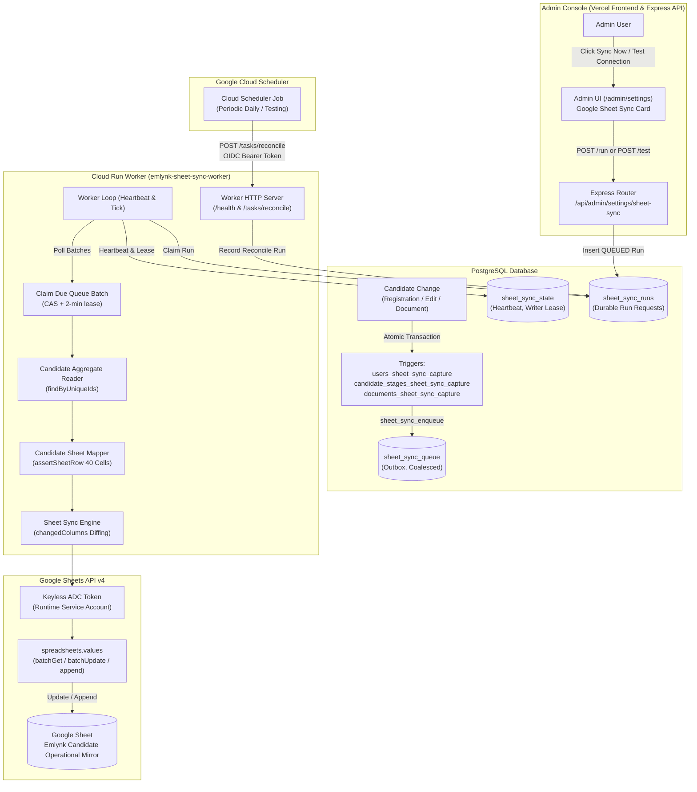

# Google Sheet Candidate Sync Feature Documentation

## Document Metadata

- **Feature Name:** Google Sheet Candidate Operational Mirror (Candidate Sync)
- **Document Version:** 1.0.0
- **Status:** Implemented on branch `version/google-sheet-sync` (Phases 1–7 complete; database migration deployed; Cloud Run worker deployed and verified via controlled pilot; write gate enabled; full reconciliation pending final production sign-off)
- **Target Spreadsheet ID:** `1-11g-0tQruJbgVslH0nzCzG_JRr-4LahSCU8ZJirMpE`
- **Target Tab Name:** `Emlynk Candidate Operational Mirror`
- **Target Service Account:** `emlynk-sheet-sync@project-aa11e15e-a951-4e1b-a65.iam.gserviceaccount.com`
- **Target Cloud Run Worker:** `emlynk-sheet-sync-worker` (Region: `asia-south1`)
- **Primary References:**
  - Architecture Specification: [Docs/GOOGLE_SHEET_CANDIDATE_SYNC_ARCHITECTURE.md](file:///c:/Emlynk/EmlynkWABot/Docs/GOOGLE_SHEET_CANDIDATE_SYNC_ARCHITECTURE.md)
  - Outbox Migration: [prisma/migrations/20261006120000_sheet_sync_outbox/migration.sql](file:///c:/Emlynk/EmlynkWABot/prisma/migrations/20261006120000_sheet_sync_outbox/migration.sql)
  - Sheet Schema: [src/services/sheetSchema.js](file:///c:/Emlynk/EmlynkWABot/src/services/sheetSchema.js)
  - Candidate Sheet Mapper: [src/services/candidateSheetMapper.js](file:///c:/Emlynk/EmlynkWABot/src/services/candidateSheetMapper.js)
  - Google Sheets Adapter: [src/services/googleSheetsAdapter.js](file:///c:/Emlynk/EmlynkWABot/src/services/googleSheetsAdapter.js)
  - Aggregate Reader: [src/services/candidateAggregateReader.js](file:///c:/Emlynk/EmlynkWABot/src/services/candidateAggregateReader.js)
  - Sync Store: [src/services/sheetSyncStore.js](file:///c:/Emlynk/EmlynkWABot/src/services/sheetSyncStore.js)
  - Sync Engine: [src/services/sheetSyncEngine.js](file:///c:/Emlynk/EmlynkWABot/src/services/sheetSyncEngine.js)
  - Worker Service: [src/services/sheetSyncWorker.js](file:///c:/Emlynk/EmlynkWABot/src/services/sheetSyncWorker.js)
  - Admin UI: [admin/src/pages/SettingsPage.tsx](file:///c:/Emlynk/EmlynkWABot/admin/src/pages/SettingsPage.tsx)

---

## 1. Feature Overview

The Google Sheet Candidate Sync feature provides an automated, one-way operational mirror of candidate operational data from the core PostgreSQL database into a private Google Spreadsheet (`Emlynk Candidate Operational Mirror`). 

Its primary purpose is operational resilience: enabling staff to view, filter, and reference current candidate statuses, document progress, and stage milestones in Google Sheets even if the primary web application, admin console, or portal infrastructure experiences downtime or maintenance.

```
PostgreSQL Database
       │
       ▼ (Atomic DB Change-Capture Triggers)
Sheet Sync Outbox Queue (`sheet_sync_queue`)
       │
       ▼ (Long-polling / Lease Claims)
Sheet Sync Worker (`emlynk-sheet-sync-worker` on Cloud Run)
       │
       ▼ (Google Sheets API v4 with ADC)
Google Sheet (`Emlynk Candidate Operational Mirror`)
```

### Core Operating Principles

1. **Database is the single source of truth:** PostgreSQL (Supabase) is authoritative for all candidate data, stages, and document statuses.
2. **Google Sheet is an operational mirror / fallback view:** The Sheet is purely a downstream representation for human viewing and operational fallback.
3. **Strictly one-way synchronization:** Changes in the Google Sheet are **NEVER** read back or synchronized into PostgreSQL. Any manual edit made inside the Sheet will be overwritten by the next incremental sync or daily reconciliation.
4. **Asynchronous background processing:** Candidate registrations, document uploads, review actions, and stage updates trigger database triggers that enqueue sync events atomically. The background worker processes them asynchronously; neither candidate users nor admin users wait for Google API responses.
5. **Decoupled system availability:** A Google Cloud outage, Sheets API rate limit, quota exhaustion, or network failure **CANNOT** cause a candidate database transaction to fail or roll back.
6. **Reconciliation as a repair mechanism:** Admin "Sync Now" and automated Cloud Scheduler reconciliation perform full snapshot-to-sheet drift detection, repairing missing, stale, or manually altered rows. Normal candidate updates flow through the near-real-time incremental outbox.

---

## 2. Architecture

### Implemented Components and Responsibilities

| Component | Repository Path | Core Responsibilities |
| :--- | :--- | :--- |
| **Sheet Schema** | [src/services/sheetSchema.js](file:///c:/Emlynk/EmlynkWABot/src/services/sheetSchema.js) | Defines the exact 40-column contract (`A:AN`). Exports positional helpers, A1 notation range builders, strict header validation (`validateHeaderRow`), and row shape assertion (`assertSheetRow`). |
| **Candidate Mapper** | [src/services/candidateSheetMapper.js](file:///c:/Emlynk/EmlynkWABot/src/services/candidateSheetMapper.js) | Pure mapper turning candidate aggregates into 40 deterministic string cells. Enforces identical business logic as Admin UI for document currentness and stage completeness. |
| **Sheets Adapter** | [src/services/googleSheetsAdapter.js](file:///c:/Emlynk/EmlynkWABot/src/services/googleSheetsAdapter.js) | The only module communicating with Google Sheets API v4. Implements narrow read/write methods (`readHeader`, `validateSchema`, `readCandidateIds`, `readRows`, `readRowsByNumber`, `writeRows`, `appendRow`, `updateRow`). Enforces write gating, keyless ADC authentication, and error sanitation. Contains **zero** clear or row-deletion methods. |
| **Aggregate Reader** | [src/services/candidateAggregateReader.js](file:///c:/Emlynk/EmlynkWABot/src/services/candidateAggregateReader.js) | Reads candidate aggregates (`users`, `candidate_stages`, `documents`) in single queries by `unique_id`. Supports keyset pagination and transactional `readSnapshot` (`REPEATABLE READ`) verified against exact record counts. |
| **Sync Planner** | [src/services/sheetSyncPlanner.js](file:///c:/Emlynk/EmlynkWABot/src/services/sheetSyncPlanner.js) | Read-only planning module. Indexes Sheet candidate IDs from Column AN, detects duplicate system IDs (`SheetDuplicateCandidateIdError`), diffs expected cells against actual cells (`changedColumns`), and classifies operations (`APPEND`, `UPDATE`, `UNCHANGED`, `NOT_IN_DATABASE`). |
| **Health Check** | [src/services/sheetHealthCheck.js](file:///c:/Emlynk/EmlynkWABot/src/services/sheetHealthCheck.js) | Read-only connection and schema probe (`A1:AN1`). Validates Google API connectivity and exact header match using `spreadsheets.readonly` scope without writing. |
| **Sync Store** | [src/services/sheetSyncStore.js](file:///c:/Emlynk/EmlynkWABot/src/services/sheetSyncStore.js) | PostgreSQL persistence layer: atomic compare-and-swap (CAS) queue claiming, leases, fenced settlements, bounded exponential backoff (`15s * 4^(attempt-1)` ±20% jitter), durable run tracking (`sheet_sync_runs`), single-row integration state (`sheet_sync_state`), and distributed writer lease acquisition. |
| **Sync Engine** | [src/services/sheetSyncEngine.js](file:///c:/Emlynk/EmlynkWABot/src/services/sheetSyncEngine.js) | Implements incremental sync (`syncCandidates`) and full reconciliation (`reconcile`). Handles chunked writing (200 rows/batch), pre-write schema validation, duplicate detection, dry-run mode, and deletion guard verification. |
| **Sync Worker** | [src/services/sheetSyncWorker.js](file:///c:/Emlynk/EmlynkWABot/src/services/sheetSyncWorker.js) | Core worker loop: reports heartbeat, processes claimed runs (`TEST_CONNECTION` or `RECONCILE`), claims incremental queue batches, enforces writer lease, manages halting on configuration/data errors, and prunes aged completed queue rows. |
| **Status Service** | [src/services/sheetSyncStatusService.js](file:///c:/Emlynk/EmlynkWABot/src/services/sheetSyncStatusService.js) | Read-only service for Admin UI: gathers worker heartbeat, write gate status, queue counts, run history, and integration health from PostgreSQL. Never communicates with Google. |
| **Settings Routes** | [src/routes/sheetSyncSettings.js](file:///c:/Emlynk/EmlynkWABot/src/routes/sheetSyncSettings.js) | Express router mounted at `/api/admin/settings/sheet-sync`. Protected by `requireRole([ADMIN])`. Provides `GET /status`, `POST /test`, `POST /run`, and `GET /runs/:runId`. |
| **Admin Settings UI** | [admin/src/pages/SettingsPage.tsx](file:///c:/Emlynk/EmlynkWABot/admin/src/pages/SettingsPage.tsx) | React Admin console page at `/admin/settings`. Displays connection status, integration state, write gate, target hint, queue counts, run summaries, and triggers background runs via "Test Connection" and "Sync Now". |
| **Admin API Client** | [admin/src/api/sheetSync.ts](file:///c:/Emlynk/EmlynkWABot/admin/src/api/sheetSync.ts) | TypeScript API client for settings endpoints. |
| **Database Migration** | [prisma/migrations/20261006120000_sheet_sync_outbox/migration.sql](file:///c:/Emlynk/EmlynkWABot/prisma/migrations/20261006120000_sheet_sync_outbox/migration.sql) | Additive migration creating `sheet_sync_queue`, `sheet_sync_runs`, `sheet_sync_state`, partial unique indexes, RLS policies, and database triggers on `users`, `candidate_stages`, and `documents`. |
| **Worker Process** | [src/sheetSyncWorker.js](file:///c:/Emlynk/EmlynkWABot/src/sheetSyncWorker.js), [src/sheetSyncWorkerProcess.js](file:///c:/Emlynk/EmlynkWABot/src/sheetSyncWorkerProcess.js) | Dedicated Cloud Run process entrypoint (`npm run sheet:worker`). Validates environment, binds HTTP server on `$PORT` with `/health` and OIDC-protected `POST /tasks/reconcile`, and handles graceful shutdown via SIGTERM/SIGINT. |
| **Operator CLI** | [src/sheetSyncRequest.js](file:///c:/Emlynk/EmlynkWABot/src/sheetSyncRequest.js) | Operator CLI command (`npm run sheet:request -- reconcile\|test`) to enqueue durable runs directly via database without HTTP. |
| **Health Check CLI** | [src/sheetSyncCheck.js](file:///c:/Emlynk/EmlynkWABot/src/sheetSyncCheck.js) | Standalone read-only CLI check (`npm run sheet:check`) printing sanitized JSON results. |
| **Deployment Config** | [deploy/sheet-sync-worker.env.yaml](file:///c:/Emlynk/EmlynkWABot/deploy/sheet-sync-worker.env.yaml) | Cloud Run environment variable definition with non-secret defaults. |

---

### End-to-End System Architecture Diagram



---

## 3. Candidate Row Identity

### Technical Identity: Column `AN` (`_SYSTEM_CANDIDATE_ID`)

The operational mirror links database candidates to Sheet rows exclusively through an immutable technical key:

- **Sheet Column:** Column `AN` (Column 40, index 39)
- **Header Text:** `_SYSTEM_CANDIDATE_ID`
- **Database Source Field:** `users.unique_id` (e.g., `"0001"`, `"0002"`, `"0003"`)

```
+---+-------------------+-----+-----------------------+
| A | TEST NUMBER       | ... | AN                    |
+---+-------------------+-----+-----------------------+
| 1 | TEST NUMBER       | ... | _SYSTEM_CANDIDATE_ID  |
| 2 |                   | ... | 0001                  |
| 3 |                   | ... | 0003                  |
+---+-------------------+-----+-----------------------+
```

### Why Other Identifiers Must NOT Be Used as Row Keys

| Identifier | Why Rejected as Row Key |
| :--- | :--- |
| **Passport Number (`passport_id`)** | While currently the primary key in `users`, passport numbers can undergo normalization corrections, typo fixes, or renewal updates (supported via `ON UPDATE CASCADE`). Changing a passport ID would detach historical row identity if used as the key. |
| **National ID (`nic`)** | Optional during early onboarding, can be absent, and is subject to manual correction during verification. |
| **Phone / WhatsApp Number** | Candidates may update contact details or share phone lines across family members. |
| **Sheet Row Number** | Row positions change if rows are sorted or if blank lines are introduced. Positional matching causes destructive overwrites of unrelated candidates. |

### Strict Duplicate Prevention and Matching Rules

1. **Exact string matching:** `users.unique_id` is matched against Column `AN` cells as exact text.
2. **Blank IDs are ignored:** Any row in the Sheet where Column `AN` is empty or whitespace is treated as unmanaged. It is never overwritten, matched, or deleted.
3. **Duplicate System IDs cause a hard stop:** If the same `_SYSTEM_CANDIDATE_ID` appears in more than one row of the Sheet:
   - The worker immediately halts with `SheetDuplicateCandidateIdError` (`DATA_INTEGRITY`).
   - Integration state transitions to `DATA_INTEGRITY`.
   - **Zero writes occur** to the Sheet (neither to the duplicate rows nor any other rows in the batch).
   - No automatic guess is made regarding which row is "correct".
   - The condition requires manual deduplication in the Google Sheet by an authorized administrator before sync resumes.

---

## 4. Google Sheet Schema

The operational mirror implements an exact **40-column contract** (`A` through `AN`). Columns `A` through `AM` (39 columns) represent human-facing operational fields; Column `AN` represents the technical identity.

### Complete 40-Column Field Mapping Specification

| Col | Header | Source / Aggregate Mapping | Notes & Formatting |
| :-: | :--- | :--- | :--- |
| **A** | `TEST NUMBER` | Unmapped / Empty (`""`) | Legacy operational column; no authoritative source exists. Always empty string. |
| **B** | `PASSPORT NUMBER` | `users.passport_id` | Uppercase normalized passport identifier. |
| **C** | `FIRST NAME` | `users.first_name` | String text. |
| **D** | `OTHER NAME` | `users.other_name` | String text (surname / other names). |
| **E** | `TEST DATE` | `stages["TEST_DETAILS"].testDate` | Date string as entered in candidate deployment test details. |
| **F** | `BIRTHDAY` | `users.date_of_birth` | Date-only formatted: `YYYY-MM-DD`. |
| **G** | `PP EX DATE` | `users.passport_expiry_date` | Date-only formatted: `YYYY-MM-DD`. |
| **H** | `JOB` | `users.job` | Target job category / trade. |
| **I** | `ID NUMBER` | `users.nic` | National Identity Card number. |
| **J** | `ADDRESS` | `users.address` | Residential address string. |
| **K** | `WHATSAPP NUM` | `users.whatsapp_number` | WhatsApp contact phone number. |
| **L** | `CONTACT NUM` | `users.contact_number` | Alternate contact phone number. |
| **M** | `PASSPORT COPY` | `documents` type `PASSPORT` | Document verification status: `VERIFIED`, `REVIEW_REQUIRED`, or `MISSING`. |
| **N** | `POLICE REP SRI LANKA` | `documents` type `POLICE_REPORT`, variant `SL_VERIFIED` | Document status: `VERIFIED`, `REVIEW_REQUIRED`, or `MISSING`. (Identified positionally; distinct from Column V). |
| **O** | `POLICE REP ROMANIA` | `documents` type `POLICE_REPORT`, variant `ROMANIA` | Document status: `VERIFIED`, `REVIEW_REQUIRED`, or `MISSING`. |
| **P** | `MEDICAL` | `documents` type `MEDICAL` | Document status: `VERIFIED`, `REVIEW_REQUIRED`, or `MISSING`. |
| **Q** | `SCAN` | `documents` type `SCAN` | Document status: `VERIFIED`, `REVIEW_REQUIRED`, or `MISSING`. **Exactly one SCAN column** exists. |
| **R** | `DRIVING LICIAN` | Unmapped / Empty (`""`) | Legacy spelling preserved intentionally from manual Sheet; always empty string. |
| **S** | `NATIONAL ID` | `documents` type `NIC` | Document status: `VERIFIED`, `REVIEW_REQUIRED`, or `MISSING`. |
| **T** | `POLICE REPORT APPLIED` | `documents` type `POLICE_SLIP` | Document status: `VERIFIED`, `REVIEW_REQUIRED`, or `MISSING`. |
| **U** | `SUBMIT DATE` | `policeSlip.policeSubmittedDate` | Submission date of active `POLICE_SLIP`: `YYYY-MM-DD`. |
| **V** | `POLICE REP SRI LANKA` | `documents` type `POLICE_REPORT`, variant `SL_NORMAL` | Document status: `VERIFIED`, `REVIEW_REQUIRED`, or `MISSING`. Standard unverified Sri Lankan report. |
| **W** | `POLICE REP FM` | Unmapped / Empty (`""`) | Foreign Ministry police report column; always empty string. |
| **X** | `VIDEOS` | `documents` type `SKILL_VIDEO` | Document status: `VERIFIED`, `REVIEW_REQUIRED`, or `MISSING`. |
| **Y** | `PLACE OF BIRTH` | `users.place_of_birth` | String text. |
| **Z** | `SEX` | `users.sex` | Candidate sex / gender string. |
| **AA** | `NATIONALITY` | `users.nationality` | Nationality string. |
| **AB** | `PASSPORT ISSUE DATE` | `users.passport_issue_date` | Date-only formatted: `YYYY-MM-DD`. |
| **AC** | `JOB EXPERIENCE` | `users.job_experience` | Experience summary string. |
| **AD** | `CANDIDATE DETAILS NOTE`| `stages["CANDIDATE_DETAILS"].notes` | Operator deployment notes for Candidate Details stage. |
| **AE** | `TEST DETAILS STATUS` | `stages["TEST_DETAILS"]` | Stage status: `COMPLETED` or `INCOMPLETE`. |
| **AF** | `CANDIDATE DETAILS STATUS` | `stages["CANDIDATE_DETAILS"]` | Stage status: `COMPLETED` or `INCOMPLETE`. |
| **AG** | `DOCUMENT SUBMISSION STATUS` | `stages["DOCUMENT_SUBMISSION"]` | Stage status: `COMPLETED` or `INCOMPLETE`. |
| **AH** | `IVS INTERVIEW STATUS` | `stages["IVS_INTERVIEW"]` | Stage status: `COMPLETED` or `INCOMPLETE`. |
| **AI** | `VISA APPROVAL STATUS` | `stages["VISA_APPROVAL"]` | Stage status: `COMPLETED` or `INCOMPLETE`. |
| **AJ** | `FINALIZING JOB STATUS` | `stages["FINALIZING_JOB"]` | Stage status: `COMPLETED` or `INCOMPLETE`. |
| **AK** | `RECORD STATUS` | Operational status | `ACTIVE` for active candidates; `DELETED / INACTIVE` for candidates removed from database. |
| **AL** | `REGISTERED AT` | `users.created_date` | UTC ISO timestamp: `YYYY-MM-DDTHH:mm:ssZ`. |
| **AM** | `LAST MIRRORED AT` | Mirror execution timestamp | UTC ISO timestamp: `YYYY-MM-DDTHH:mm:ssZ`. Updated only when row is written. |
| **AN** | `_SYSTEM_CANDIDATE_ID` | `users.unique_id` | Technical identity key. Never empty for valid candidate rows. |

### Schema Invariants

- **No arbitrary columns:** No columns exist for Agreements, Affidavits, Contracts, or secondary Scan documents.
- **Positional identity:** Columns `N` and `V` have identical header text (`POLICE REP SRI LANKA`). The system maps them strictly by ordinal position (`index 13` vs `index 21`), never by header string search.
- **Header validation:** The worker validates `A1:AN1` before every write batch. If any column header differs or is out of order, writing is immediately aborted with `SheetSchemaMismatchError`.

---

## 5. Incremental Automatic Sync

The normal path for candidate synchronization is completely automated and event-driven.

```mermaid
sequenceid
autonumber
actor Operator as User / Admin / Webhook
participant DB as PostgreSQL
participant Queue as sheet_sync_queue
participant Worker as Cloud Run Worker
participant Google as Google Sheets API

Operator->>DB: Candidate Created / Edited / Document Stored
DB->>DB: Fire Trigger (users / stages / documents)
DB->>Queue: INSERT ... ON CONFLICT (unique_id) WHERE status='PENDING' DO UPDATE
Note over Operator,DB: DB Transaction Commits Immediately (Google not called)

loop Every 10 Seconds (Worker Polling)
    Worker->>Queue: Claim PENDING batch (CAS, 2-min lease)
    Queue-->>Worker: Return claimed batch
    Worker->>DB: Read Aggregates (findByUniqueIds)
    Worker->>Google: Read Header A1:AN1 (Validate Schema)
    Worker->>Google: Read Candidate IDs AN2:AN
    Worker->>Google: batchGet Existing Rows for Batch Candidates
    Worker->>Worker: Map Candidates & Diff Cells (changedColumns)
    alt Candidate Missing in Sheet
        Worker->>Google: append (INSERT_ROWS, RAW)
    else Cells Differ
        Worker->>Google: batchUpdate (RAW)
    else Unchanged
        Note over Worker: Skip write; preserve LAST MIRRORED AT
    end
    Worker->>Queue: Complete Item (status=COMPLETED, last_result)
    Worker->>DB: Update last_sync_success_at in sheet_sync_state
end
```

### Key Incremental Sync Mechanisms

1. **Atomic Trigger Enqueue:** Database triggers (`users_sheet_sync_capture`, `candidate_stages_sheet_sync_capture`, `documents_sheet_sync_capture`) execute inside the candidate write transaction.
2. **Pending Row Coalescing:** The trigger calls `sheet_sync_enqueue(unique_id, deleted)`, which inserts or updates `sheet_sync_queue` using:
   ```sql
   INSERT INTO "sheet_sync_queue" ("unique_id", "candidate_deleted")
   VALUES (p_unique_id, p_candidate_deleted)
   ON CONFLICT ("unique_id") WHERE "status" = 'PENDING'
   DO UPDATE SET
       "candidate_deleted" = "sheet_sync_queue"."candidate_deleted" OR EXCLUDED."candidate_deleted",
       "updated_at" = CURRENT_TIMESTAMP;
   ```
   At most **one pending row exists per candidate**, preventing queue explosion during rapid edits or bulk imports.
3. **Optimistic Leases and Worker Claims:** The worker polls every 10 seconds (configurable via `SHEET_SYNC_POLL_INTERVAL_MS`). Claiming uses compare-and-swap (CAS) setting `status = 'PROCESSING'` and `lease_expires_at = now + 2 minutes`.
4. **Fresh Aggregate Re-reading:** The worker re-reads the full candidate aggregate directly from PostgreSQL at processing time. This ensures that the Sheet always receives the latest committed database state regardless of queue latency.
5. **Selective Cell Diffs:** The engine compares expected cells against actual cells across columns `A` through `AK` and `AN`. Column `AM` (`LAST MIRRORED AT`) is intentionally ignored during diffing. Unchanged rows are skipped, avoiding unnecessary Google API quota consumption and preserving the authentic timestamp of when data last changed.
6. **Browser Disconnection Safety:** The process is entirely decoupled from the frontend. The operator or candidate can close their browser immediately; the worker runs asynchronously on Cloud Run.

---

## 6. Reconciliation / Sync Now

Reconciliation provides a full-state repair mechanism to audit and heal drift between PostgreSQL and Google Sheets.

### Distinctions Across Sync Modes

| Characteristic | Incremental Auto-Sync | Scheduled Reconciliation | Admin "Sync Now" |
| :--- | :--- | :--- | :--- |
| **Trigger Mechanism** | Event-driven (DB triggers) | Google Cloud Scheduler | Admin UI button click |
| **Scope** | Claimed queue candidates | Entire database & Sheet | Entire database & Sheet |
| **Data Consistency** | Point-in-time aggregate read | `REPEATABLE READ` snapshot | `REPEATABLE READ` snapshot |
| **Missing Candidate Action** | Appends claimed candidate | Appends all missing DB candidates | Appends all missing DB candidates |
| **Stale Row Action** | Updates claimed candidate | Rewrites any differing row | Rewrites any differing row |
| **Sheet-Only Candidate Action** | Handled only if delete-flagged | Marks `DELETED / INACTIVE` (within guard) | Marks `DELETED / INACTIVE` (within guard) |
| **Writes Disabled Behavior** | Queue items remain `PENDING` | Executes as Dry Run | Executes as Dry Run |

### Detailed Reconciliation Algorithm

1. **Positional Header Validation:** Reads `A1:AN1` and validates exact header match.
2. **Full Sheet Scan:** Reads all data rows (`A2:AN`). Builds candidate row index from Column `AN`.
3. **Duplicate Check:** If any duplicate candidate ID is found in Column `AN`, the run halts immediately with `DUPLICATE_CANDIDATE_ID`.
4. **Complete Database Snapshot:** Opens a single `REPEATABLE READ` transaction with `SNAPSHOT_TRANSACTION_TIMEOUT_MS = 120_000`. The reader executes `tx.user.count()` and reads all candidate aggregates, asserting:
   - `aggregates.length === expectedCount`
   - `uniqueIds` are distinct
   If the transaction fails this check, it aborts with `IncompleteSnapshotError` (`SNAPSHOT_INCOMPLETE`) to prevent marking valid rows inactive due to a partial read.
5. **Comparison & Chunked Writing:**
   - Database candidates missing from the Sheet are appended.
   - Database candidates whose cells differ from Sheet rows are updated.
   - Matching rows are counted as `unchanged` and left untouched.
   - Writes execute in chunks of 200 rows (`DEFAULT_WRITE_CHUNK`), renewing the distributed writer lease before each chunk.
6. **Sheet-Only Candidates & Deletion Guard:** Identified Sheet rows whose Column `AN` is absent from the database snapshot are evaluated against the deletion guard (see Section 7).
7. **Resolution of Dead Letters:** A successful reconciliation automatically updates older `FAILED` queue items to `COMPLETED` (`last_result = 'RESOLVED'`), clearing stale operational errors.
8. **Idempotence:** Repeatedly triggering Sync Now against a healthy Sheet results in zero writes: summary reports `appended: 0`, `updated: 0`, `unchanged: N`.

---

## 7. Candidate Deletion Behavior

Operational requirements dictate that **candidate rows must never disappear from the operational Google Sheet**. Deleting rows destructively removes historical records, invalidates row references, and risks losing operational context.

### Preservation and Inactive Marking

When a candidate is deleted or removed from the database:
1. The row **remains in the Google Sheet**.
2. Column `AK` (`RECORD STATUS`) transitions from `ACTIVE` to:
   ```
   DELETED / INACTIVE
   ```
3. Column `AM` (`LAST MIRRORED AT`) is updated to the timestamp of the deactivation write.
4. All other columns (demographics, passport number, notes, document statuses, timestamps) remain untouched.
5. If the same candidate unique ID is ever re-created or restored in the database, subsequent sync updates Column `AK` back to `ACTIVE` and refreshes the data.

### Deletion Guard Safeguards

Absence of a candidate from the database only triggers `DELETED / INACTIVE` marking under strict verification:

- **Incremental Sync Guard:** An incremental item will only mark a row inactive if the trigger explicitly flagged `candidate_deleted = true` **and** a fresh database read confirms the record no longer exists.
- **Reconciliation Deletion Guard:** During full reconciliation, the number of Sheet rows eligible to be marked `DELETED / INACTIVE` must satisfy:
  $$\text{toMarkCount} \le \text{SHEET\_SYNC\_DELETION\_GUARD\_MAX (default: 10)}$$
  $$\text{toMarkCount} \le \lfloor \text{SHEET\_SYNC\_DELETION\_GUARD\_FRACTION (default: 0.05)} \times \text{identifiedSheetRows} \rfloor$$
  $$\text{snapshotCount} > 0 \quad (\text{an empty DB snapshot never marks anything})$$

If the threshold is breached (for example, if a database filter bug or accidental truncate occurs):
- Zero rows are marked inactive.
- The summary records `deletionGuardTriggered: true`.
- Affected rows are reported under `notInDatabase` count.
- A warning event `sheet_sync.reconcile_deletion_guard` is emitted to Cloud Logging.

---

## 8. Admin Settings UI

The admin interface is accessible at:
```
/admin/settings
```
Inside the Settings view, the **Google Sheet Sync** card provides real-time observability and manual controls.

### Displayed Status Items

| UI Item | Source Field | Description / States |
| :--- | :--- | :--- |
| **Connection** | `lastConnectionTest` | ToneBadge indicator: `Connected · schema valid` (green), `Not tested yet` (neutral), or `Failed` (critical). |
| **Integration state** | `integration.state` | ToneBadge indicator: `OK` (green), `Not checked yet` (neutral), `Configuration error: sync halted` (critical), or `Duplicate candidate IDs in the Sheet: sync halted` (critical). |
| **Write sync** | `writeGate` | ToneBadge indicator: `Enabled` (green) when active; `Disabled` (neutral) when in safety/dry-run mode. |
| **Target** | `target` | Safe target hint showing the spreadsheet ID suffix and tab name: `…JirMpE / Emlynk Candidate Operational Mirror`. |
| **Last successful sync** | `lastSuccessfulSyncAt` | Timestamp of the most recent successful live write. |
| **Last reconciliation** | `lastReconciliation` | Status badge (`QUEUED`, `RUNNING`, `SUCCEEDED`, `FAILED`, `SKIPPED`), dry-run indicator, finished timestamp, and counts summary (e.g., `6 appended · 0 updated · 0 unchanged`). |
| **Last successful reconciliation** | `lastSuccessfulReconciliationAt` | Timestamp of the most recent successful reconciliation. |
| **In progress** | `activeRuns` | Active execution indicators for running or queued syncs / connection tests. |
| **Pending / failed candidate syncs** | `queue` | Formatted count: `(pending + processing) / failed` (e.g., `0 / 0`). |
| **Last failure** | `integration.lastError*` | Error class, error code, and error timestamp if an error has occurred. |
| **Worker Warning Banner** | `worker.online` | Displayed if `workerHeartbeatAt` is older than 2 minutes: *"The sheet-sync worker is not reporting. Requests stay queued until it runs."* |
| **Dry-Run Notice** | `writeGate` | Displayed when write gate is `DISABLED`: explains that Sync Now executes a dry run without modifying the Sheet. |

### UI Action Buttons

1. **Test Connection:**
   - Triggers `POST /api/admin/settings/sheet-sync/test`.
   - Records a durable `TEST_CONNECTION` run in PostgreSQL.
   - Disabled while a connection test run is active.
   - Worker runs the read-only health check and records the result.
2. **Sync Now:**
   - Triggers `POST /api/admin/settings/sheet-sync/run`.
   - Records a durable `RECONCILE` run in PostgreSQL.
   - Disabled while a reconciliation run is active.
   - Polling interval automatically switches to 5 seconds while a run is active.

### Role-Based Access Control (RBAC)

- **ADMIN Role Only:** The Settings page and all underlying API endpoints are strictly restricted to users with the `ADMIN` role (`requireRole([ADMIN_ROLES.ADMIN])`).
- **Forbidden Roles:** `MANAGER`, `ANALYST`, and `REGISTRATION_DESK` roles receive `403 Forbidden` from the backend API.
- **Client Enforcement:** In the Admin UI, non-ADMIN users see an "Access Restricted" message and no settings API requests are issued.
- **Candidate Pool Isolation:** The Candidate Pool UI (`/admin/candidates`) was **intentionally not changed** by this feature.

---

## 9. Security

### Keyless Authentication via Application Default Credentials (ADC)

The implementation strictly avoids static service account JSON private key files:
- **Cloud Run Runtime Identity:** The worker runs under the dedicated Google Cloud service account `emlynk-sheet-sync@project-aa11e15e-a951-4e1b-a65.iam.gserviceaccount.com`.
- **ADC Resolution:** Authentication resolves automatically via the Cloud Run instance metadata server.
- **Explicit Key Rejection:** If `GOOGLE_APPLICATION_CREDENTIALS` is set in the environment, the worker **refuses to start** (`assertValidEnv` / `readSheetSyncConfig`), preventing accidental use of key files.
- **Zero Frontend Credentials:** The Vercel frontend holds no Google credentials, tokens, or SDKs. All Google access occurs in the private Cloud Run worker.

### Least-Privilege Access Controls

| Boundary | Privilege Level | Implementation |
| :--- | :--- | :--- |
| **Google Sheet Access** | Editor on Target Sheet only | The target spreadsheet is shared directly with `emlynk-sheet-sync@...`. Staff maintain Viewer rights. |
| **Secret Manager** | Secret Accessor on `DATABASE_URL` only | Service account has `roles/secretmanager.secretAccessor` bound specifically to the `DATABASE_URL` secret. |
| **Cloud Run Ingress** | Private / Authenticated Only | Deployed with `--no-allow-unauthenticated`. Cloud Run IAM denies unauthorized traffic. |
| **Scheduler Ingress** | OIDC Token Invoker Only | Cloud Scheduler uses a dedicated service account `emlynk-sheet-sync-scheduler@...` with `roles/run.invoker`. |
| **Database RLS** | Revoked from Supabase Public API | Migration executes `REVOKE ALL PRIVILEGES ON TABLE sheet_sync_queue, sheet_sync_runs, sheet_sync_state FROM anon, authenticated;`. Only the backend connection can access tables. |
| **PII Redaction in Logs** | Code-Only JSON Logging | Cloud Logging receives structured JSON logs with event names (`sheet_sync.*`), run IDs, and candidate unique IDs (`candidateRef`). Candidate names, passport numbers, NICs, phone numbers, cell values, and Google error text are never logged. |

---

## 10. Environment Variables

All configuration is managed through environment variables without hardcoded secrets.

| Variable | Required | Purpose | Safe Example / Default |
| :--- | :---: | :--- | :--- |
| `SHEET_SPREADSHEET_ID` | **Yes** | Google Spreadsheet ID of the target operational Sheet. | `1-11g-0tQruJbgVslH0nzCzG_JRr-4LahSCU8ZJirMpE` |
| `SHEET_TAB_NAME` | **Yes** | Exact name of the operational tab. | `Emlynk Candidate Operational Mirror` |
| `SHEET_SYNC_ENABLED` | No | Master safety write switch. Must be `"true"` (case-insensitive) to enable writing. Any other value disables writes. | `false` (default) / `true` |
| `SHEET_SYNC_PILOT_CANDIDATE_IDS` | No | Comma-separated list of candidate unique IDs for controlled pilot writes. If set, only these candidates are written; all others wait, and reconciliations run as dry runs. | `0003` (pilot only) |
| `SHEET_SYNC_POLL_INTERVAL_MS` | No | Polling interval between worker loop ticks in milliseconds (1,000 to 600,000). | `10000` |
| `SHEET_SYNC_BATCH_SIZE` | No | Maximum number of queue items claimed per tick (1 to 200). | `25` |
| `SHEET_SYNC_MAX_RETRIES` | No | Maximum retry attempts for transient errors before dead-lettering (0 to 20). | `5` (yielding 6 total attempts) |
| `SHEET_SYNC_DELETION_GUARD_MAX` | No | Maximum candidate rows that can be marked `DELETED / INACTIVE` in a single reconciliation (0 to 100,000). | `10` |
| `SHEET_SYNC_DELETION_GUARD_FRACTION` | No | Maximum fraction of identified Sheet rows that can be marked inactive in a reconciliation (0.0 to 1.0). | `0.05` (5%) |
| `SHEET_SYNC_SCHEDULER_AUDIENCE` | No | Expected OIDC token audience for Cloud Scheduler HTTP trigger. | `https://emlynk-sheet-sync-worker-....run.app` |
| `SHEET_SYNC_SCHEDULER_INVOKER` | No | Expected service account email for Cloud Scheduler OIDC token. | `emlynk-sheet-sync-scheduler@project-aa11e15e-a951-4e1b-a65.iam.gserviceaccount.com` |
| `DATABASE_POOL_MAX` | No | PostgreSQL connection pool size for the worker process. | `2` |
| `GOOGLE_APPLICATION_CREDENTIALS` | **Forbidden** | Static service account JSON path. **Must NOT be set.** | *Leave unset* |

> [!IMPORTANT]
> `SHEET_SYNC_ENABLED=false` is the primary emergency kill switch. Setting it to `false` halts all writes to Google Sheets immediately while allowing candidate database operations to proceed normally.

---

## 11. Google Cloud Deployment

The Sheet Sync Worker runs as a dedicated, private microservice on Google Cloud Run.

### Service Configuration

- **Cloud Run Service Name:** `emlynk-sheet-sync-worker`
- **Region:** `asia-south1` (Mumbai)
- **Runtime Service Account:** `emlynk-sheet-sync@project-aa11e15e-a951-4e1b-a65.iam.gserviceaccount.com`
- **CPU & Memory:** 1 vCPU, 512 MiB RAM
- **Instance Scaling:** `min-instances = 1`, `max-instances = 1` (strict singleton process)
- **CPU Allocation:** `--no-cpu-throttling` (CPU is always allocated to support background polling between HTTP requests)
- **Ingress Security:** `--no-allow-unauthenticated` (IAM authentication strictly enforced)
- **Database Connection:** `DATABASE_URL` injected directly from Secret Manager via `--set-secrets=DATABASE_URL=DATABASE_URL:latest` (connecting via Supabase transaction pooler)
- **Container Image:** Built from project root `Dockerfile` and executed with command `node src/sheetSyncWorker.js`

---

## 12. Scheduler

The Cloud Run worker exposes an authenticated HTTP endpoint for scheduled triggers:
```
POST /tasks/reconcile
```

### Trigger Verification

1. **Cloud Run IAM:** Cloud Run rejects any request that lacks `roles/run.invoker` permission.
2. **OIDC Token Defense-in-Depth:** The worker's internal HTTP server ([src/sheetSyncWorkerProcess.js](file:///c:/Emlynk/EmlynkWABot/src/sheetSyncWorkerProcess.js)) verifies the Google-signed OIDC bearer token:
   - Token signature validated against Google certs.
   - Token audience matches `SHEET_SYNC_SCHEDULER_AUDIENCE`.
   - Token email matches `SHEET_SYNC_SCHEDULER_INVOKER`.
   - `email_verified === true`.
3. **Durable Request Enqueue:** A valid request records a `RECONCILE` run with trigger `SCHEDULER` and responds immediately with `202 Accepted`. The worker loop processes the reconciliation asynchronously.

> [!WARNING]
> **Final production reconciliation schedule is not yet locked/configured.**
> During release staging, an automated testing schedule may run periodically (e.g., every 5 minutes in dry-run mode). The production schedule is intended to run once daily during off-peak hours (e.g., `0 2 * * *` UTC = 07:30 Sri Lanka time).
> 
> The scheduler is **NOT** responsible for normal, near-real-time candidate updates; those are handled continuously by the incremental outbox queue.

---

## 13. Failure Handling and Retry Strategy

### Failure Classification and Behavior

| Error Condition | Error Class | Integration State | Queue / Worker Behavior |
| :--- | :--- | :--- | :--- |
| **Rate Limit / 429 / 5xx / Network** | `GOOGLE_UNAVAILABLE` | Retains current state | Exponential backoff: `15s * 4^(attempt-1)` ±20% jitter (max 15 min). Dead-letters to `FAILED` after 6 attempts. Healed by next reconciliation. |
| **Snapshot Incomplete** | `SNAPSHOT_INCOMPLETE` | Retains current state | Reconcile run fails safely. Queue items retry. Zero writes occur. |
| **Schema Mismatch (Columns altered)** | `SCHEMA_INVALID` | `CONFIG_ERROR` (Halted) | Worker halts incremental processing. Queue items return to `PENDING` without using attempts. Worker re-checks Sheet read-only every 5 min. |
| **Google Permission / 401 / 403** | `ACCESS_DENIED` | `CONFIG_ERROR` (Halted) | Worker halts incremental processing. No retry loop against Google. Re-checks read-only every 5 min. |
| **Spreadsheet / Tab Not Found (404)** | `NOT_FOUND` | `CONFIG_ERROR` (Halted) | Worker halts incremental processing. Re-checks read-only every 5 min. |
| **Duplicate System Candidate ID** | `DUPLICATE_CANDIDATE_ID` | `DATA_INTEGRITY` (Halted) | Worker halts all processing. Zero writes occur. Re-checks read-only every 5 min until duplicate row is manually resolved in Sheet. |
| **Writer Lease Conflict** | `WRITER_BUSY` | Retains current state | Run skipped. Protects against multiple worker processes attempting concurrent writes to the same Sheet. |
| **Worker Crash / Sudden Kill** | N/A | Retains current state | Leases expire automatically after 2 minutes (queue) or 10 minutes (runs). Surviving worker re-claims and finishes work safely. |

### The Core Invariant

> **A Google Sheet outage or API failure MUST NEVER cause an otherwise valid candidate database write to fail.**
> 
> Because database change capture occurs entirely via local PostgreSQL triggers writing to `sheet_sync_queue`, the candidate registration or update transaction succeeds unconditionally. If Google is down, queue rows accumulate safely and drain automatically once connectivity resumes.

---

## 14. Operational Safety

The system implements multiple overlapping layers of operational defense:

1. **Environment Write Gate (`SHEET_SYNC_ENABLED`):** Disabled by default everywhere. Unless explicitly set to `"true"`, all writes are blocked at the adapter layer before calling Google APIs.
2. **Pilot Candidate Restriction (`SHEET_SYNC_PILOT_CANDIDATE_IDS`):** Permits write operations solely for explicitly listed candidate unique IDs during activation testing.
3. **Dry-Run Mode:** Full diffing and drift reporting can be run safely with writes disabled, reporting exact counts of what would be changed.
4. **Duplicate AN Detection:** Prevents destructive cross-candidate overwrites if a user duplicates a system ID in the Sheet.
5. **Deletion Guard:** Prevents mass deactivation of candidate rows in the Sheet if a database glitch returns an incomplete candidate set.
6. **Distributed Writer Lease:** Single-writer concurrency control held in `sheet_sync_state`, renewed before every 200-row chunk.
7. **No Sheet Row Deletions:** Rows are never removed from the operational spreadsheet.

---

## 15. Real Deployment Verification Performed

The following verification steps have been **confirmed and completed**:

- [x] **Database Migration Deployed:** Migration `20261006120000_sheet_sync_outbox` successfully applied to the target database. Outbox tables and triggers are active.
- [x] **Cloud Run Worker Deployed:** Dedicated service `emlynk-sheet-sync-worker` deployed in `asia-south1`.
- [x] **ADC Authentication Verified:** Dedicated service account `emlynk-sheet-sync@...` authenticated successfully using keyless Application Default Credentials.
- [x] **Live Test Connection Succeeded:** Read-only health check connected to the live Google Sheet and verified exact header schema match (`CONNECTED`, `SCHEMA_VALID`).
- [x] **Dry-Run Reconciliation Succeeded:** Write-disabled reconciliation executed against the real database and Sheet, successfully identifying candidate drift without modifying any cells.
- [x] **Initial Candidate Count Confirmed:** Dry-run reconciliation accurately detected 6 existing database candidates prior to first write.
- [x] **Controlled Single-Candidate Pilot Executed:** Controlled pilot candidate `0003` was specified via `SHEET_SYNC_PILOT_CANDIDATE_IDS=0003`.
- [x] **Pilot Write Appended Exactly One Candidate:** Pilot write successfully appended candidate `0003` to the real operational Sheet.
- [x] **Column `AN` Technical Identity Verified:** Confirmed `_SYSTEM_CANDIDATE_ID` in Column `AN` was stamped with `0003`.
- [x] **Pilot Queue Item Completed:** Queue record for candidate `0003` transitioned to `COMPLETED` with `last_result = 'APPENDED'`.
- [x] **Write Gate Enabled:** `SHEET_SYNC_ENABLED` was set to `true`.
- [x] **Pilot Restriction Removed:** `SHEET_SYNC_PILOT_CANDIDATE_IDS` was removed, allowing normal multi-candidate processing.
- [x] **Production Cloud Run Revision Healthy:** Deployed Cloud Run revision with write gate enabled and pilot restriction removed became healthy and served 100% traffic.

### Remaining Release Verification

The following release verification steps have **not yet been confirmed** in the current environment:

- [ ] **Full Multi-Candidate Reconciliation:** Execution of the first full live reconciliation with writes enabled across all 6 database candidates.
- [ ] **Automatic End-to-End Candidate Update:** Verification that creating or editing a new candidate in the live application automatically propagates to the Sheet within one polling interval.
- [ ] **Production Cloud Scheduler Lock:** Cloud Scheduler recurring daily reconciliation job created, tested with OIDC authentication, and locked into production.

---

## 16. Testing

The feature is covered by comprehensive automated test suites covering backend services, data migrations, integration engines, and admin UI components.

### Automated Test Suite Summary

| Test File | Component Under Test | Test Count | Status |
| :--- | :--- | :---: | :---: |
| [test/sheetSchema.test.js](file:///c:/Emlynk/EmlynkWABot/test/sheetSchema.test.js) | Exact 40-column definition, A1 notation ranges, header validation, assertSheetRow. | 17 | **PASS** |
| [test/candidateSheetMapper.test.js](file:///c:/Emlynk/EmlynkWABot/test/candidateSheetMapper.test.js) | Aggregate mapping, date formatting, document/stage statuses, record status, pure mapping invariants. | 15 | **PASS** |
| [test/googleSheetsAdapter.test.js](file:///c:/Emlynk/EmlynkWABot/test/googleSheetsAdapter.test.js) | Narrow adapter methods, write gate enforcement, error classification, range quoting, live client test runner guard. | 31 | **PASS** |
| [test/sheetSyncPhase2.test.js](file:///c:/Emlynk/EmlynkWABot/test/sheetSyncPhase2.test.js) | Aggregate reader batching, planning actions, duplicate AN detection, read-only health checks. | 29 | **PASS** |
| [test/sheetSyncOutbox.test.js](file:///c:/Emlynk/EmlynkWABot/test/sheetSyncOutbox.test.js) | Additive PostgreSQL migration on PGlite, atomic triggers, coalescing, delete hint stickiness, passport cascade. | 14 | **PASS** |
| [test/sheetSyncEngine.test.js](file:///c:/Emlynk/EmlynkWABot/test/sheetSyncEngine.test.js) | Incremental sync, reconciliation drift repair, deletion guard logic, duplicate stops, dry-run mode. | 13 | **PASS** |
| [test/sheetSyncWorker.test.js](file:///c:/Emlynk/EmlynkWABot/test/sheetSyncWorker.test.js) | Worker loop, lease management, writer lease fencing, exponential backoff, dead lettering, pilot restrictions, halted states, PII redaction. | 28 | **PASS** |
| [test/sheetSyncSettingsApi.test.js](file:///c:/Emlynk/EmlynkWABot/test/sheetSyncSettingsApi.test.js) | Express Settings API routes, RBAC (403 for non-admin roles), token claim validation, deduplication of active runs. | 13 | **PASS** |
| [test/sheetSyncWorkerProcess.test.js](file:///c:/Emlynk/EmlynkWABot/test/sheetSyncWorkerProcess.test.js) | Worker HTTP server, `/health`, Cloud Scheduler OIDC verification, operator CLI command, shutdown signals. | 7 | **PASS** |
| [admin/src/test/settings.test.tsx](file:///c:/Emlynk/EmlynkWABot/admin/src/test/settings.test.tsx) | Admin UI Settings page, sidebar navigation, breadcrumbs, status badge rendering, action buttons, RBAC restricted card. | 12 | **PASS** |
| **Total Verified Sheet Sync Tests** | **All core sheet sync backend & frontend suites** | **179** | **100% PASS** |

### Additional Validations

- **Admin Frontend Suite:** Full Vitest test suite (`npm --prefix admin test`) passes with **223 tests passing across 14 test files**.
- **Admin TypeScript Check:** `npm --prefix admin run typecheck` passes with **0 errors**.
- **Admin Production Build:** `npm --prefix admin run build` compiles successfully without errors.

---

## 17. Troubleshooting

### Incident Record: Windows PowerShell Argument Parsing

During deployment configuration on Windows PowerShell, passing comma-separated environment variables to `gcloud run services update` caused an unexpected parsing error:

- **Symptom:** Cloud Run revision failed startup validation with:
  ```
  Invalid Google Sheet sync configuration:
  - SHEET_SYNC_ENABLED must be true or false
  ```
- **Root Cause:** PowerShell split arguments unexpectedly on commas or spaces, resulting in:
  ```powershell
  SHEET_SYNC_ENABLED="true SHEET_SYNC_PILOT_CANDIDATE_IDS=0003"
  ```
- **Safety System Outcome:** The fail-closed configuration validator in [src/config/sheetSync.js](file:///c:/Emlynk/EmlynkWABot/src/config/sheetSync.js) recognized the value as invalid (`INVALID`), defaulted `enabled = false`, and refused to boot, successfully preventing unauthorized writes.
- **Resolution:** When using Windows PowerShell, update variables individually or use the stop-parsing symbol `--%`:
  ```powershell
  # Safe Method: Update variables separately
  gcloud run services update emlynk-sheet-sync-worker --region=asia-south1 --update-env-vars=SHEET_SYNC_ENABLED=true
  gcloud run services update emlynk-sheet-sync-worker --region=asia-south1 --update-env-vars=SHEET_SYNC_PILOT_CANDIDATE_IDS=0003
  ```

### Common Diagnostic Scenarios

| Issue Observed | Likely Cause | Investigation & Remediation |
| :--- | :--- | :--- |
| **Connected but no rows written** | Write sync is disabled. | Check Admin UI "Write sync" badge or `SHEET_SYNC_ENABLED` env var. If `false`, Sync Now runs as a dry run. Enable via `SHEET_SYNC_ENABLED=true`. |
| **Integration state: Configuration error: sync halted** | Header modified or access denied. | Run "Test Connection" in Admin UI. Review Cloud Logging for `sheet_sync.config_error`. If `SCHEMA_INVALID`, compare Sheet header against [src/services/sheetSchema.js](file:///c:/Emlynk/EmlynkWABot/src/services/sheetSchema.js). If `ACCESS_DENIED`, verify service account has Editor role on the Sheet. |
| **Integration state: Duplicate candidate IDs: sync halted** | Duplicate ID in Column `AN`. | Inspect Google Sheet Column `AN`. Filter for duplicate values. Remove or fix duplicate technical IDs. Once fixed, run "Test Connection" or wait 5 minutes for automatic resume. |
| **Worker banner: Worker is not reporting** | Cloud Run instance stopped or crashing. | Verify Cloud Run service `emlynk-sheet-sync-worker` in GCP console. Check Cloud Run logs for startup validation failures or database connection errors. Verify Secret Manager `DATABASE_URL` binding. |
| **Queue items accumulating in FAILED** | Repeated transient errors exceeded max retries. | Check `sheet_sync_queue` table or Admin UI pending/failed count. Triggering "Sync Now" reconciles all candidates and resolves older failed queue items upon successful write. |

---

## 18. Emergency Disable

If anomalous behavior, Sheet corruption, or operational concerns arise, execute the emergency write disable procedure immediately:

### Step 1: Disable Cloud Run Worker Writes

Update the Cloud Run service environment variable:
```bash
gcloud run services update emlynk-sheet-sync-worker \
  --project=project-aa11e15e-a951-4e1b-a65 \
  --region=asia-south1 \
  --update-env-vars=SHEET_SYNC_ENABLED=false
```

**Operational Impact:**
- The worker immediately ceases all Google Sheet write calls.
- Subsequent Google API requests use the `spreadsheets.readonly` scope.
- `sheet_sync_queue` items remain in `PENDING` status.
- Candidate database operations in the core application proceed **completely unaffected**.

### Step 2: Pause Cloud Scheduler Job

```bash
gcloud scheduler jobs pause emlynk-sheet-sync-reconcile-daily \
  --project=project-aa11e15e-a951-4e1b-a65 \
  --location=asia-south1
```

### Step 3: Absolute External Revocation (If Necessary)

If immediate external access revocation is required without touching Cloud Run:
1. Open the Google Spreadsheet in Google Drive.
2. Open the **Share** dialog.
3. Remove `emlynk-sheet-sync@project-aa11e15e-a951-4e1b-a65.iam.gserviceaccount.com` from the shared users list.

---

## 19. Rollback

### Application and Worker Rollback

1. Disable writing immediately via `SHEET_SYNC_ENABLED=false`.
2. Pause all Cloud Scheduler jobs invoking the worker.
3. If necessary, redeploy the previous Cloud Run revision or scale worker instances to 0:
   ```bash
   gcloud run services update emlynk-sheet-sync-worker \
     --project=project-aa11e15e-a951-4e1b-a65 \
     --region=asia-south1 \
     --min-instances=0 --max-instances=0
   ```

### Google Sheet Data Restoration

1. In Google Sheets, navigate to **File → Version History → See version history**.
2. Locate the timestamp recorded immediately prior to write activation.
3. Select **Restore this version** (or restore from the offline `.xlsx` backup taken prior to deployment).

### Database Schema Considerations

The database migration [prisma/migrations/20261006120000_sheet_sync_outbox/migration.sql](file:///c:/Emlynk/EmlynkWABot/prisma/migrations/20261006120000_sheet_sync_outbox/migration.sql) is **strictly additive**:
- It adds new tables (`sheet_sync_queue`, `sheet_sync_runs`, `sheet_sync_state`) and triggers.
- It does **NOT** modify or drop any existing columns, constraints, or relationships in `users`, `documents`, or `candidate_stages`.

> [!CAUTION]
> **Do not perform destructive database rollbacks casually.**
> Leaving the outbox tables in place causes zero disruption to normal application features even if the worker is stopped.
> If triggers must be stopped without dropping tables, run:
> ```sql
> DROP TRIGGER IF EXISTS "users_sheet_sync_capture" ON "users";
> DROP TRIGGER IF EXISTS "candidate_stages_sheet_sync_capture" ON "candidate_stages";
> DROP TRIGGER IF EXISTS "documents_sheet_sync_capture" ON "documents";
> ```

---

## 20. Git / Release Workflow

To preserve release stability and governance across environments, the project follows this branch progression:

```
dev ──> version/google-sheet-sync ──> stage ──> main
```

1. **Development (`dev`):** All feature development and initial automated testing take place on `dev`.
2. **Feature Snapshot (`version/google-sheet-sync`):** The fully tested, verified feature implementation is preserved on `version/google-sheet-sync`.
3. **Integration / Preview (`stage`):** Used for Vercel preview builds, end-to-end integration tests, and operational verification before production.
4. **Production (`main`):** Production releases require senior developer review and pull request approval. Direct commits to `main` are strictly forbidden.

---

## 21. Definition of Done

Use this checklist to track the final completion status for production release:

- [x] Backend Sheet Sync unit and integration tests passing (`167/167` tests passing)
- [x] Admin Settings frontend tests passing (`12/12` tests passing)
- [x] Full Admin test suite passing (`223/223` tests passing)
- [x] Admin frontend TypeScript typecheck passing (`0` errors)
- [x] Admin production bundle builds cleanly
- [x] Additive database migration deployed to target database
- [x] Dedicated service account configured with keyless ADC (no JSON keys stored)
- [x] Cloud Run worker service deployed in `asia-south1`
- [x] Live Test Connection verified (`CONNECTED`, `SCHEMA_VALID`)
- [x] Dry-run reconciliation verified against live database (identified 6 candidates)
- [x] Single-candidate pilot write verified for candidate `0003` with Column `AN` confirmation
- [x] Write gate enabled (`SHEET_SYNC_ENABLED=true`)
- [x] Pilot restriction removed (`SHEET_SYNC_PILOT_CANDIDATE_IDS` cleared)
- [x] Cloud Run revision healthy and serving 100% traffic
- [x] No secrets, private keys, database URLs, or candidate PII committed
- [x] Feature branch `version/google-sheet-sync` created, up to date, and pushed
- [ ] **Full multi-candidate live reconciliation completed successfully**
- [ ] **Expected candidate count present in operational Google Sheet**
- [ ] **Column `AN` IDs unique across all rows in the operational Sheet**
- [ ] **Normal candidate update automatically synchronizes to Sheet in near-real-time**
- [ ] **Zero duplicate rows generated after repeated reconciliations**
- [ ] **Deleted/inactive candidate row behavior verified live**
- [ ] **Production Cloud Scheduler job configured, tested, and verified**
- [ ] **Stage preview deployment verified**
- [ ] **Pull Request prepared and approved by senior developers**
