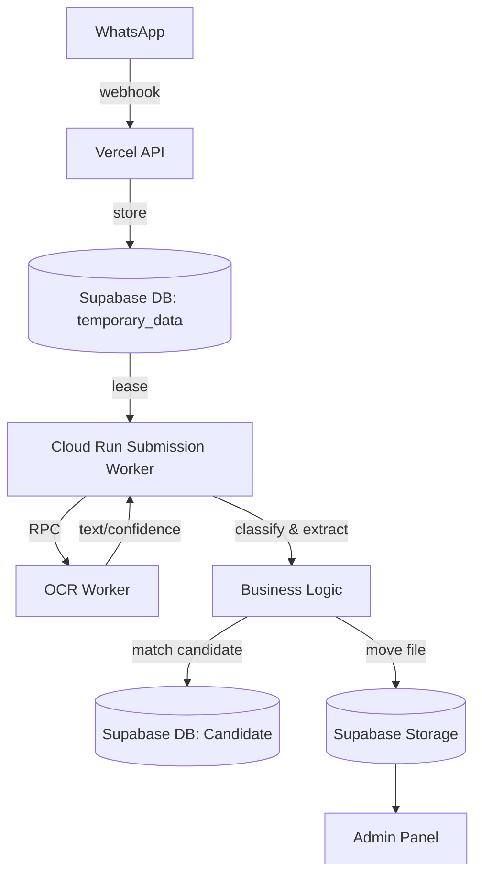

# EmlynkWABot STAGE Environment - OCR & Worker Diagnostics & Fixes
**Date**: October 5, 2026

## Context
Today's focus was on diagnosing and fixing issues within the `stage` branch (Preview environment). The production `main` branch remained strictly untouched. 

### End-to-End Architecture
The system architecture for the WhatsApp document ingestion pipeline involves:
- **Vercel Preview**: Express-based API/Webhook handling, and the Admin Frontend.
- **PostgreSQL / Supabase**: Manages the `temporary_data` queue and relational records for candidates and documents.
- **Cloud Run Submission Worker**: A dedicated background worker processing queued documents from the `temporary_data` table.
- **Separate Cloud Run OCR Worker**: Handles OCR inference for documents.
- **Supabase Storage**: Acts as object storage for `temporary`, `pending`, and `permanent` document placement.

The expected workflow is:
`WhatsApp -> Vercel Webhook/API -> temporary storage + temporary_data queue -> Cloud Run Submission Worker -> OCR Worker -> classification/extraction -> identity/candidate matching -> pending/permanent document placement -> Admin Panel`

---

## 1. Vercel Preview / Admin Login Issue

**Problem Discovered**:
The `/admin` portal was accessible, but attempts to authenticate via `/auth/login` returned an HTTP 500 error. The Prisma error code logged was `P2010` (Raw query failed).

**Root Cause**:
The issue lay in the `public.rate_limits` table state. The rate-limiting middleware triggers prior to login. The database lacked the latest migration state for rate limiting, causing the raw `UPSERT` SQL executed by the rate-limiter to fail and throw `P2010`. Additionally, the Vercel proxy headers were not correctly trusted by Express, affecting IP resolution.

**Fix Implemented**:
- Prisma migrations were executed to bring the `public.rate_limits` table state up to date.
- The raw rate-limit SQL/upsert was verified against the migrated schema.
- Vercel proxy handling was adjusted using `trust proxy` in the Express app to correctly resolve IPs from forwarded headers (`TRUST_PROXY_HOPS`).

**Current Verified Behavior**:
`/auth/login` successfully handles requests and returns a correct `400 Missing credentials` when credentials are not supplied, instead of a 500 error. 

---

## 2. CSRF Investigation

**Problem Discovered**:
It was initially suspected that CSRF protection might be blocking backend API routes (e.g. `PUT /api/admin/candidates/:passportId`).

**Root Cause**:
Investigation confirmed that CSRF was *not* the issue. The backend explicitly skips CSRF middleware checks for requests carrying Bearer tokens.

Relevant logic verified:
```javascript
skipCsrfProtection: (req) =>
  !req.cookies?.[AUTH_COOKIE_NAME] ||
  Boolean(req.headers.authorization)
```

**Fix Implemented**:
None required. The frontend deliberately uses Authorization Bearer tokens for the API, bypassing CSRF which is only strictly enforced for cookie-based browser sessions. This was verified and left unchanged.

---

## 3. Separation of OCR and Submission Processing

The architecture decouples submission orchestration from OCR computation:



The **OCR Worker** exclusively extracts text and visual data from images/PDFs. The **Submission Worker** handles polling, retry logic, classification, field extraction, candidate matching, and storage placement. 

---

## 4. Submission Worker Dockerization

**Deployment/Infrastructure Changes**:
A `Dockerfile.worker` was successfully implemented to containerize the Submission Worker for Cloud Run deployment.

- **Base Image**: Node.js base image.
- **Dependencies**: `npm ci` is used to cleanly install dependencies.
- **Prisma**: The build step correctly includes `prisma generate` to compile the query engine for the container runtime.
- **Entry point**: Runs `node src/worker.js` as the non-root entry point.
- **Health check**: Exposes a `PORT` for Cloud Run's required health/liveness probes.

The resulting image is securely pushed to Artifact Registry:
`asia-south1-docker.pkg.dev/project-aa11e15e-a951-4e1b-a65/emlynk-ocr/submission-worker-preview:stage`

This image is specifically isolated for the Preview Submission Worker.

---

## 5. Cloud Run Preview Submission Worker

**Deployment/Infrastructure Changes**:
The Submission worker is actively deployed and running independently from the OCR worker.

- **Service Name**: `emlynk-submission-worker-preview`
- **Region**: `asia-south1`
- **Project**: `project-aa11e15e-a951-4e1b-a65`
- **Service Account**: `emlynk-backend@project-aa11e15e-a951-4e1b-a65.iam.gserviceaccount.com`
- **Connected OCR Service**: `https://emlynk-ocr-worker-76153319636.asia-south1.run.app`

---

## 6. DATABASE_URL / Secret Manager Deployment Failure

**Problem Discovered**:
The initial Cloud Run submission worker deployment failed to start, repeatedly logging Prisma `P1000` (Database authentication failure) errors.

**Root Cause**:
The worker container could not connect to PostgreSQL because intermediate secret versions of the `DATABASE_URL` stored in Google Secret Manager were malformed or incorrect. 

**Fix Implemented**:
- The correct local `DATABASE_URL` format was verified.
- A new, correct Secret Manager version was created securely via GCP.
- The Cloud Run worker was re-configured to mount/use the corrected secret version.
- Plaintext temporary secret files used during debugging were securely removed from the environment.

**Current Verified Behavior**:
The Cloud Run worker successfully starts, connects to the database, and listens on its health port.

---

## 7. Worker Diagnostics / Prisma Error Logging

**Problem Discovered**:
Prisma errors occurring within the Submission worker queue (`src/services/submissionQueue.js`) were being suppressed or logged unhelpfully (e.g., `PrismaClientUnknownRequestError` with an empty error string), obscuring the root causes of queue failures.

**Fix Implemented**:
Refactored `src/utils/safeLog.js` to safely expose deeper diagnostic fields from Prisma database exceptions:
- Logs the error name/type.
- Logs the Prisma error code (e.g., `P2010`, `P2021`).
- Safely extracts and logs the adapter/database error messages when provided by the Prisma client.
- **Crucially**, it actively strips/omits `DATABASE_URL`, passwords, authorization headers, service-role keys, and PII.

**Tests Performed**:
`test/safeLog.test.js` verified that sensitive credentials are never leaked while useful database errors are surfaced.

---

## 8. First Real WhatsApp Passport Failure

**Problem Discovered**:
A real E2E test was conducted using a candidate (`N9606058`) manually registered via the Admin panel with the WhatsApp number `+94771581916`.

The expected flow: `WhatsApp -> temporary queue -> classify PASSPORT -> extract N9606058 -> match -> display`.

**Observed Behavior**:
- Vercel webhook successfully received the message and enqueued it in `temporary_data` (`TEMPORARY_STORED`).
- The Submission worker successfully leased and processed the job.
- **Failure**: The real passport was misclassified as `MEDICAL`.
- Because it was classified as medical, `passportId` remained `null`.
- The matching phase resulted in `AMBIGUOUS_MATCH` / `IDENTITY_NOT_CONFIRMED`.
- The submission entered `MANUAL_REVIEW` and was not automatically stored against the candidate.

---

## 9. First Passport Classification Fix — MRZ Weighting

**Problem Discovered**:
The classification system relied heavily on `findPassportMrz()` to confidently identify a passport. The original scoring logic allowed generic "medical" OCR noise (e.g. "health", "hospital") to out-score genuine passport indicators.

**Fix Implemented**:
The MRZ line indicators (`mrz_line_1`, `mrz_line_2`) weights were increased in `src/services/documentClassificationService.js`. 

**Tests Performed**:
A synthetic test was added to `test/documentClassification.test.js` verifying that a clean MRZ beats generic medical noise.

**Remaining Issue**:
While the tests passed, this change **DID NOT** solve the real WhatsApp image case in production, leading to the second failure below.

---

## 10. Second Real-World Failure

**Problem Discovered**:
A fresh WhatsApp submission of the passport still failed.

**Observed Behavior**:
```json
documentType: "MEDICAL",
processingStatus: "MANUAL_REVIEW",
reviewReason: "IDENTITY_NOT_CONFIRMED",
identity.status: "AMBIGUOUS_MATCH",
passportId: null
```
The OCR confidence metrics were reported as:
- Document confidence: 69
- Extraction confidence: 69
- Classification confidence: 80
- OCR rotation: 0
- upscaled: true
- thresholding: OTSU
- extraction method: OCR

**Root Cause**:
The first MRZ-weight fix was insufficient because `findPassportMrz()` completely failed to validate the MRZ. The function was too strictly expecting an uncorrupted 44-character ICAO standard string.

---

## 11. Actual Remaining Root Cause

Due to WhatsApp image compression, lighting, cropped characters, and generic OCR noise, the MRZ on the real document was slightly mangled. 

When `findPassportMrz()` failed:
1. The classification pipeline received zero MRZ evidence points.
2. Exact printed label regexes (like `\bpassport no\b`) also failed due to OCR artifacts.
3. Scattered generic words like "medical" easily accumulated enough points to dominate the classification algorithm.
4. The document became `MEDICAL`.
5. **Crucially**, passport extraction is conditional upon classification. Since the document was deemed medical, the system entirely skipped looking for the `N9606058` string, even though the raw text contained the passport ID correctly.

---

## 12. Latest Passport Classification / Extraction Fix

Code modifications were implemented in `src/services/documentClassificationService.js` and `src/services/passportExtractionService.js`.

**Fixes Implemented**:
1. **MRZ Fragment Evidence**: 
   Added generic regex patterns to detect highly distinctive fragments of an MRZ even if the full line is invalid.
   - `^P<[A-Z<]{3,}`: Spots the distinctive start of line 1.
   - `\b[0-9]{6}[0-9][MF<][0-9]{6}[0-9]\b`: Spots the unmistakable DOB/Sex/Expiry block in line 2.
2. **Passport Number Pattern Evidence**:
   Added `\b[A-Z]{1,2}[0-9]{6,8}\b` to the classification scoring table. This allows the mere presence of a passport-formatted ID string to contribute heavily to passport classification, easily out-weighting random medical noise. *(Note: This is an unanchored regex and has a theoretical false-positive risk if documents heavily utilize similar formatting; however, it requires corroborating evidence to clear the minimum score threshold).*
3. **Passport Extraction Fallback**:
   If the visual zone `passport no` label is completely missing from the OCR text, `readVisualZone` now falls back to extracting the `\b[A-Z]{1,2}[0-9]{6,8}\b` formatted ID directly from the text. 

*No specific candidate IDs (e.g. N9606058) are hardcoded anywhere.*

---

## 13. Regression Tests

**Tests Performed**:
Two major testing components were added/updated:

1. `test/fixtures/documents/passport-mangled-mrz-noisy-medical.txt`: 
   A new fixture designed to strictly mimic the real-world failing scenario (mangled MRZ, missing labels, strong medical noise).
2. `test/documentClassification.test.js`:
   Asserts that the new fixture correctly resolves to `PASSPORT` using `passport_id_format` and `mrz_fragment_p` indicators.
3. `test/passportExtractionFallback.test.js`:
   A new unit test that asserts `extractPassportFields` successfully pulls a valid passport ID format even when printed labels and valid MRZs are entirely absent.

Existing suites run successfully:
- `test/documentClassification.test.js`
- `test/documentProcessing.test.js`

**Current Verified Behavior**:
Both integration/processing suites pass perfectly, ensuring no regression occurred against genuine medical, police, or unknown documents.

---

## 14. Docker Build / Artifact Registry / Cloud Run Redeployment

The Preview worker deployment procedure relies on Docker container pushes. The commands used (or intended to be used) for deployment:

```bash
# Build the Docker image locally
docker build -f Dockerfile.worker -t asia-south1-docker.pkg.dev/project-aa11e15e-a951-4e1b-a65/emlynk-ocr/submission-worker-preview:stage .

# Push the Docker image to Google Artifact Registry
docker push asia-south1-docker.pkg.dev/project-aa11e15e-a951-4e1b-a65/emlynk-ocr/submission-worker-preview:stage

# Deploy the image to Cloud Run
gcloud run deploy emlynk-submission-worker-preview \
  --image asia-south1-docker.pkg.dev/project-aa11e15e-a951-4e1b-a65/emlynk-ocr/submission-worker-preview:stage \
  --region asia-south1 \
  --project project-aa11e15e-a951-4e1b-a65
```

*Important Note: Git push operations and Docker image push operations are entirely distinct.* 

---

## 15. Vercel vs Cloud Run Deployment Clarification

- **Vercel Preview**: Pushing code to the `stage` branch on GitHub automatically triggers a Vercel deployment which updates the Express/Admin portal.
- **Cloud Run Worker**: The worker is updated independently by building the Docker image and pushing it directly to Artifact Registry, then executing `gcloud run deploy`.

Because of this separation, it is entirely possible for the Cloud Run worker to run code that is newer (built from local, uncommitted changes) than the GitHub/Vercel `stage` revision. Keeping these synchronized manually via Git commits is strictly required.

---

## 16. Manual Review / Candidate Assignment Verification

**Tests Performed**:
The manual review assignment pipeline was successfully tested and verified.

**Current Verified Behavior**:
1. Document enters `MANUAL_REVIEW`.
2. Admin clicks `Assign Candidate`.
3. Admin clicks `Approve`.
4. The document is safely attached to the candidate's database record.
5. The document is permanently moved to the correct candidate storage folder and becomes visible in the Admin UI.

---

## 17. Current Business Requirement

The overriding automation goal is:
**If a candidate is manually registered, and they send a readable document from their registered WhatsApp number, the system must automatically attach the document to their profile.**

**Desired Happy Path:**
`Existing candidate -> sends document via registered WhatsApp -> webhook -> worker processes/classifies -> unique candidate match -> document attached -> visible in Admin.`

**Manual Review Requirements:**
Manual Review MUST remain as the ultimate safety net for:
- No reliable candidate match
- Multiple/ambiguous candidate matches
- Conflicting identity evidence
- Unclear or unsupported document types
- Unsafe, low-confidence processing

---

## 18. Current Status

| Component | Status | Notes |
| :--- | :--- | :--- |
| **Vercel Webhook** | ✅ Verified | Correctly receives documents and queues `temporary_data`. |
| **Admin Preview** | ✅ Verified | Accessible, rate limits and login function correctly. |
| **Submission Queue** | ✅ Verified | Database integration and safe-logging are fully functional. |
| **Cloud Run Submission Worker** | ✅ Verified | Deployed, connects to DB, and processes queue items successfully. |
| **OCR Worker** | ✅ Verified | Running as an independent Cloud Run service. |
| **Passport Classification** | ✅ Verified | Robust against medical noise and mangled MRZs (Tests pass). |
| **Passport Extraction** | ✅ Verified | Fallback regex accurately extracts IDs missing VIZ labels (Tests pass). |
| **Manual Review Assignment** | ✅ Verified | End-to-end admin UI assignment works perfectly. |
| **Candidate Document Display** | ✅ Verified | Documents show correctly after assignment. |
| **Automatic WhatsApp Auto-Match** | ⏳ Pending | Needs final E2E verification with fresh WhatsApp submission. |
| **Git Stage Synchronization** | ✅ Verified | Local branch is currently synchronized (`59c0cc7`). |

---

## 19. Remaining Work / Next Steps

**Prioritized checklist:**

1. [ ] **Verify/finish unique WhatsApp-number candidate auto-matching**: Ensure auto-match rules correctly resolve the incoming WhatsApp number to candidate `N9606058`.
2. [ ] **Ensure document auto-attaches**: Confirm a document from an existing candidate's registered WhatsApp number can automatically attach when the extraction is safe and unique.
3. [ ] **Retest the latest fix**: Conduct a fresh E2E test by sending a real, physical WhatsApp image of candidate `N9606058`.
4. [ ] **Confirm UI presence**: Confirm the document appears automatically in Admin Candidate Details without requiring manual assignment.
5. [ ] **Keep ambiguous cases in Manual Review**: Confirm ambiguous tests gracefully degrade to manual UI.
6. [ ] **Review Fallback Rules**: Monitor the new broad passport-number regex in production/stage to ensure it does not generate false positives.
7. [ ] **Commit verified changes**: Commit the newly validated source and test changes.
8. [ ] **Push to `stage`**: Keep remote and local in sync.
9. [ ] **Confirm Sync**: Confirm Vercel Preview is running the identical Git revision as the latest Cloud Run worker deployment.
10. [ ] **Cherry-pick Strategy**: Later, selectively cherry-pick relevant commits into their proper feature/version branches rather than merging all of `stage`.

---

## 20. Git / Branch Strategy Note

- `stage` is currently utilized strictly as an integration/Preview testing branch, aggregating changes from multiple feature branches.
- The `main` production branch has remained explicitly untouched.
- **Do not** blindly merge `stage` back into feature branches or `main`.
- Once these OCR/Classification fixes are completely verified in Preview, use clean Git history and `git cherry-pick` to pull only the specific debug/fix commits into the appropriate feature/version branch.
