# WhatsApp Document Processing Automation
## Professional Project Proposal & Technical Solution Design

**Document Type:** Project Proposal / Technical Solution Design  
**Version:** 1.0  
**Status:** Proposed  
**Primary Audience:** Management, Project Management, Architecture, Development, QA, DevOps, AI/OCR and WhatsApp Integration Teams

---

## 1. Executive Summary

This proposal defines an enhancement to the existing WhatsApp-based document-processing workflow. The solution will allow clients to submit required documents through WhatsApp, automatically classify and analyze those documents, identify the associated client, verify passport information against existing data, store documents securely, update missing client information, temporarily hold incomplete submissions, and expose operational information through an administrator dashboard.

The design intentionally keeps the new database architecture small and maintainable. The core database consists of only four tables:

1. `admins`
2. `users`
3. `documents`
4. `temporary_data`

The most important identity rule is that `users.passport_id` is the **Primary Key**. A separate `users.unique_id` is maintained as a **UNIQUE client/backload reference**, using values such as `0001`, `0002`, `0003`, etc. The two identifiers must never be treated as interchangeable.

The uploaded Excel workbook was reviewed as the source reference. Its main sheet contains a broad legacy dataset with fields including `PASSPORT NUMBER`, `FIRST NAME`, `OTHER NAME`, `BIRTHDAY`, `PP EX DATE`, `JOB`, `ID NUMBER`, `ADDRESS`, `WHATSAPP NUM`, `CONTACT NUM`, `PASSPORT COPY`, police-report-related fields, `MEDICAL`, `SCAN`, and `SUBMIT DATE`. A separate `MANDATORY` sheet defines mandatory/document-related information.

The new architecture does **not** copy all legacy columns into the new database. Instead, relevant fields are mapped into the four-table design, while fields that are outside this project's scope remain part of the legacy system or require client confirmation.

> **Important source-data limitation:** the uploaded workbook contains an `ID NUMBER` field, but the source does not establish with sufficient certainty that `ID NUMBER` is the client's backload `Unique ID`. The proposal therefore treats the backload `unique_id` as a required business field and requires confirmation of its source mapping before production migration. Sample values are `0001`, `0002`, `0003`, etc.

---

# 2. Project Background

The existing system stores client/passport information and related operational information. The enhancement introduces automated WhatsApp document intake and processing.

The existing source data includes information relevant to the new workflow such as:

- Passport number
- First name
- Other name
- Date of birth
- Passport expiry date
- Job
- Address
- WhatsApp number
- Contact number
- Passport copy
- Police-report-related information
- Medical information
- Scan information
- Submission date

The new solution will connect the WhatsApp channel to document processing, OCR/document AI, the existing client database, secure object storage, and an administration interface.

---

# 3. Objectives

## 3.1 Primary Objectives

- Receive client documents through WhatsApp.
- Validate incoming files.
- Identify document type.
- Process passports using OCR/document AI.
- Extract Passport ID and relevant passport information.
- Identify the client using WhatsApp number and Passport ID.
- Use `unique_id` as a separate client/backload reference.
- Verify identity before attaching documents.
- Populate missing trusted client fields from valid passport extraction.
- Detect and flag identity/data conflicts.
- Rename and securely store valid documents.
- Preserve unclear and unrecognized documents.
- Temporarily store incomplete client submissions.
- Finalize temporary documents once the required set is complete.
- Track police-report submission dates and 21-day reminders.
- Provide an operational admin dashboard.
- Keep the database limited to four core tables.

---

# 4. Scope

## 4.1 In Scope

- WhatsApp document ingestion
- File validation
- Document classification
- Passport OCR/document AI
- Passport ID extraction
- Client identification
- Identity reconciliation
- Document storage
- Temporary document workflow
- Undefined/unclear document handling
- Police report slip processing
- 21-day countdown
- Admin dashboard
- Reporting
- Error handling
- Security controls
- Database migration mapping
- Testing and acceptance criteria

## 4.2 Out of Scope

- Full replacement of the existing business application
- Full redesign of unrelated legacy data
- Automatic approval of identity conflicts
- Public document storage
- Unnecessary microservice decomposition
- Unnecessary database tables
- Advanced analytics unrelated to document processing
- Automatic resolution of ambiguous identity cases without human review

---

# 5. Existing Data Analysis

## 5.1 Source Workbook

The uploaded workbook contains:

- `Sheet1` — primary legacy/client dataset
- `MANDATORY` — mandatory/document-related reference information

The primary dataset contains a wide set of legacy fields. The new system should not reproduce the legacy workbook one-for-one.

## 5.2 Important Existing Fields

The source contains fields including:

| Existing Field | Proposed Treatment | Notes |
|---|---|---|
| `PASSPORT NUMBER` | `users.passport_id` | Primary client identifier |
| `FIRST NAME` | `users.first_name` | Client field |
| `OTHER NAME` | `users.other_name` | Client field |
| `BIRTHDAY` | `users.date_of_birth` | Client field |
| `PP EX DATE` | `users.passport_expiry_date` | Client field |
| `JOB` | `users.job` | Retain if required by current business process |
| `ADDRESS` | `users.address` | Client field |
| `WHATSAPP NUM` | `users.whatsapp_number` | Identity/contact field |
| `CONTACT NUM` | `users.contact_number` | Contact field |
| `PASSPORT COPY` | `documents` | Document metadata/storage reference |
| `MEDICAL` | `documents` | Document-related data |
| `SCAN` | `documents` / legacy | Requires business confirmation |
| `SUBMIT DATE` | `documents` or derived workflow data | Depends on document context |
| Police-report fields | `documents` | Requires document/status mapping |
| `ID NUMBER` | **Requires confirmation** | Do not assume it is `unique_id` |
| `TEST NUMBER` | Legacy/confirmation required | Do not assume client identity meaning |

## 5.3 Existing Data to New Architecture Mapping

| Existing Field | New Field | Table | Action | Reason |
|---|---|---|---|---|
| `PASSPORT NUMBER` | `passport_id` | `users` | Keep / map | Primary client identity |
| Backload/Unique ID, once confirmed | `unique_id` | `users` | Keep / map | Client reference |
| `FIRST NAME` | `first_name` | `users` | Keep | Client information |
| `OTHER NAME` | `other_name` | `users` | Keep | Client information |
| `BIRTHDAY` | `date_of_birth` | `users` | Rename/map | Standard field name |
| `PP EX DATE` | `passport_expiry_date` | `users` | Rename/map | Passport information |
| `JOB` | `job` | `users` | Keep if required | Existing client information |
| `ADDRESS` | `address` | `users` | Keep if required | Existing client information |
| `WHATSAPP NUM` | `whatsapp_number` | `users` | Rename/map | Client identification |
| `CONTACT NUM` | `contact_number` | `users` | Rename/map | Contact information |
| `PASSPORT COPY` | document record + storage path | `documents` | Move | Document management |
| `MEDICAL` | document record + storage path | `documents` | Move | Document management |
| Police report fields | document records | `documents` | Normalize into document metadata | Document workflow |
| `SUBMIT DATE` | document/workflow date | `documents` | Context-dependent | Police report processing |
| `ID NUMBER` | TBD | TBD | Confirm | Source meaning is not established |
| `TEST NUMBER` | TBD | TBD | Confirm | Source meaning is not established |

### Migration rule

No legacy field should be migrated merely because it exists. Each field must have a documented purpose in the new workflow.

---

# 6. Identifier Design

## 6.1 Passport ID

`passport_id` is the primary business identity and the **Primary Key** of `users`.

Example:

```text
P1234567
```

Database rule:

```text
users.passport_id = PRIMARY KEY
```

## 6.2 Unique ID

`unique_id` is a separate client/backload reference.

Example values:

```text
0001
0002
0003
0004
0005
0010
```

Example:

| Passport ID | Unique ID |
|---|---:|
| P1234567 | 0001 |
| P7654321 | 0002 |
| P9876543 | 0003 |

Database rule:

```text
users.unique_id = UNIQUE
```

The existing backload value should be preserved during migration where it can be identified. If no value exists for a newly created client, the system may generate the next available sequential reference according to the approved business rule.

### Critical distinction

```text
passport_id
    = Primary Key
    = Passport/business identity

unique_id
    = Unique reference
    = Client/backload identifier
```

`unique_id` must never replace `passport_id` as the primary key.

---

# 7. Target Architecture

## 7.1 High-Level Architecture

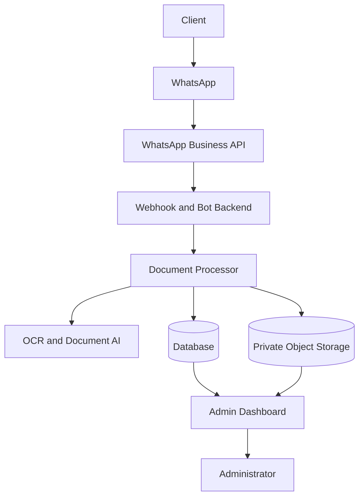

## 7.2 Detailed System Architecture

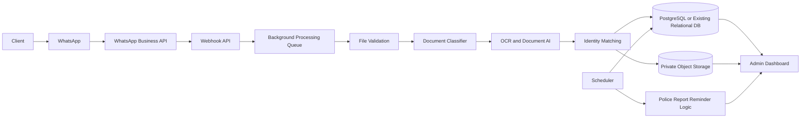

### Architecture principle

The system should begin as a modular application rather than a collection of unnecessary microservices. Background processing can be introduced through a queue/worker pattern where OCR and file operations are too slow for synchronous webhook handling.

---

# 8. Core Database Architecture

Only four core tables are proposed:

```text
admins
users
documents
temporary_data
```

## 8.1 Relationship Overview

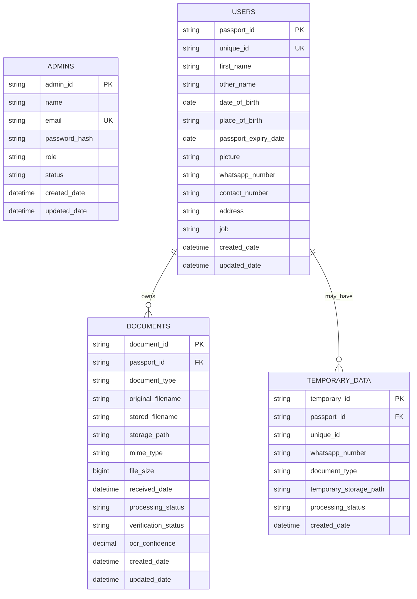

---

# 9. Table Design

## 9.1 `admins`

| Field | Type | Constraint | Purpose |
|---|---|---|---|
| `admin_id` | VARCHAR | PK | Admin identity |
| `name` | VARCHAR | NOT NULL | Display name |
| `email` | VARCHAR | UNIQUE | Login/reference |
| `password_hash` | VARCHAR | Nullable if external auth | Never plaintext |
| `role` | VARCHAR | NOT NULL | Authorization role |
| `status` | VARCHAR | NOT NULL | Active/inactive |
| `created_date` | TIMESTAMP | NOT NULL | Creation timestamp |
| `updated_date` | TIMESTAMP | NOT NULL | Last update |

## 9.2 `users`

| Field | Type | Constraint | Purpose |
|---|---|---|---|
| `passport_id` | VARCHAR | **PK** | Primary client identity |
| `unique_id` | VARCHAR(20) | **UNIQUE** | Backload/client reference |
| `first_name` | VARCHAR | Nullable | First name |
| `other_name` | VARCHAR | Nullable | Other name |
| `date_of_birth` | DATE | Nullable | Date of birth |
| `place_of_birth` | VARCHAR | Nullable | Place of birth |
| `passport_expiry_date` | DATE | Nullable | Passport expiry |
| `picture` | VARCHAR | Nullable | Object-storage reference |
| `whatsapp_number` | VARCHAR | Nullable/indexed | WhatsApp identification |
| `contact_number` | VARCHAR | Nullable/indexed | Contact |
| `address` | TEXT | Nullable | Address |
| `job` | VARCHAR | Nullable | Occupation |
| `created_date` | TIMESTAMP | NOT NULL | Creation |
| `updated_date` | TIMESTAMP | NOT NULL | Last update |

## 9.3 `documents`

| Field | Type | Constraint | Purpose |
|---|---|---|---|
| `document_id` | VARCHAR | PK | Document identity |
| `passport_id` | VARCHAR | FK | Associated client |
| `document_type` | VARCHAR | NOT NULL | Passport/police/medical/etc. |
| `original_filename` | VARCHAR | NOT NULL | Original file name |
| `stored_filename` | VARCHAR | NOT NULL | Standardized name |
| `storage_path` | TEXT | NOT NULL | Object-storage key |
| `mime_type` | VARCHAR | Nullable | File MIME type |
| `file_size` | BIGINT | Nullable | File size |
| `received_date` | TIMESTAMP | NOT NULL | Receipt time |
| `processing_status` | VARCHAR | NOT NULL | Processing state |
| `verification_status` | VARCHAR | NOT NULL | Verification state |
| `ocr_confidence` | DECIMAL | Nullable | OCR confidence |
| `created_date` | TIMESTAMP | NOT NULL | Creation |
| `updated_date` | TIMESTAMP | NOT NULL | Last update |

## 9.4 `temporary_data`

| Field | Type | Constraint | Purpose |
|---|---|---|---|
| `temporary_id` | VARCHAR | PK | Temporary record |
| `passport_id` | VARCHAR | Nullable FK | Known client if available |
| `unique_id` | VARCHAR | Nullable | Known backload ID |
| `whatsapp_number` | VARCHAR | Nullable/indexed | Temporary identity |
| `document_type` | VARCHAR | NOT NULL | Temporary document |
| `temporary_storage_path` | TEXT | NOT NULL | Temporary storage key |
| `processing_status` | VARCHAR | NOT NULL | Temporary workflow state |
| `created_date` | TIMESTAMP | NOT NULL | Creation |

---

# 10. Key and Index Design

| Table | Field | Constraint | Purpose |
|---|---|---|---|
| `users` | `passport_id` | PRIMARY KEY | Client identity |
| `users` | `unique_id` | UNIQUE | Backload/client reference |
| `users` | `whatsapp_number` | INDEX | Client lookup |
| `documents` | `document_id` | PRIMARY KEY | Document identity |
| `documents` | `passport_id` | FOREIGN KEY + INDEX | Client document lookup |
| `temporary_data` | `temporary_id` | PRIMARY KEY | Temporary record |
| `temporary_data` | `passport_id` | FOREIGN KEY + INDEX | Temporary client lookup |
| `temporary_data` | `whatsapp_number` | INDEX | Temporary sender lookup |
| `admins` | `admin_id` | PRIMARY KEY | Admin identity |
| `admins` | `email` | UNIQUE | Admin lookup |

---

# 11. Document Receiving Workflow

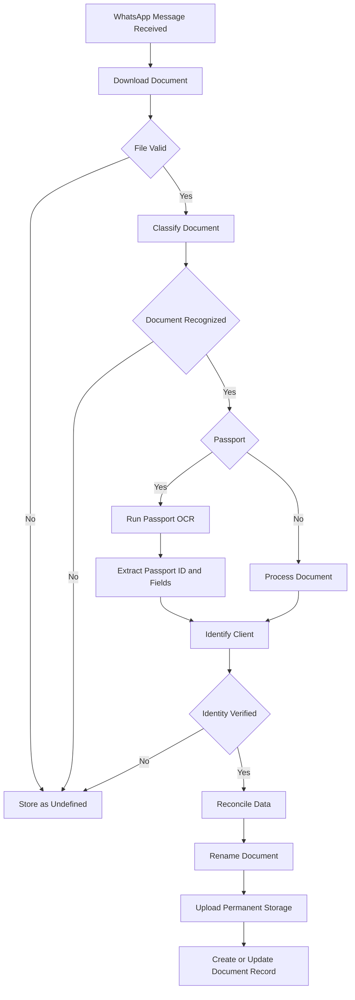

---

# 12. Passport Processing

When a passport is received:

1. Validate file.
2. Detect passport.
3. Extract Passport ID.
4. Extract supported fields.
5. Compare Passport ID with `users.passport_id`.
6. Compare WhatsApp identity where available.
7. Detect conflicts.
8. Reconcile missing and existing fields.
9. Store passport document.
10. Preserve OCR confidence.
11. Expose low-confidence cases for review.

## Required Passport Information

- Passport ID

## Potentially Available Information

- First name
- Other name
- Date of birth
- Place of birth
- Passport expiry date
- Nationality
- Sex/gender where appropriate
- Passport photograph

Not every passport should be assumed to provide every field.

---

# 13. User Identification Logic

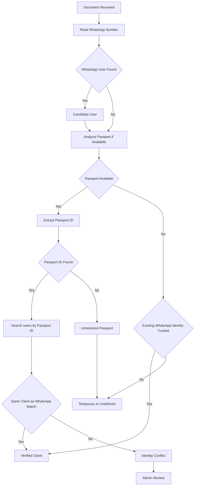

## Required Scenarios

### A. WhatsApp and Passport match

Proceed as a verified client.

### B. WhatsApp matches another user

Do not merge. Flag an identity conflict.

### C. Passport matches but WhatsApp differs

Do not automatically change the WhatsApp number. Flag for review unless the business process explicitly authorizes verification/update.

### D. WhatsApp exists but Passport is new

Keep the client association provisional until identity verification is completed.

### E. Passport exists but WhatsApp is missing

Associate the document with the Passport ID and optionally populate WhatsApp only after the identity relationship is verified.

### F. Neither identifies the client

Use temporary or undefined handling and require review.

### G. Passport unreadable

Preserve the file and route to manual review.

### H. Multiple matches

Do not select a client silently. Route to manual review.

---

# 14. Passport Verification and Reconciliation

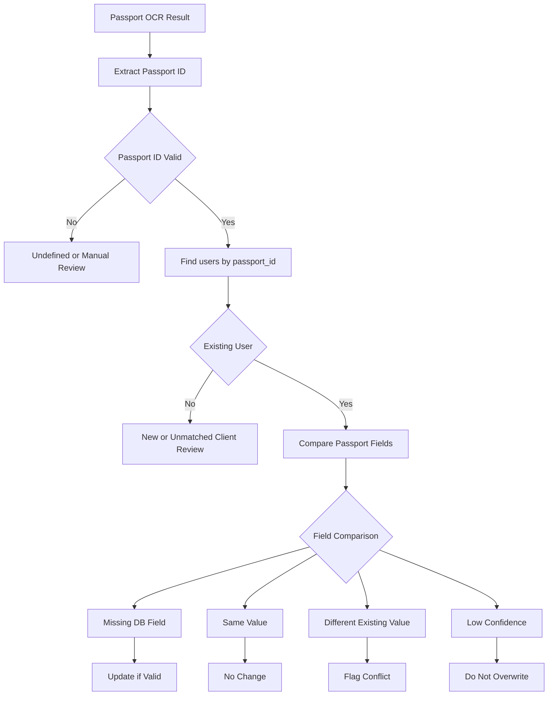

## Reconciliation Matrix

| Database Value | Passport Value | Action |
|---|---|---|
| Missing | Valid/high confidence | Update |
| Existing | Same | No change |
| Existing | Different | Flag for review |
| Existing | Low confidence | Do not overwrite |
| Missing | Low confidence | Do not automatically update |

---

# 15. Document Naming and Storage

Recommended standard names:

```text
passport.pdf
police_report.pdf
medical.pdf
```

For duplicate versions:

```text
passport_v2.pdf
police_report_v2.pdf
medical_v2.pdf
```

The final implementation should retain the original filename in `documents.original_filename`.

## Permanent Storage

```text
clients/
  {passport_id}/
    passport/
      passport.pdf
    police-report/
      police_report.pdf
    medical/
      medical.pdf
    other/
```

Object keys should use the verified Passport ID rather than a mutable display name.

---

# 16. Undefined / Unclear Documents

Unrecognized, unclear, corrupted, unsupported, or conflicting documents must never be deleted automatically.

Required path:

```text
undefined/
  {mobile_number}/
    uncleared-docs/
```

Example:

```text
undefined/
  94771234567/
    uncleared-docs/
      document_20260920_143522.pdf
```

The document should remain available for administrator review.

---

# 17. Temporary Document Workflow

A client does **not** need to wait until all three required documents are available. Each document is processed independently as soon as it is received.

Example:

```text
Police Report  -> process immediately
Medical        -> process immediately
Passport       -> process immediately
```

Each incoming document is first placed in temporary storage. The bot then verifies the document type and its processing/OCR confidence level. The verification process uses nested confidence-level filtering so that unclear or wrong documents are flagged without losing the original file.

Confidence handling:

| Confidence Level | Verification Result | Flag / Alert | Rename | Storage Action |
|---|---|---|---|---|
| Above 95% | Verified / clear document | No alert required | Rename using detected document type | Upload to original/permanent folder |
| 90%–95% | High-confidence document | Optional review flag | Rename using detected document type | Upload to original/permanent folder |
| 60%–89% | Slightly unclear document | Add warning flag | Rename using detected document type | Upload to original/permanent folder |
| 40%–59% | Unclear document | Add warning/review flag | Do not rename | Upload to original/permanent folder using the original filename |
| Below 40% | Undefined / unreliable document | Add critical admin-review flag | Do not rename | Store in undefined area for administrator review |

The 90%–95% band is an initial configurable rule and may be adjusted after business validation. A detected wrong-document condition must also create a verification flag so that the administrator can review the document rather than allowing it to pass silently.

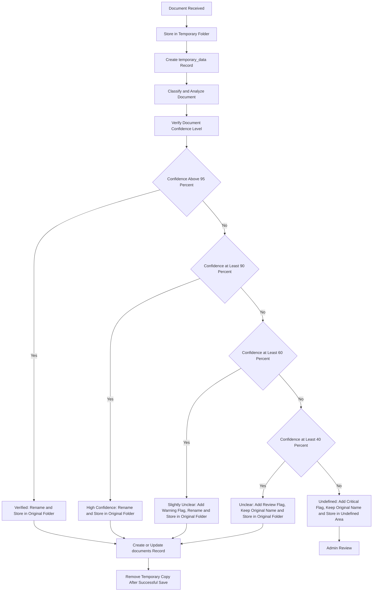

Temporary identity can use:

1. `passport_id`, if known;
2. `unique_id`, if known;
3. WhatsApp number, if neither is known.

---

# 18. Temporary Finalization Rules

Temporary records/files are deleted only after:

1. Required documents are present.
2. Identity is verified.
3. Permanent object storage succeeds.
4. Permanent document records are successfully written.
5. Required user updates succeed.
6. Finalization is marked successful.

If any step fails, temporary data remains for retry/recovery.

---

# 19. Required Document Set

The current example is:

```text
1. Passport
2. Police Report
3. Medical
```

The third document should be configurable at application level. The database does not require a separate document-type table for this.

A configuration value or application configuration can define:

```text
required_document_types =
[
  passport,
  police_report,
  medical
]
```

---

# 20. Police Report Slip Processing

When a police report slip/receipt is received:

1. Classify the document.
2. Run OCR/document AI.
3. Extract submitted/application date.
4. Validate the date.
5. Store the date with the relevant document/workflow record.
6. Calculate the reminder date.
7. Display countdown/status in the dashboard.

Formula:

```text
reminder_date = submitted_date + 21 days
```

Example:

```text
Submitted Date: 2026-09-01
Reminder Date:  2026-09-22
```

---

# 21. Police Report Countdown

Before the 21-day countdown is calculated, the system must first check whether a police report slip has been uploaded for the client. If no slip has been uploaded, the status remains `NOT_UPLOADED` / `MISSING` and no countdown is started. If the slip exists, the system processes the slip, extracts the submitted date, validates it, and starts the 21-day calculation.

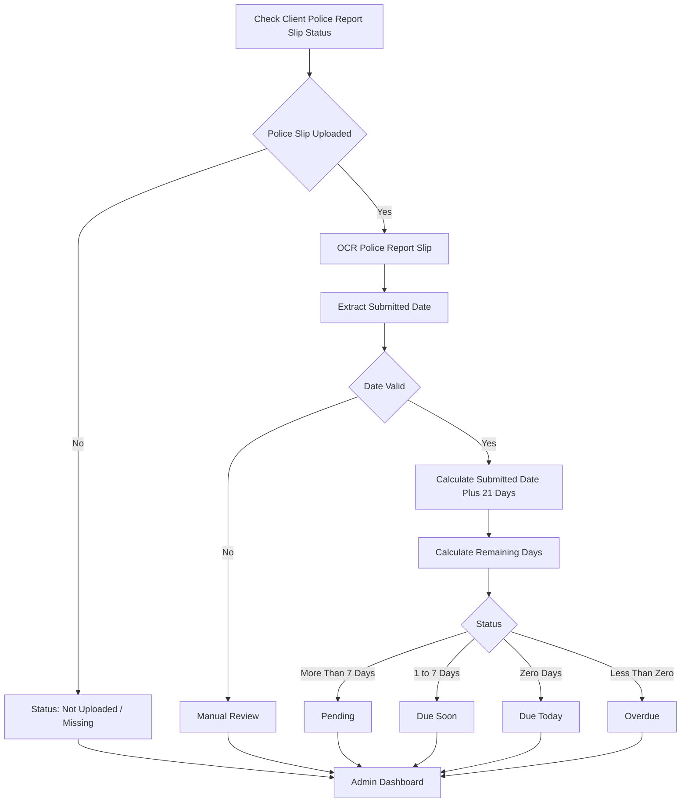

The application should use a single agreed timezone for date calculations, preferably the business operating timezone, and should store timestamps in a consistent format such as UTC while converting for display.

Suggested business thresholds:

| Condition | Status |
|---|---|
| More than 7 days remaining | Pending |
| 1–7 days remaining | Due Soon |
| 0 days | Due Today |
| Less than 0 days | Overdue |
| Confirmed police report completed | Completed |

---

# 22. Admin Dashboard

## Daily Summary

- Total documents received
- Successfully processed
- Failed processing
- Passport documents
- Police reports
- Medical documents
- Unknown documents
- Unclear documents
- Temporary documents
- Completed clients
- Incomplete clients
- Missing documents
- Police reports due soon
- Police reports due today
- Overdue police reports

## Client View

Example:

```text
Unique ID:       0001
Passport ID:     P1234567
WhatsApp Number: +94771234567

Passport        ✓ Verified
Police Report   ✓ Received
Medical         ✗ Missing
```

## Statuses

- Missing
- Received
- Processing
- Verified
- Temporary
- Unclear
- Invalid
- Rejected
- Completed

---

# 23. Dynamic Admin Alerts

No separate `alerts` table is required.

Alerts can be calculated from existing records.

Examples:

```text
documents.processing_status = 'FAILED'
documents.verification_status = 'CONFLICT'
police submitted_date + 21 days <= CURRENT_DATE
```

For police-report alerts, the application calculates the current status from the stored date rather than persisting a duplicate alert record.

---

# 24. Document State Machine

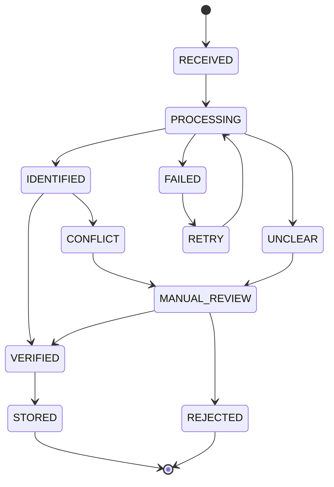

Temporary state:

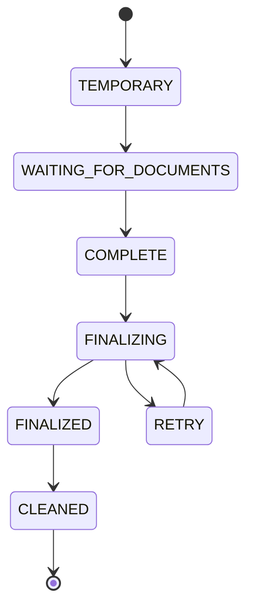

---

# 25. Storage Architecture

Temporary and undefined documents are grouped under one common non-final storage area while remaining logically separated by their processing status.

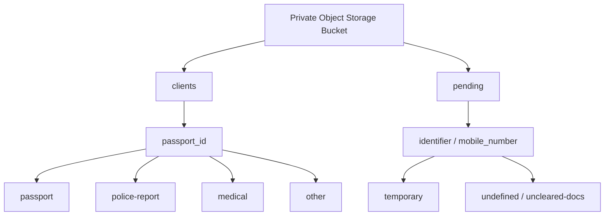

---

# 26. Storage Security

- Bucket must be private.
- No public object URLs.
- Admin access should use authenticated application requests.
- Temporary signed URLs should have short expiry times.
- Encryption at rest should be enabled.
- TLS must be used for data transfer.
- Access should be limited by role.
- Temporary files must have a defined retention period.
- Storage keys must not expose unnecessary personal information.
- Backups must be encrypted and access-controlled.

---

# 27. API Design

## `POST /webhooks/whatsapp`

Purpose: Receive WhatsApp webhook events.

Validation:

- Verify webhook authenticity.
- Validate event structure.
- Capture WhatsApp message ID.
- Reject malformed events.

Response:

```json
{
  "status": "accepted"
}
```

## `POST /documents/process`

Purpose: Start document processing.

Request:

```json
{
  "message_id": "wamid-example",
  "whatsapp_number": "94771234567",
  "file_reference": "media-reference"
}
```

## `GET /users/{passportId}`

Returns verified user information.

## `GET /users/{passportId}/documents`

Returns documents associated with the client.

## `GET /documents/unclear`

Returns documents requiring review.

## `GET /documents/missing`

Returns incomplete client document requirements.

## `GET /reports/daily`

Returns dashboard metrics for a requested business date.

## `GET /police-reports/upcoming`

Returns police-report records approaching their 21-day date.

---

# 28. API Error Model

Example:

```json
{
  "error": {
    "code": "DOCUMENT_UNCLEAR",
    "message": "The document could not be confidently classified.",
    "reference": "REQ-123456"
  }
}
```

Suggested error codes:

- `INVALID_WEBHOOK`
- `FILE_DOWNLOAD_FAILED`
- `UNSUPPORTED_FILE`
- `FILE_TOO_LARGE`
- `DOCUMENT_UNCLEAR`
- `OCR_FAILED`
- `PASSPORT_ID_MISSING`
- `IDENTITY_CONFLICT`
- `STORAGE_FAILED`
- `DATABASE_FAILED`
- `FINALIZATION_FAILED`

---

# 29. Background Processing

Long-running processing should not block the WhatsApp webhook.

Recommended asynchronous operations:

- OCR
- Document classification
- Large file processing
- Storage upload
- Temporary cleanup
- Police-report status calculation
- Daily reporting aggregation where required

The webhook should acknowledge receipt quickly and process the document asynchronously. The processing flow should use asynchronous jobs/workers so that document processing continues independently after the WhatsApp webhook has returned its response.

Recommended asynchronous flow:

```text
WhatsApp Webhook
    -> Validate event
    -> Record message / processing state
    -> Enqueue asynchronous document job
    -> Return accepted response immediately

Background Worker
    -> Download media asynchronously
    -> Validate file
    -> Classify document asynchronously
    -> Run OCR/document AI asynchronously
    -> Apply confidence and verification rules
    -> Upload file to the required storage location asynchronously
    -> Update database status
    -> Create review flag/alert when required
```

Independent asynchronous tasks should handle retries without blocking new WhatsApp messages. A failed OCR, storage, or database operation must update the processing state and follow the defined retry/error-handling rules rather than terminating the entire webhook flow.

---

# 30. Idempotency

WhatsApp systems may deliver duplicate webhook events.

The processing layer should use:

- WhatsApp message ID
- File checksum/hash where appropriate
- Processing status
- Idempotency key
- Retry state

A separate idempotency table is not required unless operational volume or provider behavior demonstrates that the four-table design cannot reliably support the requirement.

Processing should follow:

```text
Receive event
   |
   v
Check message already processed?
   |
   +-- Yes --> Return existing result
   |
   +-- No --> Begin processing
```

---

# 31. Duplicate Document Handling

A checksum can identify the same binary file submitted more than once.

Recommended approach:

1. Calculate file hash.
2. Check whether the same file is already associated with the client/context.
3. If duplicate, avoid creating unnecessary duplicate records.
4. If a different version is valid, retain it according to the document versioning policy.

---

# 32. Error Handling

| Failure | Detection | Processing Status / Flag | System Response | Storage / Data Action | Recovery / Admin Action |
|---|---|---|---|---|---|
| WhatsApp API failure | API error, timeout, invalid provider response | `FAILED` / integration error | Do not block other jobs; record failure and retry | Preserve existing processing state | Retry with exponential backoff; surface repeated failures for monitoring |
| File download failure | Media download exception or timeout | `FAILED` / download flag | Retry download asynchronously | Do not create a final document record until media is available | Retry with configured limit; flag for review if retries are exhausted |
| Unsupported file | MIME/extension validation | `UNDEFINED` / unsupported-file flag | Reject normal processing | Keep the original file in the combined pending/undefined area | Administrator review |
| Corrupt file | File parser/read failure | `UNDEFINED` / corrupt-file flag | Stop OCR/classification for the corrupt file | Preserve the original file in the combined pending/undefined area | Administrator review or request a replacement document |
| Wrong document detected | Document classification/verification result | `CONFLICT` or review flag | Do not silently verify the document | Preserve the file according to confidence/storage rules | Administrator verifies the correct document type |
| OCR failure | OCR/document-AI exception | `FAILED` / OCR flag | Retry OCR asynchronously | Keep the file recoverable; do not overwrite trusted data | Retry with limit, then route to manual review |
| Confidence above 95% | Confidence filter | `VERIFIED` | Continue normal processing | Rename and store in original/permanent folder | No manual action unless another verification rule fails |
| Confidence 90%–95% | Confidence filter | `HIGH_CONFIDENCE` | Continue processing under configurable high-confidence rule | Rename and store in original/permanent folder | Optional review according to configured rule |
| Confidence 60%–89% | Confidence filter | `SLIGHTLY_UNCLEAR` / warning flag | Continue processing with warning | Rename and store in original/permanent folder | Make warning visible to administrator |
| Confidence 40%–59% | Confidence filter | `UNCLEAR` / review flag | Continue without renaming | Store in original/permanent folder using original filename | Administrator can review the unclear document |
| Confidence below 40% | Confidence filter | `UNDEFINED` / critical review flag | Do not treat as a verified document | Do not rename; store in combined pending/undefined area | Administrator review required |
| Passport ID missing | Extraction result | `UNDEFINED` or `TEMPORARY` | Do not attach to a verified client automatically | Keep file recoverable in pending workflow | Manual review / retry OCR where appropriate |
| Passport mismatch | Identity comparison | `CONFLICT` / identity flag | Do not merge or overwrite client data | Preserve document and existing user data | Administrator review |
| WhatsApp mismatch | Identity comparison | `CONFLICT` / identity flag | Do not automatically change WhatsApp identity | Preserve document and existing user data | Administrator review |
| Duplicate document | Hash/message ID check | Existing result / duplicate flag where needed | Return idempotent result | Do not create unnecessary duplicate records | No duplicate processing; retain valid newer version only under versioning policy |
| Storage failure | Storage exception | `FAILED` / storage flag | Do not finalize document | Keep temporary/pending state and database state recoverable | Retry asynchronously; alert if retries fail |
| DB failure | Transaction exception | `FAILED` / database flag | Roll back incomplete database operation where applicable | Do not report successful finalization | Retry transaction; preserve file/state for recovery |
| Finalization failure | Transaction/storage verification | `RETRY` / finalization flag | Keep the workflow incomplete | Keep temporary/pending data; do not clean up | Retry finalization and expose repeated failure to administrator |
| Police slip not uploaded | Required-document/status check | `MISSING` / `NOT_UPLOADED` | Do not start 21-day countdown | No police-slip date is created | Show missing status on dashboard until uploaded |
| Police slip date missing/invalid | OCR/date validation | `MANUAL_REVIEW` / date flag | Do not calculate the 21-day due date | Preserve the uploaded slip | Administrator reviews/corrects date |
| Reminder calculation/job failure | Scheduler/background-job error | Reminder-processing error | Keep existing document state unchanged | Do not create an incorrect due status | Recalculate on next asynchronous run and monitor repeated failures |

### Error-handling flow

```text
Error detected
    -> Record structured error code and processing status
    -> Preserve the original document and recoverable state
    -> Decide whether the operation is retryable
        -> Retryable: process asynchronously with a configured retry limit
        -> Not retryable / retries exhausted: add admin review flag
    -> Never overwrite trusted client data because of a failed or low-confidence operation
    -> Never report successful finalization until required storage and database operations succeed
```

---

# 33. Security Architecture

## Authentication

- Admin authentication required.
- Strong password hashing if passwords are locally managed.
- External identity provider can be used where appropriate.
- Sessions/tokens must expire appropriately.

## Authorization

Recommended roles:

- Administrator
- Reviewer
- Read-only/reporting user

## Webhook Security

- Verify provider signatures/tokens.
- Reject untrusted requests.
- Rate-limit public endpoints.
- Avoid logging document contents.

## Document Security

- Private bucket.
- Encryption at rest.
- TLS in transit.
- Short-lived signed URLs.
- Least-privilege service credentials.

## Database Security

- Parameterized queries.
- Least-privilege database account.
- Encrypted backups.
- No plaintext passwords.
- Secrets stored outside source code.

---

# 34. Privacy and Data Protection

The system processes sensitive client documents and personal information, including:

- Passport details
- Date of birth
- Photographs
- Address
- Phone numbers
- Police-report documents
- Medical-related documents

The implementation should apply:

- Data minimization
- Least privilege
- Secure storage
- Defined retention periods
- Controlled deletion
- Restricted administrative access
- Access logging
- Encrypted backups

Applicable privacy/data-protection obligations should be reviewed with the organization and relevant legal/compliance advisers.

---

# 35. Daily Reporting

Reports should be calculated from the four core tables.

Examples:

```text
Total documents today
Processed documents
Failed documents
Unclear documents
Unknown documents
Temporary documents
Completed clients
Incomplete clients
Missing documents
Police reports due soon
Police reports due today
Overdue police reports
```

No dedicated reporting table is required for the initial implementation.

---

# 36. Non-Functional Requirements

## Performance

- WhatsApp webhook acknowledgement should be fast.
- OCR and heavy processing should be asynchronous.
- Dashboard queries should use appropriate indexes.
- Large files should not be loaded into memory unnecessarily.

## Scalability

The architecture should support increasing:

- Client count
- Document volume
- Concurrent WhatsApp submissions
- OCR workload

Object storage should handle document growth independently from database growth.

## Availability

- Retry failed external calls.
- Keep temporary state during failures.
- Use database transactions.
- Maintain backups.
- Support recovery after worker failure.

## Maintainability

- Modular application structure.
- Centralized configuration.
- Clear processing states.
- Structured logging.
- Automated tests.

## Observability

Monitor:

- Webhook failures
- OCR failures
- Processing duration
- Storage failures
- Database errors
- Temporary backlog
- Failed finalizations
- Reminder-job failures

---

# 37. Activity Workflow

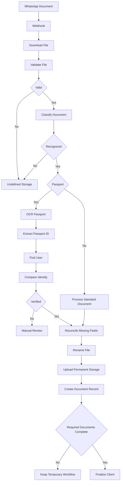

---

# 38. Sequence Diagram

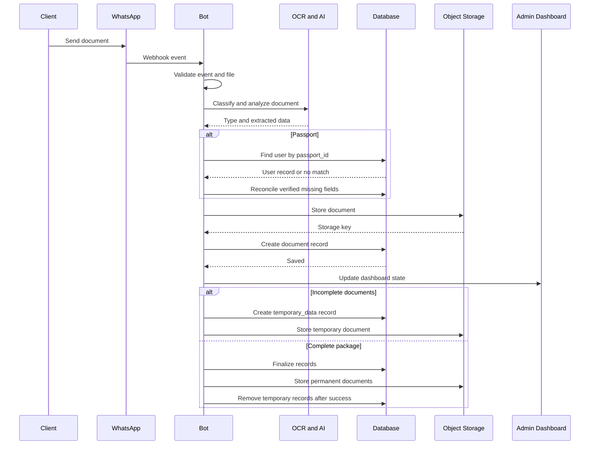

---

# 39. Scenario Workflows

## Scenario 1 — Passport Submitted

```text
WhatsApp
 -> Download
 -> Validate
 -> Passport classification
 -> OCR
 -> Extract Passport ID
 -> Find user
 -> Verify identity
 -> Reconcile fields
 -> Store passport
 -> Update dashboard
```

## Scenario 2 — Police Report Before Passport

```text
WhatsApp
 -> Police report
 -> Identify sender
 -> Temporary storage
 -> temporary_data
 -> Wait for passport
 -> Complete required set
 -> Finalize
```

## Scenario 3 — Unclear Document

```text
WhatsApp
 -> Download
 -> Classification fails
 -> Store under undefined/{mobile}/uncleared-docs/
 -> Flag for admin review
```

## Scenario 4 — All Three Documents Complete

```text
Passport + Police Report + Medical
 -> Verify
 -> Permanent storage
 -> Document records
 -> User updates
 -> Successful finalization
 -> Temporary cleanup
```

## Scenario 5 — Police Report Reaches 21 Days

```text
Submitted date
 -> +21 days
 -> Compare with current date
 -> Due Soon / Due Today / Overdue
 -> Dashboard visibility
```

---

# 40. SQL DDL

The following is a PostgreSQL-style reference schema. Exact types may be adjusted to match the existing database technology.

```sql
CREATE TABLE admins (
    admin_id VARCHAR(50) PRIMARY KEY,
    name VARCHAR(150) NOT NULL,
    email VARCHAR(255) NOT NULL UNIQUE,
    password_hash VARCHAR(255),
    role VARCHAR(50) NOT NULL,
    status VARCHAR(30) NOT NULL DEFAULT 'ACTIVE',
    created_date TIMESTAMP NOT NULL DEFAULT CURRENT_TIMESTAMP,
    updated_date TIMESTAMP NOT NULL DEFAULT CURRENT_TIMESTAMP
);

CREATE TABLE users (
    passport_id VARCHAR(50) PRIMARY KEY,
    unique_id VARCHAR(20) NOT NULL UNIQUE,
    first_name VARCHAR(150),
    other_name VARCHAR(150),
    date_of_birth DATE,
    place_of_birth VARCHAR(200),
    passport_expiry_date DATE,
    picture TEXT,
    whatsapp_number VARCHAR(30),
    contact_number VARCHAR(30),
    address TEXT,
    job VARCHAR(150),
    created_date TIMESTAMP NOT NULL DEFAULT CURRENT_TIMESTAMP,
    updated_date TIMESTAMP NOT NULL DEFAULT CURRENT_TIMESTAMP
);

CREATE INDEX idx_users_whatsapp
    ON users (whatsapp_number);

CREATE TABLE documents (
    document_id VARCHAR(50) PRIMARY KEY,
    passport_id VARCHAR(50) NOT NULL,
    document_type VARCHAR(50) NOT NULL,
    original_filename VARCHAR(500) NOT NULL,
    stored_filename VARCHAR(500) NOT NULL,
    storage_path TEXT NOT NULL,
    mime_type VARCHAR(150),
    file_size BIGINT,
    received_date TIMESTAMP NOT NULL,
    processing_status VARCHAR(50) NOT NULL,
    verification_status VARCHAR(50) NOT NULL,
    ocr_confidence DECIMAL(5,4),
    created_date TIMESTAMP NOT NULL DEFAULT CURRENT_TIMESTAMP,
    updated_date TIMESTAMP NOT NULL DEFAULT CURRENT_TIMESTAMP,
    CONSTRAINT fk_documents_user
        FOREIGN KEY (passport_id)
        REFERENCES users(passport_id)
);

CREATE INDEX idx_documents_passport_id
    ON documents (passport_id);

CREATE INDEX idx_documents_type_status
    ON documents (document_type, processing_status);

CREATE TABLE temporary_data (
    temporary_id VARCHAR(50) PRIMARY KEY,
    passport_id VARCHAR(50),
    unique_id VARCHAR(20),
    whatsapp_number VARCHAR(30),
    document_type VARCHAR(50) NOT NULL,
    temporary_storage_path TEXT NOT NULL,
    processing_status VARCHAR(50) NOT NULL,
    created_date TIMESTAMP NOT NULL DEFAULT CURRENT_TIMESTAMP,
    CONSTRAINT fk_temporary_user
        FOREIGN KEY (passport_id)
        REFERENCES users(passport_id)
);

CREATE INDEX idx_temporary_passport_id
    ON temporary_data (passport_id);

CREATE INDEX idx_temporary_whatsapp
    ON temporary_data (whatsapp_number);

```

### Schema note

The exact SQL representation of `picture` should be chosen according to storage policy. The recommended approach is to store an object-storage reference rather than the binary image inside the relational database.

---

# 41. Business Rules

1. `users.passport_id` is the Primary Key.
2. `users.unique_id` is a separate UNIQUE client/backload reference.
3. Sample Unique IDs are `0001`, `0002`, `0003`, etc.
4. Existing backload Unique IDs must be preserved where identified.
5. `ID NUMBER` must not automatically be treated as `unique_id` without client confirmation.
6. WhatsApp number is a client-identification signal, not an automatic replacement for Passport ID.
7. Identity conflicts must not be automatically merged.
8. Existing trusted fields must not be blindly overwritten.
9. Missing trusted fields may be populated from valid, sufficiently confident passport extraction.
10. Low-confidence extraction must not overwrite existing trusted data.
11. Unknown documents must not be deleted automatically.
12. Unknown documents must be stored under `undefined/{mobile_number}/uncleared-docs/`.
13. Temporary documents remain until required documents are complete and finalization succeeds.
14. Temporary cleanup occurs only after successful permanent finalization.
15. Police report reminder date is submitted date plus 21 days.
16. Duplicate webhook events must be handled idempotently.
17. Documents must be stored in a private bucket.
18. Administrators must be able to review unclear/conflicting documents.
19. Document processing state must be traceable.
20. The third required document must be configurable.
21. No new core table should be introduced unless the four-table design cannot technically satisfy a proven requirement.

---

# 42. Acceptance Criteria

## AC-01 — Passport Primary Key

**Given** a user record exists,  
**When** the user is stored in the new database,  
**Then** `passport_id` must be the Primary Key.

## AC-02 — Unique ID

**Given** a client has backload reference `0001`,  
**When** the client is migrated,  
**Then** `unique_id` must contain `0001` and be unique.

## AC-03 — Unique ID Does Not Replace Passport ID

**Given** a client has `passport_id = P1234567` and `unique_id = 0001`,  
**When** the client is stored,  
**Then** `P1234567` remains the Primary Key and `0001` remains a separate unique reference.

## AC-04 — WhatsApp Match

**Given** a WhatsApp number matches one user,  
**When** a supported document arrives,  
**Then** that user becomes a candidate identity.

## AC-05 — Passport Match

**Given** a passport is readable,  
**When** Passport ID is extracted,  
**Then** the system must search `users.passport_id`.

## AC-06 — Matching Identity

**Given** WhatsApp and Passport ID identify the same user,  
**When** verification succeeds,  
**Then** the document may proceed to permanent processing.

## AC-07 — Identity Conflict

**Given** WhatsApp identifies user A but Passport ID identifies user B,  
**When** processing completes,  
**Then** the system must not merge the records and must flag the case.

## AC-08 — Missing Database Field

**Given** a user's place of birth is empty,  
**When** the passport contains a valid high-confidence place of birth,  
**Then** the system may populate the missing field.

## AC-09 — Existing Conflicting Field

**Given** a trusted database value exists,  
**When** passport OCR produces a different value,  
**Then** the system must flag the difference rather than silently overwrite it.

## AC-10 — Low Confidence

**Given** OCR confidence is below the configured threshold,  
**When** the extracted value conflicts with existing data,  
**Then** the system must not overwrite the existing value.

## AC-11 — Undefined Document

**Given** a document cannot be confidently classified,  
**When** processing ends,  
**Then** it must be stored under `undefined/{mobile_number}/uncleared-docs/`.

## AC-12 — Temporary Document

**Given** only one required document has been received,  
**When** processing succeeds,  
**Then** the document must remain in the temporary workflow.

## AC-13 — Complete Package

**Given** all three required documents are present and verified,  
**When** finalization runs,  
**Then** permanent storage and database records must be created.

## AC-14 — Temporary Cleanup

**Given** finalization fails,  
**When** cleanup is attempted,  
**Then** temporary records/files must not be deleted.

## AC-15 — Successful Cleanup

**Given** finalization succeeds,  
**When** cleanup executes,  
**Then** temporary records/files may be deleted.

## AC-16 — Police Report Date

**Given** a valid police-report submitted date is extracted,  
**When** the workflow is processed,  
**Then** the system must calculate `submitted_date + 21 days`.

## AC-17 — Due Today

**Given** the current date equals the calculated reminder date,  
**When** the dashboard is loaded,  
**Then** the police report must appear as `Due Today`.

## AC-18 — Overdue

**Given** the current date is after the calculated reminder date,  
**When** the dashboard is loaded,  
**Then** the police report must appear as `Overdue`.

## AC-19 — Duplicate Webhook

**Given** the same WhatsApp message event is received twice,  
**When** the second event is processed,  
**Then** the system must not create duplicate processing results.

## AC-20 — Private Storage

**Given** a document is successfully stored,  
**When** an unauthenticated user requests the object directly,  
**Then** the document must not be publicly accessible.

## AC-21 — Admin Review

**Given** an identity conflict exists,  
**When** an administrator opens the dashboard,  
**Then** the case must be visible for review.

## AC-22 — Required Document Status

**Given** a client has submitted Passport and Police Report but not Medical,  
**When** the client dashboard is displayed,  
**Then** Medical must appear as missing.

## AC-23 — Unsupported File

**Given** a file type is unsupported,  
**When** it is received,  
**Then** it must not be processed as a valid client document and must follow the undefined/error workflow.

## AC-24 — Database Failure

**Given** permanent storage succeeds but database finalization fails,  
**When** finalization completes,  
**Then** temporary state must remain recoverable and the system must not report finalization as successful.

## AC-25 — Existing Data Mapping

**Given** the uploaded legacy data contains a field whose purpose is uncertain,  
**When** migration is designed,  
**Then** the field must be marked for confirmation rather than assigned an invented meaning.

---

# 43. Testing Strategy

## 43.1 Passport Tests

- Valid passport
- Blurry passport
- Cropped passport
- Damaged passport
- Passport with missing field
- Duplicate passport
- Passport belonging to another client
- Low-confidence OCR
- Missing Passport ID

## 43.2 Matching Tests

- WhatsApp match only
- Passport match only
- Both match
- WhatsApp/passport conflict
- No match
- Multiple potential matches

## 43.3 Document Tests

- Passport
- Police report
- Medical
- Wrong document
- Unknown document
- Unsupported document
- Corrupted file
- Duplicate document

## 43.4 Temporary Tests

- One document
- Two documents
- Three documents
- Expired temporary record
- Finalization success
- Finalization failure
- Storage failure
- Database failure during finalization

## 43.5 Police Report Tests

- Valid date
- Missing date
- Invalid date
- More than 7 days remaining
- 7 days remaining
- 3 days remaining
- Due today
- Overdue

## 43.6 Security Tests

- Unauthorized admin
- Invalid webhook
- Unauthorized object access
- Expired signed URL
- Private bucket validation
- SQL injection
- Broken access control
- Sensitive data exposure in logs

---

# 44. Implementation Roadmap

## Phase 1 — Existing System and Data Analysis

### Tasks
- Confirm current database technology.
- Validate Excel mappings.
- Confirm meaning of `ID NUMBER`.
- Confirm source of backload `unique_id`.
- Confirm required document set.
- Confirm existing WhatsApp integration.

### Deliverables
- Data mapping
- Confirmed identifiers
- Migration rules

### Dependencies
Existing data access and client clarification.

### Testing
Data-quality sampling.

---

## Phase 2 — Database Preparation

### Tasks
- Create/modify four core tables.
- Add indexes.
- Add constraints.
- Prepare migration scripts.

### Deliverables
- DDL
- Migration scripts
- Data validation report

### Testing
Constraint and migration testing.

---

## Phase 3 — WhatsApp Integration

### Tasks
- Webhook
- Authentication/signature validation
- Media download
- Message idempotency

### Testing
Provider sandbox and duplicate-event tests.

---

## Phase 4 — Document Ingestion

### Tasks
- File validation
- MIME checks
- Size limits
- Temporary storage

### Testing
Valid, invalid, corrupt, and unsupported files.

---

## Phase 5 — Classification and OCR

### Tasks
- Document classification
- Passport OCR
- Confidence handling
- Police-report date extraction

### Testing
Representative document samples.

---

## Phase 6 — Passport Verification

### Tasks
- Passport ID lookup
- WhatsApp lookup
- Identity conflict rules
- Field reconciliation

### Testing
All identification scenarios.

---

## Phase 7 — Permanent Storage

### Tasks
- Naming convention
- Object paths
- Private bucket
- Document records

### Testing
Storage and retrieval authorization.

---

## Phase 8 — Temporary Workflow

### Tasks
- Temporary records
- Temporary storage
- Required-document checking
- Finalization
- Cleanup

### Testing
Partial and complete submissions.

---

## Phase 9 — Police Report Countdown

### Tasks
- Date extraction
- +21-day calculation
- Dashboard statuses

### Testing
Date boundary tests.

---

## Phase 10 — Admin Dashboard

### Tasks
- Client view
- Document status
- Unclear queue
- Missing-document view
- Police-report view

### Testing
Role and functional testing.

---

## Phase 11 — Reporting and Alerts

### Tasks
- Daily reporting
- Dynamic status calculations
- Reminder visibility

### Testing
Report accuracy.

---

## Phase 12 — Security, QA and Deployment

### Tasks
- Security testing
- Performance testing
- Backup testing
- Deployment
- Monitoring
- Production verification

### Deliverables
- Production release
- Runbook
- Support documentation

---

# 45. Risks and Mitigation

| Risk | Impact | Probability | Mitigation |
|---|---|---|---|
| Poor document quality | High | Medium | OCR confidence + manual review |
| Passport mismatch | High | Medium | Identity verification |
| Duplicate document | Medium | High | Message ID + checksum |
| OCR failure | Medium | Medium | Retry + manual review |
| Storage failure | High | Low | Retry + reconciliation |
| Database failure | High | Low | Transactions + backups |
| Privacy breach | High | Low | Encryption + access control |
| Wrong legacy ID mapping | High | Medium | Confirm source identifier before migration |
| Temporary cleanup failure | Medium | Medium | Retryable finalization |
| Ambiguous client identity | High | Medium | Manual review workflow |

---

# 46. Assumptions

1. WhatsApp Business API is available.
2. The object-storage bucket can be private.
3. `passport_id` is the Users table Primary Key.
4. `unique_id` is the client's separate backload/client reference.
5. Example Unique IDs use the format `0001`, `0002`, `0003`, etc.
6. The actual legacy source column for `unique_id` requires confirmation.
7. The current required document set is Passport, Police Report and Medical unless the business confirms another third document.
8. OCR/document AI can return confidence information or an equivalent quality signal.
9. Administrators can manually review unclear and conflicting documents.
10. Existing legacy data will be validated before production migration.
11. Legacy columns outside this feature remain outside the scope of this enhancement.
12. Applicable privacy/data-protection requirements will be confirmed with the organization.

---

# 47. Out-of-Scope Clarifications

The following are not part of the proposed redesign:

- Rebuilding the entire legacy application
- Replacing every existing Excel field
- Replacing Passport ID with UUID
- Automatic merging of conflicting identities
- Public document URLs
- A separate table for every document type
- A separate table for alerts
- A separate table for reminders
- A separate table for OCR results
- A separate table for folders
- A separate audit-log table unless a future compliance requirement proves it necessary
- Full analytics/data warehouse implementation

---

# 48. Final Recommended Architecture

```text
                         CLIENT
                           |
                           v
                       WHATSAPP
                           |
                           v
                  WhatsApp Business API
                           |
                           v
                    WEBHOOK / BOT
                           |
                           v
                DOCUMENT PROCESSOR
                   /             \
                  /               \
                 v                 v
          OCR / DOCUMENT AI      DATABASE
                 |                  |
                 v                  |
        DOCUMENT CLASSIFIER         |
                 |                  |
                 +--------+---------+
                          |
                          v
                    OBJECT STORAGE
                          |
                          v
                   ADMIN DASHBOARD
                          |
                          v
                        ADMIN
```

## Database

```text
+------------------+
|      ADMINS      |
+------------------+

+------------------+
|      USERS       |
|------------------|
| passport_id PK   |
| unique_id UQ     |
| ...              |
+--------+---------+
         |
         | 1:N
         v
+------------------+
|    DOCUMENTS     |
|------------------|
| document_id PK   |
| passport_id FK   |
| ...              |
+------------------+

+------------------+
| TEMPORARY_DATA   |
|------------------|
| temporary_id PK  |
| passport_id FK   |
| ...              |
+------------------+
```

---

# 49. Final Design Decisions

| Area | Decision |
|---|---|
| Core tables | Exactly four |
| Client PK | `users.passport_id` |
| Client/backload reference | `users.unique_id` |
| Sample Unique ID | `0001`, `0002`, `0003`, ... |
| Document PK | `documents.document_id` |
| Temporary PK | `temporary_data.temporary_id` |
| Admin PK | `admins.admin_id` |
| Client matching | WhatsApp + Passport ID + Unique ID where applicable |
| Passport verification | OCR/document AI + database reconciliation |
| Unknown documents | Preserve under undefined path |
| Incomplete documents | Temporary database + temporary storage |
| Temporary cleanup | Only after successful finalization |
| Police report reminder | Submitted date + 21 days |
| Alerts | Calculated dynamically where practical |
| Storage | Private object storage |
| Legacy migration | Field-by-field mapping, not 1:1 copying |
| `ID NUMBER` | Requires client confirmation before mapping to `unique_id` |
| Third document | Configurable |
| Identity conflicts | Manual review |
| Duplicate events | Idempotent processing |

---

# 50. Final Quality Checklist

## Database

- [x] Four core tables only
- [x] Passport ID = Primary Key
- [x] Unique ID = separate UNIQUE field
- [x] Unique ID sample format = `0001`, `0002`, `0003`
- [x] Document ID = Primary Key
- [x] Temporary ID = Primary Key
- [x] Admin ID = Primary Key
- [x] Foreign keys defined
- [x] No unnecessary document-type table
- [x] No unnecessary alerts table
- [x] No unnecessary OCR table

## Document Processing

- [x] WhatsApp ingestion
- [x] Document validation
- [x] Classification
- [x] Passport OCR
- [x] Passport ID extraction
- [x] User verification
- [x] Missing-field updates
- [x] Conflict handling
- [x] Document renaming
- [x] Permanent storage
- [x] Undefined storage
- [x] Temporary storage

## Workflow

- [x] Passport workflow
- [x] Police report workflow
- [x] Third document workflow
- [x] Temporary workflow
- [x] Finalization workflow
- [x] Duplicate handling
- [x] Error handling
- [x] 21-day reminder logic

## Admin

- [x] Dashboard
- [x] Daily reports
- [x] Missing documents
- [x] Unclear documents
- [x] Identity conflicts
- [x] Police report countdown
- [x] Overdue police reports

## Diagrams

- [x] High-level architecture
- [x] Detailed architecture
- [x] ER diagram
- [x] Activity workflow
- [x] User-identification decision tree
- [x] Passport verification flow
- [x] Temporary workflow
- [x] Police-report workflow
- [x] Document state machine
- [x] Storage architecture
- [x] Sequence diagram

---

# 51. Conclusion

The proposed solution provides a controlled extension to the existing WhatsApp workflow without unnecessarily replacing the existing business system.

The design centers on four principles:

1. **Passport ID remains the authoritative database Primary Key.**
2. **Unique ID remains a separate client/backload reference**, with examples such as `0001`, `0002`, and `0003`.
3. **Documents are processed, verified and securely stored without silently attaching uncertain documents to clients.**
4. **Incomplete submissions remain temporary until the required document set is successfully finalized.**

The uploaded legacy data should be migrated selectively through a controlled mapping process. In particular, the source meaning of `ID NUMBER` must be confirmed before it is treated as the client's `unique_id`.

This architecture is intentionally simple enough to implement and maintain while providing the required OCR, WhatsApp, document-storage, identity-verification, temporary-processing, police-report monitoring, and administrator capabilities.
