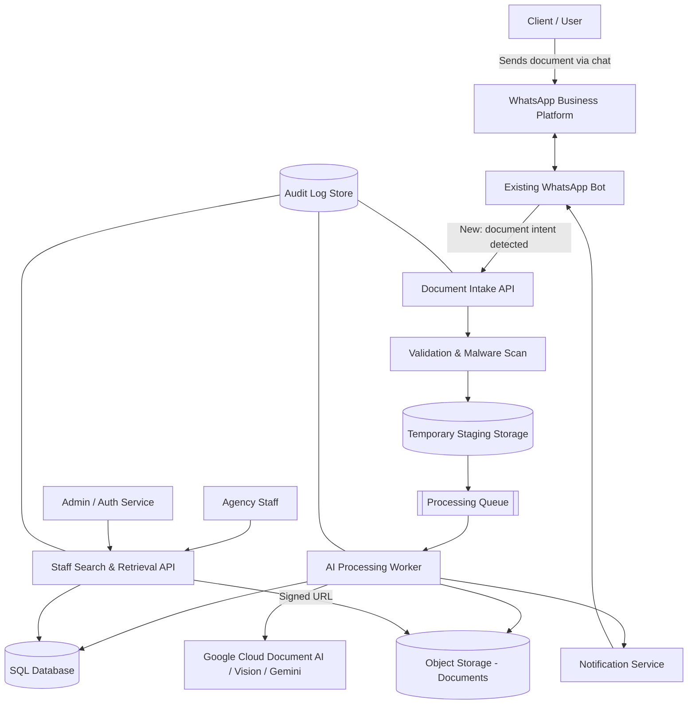
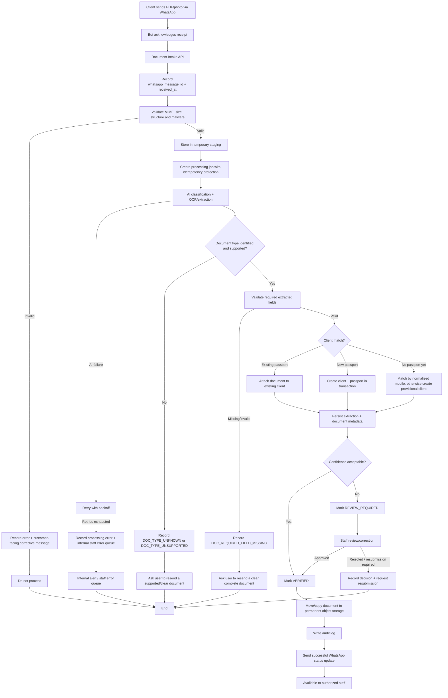
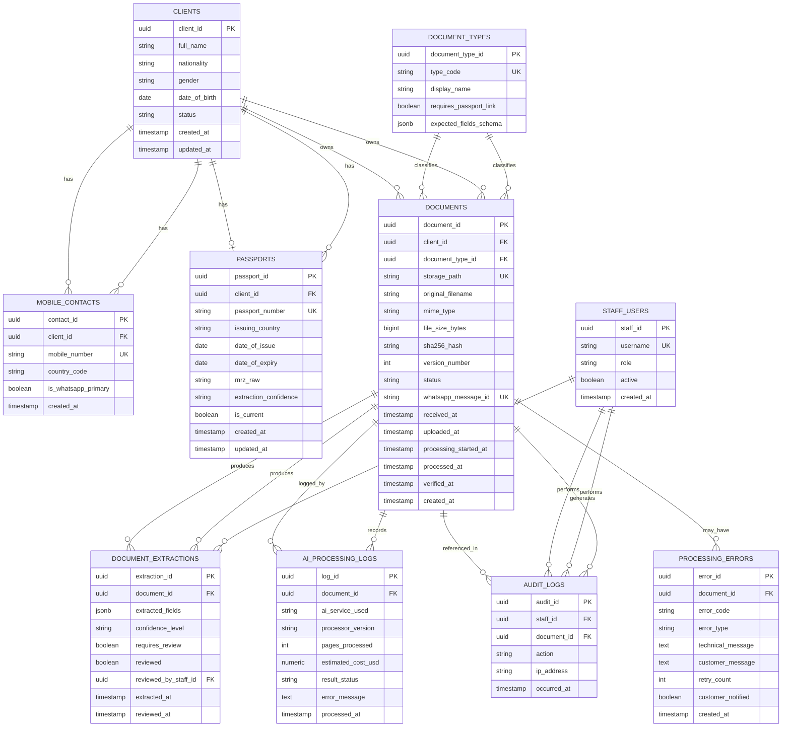
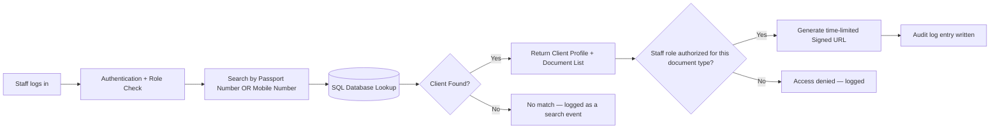
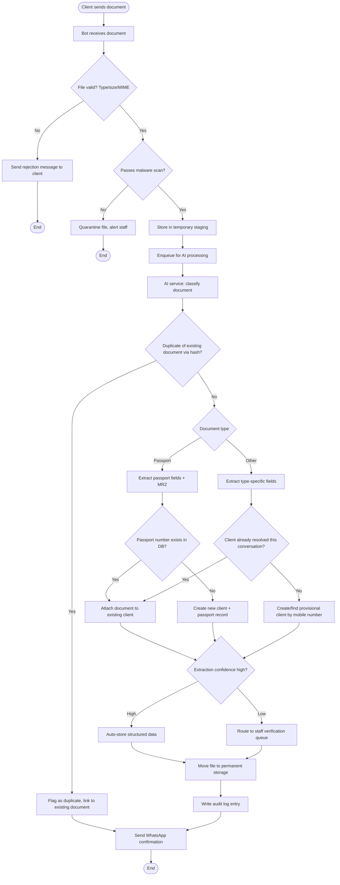
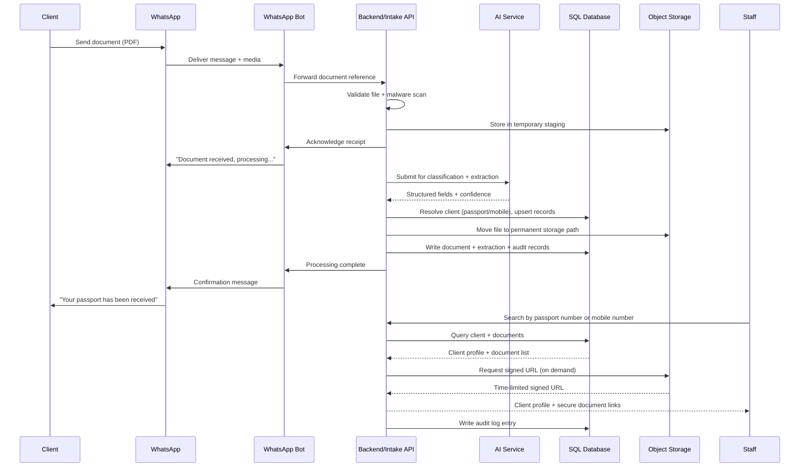
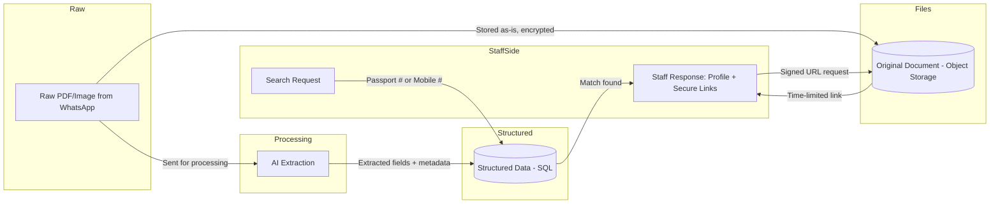
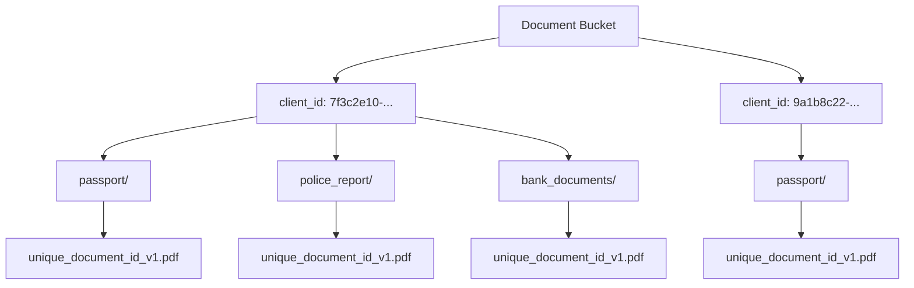
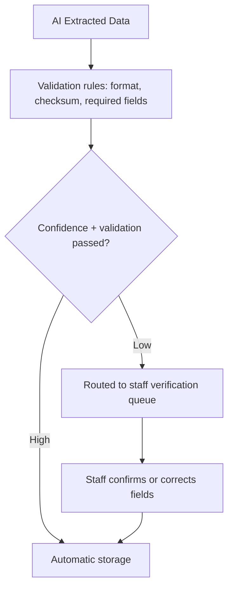

# WhatsApp Document Submission & Client Management System
## Technical Project Proposal

**Prepared for:** Agency Management, Technical Team & Project Stakeholders
**Prepared by:** Solution Architecture Team
**Document Type:** Feature Extension Proposal — Existing WhatsApp Bot
**Status:** Final Proposal — Pending Client Approval

---

## Table of Contents

1. Executive Summary
2. Project Background
3. Business Problem
4. Proposed Solution
5. Project Objectives
6. Scope
7. Out of Scope
8. Existing System
9. Proposed System Architecture
10. Detailed Workflow
11. AI Document Processing
12. Database Architecture
13. Document/Object Storage Architecture
14. Client Identification Strategy
15. Staff Search & Retrieval
16. Security & Privacy
17. AI Cost Analysis
18. Data Extraction Strategy
19. ER Diagram
20. Activity Diagram
21. Sequence Diagram
22. Data Flow Diagram
23. Storage Structure Diagram
24. API Architecture
25. Error Handling
26. AI Accuracy & Human Verification
27. Scalability
28. Monitoring
29. Implementation Plan
30. Testing Strategy
31. Risks & Mitigation
32. Assumptions
33. Open Questions
34. Cost Considerations
35. Future Enhancements
36. Conclusion
37. Recommended Next Steps
38. Decision Log

---

## 1. Executive Summary

The agency already operates a WhatsApp-based user bot that clients use to communicate. This proposal defines a new **Document Submission & Client Records feature** that extends the existing bot so clients can send required documents (passport, police report, birth certificate, educational and employment records, bank documents, photographs, visa documents, and others) directly through WhatsApp.

The system will automatically identify each client, classify the incoming document, extract structured data using a Google Cloud AI/OCR service, store extracted data in a relational database, store the original file in encrypted object storage, and let authorized staff retrieve a client's full document history by mobile number or passport number.

The proposal recommends an **internal UUID as the database primary key** (not the passport number), **asynchronous, queue-based AI processing** rather than synchronous processing, and a **document storage path keyed by internal client ID rather than passport number**. Reasons for each recommendation are detailed in Sections 12–14 and 29.

The proposal also includes a cost model built from **official Google Cloud pricing** (Section 17) so the agency can judge, before committing, whether "extract everything useful" or "extract only what's needed today" is the more economical strategy at its expected volume.

This is a **planning document**. Several inputs — exact document volume, exact fields required per document type, data retention rules, and staff permission levels — are not yet confirmed by the agency and are listed as **Open Questions** (Section 33) and a **Decision Log** (Section 38). Nothing below should be treated as final until those are answered.

---

## 2. Project Background

The agency uses WhatsApp as its primary client communication channel through an existing bot. Today, document collection for agency services (visa processing, employment placement, and similar case types) appears to happen outside that channel — by email, in person, or through other manual means — which the agency wants to consolidate into WhatsApp, the channel clients already use daily.

## 3. Business Problem

Manual or fragmented document collection creates avoidable overhead and risk:

- Staff spend time manually matching submitted documents to the right client file.
- Documents arriving through multiple channels are hard to keep organized and auditable.
- There is no single, searchable source of truth linking a client's identity (passport, mobile number) to every document they've submitted.
- Key data trapped inside PDF/image documents (passport number, dates, names) must be manually retyped for use in downstream agency processes.
- As volume grows, this manual approach does not scale and increases the chance of misfiled or lost documents.

## 4. Proposed Solution

Extend the existing WhatsApp bot with a **Document Intake Pipeline**:

1. Clients send documents as PDFs (and, where unavoidable, photos) directly in the existing WhatsApp conversation.
2. The bot validates and stores the file, then queues it for AI-based processing.
3. A backend service classifies the document type, extracts structured fields using a Google Cloud document-processing API, and identifies the submitting client — primarily via passport number when available, falling back to the WhatsApp mobile number otherwise.
4. Structured data is written to a SQL database; the original file is stored in versioned, access-controlled object storage.
5. The client receives a WhatsApp confirmation once processing completes.
6. Authorized staff search and retrieve a client's full record — profile, passport data, and every submitted document — by mobile number or passport number through a secure staff interface.

## 5. Project Objectives

- Let clients submit any of 10+ document types via WhatsApp without learning a new tool.
- Automatically classify, extract, and structure key data from each document.
- Maintain one canonical client record per real-world person, avoiding duplicates.
- Give staff fast, auditable retrieval by mobile number or passport number.
- Keep sensitive personal documents encrypted, access-controlled, and auditable end to end.
- Build the data model and pipeline so new document types can be added by configuration, not by re-architecting the system.
- Give the agency a clear, evidence-based view of AI processing cost before committing to a depth of extraction.

## 6. Scope

- New backend service(s) that integrate with the existing WhatsApp bot's message/media webhook.
- Document validation, temporary storage, and virus/malware scanning.
- Integration with a Google Cloud AI/document-processing service for OCR, classification, and structured extraction.
- Relational database schema for clients, passports, mobile contacts, documents, and processing metadata.
- Object storage integration with a defined naming/versioning convention.
- Client identification and de-duplication logic.
- A staff-facing search/retrieval capability (API-first; UI is a candidate to scope separately — see Open Questions).
- Security controls: encryption, RBAC, audit logging, signed URLs.
- Monitoring and cost-tracking for AI usage.

## 7. Out of Scope

The following are explicitly **not** part of this feature unless the agency confirms otherwise (see Open Questions):

- Rebuilding or replacing the existing WhatsApp bot's core conversational logic.
- A full staff-facing web application UI beyond the staff search/retrieval API and review workflow defined here; a production UI can be separately scoped if required.
- Legal/compliance certification (e.g., GDPR, PDPA, or country-specific data protection registration) — the agency must confirm which jurisdictions apply.
- Automated document authenticity/fraud verification (detecting forged passports) — flagged as a possible future enhancement, not included here.
- Payment processing or billing features.
- Migrating any historical documents already held outside this system, unless separately scoped.

## 8. Existing System

**Assumption (to be confirmed):** the existing WhatsApp bot already has a working WhatsApp Business API (or BSP) integration, can receive inbound media messages, and exposes some form of webhook or message-handling layer that this feature can hook into. The agency will provide the existing bot's architecture and API/document specifications separately (per the brief), and this proposal will be refined once those are reviewed. Where this proposal assumes a capability of the existing bot (e.g., "the bot can receive PDF attachments"), that assumption is listed in Section 32.

The new feature is designed as an **extension**, not a replacement: a new "document intake" capability is added to the bot's message-handling flow, and a new backend service family is introduced behind it. The existing bot's conversational flows for other purposes remain unchanged.

## 9. Proposed System Architecture



**Key components**

| Component | Responsibility |
|---|---|
| Existing WhatsApp Bot | Existing conversational logic; forwards document-submission intents/media to the new Document Intake API |
| Document Intake API | Receives file references, validates them, writes to temporary staging, enqueues a processing job |
| Processing Queue | Decouples intake from AI processing (recommended: asynchronous — see Section 10) |
| AI Processing Worker | Calls the Google Cloud AI service, classifies the document, extracts fields, resolves the client identity, writes results |
| SQL Database | System of record for clients, passports, mobile numbers, documents metadata, extraction results, audit trail |
| Object Storage | System of record for original files, encrypted at rest, access-controlled via signed URLs |
| Staff Search & Retrieval API | Authenticated endpoint set for staff to look up clients and documents |
| Notification Service | Sends the WhatsApp confirmation/result back to the client through the existing bot |
| Audit Log Store | Immutable record of who accessed what, and when |

## 10. Detailed Workflow

The brief's original workflow was largely synchronous. Because AI document processing can take anywhere from under a second (simple OCR) to several seconds (complex extraction, retries, large multi-page PDFs), and because WhatsApp conversations should stay responsive, **asynchronous, queue-based processing is recommended**:



**Submission timestamp and traceability:** `received_at` is the authoritative timestamp for when the WhatsApp bot received the user's document. `uploaded_at` records when the backend successfully stored the file. `processing_started_at`, `processed_at`, and `verified_at` provide the processing lifecycle. `whatsapp_message_id` is stored for tracing and webhook idempotency.

**Why asynchronous/queue-based:**
- WhatsApp expects a fast acknowledgment; AI calls should never block the chat response.
- A queue naturally absorbs bursts (e.g., many clients submitting documents around a deadline) without overloading the AI service or hitting its rate limits.
- Failed AI calls can be retried from the queue without the client re-sending the document.
- It creates a natural point to add virus scanning, deduplication checks, and confidence-based routing to human review without changing the client-facing flow.

## 11. AI Document Processing

The brief proposed "Google Lens." Google Lens is a **consumer-facing product** (mobile app / visual search), not a production API suited to backend document pipelines, and it is not the right fit here. The relevant Google Cloud services are:

| Service | What it does | Best fit here |
|---|---|---|
| **Cloud Vision API** (`DOCUMENT_TEXT_DETECTION`) | Returns raw OCR text, layout blocks, and confidence scores; does not understand document semantics | Good low-cost fallback for plain OCR, or as a pre-check on scanned images |
| **Document AI — Enterprise Document OCR Processor** | Purpose-built document OCR (better than Vision for multi-page PDFs and forms) | General-purpose OCR layer for most document types |
| **Document AI — Prebuilt processors** (e.g., ID/passport-oriented processors) | Pretrained models that return structured key-value fields for common document types | Best fit for passports/IDs where a matching prebuilt processor exists |
| **Document AI — Custom Extractor / Form Parser** | Trainable processor returning custom structured fields (tables, key-value pairs) you define | Best fit for agency-specific documents (police reports, employment letters) that have no prebuilt Google processor |
| **Gemini API (multimodal)** | General-purpose LLM that can read an image/PDF and return extracted fields as JSON per a prompt/schema | Good fit for document types that are too varied/unstructured for a trainable extractor, or as the initial approach before investing in a custom-trained processor |

**Recommended approach (subject to confirmation — see Decision Log):**

1. **OCR/classification pass:** Document AI's Enterprise OCR Processor (or Cloud Vision as a lower-cost alternative) to get raw text and confirm the file is a real, legible document.
2. **Passport/MRZ extraction:** a Document AI processor suited to identity documents, since MRZ (Machine-Readable Zone) parsing benefits from a purpose-built model and checksum validation rather than free-form LLM extraction.
3. **Other document types (police report, education/employment/bank documents):** either a Document AI Custom Extractor trained per document type, or Gemini with a strict JSON schema prompt — the right choice depends on document volume and consistency of layout, and should be piloted with real (or representative) sample documents before final selection.

This is flagged as an **architectural decision requiring a short technical spike** with real sample documents from the agency before being finalized (see Decision Log, Section 38).

## 12. Database Architecture

### 12.1 Primary key: internal UUID vs. Passport Number

| Option | Advantages | Disadvantages |
|---|---|---|
| **Passport Number as primary key** | Conceptually simple; matches the business's mental model | Passport numbers are reissued/changed on renewal, sometimes reused by issuing authorities across different documents, may be entered inconsistently (case, spacing, OCR errors); using it as a PK means every foreign-key relationship must be corrected if the value is later found wrong; a client without a passport yet (e.g., only a police report submitted so far) can't get a record at all |
| **Internal UUID as primary key, Passport Number as a UNIQUE indexed column** (recommended) | Client record can be created before a passport is ever seen; passport corrections/renewals become a simple update, not a cascading key change; foreign keys stay stable even if identity data changes; standard practice for systems handling mutable natural identifiers | Slightly more application logic needed to resolve "which client does this passport/mobile number belong to" |

**Recommendation:** use an internal UUID (`client_id`) as the primary key across the schema, with `passport_number` stored as a `UNIQUE, NULLABLE` column on a related `passports` table (nullable because a client may exist before any passport is captured).

### 12.2 Mobile number: unique column vs. separate table

A single client may use more than one number (a personal number vs. the number they message the bot from), and numbers change over time. A separate `mobile_contacts` table (one client → many numbers, one flagged as primary/WhatsApp-linked) is recommended over a single unique column, so a number change or a second number doesn't require altering the client record itself.

### 12.3 Core tables (proposed)



### 12.4 Handling passport check-and-create

When a passport is scanned: normalize the extracted number (trim, uppercase, strip spaces), look it up in `passports.passport_number`. If found, attach the new document to the existing `client_id`. If not found, create a new `clients` row and a linked `passports` row. This lookup-then-create logic must run inside a database transaction with a unique constraint on `passport_number` as the final safety net against race conditions (e.g., two documents for the same new client arriving at nearly the same time).

### 12.5 Passport renewal and history

A client may have multiple passports over time. The `PASSPORTS` table therefore stores passport history rather than overwriting an old passport record. Only one passport should normally have `is_current = true` for a client at a time. When a new passport is verified, the previous current passport is retained for historical linkage and marked `is_current = false`; the new passport becomes current. The passport number remains unique as a business identifier, while `passport_id` remains the database key.

## 13. Document/Object Storage Architecture

### 13.1 Storage keyed by internal Client ID, not Passport Number

The brief's example structure used the passport number as the top-level folder name. This is **not recommended**:

- A passport number is personally identifiable and, if it ever leaked via a storage path, URL, or log line, would directly expose a real government ID number — the internal UUID is opaque and safe to appear in logs, URLs, and paths.
- A client may have documents before a passport is captured (e.g., a police report submitted first); an internal ID always exists, a passport number might not yet.
- If a passport number is corrected after an OCR error, a passport-number-keyed folder would need to be renamed everywhere; a UUID-keyed folder never needs to change.

### 13.2 Recommended naming convention

```text
{client_id}/{document_type}/{unique_document_id}_{version}.pdf
```

Example:
```text
7f3c2e10-4b2a-4e9e-9a3d-1a2b3c4d5e6f/passport/a1b2c3d4-e5f6-4789-a0b1-c2d3e4f5a6b7_v1.pdf
7f3c2e10-4b2a-4e9e-9a3d-1a2b3c4d5e6f/police_report/b2c3d4e5-f6a7-4890-b1c2-d3e4f5a6b7c8_v1.pdf
```

Rationale: never trust the original filename (clients may send `IMG_0234.pdf` or a filename in another script); the `unique_document_id` is generated server-side and is what the database references, so the file itself carries no ambiguity even if copied outside the system.

### 13.3 Additional storage considerations

| Concern | Approach |
|---|---|
| Versioning / re-uploads | New upload of an existing document type creates a new version row (`version_number` increments); prior versions are retained, not overwritten, unless a retention policy says otherwise |
| Duplicate detection | Compute a SHA-256 hash on upload; if it matches an existing document for the same client, flag as duplicate rather than storing a redundant copy |
| Metadata | MIME type, file size, upload timestamp, and hash are stored in the `documents` table, not only in the file itself |
| Encryption | Server-side encryption at rest (bucket-level, e.g., Google Cloud Storage default CMEK/Google-managed encryption); TLS in transit |
| Access control | No file is ever served by a public/direct URL; staff and the client-facing bot receive time-limited **signed URLs** generated on demand |
| Retention & deletion | Retention period must be defined by the agency based on its record-keeping and legal obligations (see Open Questions); deletion should be a soft-delete first (marks record inactive, revokes access) with a scheduled hard-delete job |
| Backup | Object storage should use the cloud provider's cross-region replication or scheduled bucket-to-bucket backup; the SQL database needs point-in-time backup separately |
| Audit logs | Every read (signed URL issuance) and write is logged with staff/service identity, timestamp, and document ID |

## 14. Client Identification Strategy

### 14.1 Passport ID as primary identifier, mobile number as secondary

Passport number is the strongest identifier when available (globally unique per issuing country + number, versus a mobile number which can be shared, changed, or reassigned by a telecom). The recommended precedence:

1. If a passport has been captured, `passport_number` is the authoritative link to a `client_id`.
2. Until then, the WhatsApp mobile number is used as a **provisional** identifier, with the resulting record flagged `passport_pending`. When a passport later arrives from that same number, the provisional record is upgraded/merged rather than a second record being created.

### 14.2 Mobile number edge cases

| Case | Handling |
|---|---|
| International formats / country codes | Normalize to E.164 format (`+<country code><number>`) at intake; never store local-format-only numbers |
| Duplicate mobile numbers across clients | Extremely unlikely for a genuine same number, but if it occurs (e.g., recycled SIM), the system should flag it for staff review rather than silently merging two different people |
| Client changes phone number | Old number is kept in `mobile_contacts` (marked inactive) rather than deleted, preserving history; new number is added and flagged as WhatsApp-primary |
| Multiple numbers per client | Supported directly by the `mobile_contacts` table design |
| WhatsApp number vs. personal contact number | The WhatsApp-originating number is always captured as `is_whatsapp_primary = true`; a different personal/office number can be added later by staff if the agency's process requires it |

## 15. Staff Search & Retrieval



Authorization requirements: staff accounts are role-based (e.g., `intake_clerk`, `case_officer`, `admin`), and each role is scoped to which document types and actions (view metadata vs. view/download original file) it can perform. Every search and every document access is written to the audit log with staff identity, timestamp, and the client/document accessed — not just failures.

## 16. Security & Privacy

| Area | Approach |
|---|---|
| Encryption in transit | TLS 1.2+ for all API traffic, including WhatsApp webhook calls, AI service calls, and staff API calls |
| Encryption at rest | Database encryption at rest (managed by the cloud SQL provider); object storage server-side encryption |
| Access control / RBAC | Role-based permissions for staff; principle of least privilege; service-to-service calls (worker → DB, worker → storage) use scoped service accounts, not shared credentials |
| Staff authentication | Standard username/password with MFA recommended, or SSO if the agency has an existing identity provider |
| API authentication | Signed service-to-service tokens (e.g., OAuth2 client credentials) between internal services; the WhatsApp webhook itself authenticated per the WhatsApp/BSP provider's signature verification |
| Secure document access | No permanent public links; all downloads via short-lived signed URLs |
| Audit logging | Immutable, append-only log of all document access, searches, and administrative actions |
| Secrets management | API keys and service credentials stored in a managed secrets vault (e.g., Google Secret Manager), never in code or config files |
| Rate limiting | Applied at the API gateway to prevent abuse of both the intake endpoint and the AI processing pipeline |
| Malware/file scanning | All uploaded files scanned before being handed to the AI service or moved to permanent storage |
| PDF validation | Structural validation (well-formed PDF, page count limits) before processing |
| File size limits | Enforced at intake, with a clear client-facing WhatsApp error message if exceeded |
| Duplicate detection | SHA-256 hash comparison at intake, as described in Section 13 |

**Sending personal documents to a third-party AI service:** Passport and other identity documents will be transmitted to Google Cloud's AI/document-processing APIs for extraction. This is a material privacy consideration the agency should evaluate directly with Google Cloud's data processing terms (Google does not use Cloud AI API customer content to train its general models by default, but the agency should verify the current terms for the specific service selected) and against **the specific data-protection laws of the countries in which the agency and its clients operate** — this proposal does not make a legal determination and the agency should seek confirmation from qualified legal counsel or its compliance function before processing personal identity documents at scale.

## 17. AI Cost Analysis

### 17.1 Pricing used (official sources, as published)

| Service | Price | Source |
|---|---|---|
| Google Cloud Vision API, `DOCUMENT_TEXT_DETECTION` | First 1,000 units/month free, then $1.50 per 1,000 units | Google Cloud Vision pricing |
| Document AI — Enterprise Document OCR Processor | First 1,000 pages/month free, then $1.50 per 1,000 pages (0–5M/month), $0.60 per 1,000 pages above 5M/month | cloud.google.com/document-ai/pricing |
| Document AI — Custom Extractor / Form Parser | $30 per 1,000 pages (up to 1M/month), $20 per 1,000 pages above 1M/month | cloud.google.com/document-ai/pricing |
| Gemini 2.5 Flash-Lite (API) | $0.10 per 1M input tokens, $0.40 per 1M output tokens | ai.google.dev/gemini-api/docs/pricing (as reported August 2026) |
| Gemini 2.5 Flash (API) | $0.30 per 1M input tokens, $2.50 per 1M output tokens | ai.google.dev/gemini-api/docs/pricing (as reported August 2026) |
| Gemini 2.5 Pro (API) | $1.25 per 1M input tokens, $10.00 per 1M output tokens | ai.google.dev/gemini-api/docs/pricing (as reported September 2026) |

> These are the vendor's published list prices at the time of writing and are subject to change; the agency should re-confirm current rates on the official pricing pages before budgeting, and these numbers exclude any GCP infrastructure, storage, networking, or engineering costs.

### 17.2 Scenario assumptions (stated explicitly, not implied as fact)

- Average of **3 documents submitted per client** during onboarding (passport + 2 supporting documents), each averaging **2 pages**.
- Enterprise OCR Processor used for classification/OCR of every page; a Custom Extractor (or equivalent Gemini call) used only for pages that need structured field extraction (assume all pages, worst case, for Option B; assume only the passport page, best case, for Option A).
- These are illustrative planning numbers, not a guarantee of actual usage — the agency's real document mix and page counts should replace these once known (see Open Questions).

### 17.3 Option A — Minimal extraction (passport fields only; other documents OCR'd but not deeply structured)

Per client: 3 documents × 2 pages = 6 OCR pages, plus 2 structured-extraction pages (passport only, assuming 2-page passport data spread incl. MRZ).

| Clients/month | OCR pages (Enterprise OCR) | Structured pages (Custom Extractor) | OCR cost | Extraction cost | Total/month |
|---|---|---|---|---|---|
| 100 | 600 | 200 | $0.90* | $6.00 | ~$6.90 |
| 500 | 3,000 | 1,000 | $3.00 | $30.00 | ~$33.00 |
| 1,000 | 6,000 | 2,000 | $7.50 | $60.00 | ~$67.50 |
| 5,000 | 30,000 | 10,000 | $43.50 | $300.00 | ~$343.50 |

\* First 1,000 OCR pages/month are free; figures above net that out at low volume and are illustrative.

### 17.4 Option B — Detailed extraction (structured fields from every submitted document, not just the passport)

Per client: 3 documents × 2 pages = 6 pages, **all** routed through structured extraction.

| Clients/month | Structured pages (Custom Extractor, $30/1,000) | Total/month |
|---|---|---|
| 100 | 600 | $18.00 |
| 500 | 3,000 | $90.00 |
| 1,000 | 6,000 | $180.00 |
| 5,000 | 30,000 | $900.00 |

### 17.5 Comparison and recommendation

| Factor | Option A (minimal) | Option B (detailed) |
|---|---|---|
| AI/API cost | Lower | Higher, but still modest at these volumes (well under $1/client even at 5,000 clients/month) |
| Processing time | Slightly faster | Slightly slower per document, negligible with async processing |
| Database storage | Smaller | Larger, but structured text is cheap to store relative to the AI cost of producing it |
| Future business value | Lower — re-processing needed later if more data is ever required | Higher — fields are available immediately for future case work without re-scanning archived documents |
| Accuracy | N/A (not extracting from those documents at all) | Depends on document quality; requires the human-verification workflow in Section 26 regardless |
| Privacy | Marginally less data sent/retained | More personal data extracted and stored — increases the importance of the access controls in Section 16 |
| Complexity | Simpler to build initially | Slightly more processor/prompt configuration up front, but same pipeline shape |
| Reprocessing | Likely needed later if requirements grow | Avoided, since data was captured the first time |

**Observation:** at the volumes modeled, the incremental AI cost of Option B over Option A is on the order of tens to a few hundred dollars per month even at 5,000 clients/month — small relative to the value of not having to re-collect or re-scan documents later if the agency's case work needs more fields down the line. However, this trades off against **more personal data being extracted and retained**, which raises the privacy stakes discussed in Section 16. **This is a business decision, not a purely technical one**, and is listed in the Decision Log for the agency to confirm, ideally after a short pilot with real document samples to validate actual page counts and extraction quality per document type.

## 18. Data Extraction Strategy

Recommended default field sets per document type (to be confirmed/extended per Open Questions):

**Passport:** passport number, full name, date of birth, nationality, gender, date of issue, date of expiry, MRZ string (for checksum validation).

**Police report:** full name, date of report, reference number, address, issuing police station, report type/category.

**Other document types** (birth certificate, educational certificates, employment documents, bank documents, visa documents, photographs): field sets should be defined with agency input per type, since these vary far more by jurisdiction and issuing authority than passports do — each is modeled as configurable via the `document_types.expected_fields_schema` column (Section 12.3) so adding a document type is a configuration change, not a schema migration.

## 19. ER Diagram

See Section 12.3 for the full entity-relationship diagram.

## 20. Activity Diagram



## 21. Sequence Diagram



## 22. Data Flow Diagram



Raw documents flow only into processing and permanent storage — never directly to staff. Structured data and metadata flow into the database and are what staff search against. Staff responses combine database records with on-demand, time-limited links to the original files; nothing is ever exposed as a static/public link.

## 23. Document Storage Structure Diagram



## 24. API Architecture

Proposed endpoints (subject to refinement once the existing bot's API is reviewed):

| Method & Path | Purpose |
|---|---|
| `POST /v1/documents/intake` | Internal — bot forwards a received document reference for validation + queuing |
| `POST /v1/documents/{documentId}/process` | Internal — triggers/retries AI processing for a staged document |
| `GET /v1/documents/{documentId}` | Retrieve document metadata (staff-authenticated) |
| `GET /v1/documents/{documentId}/download-url` | Generate a short-lived signed URL (staff-authenticated, audited) |
| `GET /v1/clients/by-passport/{passportNumber}` | Staff search by passport number |
| `GET /v1/clients/by-mobile/{mobileNumber}` | Staff search by mobile number |
| `GET /v1/clients/{clientId}` | Full client profile |
| `GET /v1/clients/{clientId}/documents` | All documents for a client |
| `GET /v1/documents/{documentId}/status` | Processing status (queued/processing/complete/needs-review/failed) |
| `POST /v1/auth/login` | Staff authentication |
| `GET /v1/audit-logs` | Admin-only audit trail query |

These are a proposed starting point, not a final contract, and should be reconciled with the existing bot's API conventions once shared.

### Intake idempotency

`POST /v1/documents/intake` must accept and persist the originating WhatsApp message ID. The `whatsapp_message_id` value is unique and is checked before creating a new document/job. A webhook retry for the same WhatsApp message must return the existing intake result rather than creating a duplicate document or processing job.

## 25. Error Handling

**Customer error-message rule:** Automated error messages do not include a WhatsApp support phone number.

| Failure | Handling |
|---|---|
| Invalid/corrupted/unsupported PDF | Reject at intake with a clear WhatsApp message; do not enqueue |
| File too large | Reject at intake with size-limit guidance |
| AI API failure/timeout | Automatic retry with backoff (e.g., 3 attempts); after final failure, route to a staff error queue |
| OCR/extraction failure or low confidence | Route to human verification (Section 26) rather than failing silently |
| Missing/duplicate passport number | Duplicate: attach to existing client. Missing: create provisional client, flag for follow-up |
| Unknown document type | Store the file, flag as "unclassified," route to staff for manual type assignment |
| Database or object storage failure | Job remains in queue and is retried; client is not told "success" until both writes are confirmed |
| WhatsApp API/network failure | Standard delivery retry behavior of the messaging platform; backend processing continues independently of confirmation delivery |
| Rate limiting / AI service unavailable | Queue absorbs the backlog; jobs process once capacity/availability returns, with monitoring alerting staff if backlog grows abnormally |

### 25.1 Error record and customer notification rules

Every operational failure is recorded in `PROCESSING_ERRORS` with a stable `error_code`, technical details, retry count, and notification state. Technical error details are never exposed to the customer.

**Automated user error messages must not include a WhatsApp support phone number.** For document problems, the bot gives clear corrective instructions and asks the user to resend the document when appropriate. Operational/system failures are routed to the internal staff error queue and monitoring/alerts; the customer receives only a safe, generic status message where needed.

Recommended error codes:
- `DOC_MISSING`
- `DOC_INVALID`
- `DOC_CORRUPTED`
- `DOC_UNREADABLE`
- `DOC_TYPE_UNKNOWN`
- `DOC_TYPE_UNSUPPORTED`
- `DOC_REQUIRED_FIELD_MISSING`
- `AI_PROCESSING_FAILED`
- `CLIENT_MATCH_FAILED`
- `SYSTEM_ERROR`

Customer-facing messages should be concise and actionable:
- Wrong/unsupported document: explain the required document type and ask the user to send a supported document.
- Unreadable/missing information: ask the user to send a clearer, complete copy.
- Processing failure: confirm that the document could not be processed and ask the user to try again later or resend it; do not expose internal error details.

## 26. AI Accuracy & Human Verification



Fields that should always be validated before being treated as authoritative: **passport number** (MRZ checksum validation, format pattern), **date of birth**, **passport expiry date**, and **full name** (cross-checked for basic plausibility, e.g., non-empty, expected character set). A combination of OCR confidence scores from the AI service, regex/format validation, and MRZ checksum validation should determine whether a document auto-stores or is routed to a staff reviewer; this threshold should be tuned during a pilot rather than fixed in advance.

## 27. Scalability

| Volume | Considerations |
|---|---|
| 100 clients | Single small worker instance, standard managed SQL tier sufficient |
| 1,000 clients | Add database indexes on `passport_number`, `mobile_number`, `client_id`; queue-based processing already isolates load spikes |
| 10,000 clients | Consider read replicas for staff search queries; monitor AI API quota/rate limits and request increases proactively |
| 100,000+ clients | Horizontal scaling of worker pool; object storage scales natively; database partitioning/sharding strategy should be evaluated at this scale; caching layer for frequent staff searches |

Additional considerations throughout: connection pooling on the database, autoscaling worker instances against queue depth, and search-optimized indexing on the two lookup keys staff will use most (passport number, mobile number).

## 28. Observability & Monitoring

Recommended metrics and logs: application logs (intake, processing, staff API), AI processing logs with per-call cost estimate (already modeled in `ai_processing_logs`, Section 12.3), API latency and error rate, queue depth over time, document processing success/failure rate, count of documents routed to human review, database and storage utilization/health, and a running **AI cost dashboard** derived from the `estimated_cost_usd` field logged per call — directly supporting the cost governance discussed in Section 17.

## 29. Implementation Plan

| Phase | Activities | Deliverables | Dependencies | Outcome |
|---|---|---|---|---|
| 1. Requirements & Architecture | Confirm open questions, review existing bot's API/spec, finalize document type list and fields | Approved architecture document | Agency input on Open Questions | Shared understanding before build starts |
| 2. Database Implementation | Build schema, migrations, indexing | Deployed SQL schema | Phase 1 | Data layer ready |
| 3. Object Storage | Configure buckets, naming convention, encryption, signed URL issuance | Storage service integrated | Phase 1 | Files can be stored/retrieved securely |
| 4. AI Document Processing | Pilot Document AI/Gemini options, select processors per document type, build extraction pipeline | Working extraction pipeline with confidence thresholds | Phases 2–3, sample documents from agency | Documents can be classified and extracted |
| 5. WhatsApp Bot Integration | Hook intake flow into existing bot, build client-facing confirmation messages | Integrated document intake in the live bot | Existing bot spec, Phase 4 | Clients can submit documents end to end |
| 6. Staff Search Functionality | Build search/retrieval API (and UI if scoped), RBAC | Working staff search | Phases 2–3 | Staff can retrieve client records |
| 7. Security & Audit Logging | Implement RBAC, signed URLs, audit trail, secrets management | Security review sign-off | Phases 2–6 | System meets baseline security bar |
| 8. Testing | Execute test plan (Section 30) | Test report | All prior phases | Confidence in correctness and resilience |
| 9. Deployment | Production rollout, cutover plan, rollback plan | Live production system | Phase 8 sign-off | Feature live for real clients |
| 10. Monitoring & Maintenance | Dashboards, alerting, cost tracking live | Operating runbook | Phase 9 | Ongoing visibility and support |

## 30. Testing Strategy

- **Unit testing:** validation logic, client-matching logic, field normalization.
- **Integration testing:** end-to-end intake → AI → DB → storage flow with test documents.
- **API testing:** staff search/retrieval endpoints, auth, and error responses.
- **AI extraction testing:** accuracy against a labeled sample set per document type; confidence-threshold tuning.
- **WhatsApp testing:** message/media delivery, confirmation messages, failure messaging.
- **Database testing:** duplicate-prevention logic, transactional integrity under concurrent submissions.
- **Security testing:** access control enforcement, signed URL expiry, audit log completeness.
- **Performance testing:** queue behavior under burst load, AI API rate-limit handling.
- **User acceptance testing:** agency staff validate search/retrieval against real (or realistic) scenarios.
- **Failure/recovery testing:** simulate AI outage, storage outage, and database outage and confirm graceful degradation and recovery.

## 31. Risks & Mitigation

| Risk | Impact | Probability | Mitigation |
|---|---|---|---|
| AI extraction inaccuracies | Incorrect client data, misfiled documents | Medium | Confidence-based human verification (Section 26), validation rules |
| AI API cost increases with volume | Budget overrun | Low–Medium | Cost monitoring dashboard, alerts on unexpected volume spikes, periodic pricing review |
| Third-party AI service downtime | Processing delays | Low | Queue-based design absorbs outages; retries; fallback to a secondary OCR path if warranted |
| Privacy/data exposure | Regulatory and reputational risk | Medium | Encryption, RBAC, signed URLs, audit logging, legal review of jurisdictional requirements |
| Duplicate client records | Fragmented client history | Medium | Passport-number uniqueness constraint, provisional-record merge logic |
| Incorrect passport extraction | Wrong client match | Medium | MRZ checksum validation, confidence thresholds, staff review queue |
| Storage failures | Data loss | Low | Backups, cross-region replication, versioning |
| WhatsApp API limitations | Delivery/media constraints | Low–Medium | Confirm limits with existing bot's provider during Phase 1 |
| Large document volumes / bursts | Processing backlog | Medium | Queue-based, autoscaling workers |
| Vendor lock-in (Google Cloud AI) | Harder to switch providers later | Medium | Keep extraction logic behind an internal abstraction layer so the underlying AI provider can be swapped |
| Staff unauthorized access | Data breach | Low–Medium | RBAC, MFA, audit logging, least-privilege service accounts |

## 32. Assumptions

- The existing WhatsApp bot is operational and has a working WhatsApp Business API/BSP integration.
- The existing bot can receive and forward PDF (and likely image) attachments to a new backend service.
- The agency will provide the existing bot's architecture and API/document specifications for integration design.
- The agency will confirm the required document types and the fields to extract per type.
- The agency will define staff roles and access requirements.
- Cloud infrastructure (Google Cloud, for AI services and optionally hosting) will be made available/provisioned.
- The agency will provide or arrange the necessary AI/API credentials.
- The agency will confirm applicable legal/privacy requirements for the jurisdictions it operates in.

## 33. Open Questions

1. What exact document types must be supported (confirm the full list beyond the 10 examples given)?
2. What fields must be extracted from each document type?
3. What is the expected monthly document/client volume?
4. Which countries' passports will be processed (affects MRZ/format handling)?
5. Should expired passports be accepted, and if so, how should that be flagged?
6. How long should documents and extracted data be retained?
7. Which staff roles should exist, and what should each be authorized to view or download?
8. Should staff be able to download original documents, or only view extracted data plus a preview?
9. Should staff be able to edit AI-extracted data directly, and if so, is that edit itself audited?
10. What should happen when AI extraction is later found to be incorrect after the client was already notified of success?
11. Which specific Google AI service(s) should be used for each document type (to be confirmed after a technical pilot)?
12. What is the expected/approved AI processing budget per month?
13. Is detailed extraction (Option B, Section 17) required for all documents, or only certain types?
14. What data residency/compliance requirements apply, and in which countries?
15. How should passport renewals (same client, new passport number) be handled — link as history, or treat as a new passport record under the same client?
16. Can multiple WhatsApp numbers belong to one client, and if so, how should that be confirmed (e.g., staff-approved merge vs. automatic)?
17. Is a staff-facing UI in scope for this phase, or API-only with a follow-on UI phase?

## 34. Cost Considerations

### One-time development costs (to be estimated once scope is finalized)
Backend development (intake API, worker service), database schema and migrations, WhatsApp bot integration work, AI pipeline integration and prompt/processor tuning, object storage integration, staff search API (and UI if in scope), security implementation, and testing.

### Recurring costs
- AI API usage (see Section 17 for a data-backed model).
- Cloud compute for backend services and workers.
- Managed SQL database hosting.
- Object storage (including redundancy/backup storage).
- WhatsApp Business API/BSP messaging costs (governed by the agency's existing provider agreement, not part of this proposal).
- Monitoring/alerting tooling.
- Ongoing maintenance and support.

Exact one-time development pricing depends on team rates and final scope and is intentionally not estimated here — the agency should request a separate effort/cost estimate once Sections 33's open questions are answered and the phased plan in Section 29 is scoped in detail.

## 35. Future Enhancements

- Automated document authenticity/fraud detection.
- Staff-facing web UI with dashboards (beyond the API-first design here).
- Multi-language OCR/extraction expansion as client base grows.
- Automated passport-expiry reminders to clients via WhatsApp.
- Self-service client portal for viewing their own submission status.
- Analytics on document-type volume and processing turnaround time.

## 36. Conclusion

This proposal extends the agency's existing WhatsApp bot with a structured, auditable document intake pipeline that identifies clients reliably, extracts key data using appropriate Google Cloud AI services, and gives staff fast, secure retrieval by passport number or mobile number. The architecture favors an internal UUID-based data model, asynchronous AI processing, and UUID-keyed storage over the passport-number-keyed approach originally sketched, for the security and maintainability reasons detailed above. The AI cost analysis, grounded in Google's published pricing, indicates the AI processing cost itself is modest relative to likely business value even at higher extraction depth — but this, along with several other decisions below, needs the agency's explicit confirmation before implementation begins.

## 37. Recommended Next Steps

1. Agency to provide the existing WhatsApp bot's architecture and API/message specifications.
2. Agency to answer the Open Questions in Section 33, particularly document types, expected volume, and retention requirements.
3. Run a short technical pilot with a handful of real (or representative/anonymized) sample documents per type to validate the AI service selection in Section 11 and refine the cost model in Section 17.
4. Confirm the Decision Log items below with the appropriate business and legal stakeholders.
5. Once confirmed, proceed to a detailed effort/cost estimate for Phases 1–10 (Section 29).

## 38. Decision Log

| Decision needed | Status |
|---|---|
| Which Google AI service(s) per document type (Section 11) | Pending technical pilot |
| Extraction depth: minimal vs. detailed (Section 17) | Pending agency business decision |
| Approved AI processing budget | Pending |
| Database architecture: UUID PK + passport as UNIQUE (Section 12) | Recommended by this proposal — pending agency sign-off |
| Document retention period | Pending |
| Staff roles and permission levels | Pending |
| Applicable privacy/compliance jurisdictions | Pending legal/compliance confirmation |
| Expected monthly document/client volume | Pending |
| Full list of supported document types and required fields | Pending |
| Whether a staff-facing UI is in scope for this phase | Pending
