# WhatsApp Document Submission & Client Management System
## Technical Project Proposal

**Prepared for:** Agency Management, Technical Team & Project Stakeholders
**Prepared by:** Solution Architecture Team
**Document Type:** Feature Extension Proposal — Existing WhatsApp Bot
**Version:** 2.1 — Revised for Persistent Error Intake & Temporary Client Matching
**Status:** Revised Draft — Pending Client Review

---

## Table of Contents

1. Executive Summary
2. Document Status & Change Log
3. Project Background
4. Business Problem
5. Proposed Solution
6. Project Objectives
7. Scope
8. Out of Scope
9. Existing System
10. Proposed System Architecture
11. Detailed Workflow (Identified & Unidentified Users)
12. AI Document Processing
13. Database Architecture
14. Document/Object Storage Architecture
15. Client Identification Strategy
16. Temporary Intake Lifecycle & Migration to Permanent Records
17. Staff Search & Retrieval
18. Admin Dashboard
19. Security & Privacy
20. AI Cost Analysis
21. Data Extraction Strategy
22. ER Diagram
23. Activity Diagram
24. Sequence Diagram
25. Data Flow Diagram
26. Storage Structure & Lifecycle Diagrams
27. API Architecture
28. Error Handling
29. AI Accuracy & Human Verification
30. Scalability
31. Monitoring & Resource Observability
32. Implementation Plan
33. Testing Strategy
34. Risks & Mitigation
35. Assumptions
36. Open Questions
37. Cost Considerations
38. Future Enhancements
39. Conclusion
40. Recommended Next Steps
41. Decision Log

---

## 1. Executive Summary

The agency already operates a WhatsApp-based user bot that clients use to communicate. This proposal defines a **Document Submission & Client Records feature** that extends the existing bot so clients can send required documents (passport, police report, birth certificate, educational and employment records, bank documents, photographs, visa documents, and others) directly through WhatsApp.

The system automatically identifies each client, classifies incoming documents, extracts structured data using a Google Cloud AI/OCR service, stores extracted data in a relational database, stores the original file in encrypted object storage, and lets authorized staff retrieve a client's full document history by mobile number or passport number.

**This revision (v2.0) adds a critical capability that was missing from the original design:** clients frequently send required documents *before* they have provided a passport or any other reliable permanent identifier. The system must not reject these submissions. It now creates an isolated **Temporary Intake** record, safely stores the incoming documents in temporary storage, processes them, and only creates (or matches to) a **permanent Client record** once enough verified identifying information is available — then migrates the temporary data into permanent storage and deletes the temporary copies only after that migration is confirmed successful. This distinction — **identified client vs. unidentified/temporary intake** — now runs consistently through the database design, storage design, workflows, diagrams, API, Admin Dashboard, security controls, error handling, and cost analysis in this document.

The proposal continues to recommend an **internal UUID as the database primary key** (not the passport number) for both permanent and temporary structures, **asynchronous, queue-based AI processing**, and **storage paths keyed by internal IDs rather than passport numbers**. A key operational rule in this revision is that **a document-processing error does not end the intake**: the submitted file is retained in the appropriate isolated temporary/undefined or quarantine location, the error is recorded, an alert is raised for admins when intervention is required, and the intake remains open so the client can retry or continue sending documents. It also includes a cost model built from **official Google Cloud pricing** (Section 20), now updated to explain how already-processed temporary documents avoid redundant AI calls during migration.

This remains a **planning document**. Several inputs — exact document volume, exact fields required per document type, the exact list/count of "main required documents," data retention rules (including temporary-intake retention), and staff permission levels — are not yet confirmed by the agency and are listed as **Open Questions** (Section 36) and a **Decision Log** (Section 41). Nothing below should be treated as final until those are answered.

## 2. Document Status & Change Log

### Architecture Change — Temporary Unidentified Intake

The original proposal assumed a client's passport number (or, failing that, their mobile number) would be resolvable at the moment a document arrived. In practice, clients commonly submit other required documents — a police report, a birth certificate — before ever sending a passport. The original design had no safe place to put these documents: storing them under a real client record risked creating fake/placeholder passport numbers or premature client records, and rejecting the documents would push clients back to the fragmented, manual process this project exists to replace.

This revision introduces a **Temporary Intake** subsystem that sits in front of the permanent client/document model. It gives every unidentified submission a stable home — its own database structure and its own isolated storage area — until the client can be reliably identified, at which point the data is migrated into the permanent structures already defined in v1.0 and the temporary copies are safely removed.

### Change Log

```text
Change:
Added temporary/unidentified document intake architecture (Temporary Intakes,
Temporary Documents, Temporary Extractions, Temporary Processing Errors,
Migration Logs), an intake state machine, a verified migration procedure,
a temporary-data retention/cleanup policy, and an Admin Dashboard section
for staff visibility into temporary intakes and system resource usage.

Reason:
Users may submit required documents before providing a passport number or
other permanent identifier, and the system must not reject or mishandle
these submissions.

Impact:
Database schema (Section 13), object storage architecture (Section 14),
client identification logic (Section 15), processing workflow (Section 11),
migration/cleanup process (Section 16), Admin Dashboard (Section 18),
security (Section 19), AI cost analysis (Section 20), all diagrams
(Sections 22–26), API design (Section 27), error handling (Section 28),
monitoring (Section 31), and the implementation plan (Section 32).
```

### Additional Change — Persistent Error-Document Retention

The v2.1 revision changes error handling so a document-processing problem does not terminate the document collection journey. Submitted documents are retained in the temporary/undefined area when safe to retain, or in restricted quarantine for security failures. Errors are recorded in the temporary error table, and Admin Dashboard alerts are created when staff action is required. The parent Temporary Intake remains open until migration, explicit resolution, or configured expiry.

## 3. Project Background

The agency uses WhatsApp as its primary client communication channel through an existing bot. Today, document collection for agency services (visa processing, employment placement, and similar case types) appears to happen outside that channel — by email, in person, or through other manual means — which the agency wants to consolidate into WhatsApp, the channel clients already use daily.

## 4. Business Problem

Manual or fragmented document collection creates avoidable overhead and risk:

- Staff spend time manually matching submitted documents to the right client file.
- Documents arriving through multiple channels are hard to keep organized and auditable.
- There is no single, searchable source of truth linking a client's identity (passport, mobile number) to every document they've submitted.
- Key data trapped inside PDF/image documents (passport number, dates, names) must be manually retyped for use in downstream agency processes.
- Clients naturally send documents in whatever order is convenient for them, often before they have their passport ready — a system that can only handle documents in a fixed order forces clients back into manual workarounds.
- As volume grows, this manual approach does not scale and increases the chance of misfiled or lost documents.

## 5. Proposed Solution

Extend the existing WhatsApp bot with a **Document Intake Pipeline** that supports two situations side by side:

**Situation A — client already identifiable** (an existing passport number matches, or the conversation has already resolved to a known client): the document is processed and attached directly to that permanent client record.

**Situation B — client not yet identifiable:** the document is captured into a **Temporary Intake**, processed the same way (OCR/AI extraction), and held safely until enough of the agency's required documents have been received and the client's identity can be verified — at which point the temporary data is migrated into a new or matched permanent client record.

1. Clients send documents as PDFs (and, where unavoidable, photos) directly in the existing WhatsApp conversation.
2. The bot validates and stores the file, then queues it for AI-based processing — via the temporary path if the client isn't yet identifiable, or directly against the permanent client if they are.
3. A backend service classifies the document type, extracts structured fields using a Google Cloud document-processing API, and identifies the submitting client — primarily via passport number when available, falling back to the WhatsApp mobile number as a provisional link otherwise.
4. Once identity is verified and the agency's required documents are complete, temporary data is migrated into the permanent SQL database and object storage; temporary copies are removed only after migration is verified.
5. The client receives a WhatsApp confirmation once processing (and, if applicable, migration) completes.
6. Authorized staff search and retrieve a client's full record — profile, passport data, and every submitted document — by mobile number or passport number, and separately monitor in-progress temporary intakes, through a secure staff interface / Admin Dashboard.

## 6. Project Objectives

- Let clients submit any of 10+ document types via WhatsApp, in any order, without learning a new tool.
- Never reject a document solely because the client's identity is not yet known — hold it safely in a temporary intake instead.
- Automatically classify, extract, and structure key data from each document.
- Maintain one canonical client record per real-world person, avoiding duplicates, including duplicates that could otherwise arise from the temporary-to-permanent migration itself.
- Give staff fast, auditable retrieval by mobile number or passport number, plus visibility into pending/unidentified intakes.
- Keep sensitive personal documents encrypted, access-controlled, and auditable end to end — in both temporary and permanent storage.
- Build the data model and pipeline so new document types (and the list of "main required documents") can be added by configuration, not by re-architecting the system.
- Give the agency a clear, evidence-based view of AI processing cost before committing to a depth of extraction, including avoiding redundant AI calls when temporary documents migrate to permanent records.

## 7. Scope

- New backend service(s) that integrate with the existing WhatsApp bot's message/media webhook.
- Document validation, temporary staging storage, and virus/malware scanning.
- A **Temporary Intake subsystem**: temporary database structures, isolated temporary object storage, a state machine, and a verified migration process into permanent records.
- Integration with a Google Cloud AI/document-processing service for OCR, classification, and structured extraction.
- Relational database schema for clients, passports, mobile contacts, documents, processing metadata, temporary intakes, and migration tracking.
- Object storage integration with a defined naming/versioning convention, covering both temporary and permanent storage.
- Client identification, de-duplication, and identity-conflict routing logic.
- A staff-facing search/retrieval capability (API-first; UI is a candidate to scope separately — see Open Questions) plus an **Admin Dashboard** for temporary intakes and system resource monitoring.
- Security controls: encryption, RBAC, audit logging, signed URLs — applied equally to temporary and permanent data.
- Monitoring and cost-tracking for AI usage and for temporary storage/intake volume.

## 8. Out of Scope

The following are explicitly **not** part of this feature unless the agency confirms otherwise (see Open Questions):

- Rebuilding or replacing the existing WhatsApp bot's core conversational logic.
- A full staff-facing web application UI beyond the staff search/retrieval API, review workflow, and Admin Dashboard defined here; a fully productionized front-end can be separately scoped if required.
- Legal/compliance certification (e.g., GDPR, PDPA, or country-specific data protection registration) — the agency must confirm which jurisdictions apply.
- Automated document authenticity/fraud verification (detecting forged passports) — flagged as a possible future enhancement, not included here.
- Payment processing or billing features.
- Migrating any historical documents already held outside this system, unless separately scoped.

## 9. Existing System

**Assumption (to be confirmed):** the existing WhatsApp bot already has a working WhatsApp Business API (or BSP) integration, can receive inbound media messages, and exposes some form of webhook or message-handling layer that this feature can hook into. The agency will provide the existing bot's architecture and API/document specifications separately, and this proposal will be refined once those are reviewed. Where this proposal assumes a capability of the existing bot, that assumption is listed in Section 35.

The new feature is designed as an **extension**, not a replacement: a new "document intake" capability — including the temporary-intake path — is added to the bot's message-handling flow, and a new backend service family is introduced behind it. The existing bot's conversational flows for other purposes remain unchanged.

## 10. Proposed System Architecture

The architecture is revised so that **document submission and document processing are separate concerns**. The system first creates a durable intake/document record and stores the submitted file in an isolated location. Only then does validation and AI processing determine the document's next state.

A document-processing error **does not terminate the user's intake**. The file remains traceable, the error is recorded, the bot gives the client a useful status message, and the temporary intake remains available for additional documents or a later retry.

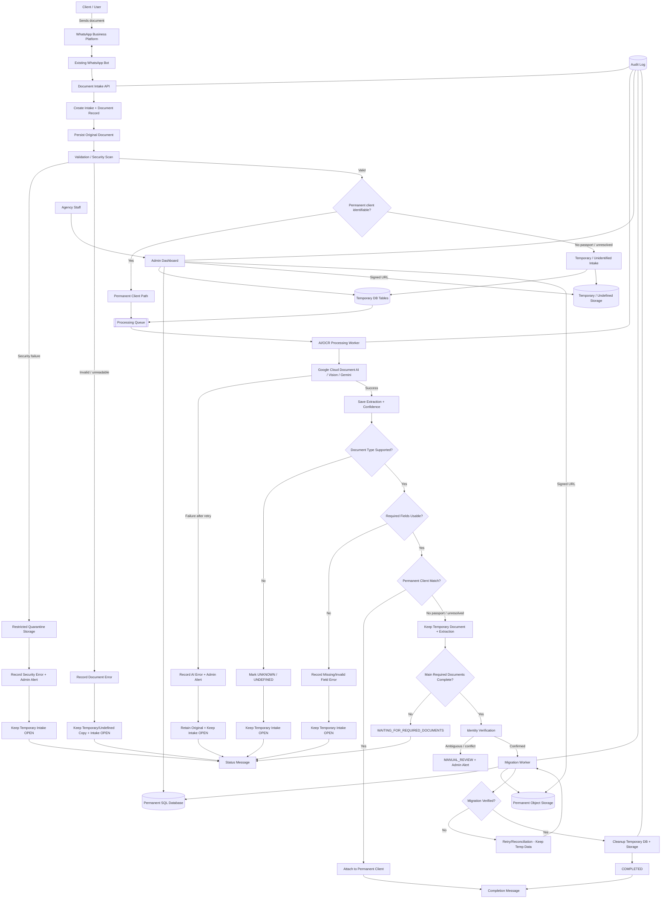

### 10.1 Core architectural rules

| Rule | Required behavior |
|---|---|
| Store first, process second | Every accepted WhatsApp document gets an internal document/intake ID and is persisted before asynchronous processing. |
| Errors do not terminate the intake | A document error changes the document status and triggers notification/alert, but the parent Temporary Intake remains open. |
| No passport = temporary path | If no reliable permanent match exists, keep the document in a Temporary Intake until approved identity evidence is available. |
| Undefined document type | Unclassifiable documents remain stored under the temporary/undefined area and are marked `UNKNOWN`/`UNDEFINED`. |
| Security rejection | Malware/security failures go to restricted quarantine and are not sent to AI processing. |
| AI failure | Original file and intake record remain intact; retry according to policy and alert staff after retry exhaustion. |
| Missing fields | Retain the document, record the error, ask for a clearer/correct document, and keep the intake open. |
| Client match unresolved | Temporary DB/storage remain authoritative until identity is verified. |
| Migration before deletion | Temporary data is never deleted until permanent DB records and object copies are verified. |
| Admin visibility | Processing errors, undefined documents, unresolved identity, migration/cleanup failures and expiring intakes are visible in the dashboard. |

### 10.2 Component responsibilities

| Component | Responsibility |
|---|---|
| Existing WhatsApp Bot | Existing conversational logic; forwards document submissions and sends status messages. |
| Document Intake API | Creates intake/document records, records WhatsApp message IDs, persists originals, validates input, and routes documents. |
| Temporary Intake Manager | Creates/finds Temporary Intakes using an internal UUID plus WhatsApp contact/mobile continuity data. |
| Temporary DB | Stores unresolved intake state, document metadata, extraction results, errors, retries, expiry and migration state. |
| Temporary/Undefined Storage | Private storage for documents not yet attached to a permanent client, including undefined documents. |
| Quarantine Storage | Restricted storage for malware/security failures. |
| Processing Queue | Asynchronous processing for temporary and permanent documents. |
| AI Processing Worker | Classification, OCR, extraction, confidence scoring and retry handling. |
| Identity Verification | Applies approved matching rules before temporary data becomes permanent. |
| Migration Worker | Performs idempotent temporary-to-permanent migration and verifies outcomes. |
| Cleanup Worker | Deletes temporary data only after successful migration or configured expiry. |
| Admin Dashboard | Shows temporary intakes, errors, alerts, review queues, migration state and resource metrics. |
| Audit Log | Immutable record of intake, processing, review, migration, cleanup and access events. |

## 11. Detailed Workflow (Identified & Unidentified Users)

The workflow is intentionally **non-terminal for document-level errors**. The bot may tell the client that one document could not be processed, but the Temporary Intake is not closed. The submitted document remains traceable and the client can continue sending documents or retry the failed document.

```mermaid
flowchart TD
    A[Client sends document via WhatsApp] --> B[Bot acknowledges receipt]
    B --> C[Document Intake API]
    C --> D[Create/Update Intake + Document Record]
    D --> E[Persist Original File]
    E --> F{Validation / Security}
    F -->|Security failure| Q[Restricted Quarantine]
    Q --> QA[Security Error + Admin Alert]
    QA --> QO[Keep Intake OPEN / MANUAL_REVIEW]
    QO --> M1[Send status message]
    F -->|Invalid/corrupted/unreadable| ER[Record Document Error]
    ER --> UD[Keep Copy in Temporary/Undefined Storage]
    UD --> M2[Send resend/correction message]
    F -->|Valid| G{Permanent Client Identifiable?}
    G -->|Yes| GP[Permanent Processing Path]
    G -->|No passport / unresolved| GT[Temporary/Undefined Path]
    GT --> TS[Store under temporary/undefined/{mobile-or-contact}/{intake_id}/]
    GP --> PS[Store in permanent staging]
    TS --> H[Enqueue Processing Job]
    PS --> H
    H --> I[AI Classification + OCR + Extraction]
    I -->|Transient failure| R[Retry with backoff]
    R -->|Retry succeeds| I
    R -->|Retries exhausted| AE[Record AI_PROCESSING_FAILED + Admin Alert]
    AE --> AM[Retain Original + Keep Intake OPEN]
    AM --> M3[Send status message]
    I -->|Success| J{Document Type Identified?}
    J -->|No| U[Mark UNKNOWN / UNDEFINED]
    U --> UA[Admin Alert if review needed]
    UA --> M4[Send status message]
    J -->|Yes| K{Required Fields Valid?}
    K -->|No| FE[Record REQUIRED_FIELD_MISSING / INVALID]
    FE --> FA[Admin Alert if required]
    FA --> M5[Send status message]
    K -->|Yes| L[Save Extraction + Confidence]
    L --> N{Permanent Client Match?}
    N -->|Yes| ATT[Attach to Permanent Client]
    N -->|No passport / unresolved| O[Keep Temporary Document + Extraction]
    O --> P{Main Required Documents Complete?}
    P -->|No| W[WAITING_FOR_REQUIRED_DOCUMENTS]
    W --> M6[Status: continue sending documents]
    P -->|Yes| V[Identity Verification]
    V -->|Conflict| MR[MANUAL_REVIEW + Admin Alert]
    MR --> M7[Status: staff review required]
    V -->|Confirmed| MIG[Verified Migration]
    MIG --> VM{Permanent DB + Storage Verified?}
    VM -->|No| RT[Keep Temp Data + Retry/Reconciliation]
    RT --> M8[No data loss; intake remains open]
    VM -->|Yes| DEL[Delete Temporary DB + Storage]
    DEL --> DONE[COMPLETED]
    ATT --> DONE2[Document completed]
    DONE --> M9[WhatsApp completion message]
    DONE2 --> M9
```

### 11.1 Critical rule: document error != intake end

The system must distinguish the lifecycle of an individual document from the lifecycle of the parent Temporary Intake.

```text
Document:       RECEIVED -> PROCESSING -> ERROR_REQUIRES_RETRY
Parent Intake:  COLLECTING_DOCUMENTS -> remains OPEN
```

A failed document can therefore be retried, replaced by a new upload, or reviewed by staff while other documents continue to arrive.

### 11.2 Required bot behavior

When a document has an issue, the bot should:

1. Save the submitted file and create/update its temporary record whenever security policy permits.
2. Record the internal error code and technical details.
3. Tell the client what action is needed, without exposing internal technical details.
4. Keep the parent Temporary Intake open.
5. Allow additional documents to be submitted immediately.
6. Allow an authorized retry or staff review where applicable.
7. Create an Admin Dashboard alert when staff action is required.
8. Never delete the document merely because processing failed.
9. Close the intake only after verified migration/cleanup or configured expiry.

### 11.3 Unidentified folder rule

For a user who has submitted documents but has not yet supplied a passport or another approved permanent identifier, the logical temporary location is:

```text
temporary/
└── undefined/
    └── {normalized_mobile_or_contact}/
        └── {temporary_intake_id}/
            └── documents/
                ├── {temp_document_id}_police_report.pdf
                ├── {temp_document_id}_birth_certificate.pdf
                └── ...
```

The bucket is private and access-controlled. The mobile/contact value provides continuity, while the **Temporary Intake UUID remains the authoritative database identifier**. If raw phone numbers should not appear in object paths, use a deterministic contact hash instead.

## 12. AI Document Processing

The relevant Google Cloud services (Google Lens is a consumer product and not suited to a backend pipeline):

| Service | What it does | Best fit here |
|---|---|---|
| **Cloud Vision API** (`DOCUMENT_TEXT_DETECTION`) | Returns raw OCR text, layout blocks, and confidence scores | Low-cost fallback for plain OCR, or a pre-check on scanned images |
| **Document AI — Enterprise Document OCR Processor** | Purpose-built document OCR | General-purpose OCR layer for most document types |
| **Document AI — Prebuilt processors** (ID/passport-oriented) | Pretrained models returning structured key-value fields | Best fit for passports/IDs where a matching prebuilt processor exists |
| **Document AI — Custom Extractor / Form Parser** | Trainable processor for custom structured fields | Best fit for agency-specific documents with no prebuilt Google processor |
| **Gemini API (multimodal)** | Reads an image/PDF and returns extracted fields as JSON per a schema | Good fit for varied/unstructured document types, or before investing in a custom-trained processor |

**Recommended approach (subject to confirmation — see Decision Log):**

1. **OCR/classification pass:** Document AI's Enterprise OCR Processor (or Cloud Vision as a lower-cost alternative).
2. **Passport/MRZ extraction:** a Document AI processor suited to identity documents, since MRZ parsing benefits from a purpose-built model and checksum validation.
3. **Other document types:** a Document AI Custom Extractor per type, or Gemini with a strict JSON schema prompt, piloted with real sample documents before final selection.

This processing pipeline is shared by both the permanent and temporary paths — a document is classified and extracted the same way regardless of whether the client is yet identifiable. This is deliberate: it means extraction results computed while a document sits in a temporary intake are directly reusable after migration (see Section 20.4), rather than needing to be redone.

## 13. Database Architecture

### 13.1 Primary key: internal UUID vs. Passport Number

| Option | Advantages | Disadvantages |
|---|---|---|
| **Passport Number as primary key** | Conceptually simple | Passports are reissued/changed on renewal, may be entered inconsistently, and a client without a passport yet can't get a record at all — which is precisely the situation this revision must handle |
| **Internal UUID as primary key, Passport Number as a UNIQUE indexed column** (recommended) | A record can exist before a passport is ever seen (essential for temporary intakes); passport corrections/renewals become simple updates; foreign keys stay stable | Slightly more application logic to resolve "which client does this passport/mobile number belong to" |

**Recommendation (unchanged, and now more clearly required):** every identifier in this system — `client_id`, and the new `intake_id` — is an internal UUID. `passport_number` is stored as a `UNIQUE, NULLABLE` column, never as a primary key, in both the permanent and temporary structures.

### 13.2 Mobile number: unique column vs. separate table

A separate `mobile_contacts` table (one client → many numbers, one flagged as primary/WhatsApp-linked) is used over a single unique column, so a number change or a second number doesn't require altering the client record itself. The same WhatsApp identity (contact ID / mobile number) is what links a temporary intake to its documents before any permanent client exists.

### 13.3 Permanent core tables

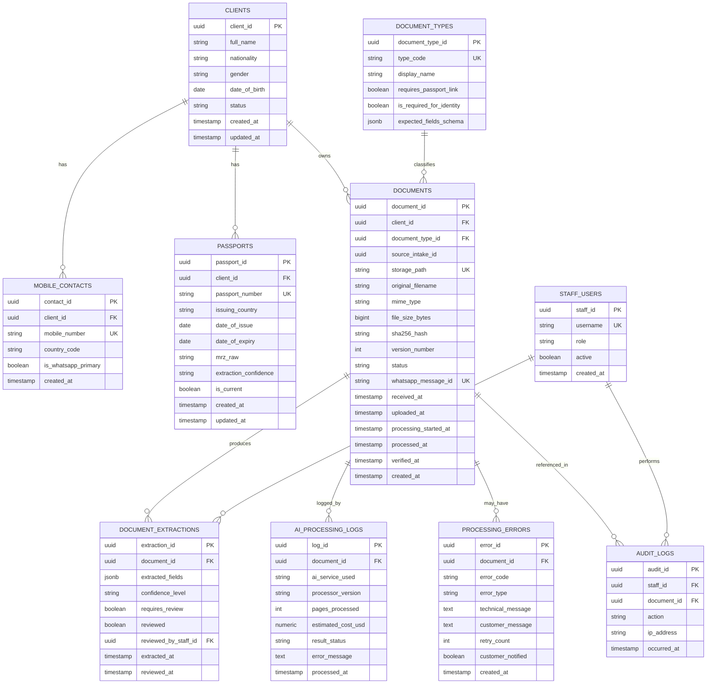

`DOCUMENTS.source_intake_id` is a nullable reference retained after migration, recording which temporary intake (if any) a permanent document originated from — useful for audit and troubleshooting, without creating a live foreign-key dependency on temporary tables that will later be cleaned up.

### 13.4 Temporary intake tables

These tables are physically and logically separate from the permanent tables above — a different schema/namespace (or a separate database entirely, see Section 14.1's storage analogy) — so that unidentified data can never be casually joined against or mistaken for verified client data, and so cleanup jobs can safely operate on this structure without any risk to permanent records.

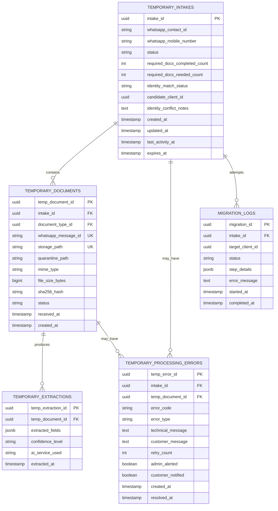

**Design notes:**
- `TEMPORARY_INTAKES.candidate_client_id` is populated once identity verification finds a probable match, but is only a candidate/proposal until migration commits it — it never implies the permanent record has been created or updated yet.
- `TEMPORARY_INTAKES.required_docs_needed_count` is configurable per Section 11's `is_required_for_identity` flag on `DOCUMENT_TYPES`, rather than hard-coded — see Section 13.5.
- `MIGRATION_LOGS` is the audit trail and the recovery mechanism for the verified migration procedure in Section 16 — every attempt (successful or failed) is recorded with a per-step status, which is what allows retries to be safe and allows staff/reconciliation jobs to see exactly where a stalled migration stopped.
- `TEMPORARY_PROCESSING_ERRORS` mirrors the permanent `PROCESSING_ERRORS` table so the same error-handling conventions (Section 28) apply to both paths.
- Every safely retainable submitted document is represented in `TEMPORARY_DOCUMENTS` even when processing later fails; security-failed files use the restricted quarantine path.
- A document error is non-terminal for `TEMPORARY_INTAKES`: the parent intake remains open for additional documents and retry/review.
- `admin_alerted` and `customer_notified` make dashboard/user notification state explicit and auditable.

### 13.5 The "main required documents" concept

The brief refers to **three main/required documents** needed before a temporary intake can be converted to a permanent client. This proposal treats that as a **configurable business rule**, not a hard-coded value: `DOCUMENT_TYPES.is_required_for_identity` flags which document types count toward the requirement, and a single configuration value (e.g., `required_identity_document_count`) determines how many distinct required types must be present before identity verification is attempted. The brief's example of three is used as an illustrative default throughout this document and is listed as an assumption in Section 35 and an open question in Section 36 — the agency should confirm the exact required document types (most likely including the passport itself, unless the agency intends identity to be establishable without one, which should also be confirmed).

### 13.6 Handling passport check-and-create

When a passport is scanned: normalize the extracted number (trim, uppercase, strip spaces), look it up in `passports.passport_number`. If found, attach the new document to the existing `client_id`. If not found, create a new `clients` row and a linked `passports` row. This lookup-then-create logic runs inside a database transaction with a unique constraint on `passport_number` as the final safety net against race conditions. The same check governs whether a temporary intake, once ready for identity verification, results in a **new** client or an **update/attachment to an existing** client (Section 16).

### 13.7 Passport renewal and history

A client may have multiple passports over time. The `PASSPORTS` table stores passport history rather than overwriting an old record; only one passport should normally have `is_current = true` per client. When a new passport is verified, the previous current passport is retained and marked `is_current = false`.


## 14. Document/Object Storage Architecture

### 14.1 Two isolated storage areas: temporary and permanent

The requested choice between a fully separate temporary bucket and a `temporary/` prefix inside the main bucket:

| Option | Assessment |
|---|---|
| Single bucket with a `temporary/` prefix inside the main bucket | Simpler to operate (one bucket, one set of credentials to manage) but riskier: a single misconfigured IAM policy or lifecycle rule at the bucket level applies to both temporary and permanent data, and it is easier for application code to accidentally reference the wrong prefix |
| **Separate temporary bucket (recommended)** | A distinct bucket lets IAM permissions, lifecycle/expiration rules, and monitoring be defined once at the bucket level and be structurally impossible to apply to the wrong data; automated expiration of abandoned temporary documents can be configured as a native bucket lifecycle policy instead of a custom job having to enforce it entirely in application logic; a compromised or misconfigured service account scoped to the temporary bucket cannot reach permanent client documents |

**Recommendation:** a **separate temporary bucket** (e.g., `agency-docs-temporary`), distinct from the permanent bucket (e.g., `agency-docs-permanent`), each with its own IAM policy, encryption configuration, and monitoring. This is the safer and more maintainable option and is used throughout this proposal.

### 14.2 Naming conventions

**Temporary:**
```text
{intake_id}/documents/{temp_document_id}_{document_type}.pdf
```
Example:
```text
c4a1e9f0-1234-4abc-9def-000011112222/documents/9f8e7d6c-aaaa-bbbb-cccc-111122223333_police_report.pdf
```

**Permanent (unchanged from v1.0):**
```text
{client_id}/{document_type}/{unique_document_id}_{version}.pdf
```
Example:
```text
7f3c2e10-4b2a-4e9e-9a3d-1a2b3c4d5e6f/passport/a1b2c3d4-e5f6-4789-a0b1-c2d3e4f5a6b7_v1.pdf
```

Neither convention ever uses the passport number or a client-provided filename — both use server-generated internal identifiers, for the same reasons given in v1.0 (Section 14.1's PII-leakage and immutability concerns apply equally to temporary storage, since temporary documents are just as sensitive as permanent ones).

### 14.3 Migration between storage areas

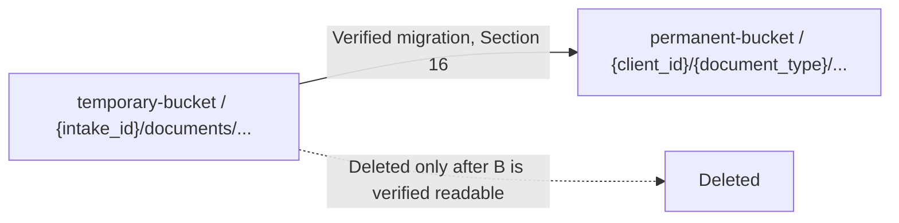

### 14.4 Additional storage considerations (applies to both areas)

| Concern | Approach |
|---|---|
| Versioning / re-uploads | New upload of an existing document type creates a new version row; prior versions retained unless policy says otherwise |
| Duplicate detection | SHA-256 hash comparison at intake, checked within the same intake/client scope, before storing a redundant copy |
| Metadata | MIME type, file size, timestamp, and hash stored in the database, not only in the file itself |
| Encryption | Server-side encryption at rest on both buckets; TLS in transit |
| Access control | No file ever served by a public/direct URL, in either bucket; access only via time-limited signed URLs, issued to staff or internal services |
| Retention & deletion (permanent) | Defined by the agency's record-keeping/legal obligations (see Open Questions); soft-delete first, then scheduled hard-delete |
| Retention & deletion (temporary) | Governed by the intake expiration policy in Section 16.4 — materially shorter than permanent retention, since temporary data represents an incomplete, unverified submission |
| Backup | Cross-region replication or scheduled backup on the permanent bucket; the temporary bucket is intentionally **not** included in long-term backup, since its contents are either migrated (and thus backed up as permanent data) or expired |
| Audit logs | Every read and write on either bucket is logged with the actor's identity, timestamp, and object reference |

## 15. Client Identification Strategy

Client matching is deliberately conservative. A mobile number or WhatsApp contact identifies the **conversation/intake**, but does not by itself prove that submitted documents belong to an existing permanent client.

### 15.1 Matching hierarchy

1. **Passport number match** — strongest business identifier when a valid passport number is available.
2. **Verified mobile/contact match** — only where the agency has an approved rule linking that mobile/contact to the client.
3. **Other extracted identifiers** — name, date of birth, nationality and document references may support verification but must not silently override conflicts.
4. **No reliable match** — keep the submission in the Temporary Intake.

### 15.2 No passport available

If the client sends supporting documents before sending a passport:

- Do not create a fake passport number.
- Do not force the document into a permanent client based only on an unverified mobile number.
- Create/find the Temporary Intake using WhatsApp contact/mobile continuity data.
- Store the original under `temporary/undefined/{mobile-or-contact}/{intake_id}/`.
- Process the document and save extraction results in the temporary tables.
- Keep the intake open while additional documents arrive.
- When the passport later arrives, process its passport number and identity fields together with the accumulated temporary evidence.
- Only after identity verification succeeds should the system create/match the permanent Client/Passport record and migrate the temporary documents.

### 15.3 Passport received later

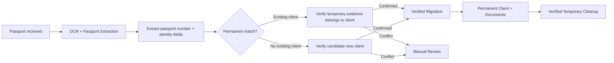

### 15.4 Identity conflicts

If temporary documents contain conflicting names, dates of birth, passport numbers or other identity information, the system must not auto-migrate. The intake becomes `MANUAL_REVIEW`, an Admin Dashboard alert is created, and staff explicitly approve/reject/request replacement evidence.

## 16. Temporary Intake Lifecycle & Migration to Permanent Records

### 16.1 Intake state machine

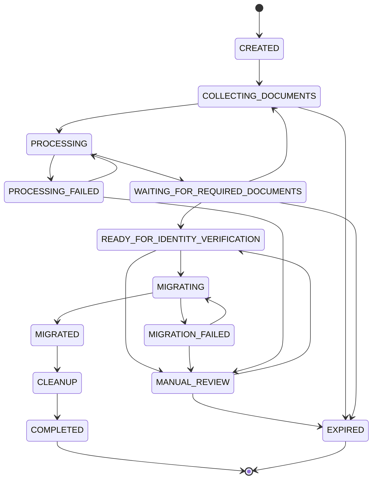

| State | Retryable automatically? | Requires staff? |
|---|---|---|
| `CREATED`, `COLLECTING_DOCUMENTS`, `PROCESSING`, `WAITING_FOR_REQUIRED_DOCUMENTS` | Yes — normal in-progress states | No |
| `PROCESSING_FAILED` | Yes, up to a configured retry limit | Only after retries are exhausted |
| `READY_FOR_IDENTITY_VERIFICATION` | N/A — a decision point, resolved automatically to `MIGRATING` or `MANUAL_REVIEW` | Sometimes (see Section 15.3) |
| `MIGRATING` / `MIGRATION_FAILED` | Yes, migration retries are safe due to idempotency (Section 16.3) | Only after the retry limit is exceeded |
| `MANUAL_REVIEW` | No | **Yes** — a staff member must resolve the conflict or approve the match before the intake can proceed |
| `MIGRATED` / `CLEANUP` / `COMPLETED` | N/A — terminal success path | No |
| `EXPIRED` | No | Staff visibility only (Admin Dashboard); data is deleted per Section 16.4 |

### 16.2 Verified, staged migration procedure

Database transactions and object storage operations are **different systems** and cannot be wrapped in a single ACID transaction — a claim this proposal deliberately avoids making. Instead, reliability is achieved through **explicit migration states, idempotency, verification, retries, and reconciliation**, recorded step-by-step in `MIGRATION_LOGS`:

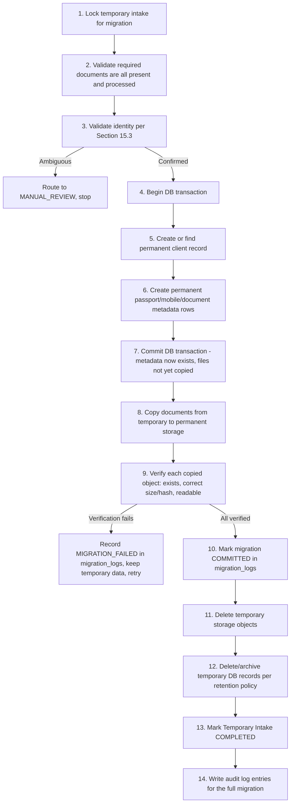

**Why this order matters:** database metadata is committed *before* the files are copied, and files are copied and independently verified *before* anything temporary is deleted. If the process crashes after Step 7 but before Step 11, the result is a permanent client record that correctly points at storage paths that may not exist yet — the migration is `IN_PROGRESS`/`FAILED` in `migration_logs`, not silently lost, and a retry of Steps 8–13 is safe (see idempotency below). Temporary data is never deleted until Step 11–12, which only run after Step 9's verification succeeds.

### 16.3 Idempotency guarantees

| Risk scenario | Mechanism that prevents a duplicate/incorrect outcome |
|---|---|
| WhatsApp sends the same webhook more than once | `whatsapp_message_id` has a unique constraint on both `documents` and `temporary_documents`; a repeated webhook for the same message ID returns the existing record rather than creating a new one |
| User sends the same document twice | SHA-256 hash comparison within the same intake/client scope flags the second copy as a duplicate rather than storing/re-processing it |
| Migration job retries after a partial failure | `migration_logs.status` records exactly which step last completed; retries resume from a not-yet-verified step rather than repeating already-committed work, and Step 5 ("create or find permanent client") is itself idempotent via the passport-number unique constraint (Section 13.6), so a retried migration cannot create a second client |
| Server crashes during migration | The intake remains in `MIGRATING`/`MIGRATION_FAILED` state (never silently reverts to "unprocessed"); temporary data is untouched until Steps 11–12 run, so a crash before that point loses nothing — a scheduled reconciliation job (Section 31) detects intakes stuck in `MIGRATING` past a timeout and resumes or flags them |
| Storage copy succeeds but the database update fails | The migration is not marked committed until *both* the DB transaction (Step 7) and storage verification (Step 9) succeed; a DB failure after a storage copy leaves an orphaned but harmless copy in permanent storage, which reconciliation can either finish linking or garbage-collect |
| Database update succeeds but the process crashes before cleanup | Temporary data simply persists a little longer; Steps 11–13 are safely re-run by a retry or by the reconciliation job, since deleting already-deleted objects/records is a safe no-op |

### 16.4 Temporary data expiration and cleanup

> **Assumption, not a confirmed business rule:** a starting default of **14 days** from an intake's last activity is suggested here as a reasonable balance between giving clients time to complete their required documents and not accumulating unbounded unverified personal data. **This must be confirmed as a business/compliance decision by the agency** (see Open Questions) and should be implemented as a configurable value, not a hard-coded constant.

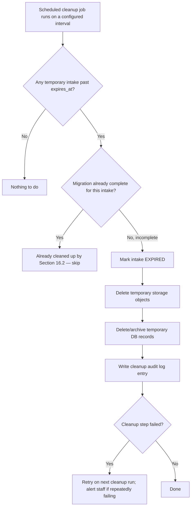

Cleanup runs on a configurable frequency (e.g., hourly), is itself idempotent (re-running against an already-cleaned intake is a safe no-op), and every deletion is written to the audit log. Intakes approaching expiration are surfaced in the Admin Dashboard (Section 18) so staff can proactively follow up with a client before their submitted documents are deleted, if the agency wants that operational behavior.

## 17. Staff Search & Retrieval

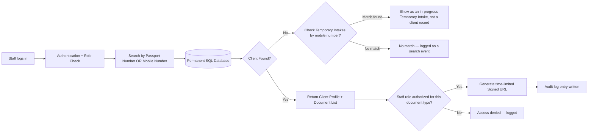

Authorization requirements: staff accounts are role-based (e.g., `intake_clerk`, `case_officer`, `admin`), scoped to which document types and actions (view metadata vs. view/download original file) each role can perform. A staff search that only matches a **temporary** intake is clearly labeled as such — never presented as if it were a confirmed client record — since the identity behind it has not yet been verified. Every search and every document access is written to the audit log.

## 18. Admin Dashboard

The Admin Dashboard provides operational visibility into **temporary/unidentified documents, processing errors, identity conflicts, and system resources**. A document error is not silently lost and does not terminate the parent intake.

### 18.1 Temporary Intake / Unidentified Documents view

```text
INTAKE       MOBILE        DOCS      STATUS                         ALERT
--------------------------------------------------------------------------------
T-001        +94xxxxxxx    2/3       WAITING_FOR_REQUIRED_DOCUMENTS -
T-002        +94xxxxxxx    3/3       MANUAL_REVIEW                  HIGH
T-003        +94xxxxxxx    3/3       MIGRATING                     -
T-004        +94xxxxxxx    1/3       ERROR_REQUIRES_RETRY           MEDIUM
T-005        +94xxxxxxx    2/3       UNKNOWN_DOCUMENT               MEDIUM
```

The list should show Intake ID, WhatsApp contact/mobile, documents received vs. required, missing document types, intake status, document error count, alert severity, identity status, migration status, last activity, expiration, retry count, and review flag.

### 18.2 Processing-error alert center

| Alert | Example | Intake behavior |
|---|---|---|
| `DOCUMENT_VALIDATION_ERROR` | Corrupt/unsupported PDF | Keep document + ask client to resend |
| `UNKNOWN_DOCUMENT` | AI cannot determine type | Keep under `undefined`; staff may review |
| `AI_PROCESSING_FAILED` | AI failed after retries | Keep document + retry/manual review |
| `REQUIRED_FIELD_MISSING` | Name/passport field unreadable | Keep document + request clearer copy |
| `IDENTITY_CONFLICT` | Name/DOB/passport conflict | Keep temporary intake in manual review |
| `MIGRATION_FAILED` | Permanent DB/storage verification failed | Keep all temporary data; retry |
| `TEMPORARY_INTAKE_EXPIRING` | Intake approaching expiry | Staff can follow up |
| `TEMPORARY_STORAGE_THRESHOLD` | Temporary storage exceeds threshold | Operational alert |
| `CLEANUP_FAILED` | Temporary deletion failed | Retry and alert if repeated |

Alert severity should be configurable, e.g. `INFO`, `MEDIUM`, `HIGH`, `CRITICAL`.

### 18.3 Admin review flow

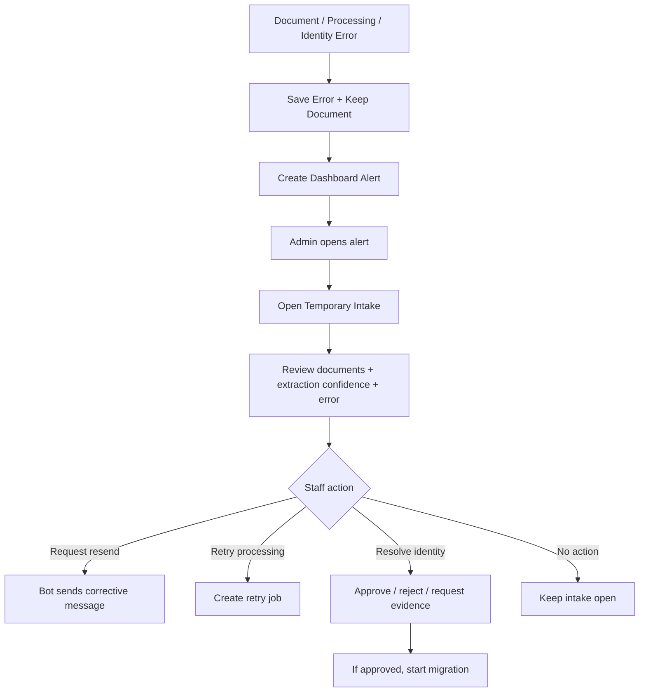

### 18.4 System resource monitoring

The dashboard can monitor CPU, RAM, database size, temporary/permanent storage, API requests, queue depth, failed jobs, AI/OCR usage, estimated AI cost, migration jobs, cleanup jobs, and error rates. Temporary storage and temporary-intake growth should be separately visible so operational problems can be identified early.

## 19. Security & Privacy

| Area | Approach |
|---|---|
| Encryption in transit | TLS 1.2+ for all API traffic, including WhatsApp webhook calls, AI service calls, and staff API calls |
| Encryption at rest | Database encryption at rest for both the permanent and temporary databases; server-side encryption on both the permanent and temporary object storage buckets |
| Access control / RBAC | Role-based permissions for staff; principle of least privilege; service accounts for the Temporary Intake Manager, Migration Worker, and Cleanup Worker are scoped separately and narrowly — e.g., the Cleanup Worker's credentials allow delete operations only within the temporary bucket/schema, never the permanent one |
| Staff authentication | Standard username/password with MFA recommended, or SSO if the agency has an existing identity provider |
| API authentication | Signed service-to-service tokens between internal services; WhatsApp webhook authenticated per the BSP provider's signature verification |
| Secure document access | No permanent public links on either bucket; all downloads via short-lived signed URLs |
| Audit logging | Immutable, append-only log covering document access, searches, administrative actions, **and every migration and cleanup action on temporary data** |
| Secrets management | API keys and service credentials in a managed secrets vault, never in code or config |
| Rate limiting | Applied at the API gateway to the intake endpoint (both permanent and temporary paths) and the AI pipeline |
| Malware/file scanning | All uploaded files scanned before AI processing or storage, in both the temporary and permanent paths — temporary documents receive identical scanning to permanent ones, since they are equally capable of carrying a malicious payload |
| PDF validation | Structural validation before processing, applied identically to both paths |
| File size limits | Enforced at intake with a clear WhatsApp error message if exceeded |
| Duplicate detection | SHA-256 hash comparison, scoped within an intake/client as described in Section 14.4 |
| No public object access | Both buckets are fully private; nothing is ever world-readable |
| Temporary data security parity | Temporary data is not treated as "less sensitive" because it is impermanent — a police report or birth certificate sitting in a temporary intake is exactly as sensitive as one attached to a confirmed client, and receives the same encryption, access control, and audit logging |

**Sending personal documents to a third-party AI service:** unchanged from v1.0 — this remains a material privacy consideration the agency should evaluate against Google Cloud's data processing terms and the data-protection laws of the countries in which it and its clients operate; this proposal does not make a legal determination.

## 20. AI Cost Analysis

### 20.1 Pricing used (official sources, as published)

| Service | Price | Source |
|---|---|---|
| Google Cloud Vision API, `DOCUMENT_TEXT_DETECTION` | First 1,000 units/month free, then $1.50 per 1,000 units | Google Cloud Vision pricing |
| Document AI — Enterprise Document OCR Processor | First 1,000 pages/month free, then $1.50 per 1,000 pages (0–5M/month), $0.60 per 1,000 pages above 5M/month | cloud.google.com/document-ai/pricing |
| Document AI — Custom Extractor / Form Parser | $30 per 1,000 pages (up to 1M/month), $20 per 1,000 pages above 1M/month | cloud.google.com/document-ai/pricing |
| Gemini 2.5 Flash-Lite (API) | $0.10 per 1M input tokens, $0.40 per 1M output tokens | ai.google.dev/gemini-api/docs/pricing |
| Gemini 2.5 Flash (API) | $0.30 per 1M input tokens, $2.50 per 1M output tokens | ai.google.dev/gemini-api/docs/pricing |
| Gemini 2.5 Pro (API) | $1.25 per 1M input tokens, $10.00 per 1M output tokens | ai.google.dev/gemini-api/docs/pricing |

> These are the vendor's published list prices at the time of writing and are subject to change; the agency should re-confirm current rates before budgeting. These numbers exclude infrastructure, storage, networking, and engineering costs.

### 20.2 Scenario assumptions

- Average of **3 documents submitted per client** during onboarding (passport + 2 supporting documents), each averaging **2 pages**.
- Enterprise OCR Processor used for classification/OCR of every page; a Custom Extractor used only where structured extraction is needed.
- These figures are illustrative planning numbers, not guaranteed usage.

### 20.3 Option A vs. Option B (unchanged methodology from v1.0)

| Clients/month | Option A total/month (minimal extraction) | Option B total/month (detailed extraction) |
|---|---|---|
| 100 | ~$6.90 | $18.00 |
| 500 | ~$33.00 | $90.00 |
| 1,000 | ~$67.50 | $180.00 |
| 5,000 | ~$343.50 | $900.00 |

The comparison table and recommendation from v1.0 (weighing AI cost, processing time, storage, future business value, accuracy, privacy, complexity, and reprocessing) stands unchanged and remains a business decision for the agency, listed in the Decision Log.

### 20.4 Cost impact of temporary intake — avoiding redundant AI calls

A document sitting in a temporary intake still incurs the same OCR/extraction cost as one attached directly to a permanent client — **temporary status does not make AI processing free**, and the cost model above should be read as applying per document regardless of which path it travels through.

However, the pipeline is specifically designed so a document is **never processed by the AI service twice**: `TEMPORARY_EXTRACTIONS` stores the full extraction result at the time a temporary document is first processed (Section 13.4), and the migration procedure (Section 16.2) carries that already-computed result forward into the permanent `DOCUMENT_EXTRACTIONS` table rather than re-submitting the same file to the AI service. Reprocessing during migration should only happen if explicitly triggered — for example, if a document was processed long enough ago that the agency wants a re-run against an improved model version, or if the original extraction was marked low-confidence and a staff reviewer requests a fresh attempt. Avoiding automatic reprocessing at migration time keeps the cost model in Section 20.3 accurate — each document is still counted once, not twice, even though it passes through two states (temporary, then permanent) on its way to a finished client record.

## 21. Data Extraction Strategy

Recommended default field sets per document type (to be confirmed/extended per Open Questions):

**Passport:** passport number, full name, date of birth, nationality, gender, date of issue, date of expiry, MRZ string.

**Police report:** full name, date of report, reference number, address, issuing police station, report type/category.

**Other document types:** field sets defined with agency input per type, modeled as configurable via `document_types.expected_fields_schema` so adding a document type is a configuration change, not a schema migration. This applies identically whether the document type is being extracted for a permanent client or a temporary intake — the extraction schema is a property of the document type, not of which path processed it.

## 22. ER Diagram

See Sections 13.3 (permanent) and 13.4 (temporary) for the full entity-relationship diagrams, and Section 13.3's note on `DOCUMENTS.source_intake_id` for how the two connect after migration.

## 23. Activity Diagram

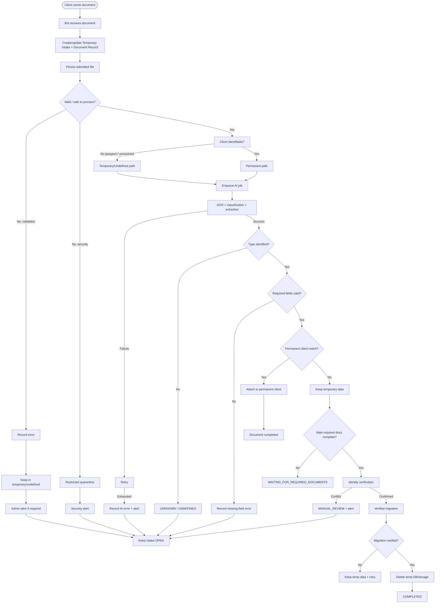

A document error ends only that document attempt; it does **not** end the parent Temporary Intake.

## 24. Sequence Diagram

```mermaid
sequenceDiagram
    participant U as Client
    participant WA as WhatsApp
    participant Bot as WhatsApp Bot
    participant BE as Intake API
    participant TDB as Temporary DB
    participant TST as Temporary/Undefined Storage
    participant Q as Processing Queue
    participant AI as AI/OCR
    participant Adm as Admin Dashboard
    participant St as Staff
    participant MIG as Migration Worker
    participant DB as Permanent DB
    participant OBJ as Permanent Storage
    participant CLN as Cleanup Worker

    U->>WA: Send document
    WA->>Bot: Media + message
    Bot->>BE: Document reference
    BE->>TDB: Create/update intake + document
    BE->>TST: Persist original
    BE->>BE: Validate/security
    alt Document issue
        BE->>TDB: Save error + status
        BE->>Adm: Alert when staff action required
        BE->>Bot: Corrective/status message
        Bot->>WA: Document issue message
        WA->>U: Resend/continue
        Note over TDB,TST: Parent intake remains OPEN
    else Valid
        BE->>Q: Enqueue job
        Q->>AI: Classification + OCR + extraction
        AI-->>Q: Fields + confidence
        alt No passport / unresolved identity
            Q->>TDB: Save temporary extraction
            Q->>TST: Keep temporary document
            Q->>Bot: Saved; waiting for identity/documents
        else Identified
            Q->>DB: Save permanent record
            Q->>OBJ: Store permanent document
        end
    end

    Note over U,TDB: Client later sends passport
    U->>WA: Send passport
    WA->>Bot: Passport
    Bot->>BE: Passport document
    BE->>Q: Enqueue passport job
    Q->>AI: Passport extraction
    AI-->>Q: Passport number + identity fields
    Q->>TDB: Update temporary identity evidence
    alt Identity verified
        Q->>MIG: Trigger migration
        MIG->>DB: Create/find client + document rows
        MIG->>OBJ: Copy temporary documents
        MIG->>OBJ: Verify copies
        MIG->>TDB: Mark migration committed
        MIG->>CLN: Trigger cleanup
        CLN->>TST: Delete temporary objects
        CLN->>TDB: Delete/archive temporary rows
        MIG->>Bot: Completion
        Bot->>WA: Completion message
        WA->>U: Documents successfully processed
    else Identity conflict
        Q->>Adm: MANUAL_REVIEW alert
        Adm->>St: Notify staff
        St->>Adm: Review evidence
    end
```

## 25. Data Flow Diagram

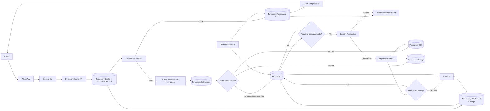

Temporary data is a real, queryable state of the system. It remains available to the collection workflow and authorized admins until verified migration or expiry.

## 26. Storage Structure & Lifecycle Diagrams

### 26.1 Temporary / undefined storage

```text
temporary/
├── undefined/
│   └── {normalized_mobile_or_contact}/
│       └── {temporary_intake_id}/
│           ├── documents/
│           │   ├── {temp_document_id}_police_report.pdf
│           │   ├── {temp_document_id}_birth_certificate.pdf
│           │   └── ...
│           └── metadata/
├── quarantine/
│   └── {normalized_mobile_or_contact}/
│       └── {temporary_intake_id}/
│           └── {temp_document_id}_quarantined_file
└── processing/
    └── {temporary_intake_id}/
        └── {temp_document_id}/
```

The bucket is private. If raw phone numbers should not appear in object paths, use a deterministic contact hash while the Admin Dashboard displays the human-readable mobile number.

### 26.2 Permanent storage

```text
clients/
└── {client_id}/
    ├── passport/
    ├── police-report/
    ├── birth-certificate/
    ├── education/
    └── other/
```

Permanent storage is keyed by internal `client_id`, not passport number or mobile number.

### 26.3 Error-document lifecycle

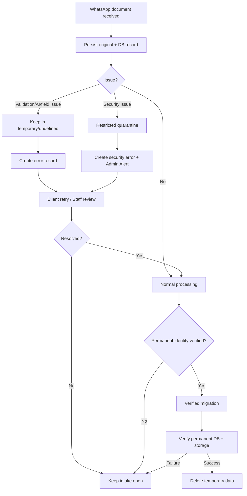

### 26.4 Temporary-to-permanent lifecycle

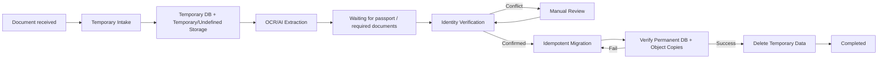

## 27. API Architecture

Proposed endpoints (subject to refinement once the existing bot's API is reviewed). Each is marked customer-facing (via the bot), internal service-to-service, or admin/staff-only.

| Method & Path | Purpose | Audience |
|---|---|---|
| `POST /v1/documents/intake` | Bot forwards a received document reference for validation + routing (permanent or temporary path) + queuing | Internal |
| `POST /v1/documents/{documentId}/process` | Trigger/retry AI processing for a staged permanent document | Internal |
| `GET /v1/clients/by-passport/{passportNumber}` | Staff search by passport number | Admin/Staff |
| `GET /v1/clients/by-mobile/{mobileNumber}` | Staff search by mobile number | Admin/Staff |
| `GET /v1/clients/{clientId}` | Full client profile | Admin/Staff |
| `GET /v1/clients/{clientId}/documents` | All documents for a client | Admin/Staff |
| `GET /v1/documents/{documentId}/status` | Processing status | Admin/Staff |
| `GET /v1/documents/{documentId}/download-url` | Generate a short-lived signed URL | Admin/Staff |
| `POST /v1/auth/login` | Staff authentication | Admin/Staff |
| `GET /v1/audit-logs` | Audit trail query | Admin only |
| `GET /v1/intakes/{intake_id}` | Retrieve a temporary intake's status and metadata | Internal / Admin |
| `GET /v1/intakes/{intake_id}/documents` | List documents currently held in a temporary intake | Internal / Admin |
| `POST /v1/intakes/{intake_id}/verify` | Trigger identity verification once required documents are complete | Internal |
| `POST /v1/intakes/{intake_id}/migrate` | Trigger the verified migration procedure (Section 16.2) | Internal |
| `POST /v1/intakes/{intake_id}/review` | Staff decision on a `MANUAL_REVIEW` intake (approve match / reject / request more info) | Admin/Staff |
| `GET /v1/admin/intakes` | List/filter temporary intakes for the Admin Dashboard | Admin/Staff |
| `GET /v1/admin/intakes/{intake_id}` | Full detail view of one intake for the Admin Dashboard | Admin/Staff |
| `POST /v1/admin/intakes/{intake_id}/retry` | Manually retry a failed processing or migration step | Admin/Staff |
| `POST /v1/admin/intakes/{intake_id}/merge` | Staff-initiated merge of a temporary intake into a specific existing client (used to resolve `MANUAL_REVIEW`) | Admin only |

`POST /v1/intakes/{intake_id}/verify` and `/migrate` are exposed as internal endpoints primarily so the pipeline's own workers can call them in a traceable, retryable way (and so a reconciliation job can safely re-trigger a stalled step); they are not intended as free-standing customer-facing actions.

### 27.1 Intake idempotency

`POST /v1/documents/intake` must accept and persist the originating WhatsApp message ID, checked against both `documents.whatsapp_message_id` and `temporary_documents.whatsapp_message_id` before creating anything new. A webhook retry for the same WhatsApp message returns the existing result rather than creating a duplicate document, temporary document, or processing job — see Section 16.3 for the full idempotency discussion.


### 27.3 Temporary Intake and Error APIs

```text
POST /v1/documents/intake
GET  /v1/intakes/{intake_id}
GET  /v1/intakes/{intake_id}/documents
GET  /v1/intakes/{intake_id}/errors
POST /v1/intakes/{intake_id}/retry
POST /v1/intakes/{intake_id}/verify
POST /v1/intakes/{intake_id}/migrate

GET  /v1/admin/intakes
GET  /v1/admin/intakes/{intake_id}
GET  /v1/admin/alerts
POST /v1/admin/intakes/{intake_id}/retry
POST /v1/admin/intakes/{intake_id}/review
POST /v1/admin/alerts/{alert_id}/acknowledge
```

`POST /v1/documents/intake` must persist the WhatsApp message ID before acknowledging intake. Duplicate webhook deliveries return the existing intake/document result. Retry operations are idempotent and never delete the original failed submission.

## 28. Error Handling

### 28.1 Error-handling principle

**No document is silently discarded because processing failed.** The system records the document, records the error, retains the original in the correct isolated location, notifies the client when appropriate, and creates an Admin Dashboard alert when staff intervention is required.

### 28.2 Error categories

| Error code | Meaning | Document retained? | Intake closed? | Admin alert? |
|---|---|---:|---:|---:|
| `DOC_MISSING` | WhatsApp media reference unavailable | Yes, metadata/message record | No | Yes |
| `DOC_INVALID` | Unsupported/invalid file | Yes | No | Usually no |
| `DOC_CORRUPTED` | File cannot be opened/read | Yes | No | If repeated |
| `DOC_UNREADABLE` | Content cannot be reliably read | Yes | No | Optional |
| `DOC_TYPE_UNKNOWN` | AI cannot determine type | Yes, under `undefined` | No | Yes if review needed |
| `DOC_TYPE_UNSUPPORTED` | Recognized type outside configured scope | Yes, under `undefined` | No | Optional |
| `DOC_REQUIRED_FIELD_MISSING` | Required field not extracted | Yes | No | If staff review needed |
| `AI_PROCESSING_FAILED` | AI failed after retries | Yes | No | Yes |
| `CLIENT_MATCH_FAILED` | No reliable permanent match | Yes, temporary | No | Optional |
| `IDENTITY_CONFLICT` | Evidence conflicts | Yes, temporary | No | Yes |
| `MIGRATION_FAILED` | Permanent migration not verified | Yes, temporary | No | Yes |
| `CLEANUP_FAILED` | Temporary deletion failed | Yes until retry | No | Yes |
| `SYSTEM_ERROR` | Unexpected application failure | Yes where possible | No | Yes |

### 28.3 Error flow

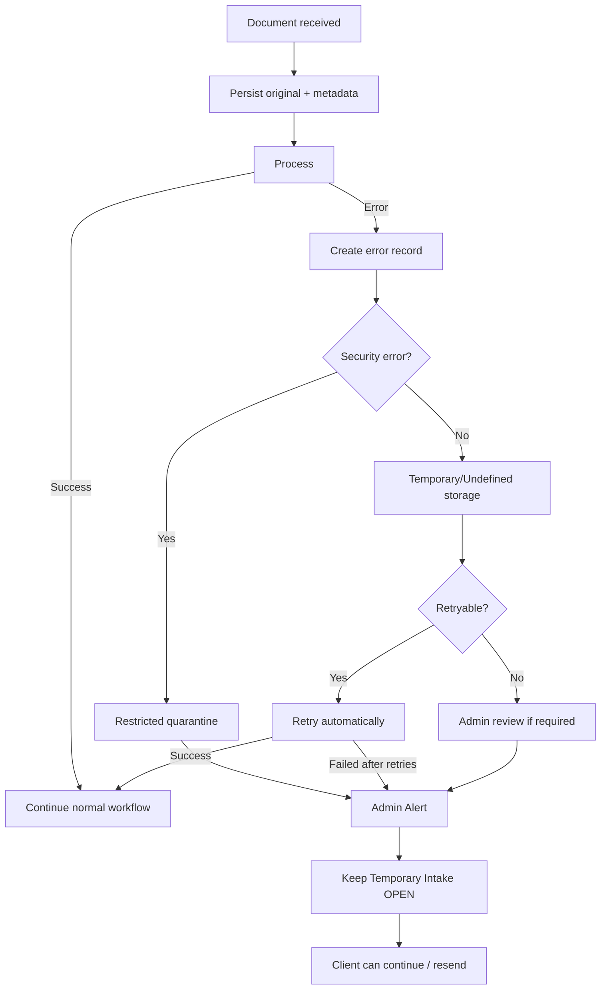

### 28.4 Bot message rule

The bot must not imply that the whole case has ended merely because one document failed. It should describe the affected document and the next action, for example:

> “We received your document, but we could not process it because it is unclear, corrupted, or unsupported. Your document collection is still open. Please resend a clearer or supported copy.”

The exact customer-facing wording should be finalized with the agency.

## 29. AI Accuracy & Human Verification

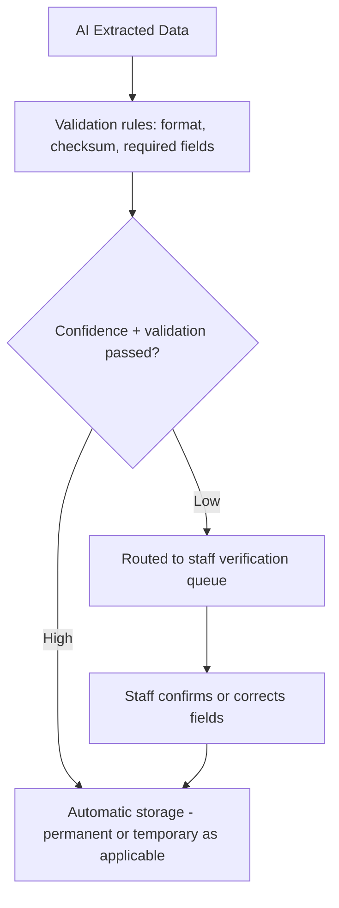

Fields that should always be validated before being treated as authoritative: **passport number** (MRZ checksum, format pattern), **date of birth**, **passport expiry date**, and **full name**. This applies identically to documents in a temporary intake — a low-confidence passport number inside a temporary intake must not be trusted to drive identity verification (Section 15.3) any more than one attached to an already-identified client would be trusted without validation.

## 30. Scalability

| Volume | Considerations |
|---|---|
| 100 clients | Single small worker instance, standard managed SQL tier sufficient |
| 1,000 clients | Add indexes on `passport_number`, `mobile_number`, `client_id`, and on `temporary_intakes.whatsapp_mobile_number` / `status` for dashboard queries |
| 10,000 clients | Consider read replicas for staff search queries; monitor AI API quota/rate limits |
| 100,000+ clients | Horizontal scaling of worker pool (including migration/cleanup workers); object storage scales natively; database partitioning strategy evaluated at this scale; caching layer for frequent staff searches |

The temporary intake volume should be watched independently of permanent client volume — a high ratio of abandoned/expired intakes to completed migrations at any scale is itself a signal worth surfacing (Section 18.2), since it indicates friction in document collection rather than simple growth.

## 31. Monitoring & Resource Observability

Recommended metrics and logs, extended for the temporary-intake architecture:

- Application logs: intake, processing, migration, cleanup, staff API.
- AI processing logs with per-call cost estimate, covering both permanent and temporary extraction calls (Section 20.4).
- API latency and error rate.
- Queue depth over time (processing queue, migration queue).
- Document processing success/failure rate, split by permanent vs. temporary path.
- Count of documents/intakes routed to human review.
- **CPU, RAM** for backend services and workers.
- **Database size**, tracked separately for the permanent database and the temporary database.
- **Permanent storage** and **temporary storage** volume, tracked separately (Section 18.2).
- API request counts; AI/OCR request counts.
- Processing queue depth; failed job count; migration job success/failure count; cleanup job success/failure count.
- AI cost running total (Section 20).
- Storage cost running total.
- System error rate.
- **Temporary intake count by state** (a live count of how many intakes sit in each state of Section 16.1's state machine) — a growing `WAITING_FOR_REQUIRED_DOCUMENTS` or `MANUAL_REVIEW` count over time is an early warning sign worth alerting on.
- A configurable alert when temporary storage volume or temporary intake count exceeds a defined threshold (Section 18.2).


### 31.3 Temporary intake and error monitoring

Track active Temporary Intakes, error-retry documents, unknown/undefined documents, manual-review intakes, temporary storage volume, temporary DB row count, intake age, intakes approaching expiry, AI retry/failure rate, migration failures, cleanup failures, retained unmatched documents, and alert backlog/time-to-resolution.

Recommended alerts include unusually high growth in undefined documents, repeated AI failures, migration failures, cleanup failures, and a rising number of old temporary intakes.

## 32. Implementation Plan

| Phase | Activities | Deliverables | Dependencies | Outcome |
|---|---|---|---|---|
| 1. Requirements & Architecture | Confirm open questions (including the exact required-document list and retention periods), review existing bot's API/spec | Approved architecture document | Agency input on Open Questions | Shared understanding before build starts |
| 2. Permanent Database Implementation | Build permanent schema, migrations, indexing | Deployed permanent SQL schema | Phase 1 | Permanent data layer ready |
| 3. Temporary Intake Database & Storage | Build temporary schema (Section 13.4), configure isolated temporary bucket (Section 14.1) | Deployed temporary intake infrastructure | Phase 1 | Temporary path has a safe home |
| 4. Object Storage (Permanent) | Configure permanent bucket, naming convention, encryption, signed URL issuance | Storage service integrated | Phase 1 | Files can be stored/retrieved securely |
| 5. AI Document Processing | Pilot Document AI/Gemini options, build shared extraction pipeline used by both paths | Working extraction pipeline with confidence thresholds | Phases 2–4, sample documents from agency | Documents can be classified and extracted |
| 6. WhatsApp Bot Integration | Hook intake flow (including the identifiability check and temporary-path routing) into the existing bot | Integrated document intake, live in the bot | Existing bot spec, Phase 5 | Clients can submit documents end to end, in any order |
| 7. Identity Verification & Migration | Build identity verification logic (Section 15.3), the verified migration procedure (Section 16.2), and the cleanup job (Section 16.4) | Working migration pipeline with idempotency and reconciliation | Phases 2–6 | Temporary intakes safely become permanent clients |
| 8. Staff Search & Admin Dashboard | Build search/retrieval API, RBAC, and the Admin Dashboard (temporary intake view + resource monitoring, Section 18) | Working staff search and dashboard | Phases 2–7 | Staff can retrieve client records and manage temporary intakes |
| 9. Security & Audit Logging | Implement RBAC, signed URLs, audit trail, secrets management for both temporary and permanent data | Security review sign-off | Phases 2–8 | System meets baseline security bar |
| 10. Testing | Execute test plan (Section 33), including migration/idempotency/failure scenarios | Test report | All prior phases | Confidence in correctness and resilience |
| 11. Deployment | Production rollout, cutover plan, rollback plan | Live production system | Phase 10 sign-off | Feature live for real clients |
| 12. Monitoring & Maintenance | Dashboards, alerting, cost tracking, temporary-storage alerting live | Operating runbook | Phase 11 | Ongoing visibility and support |


### Additional implementation work introduced by v2.1

1. Implement the temporary tables and temporary/undefined storage path.
2. Persist every submitted document before asynchronous processing.
3. Separate document-level status from parent intake status.
4. Implement non-terminal error handling, retry state and admin alerts.
5. Implement passport-arrival matching against accumulated Temporary Intake evidence.
6. Implement idempotent migration, verification and cleanup.
7. Add reconciliation for stuck migration/cleanup jobs.
8. Add monitoring for temporary storage, unresolved intakes and error backlog.

## 33. Testing Strategy

- **Unit testing:** validation logic, client-matching logic, field normalization, state-machine transition logic.
- **Integration testing:** end-to-end intake → AI → DB → storage flow, for both the permanent path and the full temporary-intake-to-migration path.
- **API testing:** staff search/retrieval endpoints, intake/migration/review endpoints, auth, and error responses.
- **AI extraction testing:** accuracy against a labeled sample set per document type; confidence-threshold tuning.
- **WhatsApp testing:** message/media delivery, confirmation messages, failure messaging, documents arriving out of order.
- **Database testing:** duplicate-prevention logic, transactional integrity under concurrent submissions, and specifically **concurrent migration attempts on the same intake**.
- **Migration/idempotency testing:** simulate a crash after DB commit but before storage copy; simulate a crash after storage copy but before cleanup; simulate a duplicate webhook during an in-progress migration; confirm no duplicate clients or documents result in any case.
- **Identity-conflict testing:** submit documents with conflicting passport numbers, mismatched names/DOBs, and documents belonging to two different people within the same intake; confirm every case routes to `MANUAL_REVIEW` rather than auto-resolving.
- **Expiration/cleanup testing:** confirm an incomplete intake expires and is cleaned up correctly, and that an intake mid-migration is never mistakenly expired.
- **Security testing:** access control enforcement, signed URL expiry, audit log completeness, isolation between temporary and permanent storage/IAM.
- **Performance testing:** queue behavior under burst load, AI API rate-limit handling, cleanup job performance against a large backlog of expired intakes.
- **User acceptance testing:** agency staff validate search/retrieval and the Admin Dashboard's temporary intake view against real (or realistic) scenarios.
- **Failure/recovery testing:** simulate AI outage, storage outage, and database outage during both the permanent and temporary/migration flows, and confirm graceful degradation and recovery.


### 33.4 Temporary and error-path tests

- Supporting document arrives before passport.
- Several supporting documents arrive before passport.
- Corrupted/unreadable PDF is retained and the intake remains open.
- Unsupported/unknown document is stored under `undefined` and flagged appropriately.
- AI fails after retries; original document remains available.
- Required fields are missing; client can resend without losing the intake.
- Passport arrives later and successfully identifies the temporary intake.
- Passport conflicts with temporary evidence and triggers manual review.
- Duplicate WhatsApp webhook does not create duplicate records.
- Migration fails part-way and temporary data remains intact.
- Cleanup fails and is retried safely.
- Admin alert is created, acknowledged and resolved.
- Temporary intake expires according to configured retention policy.

## 34. Risks & Mitigation

| Risk | Impact | Probability | Mitigation |
|---|---|---|---|
| AI extraction inaccuracies | Incorrect client data, misfiled documents | Medium | Confidence-based human verification, validation rules |
| AI API cost increases with volume | Budget overrun | Low–Medium | Cost monitoring dashboard, reuse of extraction results at migration (Section 20.4), periodic pricing review |
| Third-party AI service downtime | Processing delays | Low | Queue-based design absorbs outages; retries |
| Privacy/data exposure | Regulatory and reputational risk | Medium | Encryption, RBAC, signed URLs, audit logging, legal review; applied equally to temporary data |
| Duplicate client records | Fragmented client history | Medium | Passport-number uniqueness constraint, idempotent migration (Section 16.3) |
| Incorrect passport extraction | Wrong client match | Medium | MRZ checksum validation, confidence thresholds, staff review queue |
| Storage failures | Data loss | Low | Backups, cross-region replication, versioning on permanent storage; migration verification before temporary cleanup |
| WhatsApp API limitations | Delivery/media constraints | Low–Medium | Confirm limits with existing bot's provider during Phase 1 |
| Large document volumes / bursts | Processing backlog | Medium | Queue-based, autoscaling workers |
| **Abandoned temporary intakes accumulating storage/DB volume** | Unbounded storage cost, cluttered dashboard | Medium | Configurable expiration policy, automated cleanup job, dashboard alerting on temporary volume thresholds (Sections 16.4, 18.2, 31) |
| **Partial/failed migration leaving inconsistent state** | Client data temporarily incomplete or duplicated | Medium | Staged, idempotent, verified migration procedure with reconciliation job (Section 16.2–16.3) |
| **Identity misidentification during temporary-to-permanent conversion** | Documents attached to the wrong client | Medium | Conservative matching rules that default to `MANUAL_REVIEW` on any ambiguity (Section 15.3), never auto-merge |
| Vendor lock-in (Google Cloud AI) | Harder to switch providers later | Medium | Keep extraction logic behind an internal abstraction layer |
| Staff unauthorized access | Data breach | Low–Medium | RBAC, MFA, audit logging, least-privilege service accounts, separately scoped for temporary vs. permanent resources |

## 35. Assumptions

- The existing WhatsApp bot is operational and has a working WhatsApp Business API/BSP integration.
- The existing bot can receive and forward PDF (and likely image) attachments to a new backend service.
- The agency will provide the existing bot's architecture and API/document specifications for integration design.
- The agency will confirm the required document types and the fields to extract per type.
- **The agency will confirm the exact set and count of "main required documents" needed before identity verification is attempted; this proposal assumes three as an illustrative default, per the brief, and assumes a passport is one of them unless told otherwise.**
- **A starting default temporary-intake retention period of 14 days from last activity is assumed for planning purposes only and must be confirmed or replaced by the agency.**
- The agency will define staff roles and access requirements, including who may resolve `MANUAL_REVIEW` cases and perform staff-initiated merges.
- Cloud infrastructure (Google Cloud, for AI services and optionally hosting) will be made available/provisioned.
- The agency will provide or arrange the necessary AI/API credentials.
- The agency will confirm applicable legal/privacy requirements for the jurisdictions it operates in, covering temporary data equally with permanent data.

## 36. Open Questions

1. What exact document types must be supported (confirm the full list beyond the 10 examples given)?
2. What fields must be extracted from each document type?
3. What is the expected monthly document/client volume, and separately, what proportion of clients are expected to submit documents out of order (i.e., trigger the temporary-intake path)?
4. Which countries' passports will be processed?
5. Should expired passports be accepted, and if so, how should that be flagged?
6. How long should permanent documents and extracted data be retained?
7. **What is the confirmed retention period for temporary/unidentified intakes, and should it differ by how much of the required document set has been completed?**
8. **What is the exact list and count of "main required documents" needed before a temporary intake can be converted to a permanent client — is a passport always mandatory, or can identity be established without one in some cases?**
9. Which staff roles should exist, and what should each be authorized to view, download, or approve (including `MANUAL_REVIEW` resolution and staff-initiated merges)?
10. Should staff be able to download original documents, or only view extracted data plus a preview — for both permanent and temporary documents?
11. Should staff be able to edit AI-extracted data directly, and is that edit itself audited?
12. What should happen when AI extraction is later found to be incorrect after a client was already notified of successful migration?
13. Which specific Google AI service(s) should be used for each document type (to be confirmed after a technical pilot)?
14. What is the expected/approved AI processing budget per month?
15. Is detailed extraction (Option B, Section 20) required for all documents, or only certain types?
16. What data residency/compliance requirements apply, and do they impose any constraint on where temporary (pre-identity-verified) data may be stored?
17. How should passport renewals be handled — link as history, or treat as a new passport record under the same client?
18. Can multiple WhatsApp numbers belong to one client, and how should that be confirmed?
19. Is a staff-facing UI in scope for this phase, or API/Admin-Dashboard-only with a follow-on full UI phase?
20. **Should clients be proactively reminded via WhatsApp as their temporary intake approaches expiration, or should expiration happen silently with only staff visibility?**
21. **When a temporary intake is flagged `MANUAL_REVIEW` for an identity conflict, should the client be told anything at all while it awaits staff resolution, or should the conversation simply continue as normal until resolved?**

## 37. Cost Considerations

### One-time development costs (to be estimated once scope is finalized)
Backend development (intake API, temporary intake manager, migration and cleanup workers), permanent and temporary database schema and migrations, WhatsApp bot integration work, AI pipeline integration, temporary and permanent object storage integration, staff search API and Admin Dashboard, security implementation, and testing (including the expanded migration/idempotency test scenarios in Section 33).

### Recurring costs
- AI API usage (Section 20), including temporary-path processing.
- Cloud compute for backend services and workers (including migration and cleanup workers).
- Managed SQL database hosting (permanent and temporary).
- Object storage — permanent (with backup) and temporary (without long-term backup, per Section 14.4).
- WhatsApp Business API/BSP messaging costs (governed by the agency's existing provider agreement).
- Monitoring/alerting tooling, including the additional temporary-resource metrics in Section 31.
- Ongoing maintenance and support.

Exact one-time development pricing depends on team rates and final scope and is intentionally not estimated here — the agency should request a separate effort/cost estimate once the Open Questions in Section 36 are answered.

## 38. Future Enhancements

- Automated document authenticity/fraud detection.
- Staff-facing web UI with dashboards (beyond the API-first design here).
- Multi-language OCR/extraction expansion as client base grows.
- Automated passport-expiry reminders to clients via WhatsApp.
- Self-service client portal for viewing their own submission status, including in-progress temporary intakes.
- Analytics on document-type volume and processing turnaround time, including how often clients complete a temporary intake vs. let it expire.
- Proactive WhatsApp nudges for clients with an intake approaching expiration (pending the decision in Open Question 20).

## 39. Conclusion

This revised proposal extends the agency's WhatsApp bot with a structured, auditable document intake pipeline that now correctly handles the common real-world case of a client submitting documents before their identity can be established. A dedicated Temporary Intake subsystem — its own database structures, its own isolated storage, a clear state machine, and a verified, idempotent migration procedure — ensures no document is rejected or mishandled while identity is still pending, and that no document becomes part of a permanent client record without passing through explicit identity verification. Every architectural layer from v1.0 — database design, storage design, security, AI cost analysis, diagrams, API design, and the Admin Dashboard — has been extended rather than patched over, so the resulting document remains internally consistent. Several decisions, most importantly the exact required-document list and the temporary-data retention period, still need the agency's explicit confirmation before implementation begins.

## 40. Recommended Next Steps

1. Agency to provide the existing WhatsApp bot's architecture and API/message specifications.
2. Agency to answer the Open Questions in Section 36, particularly the exact required-document list (Question 8) and temporary-data retention period (Question 7).
3. Run a short technical pilot with real (or representative/anonymized) sample documents per type to validate the AI service selection and refine the cost model, including a walk-through of the temporary-intake path with documents submitted deliberately out of order.
4. Confirm the Decision Log items below with the appropriate business and legal stakeholders.
5. Once confirmed, proceed to a detailed effort/cost estimate for Phases 1–12 (Section 32).

## 41. Decision Log

| Decision needed | Status |
|---|---|
| Which Google AI service(s) per document type | Pending technical pilot |
| Extraction depth: minimal vs. detailed (Section 20) | Pending agency business decision |
| Approved AI processing budget | Pending |
| Database architecture: UUID PK + passport as UNIQUE, for both permanent and temporary tables | Recommended by this proposal — pending agency sign-off |
| Permanent document retention period | Pending |
| **Temporary intake retention period (default assumption: 14 days from last activity)** | Pending agency/compliance confirmation |
| **Exact list/count of "main required documents" for identity verification (default assumption: 3, including passport)** | Pending agency confirmation |
| Staff roles and permission levels, including who resolves `MANUAL_REVIEW` and performs merges | Pending |
| Applicable privacy/compliance jurisdictions, and whether they constrain temporary data storage location | Pending legal/compliance confirmation |
| Expected monthly document/client volume, and expected proportion via the temporary-intake path | Pending |
| Full list of supported document types and required fields | Pending |
| Whether a staff-facing UI (beyond the Admin Dashboard defined here) is in scope for this phase | Pending |
| Whether clients are proactively notified as a temporary intake nears expiration | Pending |
