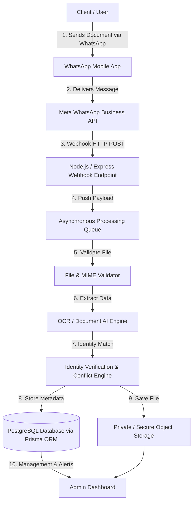
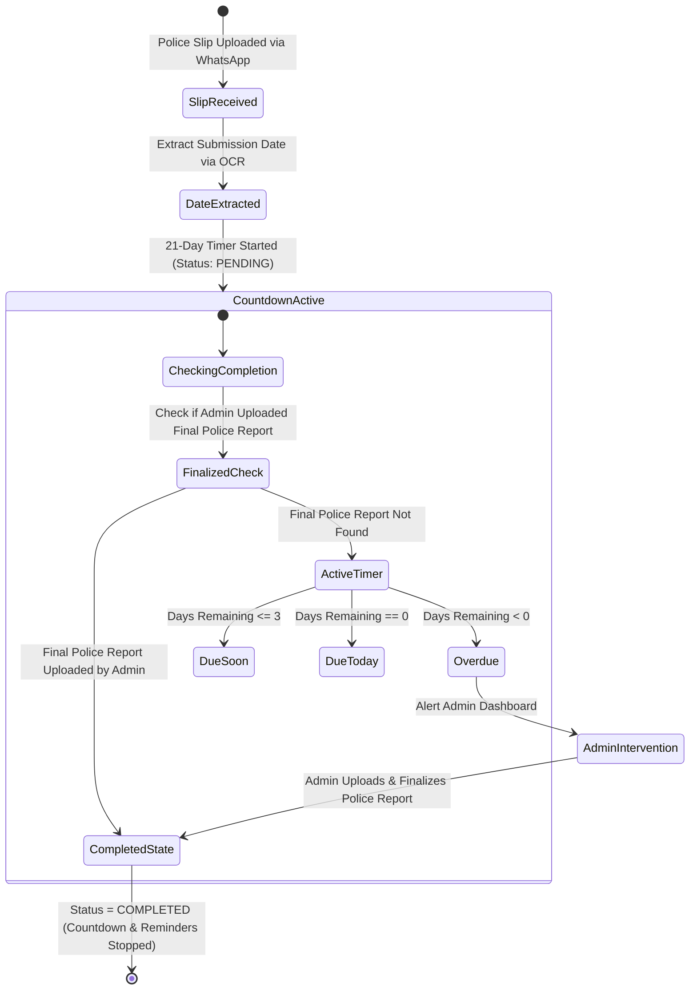
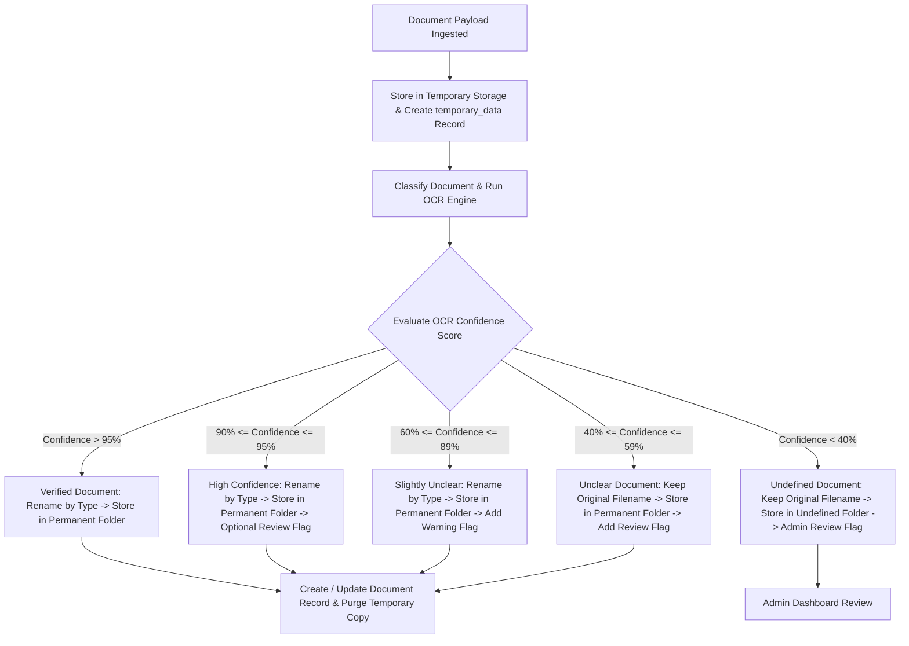
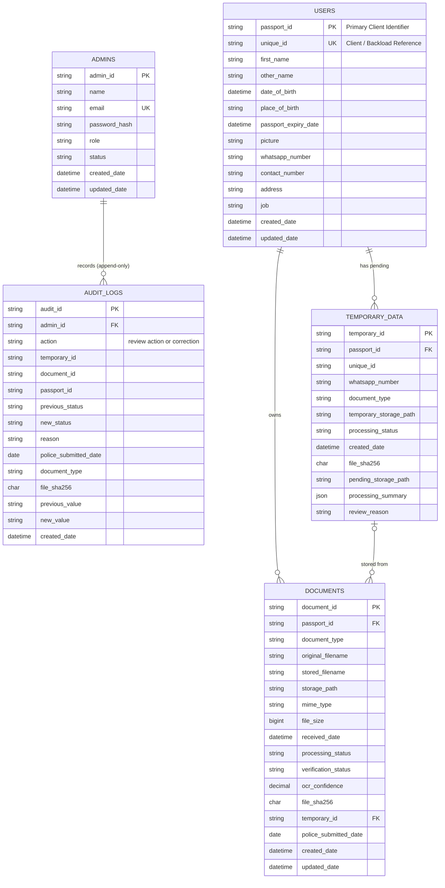

# Emlynk WhatsApp Document Processing Automation

[](https://nodejs.org/)
[](https://expressjs.com/)
[](https://www.postgresql.org/)
[](https://www.prisma.io/)
[](https://www.docker.com/)
[](LICENSE)

> A enterprise-grade Node.js backend automation system designed to ingest, process, classify, and verify client documents submitted via Meta WhatsApp Business API webhooks. Features automated passport OCR extraction, dual-identifier client reconciliation, confidence-based document routing, and a 21-day police report tracking lifecycle.

---

## Table of Contents

- [Project Overview](#project-overview)
- [Business Problem](#business-problem)
- [Solution Architecture](#solution-architecture)
- [Key Capabilities](#key-capabilities)
- [System Architecture & Workflows](#system-architecture--workflows)
  - [High-Level Architecture](#high-level-architecture)
  - [Police Report 21-Day Countdown Workflow](#police-report-21-day-countdown-workflow)
  - [Document Confidence Decision Engine](#document-confidence-decision-engine)
- [Database Architecture](#database-architecture)
  - [Core Database Schema & ER Diagram](#core-database-schema--er-diagram)
  - [Critical Identifier Distinction](#critical-identifier-distinction)
- [Technology Stack](#technology-stack)
- [Project Structure](#project-structure)
- [Current Implementation Status](#current-implementation-status)
- [Development Roadmap](#development-roadmap)
- [Getting Started](#getting-started)
  - [Prerequisites](#prerequisites)
  - [Environment Configuration](#environment-configuration)
  - [Database & Docker Setup](#database--docker-setup)
  - [Running the Application](#running-the-application)
- [Available API Endpoints](#available-api-endpoints)
- [Authentication Flow](#authentication-flow)
- [WhatsApp Webhook Integration](#whatsapp-webhook-integration)
- [Document Ingestion & Processing Lifecycle](#document-ingestion--processing-lifecycle)
- [Police Report Workflow Details](#police-report-workflow-details)
- [Security Considerations](#security-considerations)
- [Development Workflow & Git Conventions](#development-workflow--git-conventions)
- [Documentation Reference](#documentation-reference)
- [Project Status & License](#project-status--license)

---

## Project Overview

**Emlynk WhatsApp Document Processing Automation** is an automated backend solution built to streamline client onboarding and document collection operations. Clients submit essential verification documents—such as passports, police reports/slips, medical certificates, and required forms—directly through WhatsApp.

The system automatically receives document payloads via Webhooks, validates file types, performs Optical Character Recognition (OCR) / Document AI, extracts key identity data (e.g., Passport ID, full names, dates of birth), reconciles client records against existing database entries, routes documents based on OCR confidence, and alerts administrators to data conflicts or pending deadlines.

---

## Business Problem

Manual processing of client verification documents via messaging channels presents severe operational challenges:

1. **High Error & Misplacement Risk**: Manual downloading, renaming, and filing leads to lost records and misidentified documents.
2. **Data Overwrite & Identity Conflict**: Unchecked updates can silently overwrite verified client data with incorrect information from new submissions.
3. **Tracking Police Report Deadlines**: Police report slips require follow-up within a strict 21-day window. Tracking these manually across hundreds of clients causes compliance failures.
4. **Poor Document Quality**: Unclear or low-resolution document uploads stall processing without a clear audit trail or manual fallback.

---

## Solution Architecture

The Emlynk backend eliminates operational bottlenecks by establishing an automated, rule-based pipeline:

- **Automated Webhook Receiver**: Captures incoming WhatsApp media payloads securely via official Meta WhatsApp Business API webhooks.
- **Asynchronous Background Processing**: Moves file downloads, OCR, and storage tasks to background queues to maintain low endpoint latency.
- **Smart Identity Reconciliation**: Uses dual primary identifiers (`passport_id` as primary client key, `unique_id` as backload reference) and matches incoming WhatsApp sender numbers to safeguard existing records.
- **Multi-Tier Confidence Engine**: Routes documents based on OCR confidence thresholds, ensuring unclear or undefined files are preserved for manual administrator review rather than discarded or incorrectly filed.
- **21-Day Police Report Scheduler**: Automatically extracts submission dates from police slips, initiates a 21-day timer, and monitors status until an administrator uploads and finalizes the completed police report.

---

## Key Capabilities

- 📥 **WhatsApp Webhook Receiver**: Implements Meta webhook verification (`hub.verify_token`) and event ingestion handlers.
- 🔍 **Passport OCR & Extraction**: Extracts Passport ID, Full Name, DOB, Expiry Date, and Place of Birth using document intelligence.
- 🛡️ **Conflict-Aware Identity Matching**: Reconciles client identity using WhatsApp number and Passport ID; prevents silent overwriting of trusted database records.
- 📊 **Multi-Level Confidence Matrix**: Applies 5-tier confidence rules (>95%, 90-95%, 60-89%, 40-59%, <40%) for auto-renaming vs. warning flags vs. manual review routing.
- ⏱️ **Police Slip 21-Day Countdown**: Tracks police report slip submission dates; automatically suppresses reminder alerts once an administrator marks the final police report as `COMPLETED`.
- 📁 **Dual Storage Architecture**: Isolates pending/unclear uploads in `temporary_data` while routing verified files to structured client folders.
- 🔐 **Secure Admin Portal API**: Protected REST endpoints using `bcrypt` password hashing and JWT Bearer authentication (`/auth/login`, `/auth/me`).

---

## System Architecture & Workflows

### High-Level Architecture



---

### Police Report 21-Day Countdown Workflow



---

### Document Confidence Decision Engine



---

## Database Architecture

The backend database is intentionally structured into four core relational models managed via **Prisma ORM**:

```
+------------------+         +------------------+
|      admins      |         |      users       |
+------------------+         +------------------+
| admin_id (PK)    |         | passport_id (PK) |<----+
| email (UQ)       |         | unique_id (UQ)   |     |
| password_hash    |         | whatsapp_number  |     |
| role, status     |         +------------------+     |
+------------------+                  |               |
                                      | 1             | 1
                                      |               |
                                      | N             | N
                             +------------------+  +------------------+
                             |    documents     |  |  temporary_data  |
                             +------------------+  +------------------+
                             | document_id (PK) |  | temporary_id(PK) |
                             | passport_id (FK) |--+ passport_id (FK) |
                             | document_type    |  | whatsapp_number  |
                             | ocr_confidence   |  | document_type    |
                             +------------------+  +------------------+
```

### Core Database Schema & ER Diagram



### Critical Identifier Distinction

> [!IMPORTANT]
> **Primary Client Key vs Backload Reference**
> - **`users.passport_id`** is the primary client identifier and primary key throughout the application.
> - **`users.unique_id`** is a separate unique reference number used for client legacy mapping and backload tracking.
> - These two identifiers **must NOT** be treated as interchangeable in codebase logic, route parameters, or database queries.

---

## Technology Stack

### Currently Implemented Stack

| Layer | Technology | Purpose / Details |
|---|---|---|
| **Runtime** | Node.js `^22.18.0 || >=23.6.0` (`engines`; loads the generated TypeScript Prisma client directly) | ES Modules (`"type": "module"`) |
| **Web Framework** | Express.js (v5.2+) | HTTP routing & REST API backend |
| **Database** | PostgreSQL 16 | Relational data store running in Docker container |
| **ORM** | Prisma ORM (v6.19.3, `@prisma/client` and CLI) | Type-safe query engine & migration tool |
| **Driver Adapter** | `@prisma/adapter-pg` / `pg` | PostgreSQL native client adapter |
| **Containerization** | Docker & Docker Compose | Containerized local PostgreSQL service |
| **Security & Auth** | `bcrypt` (v6.0), `jsonwebtoken` (v9.0) | Password hashing & JWT access token middleware |
| **Configuration** | `dotenv` (v18.0) | Environment variable management |
| **OCR & PDF text** | `tesseract.js` (v7), `pdf-parse` (v2.4) | Passport/police/medical text extraction and scanned-PDF OCR (Phase 5) |
| **Object Storage** | Supabase Storage (`@supabase/supabase-js` v2), private bucket | `temporary/`, `clients/{passport_id}/…` and `pending/` folders (Phase 7) |
| **Admin Dashboard** | React 19, TypeScript, Vite, Tailwind CSS v4, React Router | `admin/` frontend, served by Express under `/admin` (Phase 10) |

### Planned Stack & Integrations

| Layer | Technology | Purpose |
|---|---|---|
| **Messaging Channel** | Meta WhatsApp Business API | Official cloud API webhook integration |
| **Background Processing** | Redis + BullMQ / Async Queue | Asynchronous long-running OCR and storage tasks |

---

## Project Structure

```text
EmlynkWABot/
├── .env                          # Local environment variables (git-ignored)
├── .gitignore                    # Version control exclusion rules
├── docker-compose.yml            # PostgreSQL 16 container definition
├── package.json                  # Node.js dependencies & scripts
├── package-lock.json             # Dependency lockfile
├── prisma7.config.ts             # Prisma CLI config (schema, migrations, datasource)
├── README.md                     # Project documentation
│
├── admin/                        # Admin dashboard (React + TypeScript + Vite), served at /admin
│   ├── vite.config.ts            # base /admin/, dev proxy to the backend, Vitest
│   └── src/                      # api/, auth/, layout/, pages/, components/, test/
│
├── Docs/                         # Project design specs & progress logs
│   ├── 01-initial-backend-database-setup.md
│   ├── 02-seed-data.md
│   ├── 03-admin-authentication.md
│   ├── Updates.txt
│   ├── WhatsApp-Document-Submission-Proposal.pdf
│   └── WhatsApp_Document_Processing_Project_Proposal_Final.md
│
├── scripts/                      # Operator tools (not part of the server)
│   ├── createAdmin.js            # npm run admin:create -- --name "…" --email …
│   ├── checkDatabaseConnection.js # npm run db:check
│   └── diagnoseDocument.js       # npm run diagnose:document
│
├── prisma/                       # Database schema & migrations
│   ├── schema.prisma             # Core models: Admin, User, Document, TemporaryData
│   ├── seed.js                   # Idempotent database seed script
│   └── migrations/               # SQL migration files
│
└── src/                          # Application source code
    ├── app.js                    # Express application entry point & routes
    ├── config/                   # Configuration adapters
    │   ├── env.js                # Startup check of required environment variables
    │   └── prisma.js             # Shared Prisma Client instance
    ├── middleware/               # HTTP middleware
    │   ├── auth.js               # JWT Bearer token authentication middleware
    │   └── verifyWhatsAppSignature.js # Meta webhook HMAC SHA-256 signature verification
    ├── routes/                   # API Route definitions
    │   ├── auth.js               # Admin authentication endpoints (/auth/login, /auth/me)
    │   └── whatsapp.js           # WhatsApp Webhook endpoints (/whatsapp/webhook)
    ├── services/                 # Business logic & integration services
    │   ├── documentClassificationService.js # Filename & MIME type document classifier
    │   ├── temporaryDataService.js          # DB service for temporary_data records
    │   ├── temporaryStorageService.js       # Disk storage service for temp uploads
    │   └── whatsappMediaService.js          # Graph API media URL fetcher & downloader
    └── utils/                    # Utility functions
        ├── fileValidation.js     # Document MIME type and size validator
        ├── messageIdempotency.js # WhatsApp message deduplication tracker
        ├── password.js           # Bcrypt hash generation and comparison
        └── whatsappMedia.js      # Document payload metadata extractor
```

---

## Current Implementation Status

| Feature / Module | Status | Verification & Notes |
|---|:---:|---|
| **Node.js & Express Setup** | ✅ Completed | Server initialized with ES modules & health endpoint (`GET /health`) |
| **Docker PostgreSQL Container** | ✅ Completed | Running PostgreSQL 16 container (`emlynk-postgres`) on port `5432` |
| **Prisma Schema & Models** | ✅ Completed | 4 core models defined (`admins`, `users`, `documents`, `temporary_data`) |
| **Initial Migration** | ✅ Completed | Initial migration executed via `prisma migrate dev` |
| **Database Seeding** | ✅ Completed | Idempotent seed script (`prisma/seed.js`) populating sample records |
| **Bcrypt Password Hashing** | ✅ Completed | Passwords hashed securely using `bcrypt` |
| **Admin Login Endpoint** | ✅ Completed | `POST /auth/login` verifies credentials and returns 1h JWT |
| **JWT Auth Middleware** | ✅ Completed | `authenticateAdmin` validates `Authorization: Bearer <token>` |
| **Protected Admin Route** | ✅ Completed | `GET /auth/me` returns authenticated admin profile |
| **WhatsApp Webhook Verification** | ✅ Completed | `GET /whatsapp/webhook` verifies Meta `hub.verify_token` |
| **WhatsApp Signature Verification** | ✅ Completed | `verifyWhatsappSignature` middleware validates HMAC SHA-256 Meta signatures |
| **WhatsApp Message Ingestion** | ✅ Completed | `POST /whatsapp/webhook` ingests payloads & extracts document metadata |
| **Message Deduplication & Idempotency** | ✅ Completed | `isMessageProcessed` & `markMessageAsProcessed` prevent duplicate message processing |
| **WhatsApp Media Download Service** | ✅ Completed | Fetches Graph API media URLs & downloads file buffers into backend |
| **Document File & MIME Validation** | ✅ Completed | `validateDocumentFile` checks MIME type constraints and size limits |
| **Temporary File & DB Storage** | ✅ Completed | Saves files in temp storage & creates `temporary_data` records via `createTemporaryDocumentRecord` |
| **Document Classification Engine** | ✅ Completed | Content-based classifier (passport, police slip, police report, medical) with filename hints — `Docs/06` |
| **Passport OCR & Full Extraction** | ✅ Completed | Tesseract.js OCR, scanned-PDF OCR, MRZ + printed-field extraction with check digits — `Docs/06` |
| **Identity Conflict Engine** | ✅ Completed | Passport/WhatsApp identity matrix, conflict detection, field reconciliation — `Docs/07` |
| **21-Day Police Report Countdown** | ⏳ Planned | Submission date extraction & background reminder scheduler |
| **Private Object Storage** | ✅ Completed | Private Supabase bucket, client folders, versioning, checksum duplicates, pending storage — `Docs/11`, `Docs/12` |
| **Admin Dashboard UI** | ✅ Completed (not deployed) | Overview, Documents, Review Queue, Review Detail (Approve, Keep Pending, Set Document Type, Assign Client, Remove from Review; audit log), Clients, Client Details (police slip date), Missing Documents, Police Workflow with search, Daily Report, Sync, Dark Mode — `Docs/14`, `Docs/15` |

---

## Development Roadmap

| Phase | Phase Name | Status | Key Deliverables |
|:---:|---|:---:|---|
| **Phase 1** | Existing System & Data Analysis | ✅ Completed | Excel workbook structure analysis, field mapping & migration rules |
| **Phase 2** | Database Preparation | ✅ Completed | Prisma ORM setup, core 4 models, migrations, DB seed script |
| **Phase 3** | WhatsApp Integration | ✅ Completed | Meta Webhook verification, HMAC SHA-256 signature verification & webhook route |
| **Phase 4** | Document Ingestion | ✅ Completed | WhatsApp Graph API media download, MIME validation & duplicate idempotency tracking |
| **Phase 5** | Classification & OCR | ✅ Completed | Content classification, OCR, confidence bands, passport fields, police slip date — `Docs/06` |
| **Phase 6** | Passport Verification | ✅ Completed | Identity matching rules, conflict detection & anti-overwrite checks — `Docs/07` |
| **Phase 7** | Permanent Storage | ✅ Completed | Structured folder naming, private cloud storage, checksums, pending storage — `Docs/11`, `Docs/12` |
| **Phase 8** | Temporary Workflow | ✅ Completed | Disk storage & `temporary_data` table integration for incoming unverified files |
| **Phase 9** | Police Report Countdown | 🚧 Partly | Done in Phase 10: slip submitted date stored (or set by an admin), calculated 21-day status (stops when a verified police report exists), dashboard views. Not done: reminders/warnings (Phase 11) |
| **Phase 10** | Admin Dashboard | ✅ Completed (migrations not yet applied to the live database) | Admin frontend and API; review actions (Approve, Keep Pending, Remove from Review; no reject) and corrections with an append-only audit log; Clients, Missing Documents, configurable required documents, Police Workflow, Daily Report (moved from Phase 11), Sync, Dark Mode |
| **Phase 11** | Reporting and Alerts | ⏳ Planned | Police-report reminders and warnings, alert notifications (the daily report is done in Phase 10) |
| **Phase 12** | Security, QA & Deployment | ⏳ Planned | Role-based authorization, load testing, production Docker container |

---

## Getting Started

### Prerequisites

Ensure you have the following installed on your machine:
- [Node.js](https://nodejs.org/) 22.18+ (or 23.6+). The server checks this at startup: the generated Prisma client is TypeScript that Node loads directly.
- [npm](https://www.npmjs.com/) (v9.0.0 or higher)
- [Docker Desktop](https://www.docker.com/products/docker-desktop/) (with Docker Compose)
- [Git](https://git-scm.com/)

---

### Environment Configuration

Create a `.env` file in the project root directory (you can copy values from `.env.example` if available):

```env
# Server Configuration
PORT=3000

# PostgreSQL Connection String (Docker Container)
DATABASE_URL="Add Databbase URl Here"

# JWT Authentication Secret
JWT_SECRET="your-super-secret-jwt-key-change-in-production"

# WhatsApp Business API Webhook Verification Token
WHATSAPP_VERIFY_TOKEN="Add whatsapp verify token here"

# Optional: documents every client must have (must include PASSPORT;
# allowed: PASSPORT, POLICE_SLIP, POLICE_REPORT, MEDICAL). Invalid values stop the server.
# REQUIRED_DOCUMENT_TYPES=PASSPORT,POLICE_REPORT,MEDICAL
```

`.env.example` lists every setting the server checks at startup.

> [!CAUTION]
> Never commit `.env` files or real production credentials to Git repositories.

---

### Database & Docker Setup

1. **Start PostgreSQL Container**:
   ```bash
   docker compose up -d
   ```
   Verify that the container is running:
   ```bash
   docker ps
   ```

2. **Generate Prisma Client**: `npm install` (and `npm ci --omit=dev` in production) runs it automatically (`postinstall`). Run it by hand after changing `schema.prisma`, or if dependencies were installed with `--ignore-scripts`:
   ```bash
   npx prisma generate
   ```
   The client goes to `generated/prisma` (not in git). Without it the server stops at startup with "The Prisma client is not generated".

3. **Run Database Migrations**:
   ```bash
   npx prisma migrate dev --name init_schema
   ```

4. **Seed Database with Sample Data**:
   ```bash
   npx prisma db seed
   ```

5. **(Optional) Inspect Database via Prisma Studio**:
   ```bash
   npx prisma studio
   ```

---

### Running the Application

Start the Express backend server:

```bash
npm start
```

Expected output:
```text
Server is running on http://localhost:3000
```

Verify backend health by visiting or requesting `http://localhost:3000/health`:
```json
{
  "status": "OK",
  "message": "Emlynk backend is running..!"
}
```

### Admin Dashboard

```bash
npm run admin:install   # once
npm run admin:dev       # development: http://localhost:5173/admin/ (proxies /auth and /api to :3000)
npm run admin:build     # production build into admin/dist, then `npm start`
                        # and open http://localhost:3000/admin/
npm run admin:test      # frontend tests
```

Sign in with an admin account created by `npm run admin:create`. Details: [`Docs/14-phase-10-admin-dashboard.md`](Docs/14-phase-10-admin-dashboard.md).

---

## Available API Endpoints

### System & Health

| Method | Endpoint | Protection | Description |
|---|---|:---:|---|
| `GET` | `/health` | Public | Returns service status and health message |
| `GET` | `/admin/*` | Public page, data behind JWT | Admin dashboard (built React app); client-side routes fall back to `index.html` |

---

### Authentication (`/auth`)

| Method | Endpoint | Protection | Request Payload / Query | Description |
|---|---|:---:|---|---|
| `POST` | `/auth/login` | Public | `{ "email": "...", "password": "..." }` | Authenticates admin using bcrypt and returns JWT token |
| `GET` | `/auth/me` | Protected (JWT) | `Header: Authorization: Bearer <token>` | Returns current authenticated administrator profile |

---

### Admin Dashboard API (`/api/admin`)

All routes need `Authorization: Bearer <token>` of an **ACTIVE** admin (checked against the database on every request). Reads, plus review actions and corrections — each writes an append-only audit entry; the admin always comes from the token. There is no reject endpoint, and nothing removes a pending item automatically. Details: [`Docs/14-phase-10-admin-dashboard.md`](Docs/14-phase-10-admin-dashboard.md), reference: [`Docs/15-admin-dashboard-reference.md`](Docs/15-admin-dashboard-reference.md).

| Method | Endpoint | Description |
|---|---|---|
| `GET` | `/api/admin/overview` | KPIs, client completeness, police counts, submission status/type summaries, recent documents, review-queue summary |
| `GET` | `/api/admin/documents` | Paginated, filterable, sortable list of stored documents |
| `GET` | `/api/admin/documents/missing` | Incomplete clients and their missing required documents; filter by type, search, paging |
| `POST` | `/api/admin/documents/:documentId/police-date` | Set or correct a stored police slip's submitted date (reason required; audited) |
| `GET` | `/api/admin/clients` | Clients directory: search (passport ID, unique ID, name, WhatsApp), complete/incomplete, missing type, paging, counts |
| `GET` | `/api/admin/clients/:passportId` | Client profile, documents, required-document status, police documents and slip date changes |
| `GET` | `/api/admin/reports/daily` | Daily report for a Sri Lanka business date (`?date=YYYY-MM-DD`, default today): daily and current figures |
| `GET` | `/api/admin/review` | Review queue: waiting files and REVIEW_REQUIRED documents, with review reasons |
| `GET` | `/api/admin/review/:reviewId` | One review item: reason, identity, sender, processing summary, file info |
| `GET` | `/api/admin/review/:reviewId/file` | The item's file, streamed from private storage for the in-page preview |
| `POST` | `/api/admin/review/:reviewId/approve` | Approve: waiting file moved to the client folder as VERIFIED (or stored document marked VERIFIED); audit entry |
| `POST` | `/api/admin/review/:reviewId/keep-pending` | Keep Pending with a required reason: item stays pending and in the queue; audit entry |
| `POST` | `/api/admin/review/:reviewId/remove` | Remove from Review (waiting files only, reason required): file, temporary original and record permanently deleted; audit entry kept. Never automatic |
| `POST` | `/api/admin/review/:reviewId/document-type` | Set the document type of a waiting file (reason required); it stays pending |
| `POST` | `/api/admin/review/:reviewId/assign-client` | Link a waiting file to an existing client (reason required); no client is created, no number changed |
| `GET` | `/api/admin/police` | Police Workflow: every client's 21-day status (overdue, due today, due soon, pending, date missing, not uploaded, completed), search, filter and paging |

---

### WhatsApp Webhooks (`/whatsapp`)

| Method | Endpoint | Protection | Request Payload / Query | Description |
|---|---|:---:|---|---|
| `GET` | `/whatsapp/webhook` | Meta Token | `?hub.mode=subscribe&hub.verify_token=...&hub.challenge=...` | Verifies Meta WhatsApp webhook integration token |
| `POST` | `/whatsapp/webhook` | Meta Webhook | JSON Payload | Ingests incoming WhatsApp message & document events |

---

## Authentication Flow

Administrator access to sensitive client data and dashboard management is protected using a stateless JWT authentication strategy:

```
[ Client Application / Postman ]
               |
               | 1. POST /auth/login { email, password }
               v
[ Auth Route: /auth/login ]
               |
               | 2. Query admin record by email
               v
[ PostgreSQL (admins table) ]
               |
               | 3. Returns admin_id & password_hash
               v
[ Bcrypt Password Verification ]
               |
               +---> (Hash Mismatch) ---> Return HTTP 401 "Invalid email or password"
               |
               +---> (Hash Valid)
                       |
                       | 4. Sign JWT Payload (adminId, email, role) - Exp: 1h
                       v
               [ Return HTTP 200 { token: "eyJhbGci..." } ]

--------------------------------------------------------------------------------

[ Protected Route Request ]
               |
               | 1. GET /auth/me
               |    Header: Authorization: Bearer eyJhbGci...
               v
[ Auth Middleware: authenticateAdmin ]
               |
               | 2. Verify JWT signature via JWT_SECRET
               v
[ Attach req.admin Payload & Proceed ] ---> [ Return HTTP 200 Admin Profile ]
```

---

## WhatsApp Webhook Integration

The backend exposes a dedicated Webhook router (`src/routes/whatsapp.js`) compatible with the official Meta WhatsApp Business API:

1. **Verification Request (`GET /whatsapp/webhook`)**:
   - Meta sends query parameters: `hub.mode`, `hub.verify_token`, and `hub.challenge`.
   - The route validates `hub.mode === "subscribe"` and checks `hub.verify_token` against `process.env.WHATSAPP_VERIFY_TOKEN`.
   - On match, it returns HTTP 200 with `hub.challenge` as raw text to confirm verification.

2. **Event Ingestion (`POST /whatsapp/webhook`)**:
   - Meta posts webhook JSON payloads containing incoming messages, document attachments, sender phone numbers, and timestamps.
   - Handlers respond immediately with HTTP 200 to acknowledge payload receipt, offloading heavy media downloads and OCR processing to background queues.

---

## Document Ingestion & Processing Lifecycle

```
[ Ingested Document Payload ]
             |
             v
[ Temporary File Storage & temporary_data Record Created ]
             |
             v
[ Format & MIME Type Validation ]
             |
             v
[ Passport OCR / Document AI Text Extraction ]
             |
             v
[ Identity Matching: WhatsApp Number + Passport ID ]
             |
   +---------+---------+
   |                   |
 (Match Found)   (New Client / Conflict)
   |                   |
   v                   v
[ Update Record ] [ Create New / Flag Conflict ]
             |
             v
[ Evaluate OCR Confidence Score ]
             |
  +----------+----------+-------------------+-------------------+
  | (>95%)              | (90-95%)          | (60-89%)          | (<60%)
  v                     v                   v                   v
[ Auto-Rename ]      [ Auto-Rename ]     [ Auto-Rename ]     [ Keep Original Name ]
[ Permanent Upload ] [ Permanent Upload ][ Permanent Upload ][ Store in Undefined ]
[ Status: VERIFIED ] [ Add Review Flag ] [ Add Warning Flag ][ Flag for Admin Review ]
```

---

## Police Report Workflow Details

The system handles police report submission tracking with a strict 21-day lifecycle logic:

1. **Slip Ingestion**: Client uploads a police report slip/receipt via WhatsApp.
2. **Date Extraction**: OCR extracts the official submission date from the slip.
3. **Countdown Trigger**: A 21-day timer begins based on the submission date.
4. **Completion Checking**: Before sending reminder warnings, the system checks if an administrator has uploaded and finalized the actual official police report.
5. **Admin Completion**: Once the finalized police report document record is created by an administrator, the status transitions to **`COMPLETED`**.
6. **Automatic Warning Suppression**: Transitioning to `COMPLETED` immediately halts the 21-day countdown and cancels all automated due-soon, due-today, and overdue warning notifications.

---

## Security Considerations

- 🔑 **Credential Isolation**: All sensitive environment variables, database strings, and API secrets are loaded exclusively via `.env` and kept out of Git repositories.
- 🔒 **Password Hashing**: Passwords are never stored in plain text. Hashing is enforced via `bcrypt` with a default salt factor of 10.
- 🛡️ **JWT Expiration & Authorization**: Admin access tokens expire after 1 hour and must be transmitted in HTTP `Authorization` headers using the standard `Bearer` scheme.
- 🙅 **Generic Error Responses**: Authentication failure messages refrain from indicating whether a specific user email exists in the system.
- 🛑 **Data Overwrite Prevention**: Low-confidence OCR results or unverified identity matches are prevented from silently overwriting existing trusted user profile data.

---

## Development Workflow & Git Conventions

The project enforces a process-level, checkpoint-based Git development workflow:

```text
Implement Single Process -> Test & Verify -> Update Docs -> Git Commit Checkpoint -> Next Process
```

### Commit Message Standards

Commit messages must adhere to conventional prefix standard:

| Prefix | Category | Example |
|---|---|---|
| `feat:` | New feature | `feat: add admin login endpoint with bcrypt verification` |
| `fix:` | Bug fix | `fix: handle missing authorization header gracefully` |
| `chore:` | Setup / Tooling | `chore: setup PostgreSQL container in docker-compose` |
| `docs:` | Documentation | `docs: document admin authentication flow` |
| `test:` | Testing | `test: add unit test for password hashing utility` |
| `refactor:` | Restructuring | `refactor: extract prisma client initialization into config` |

---

## Documentation Reference

Comprehensive setup logs, implementation history, and architectural proposals are maintained under the [`Docs/`](file:///c:/Users/Shamal%20Sathsara/OneDrive/Desktop/EmlynkWABot/Docs) directory:

- 📄 [`Docs/01-initial-backend-database-setup.md`](file:///c:/Users/Shamal%20Sathsara/OneDrive/Desktop/EmlynkWABot/Docs/01-initial-backend-database-setup.md): Node.js init, Docker PostgreSQL, & Prisma setup log.
- 📄 [`Docs/02-seed-data.md`](file:///c:/Users/Shamal%20Sathsara/OneDrive/Desktop/EmlynkWABot/Docs/02-seed-data.md): Database seeding documentation and sample entity records.
- 📄 [`Docs/03-admin-authentication.md`](file:///c:/Users/Shamal%20Sathsara/OneDrive/Desktop/EmlynkWABot/Docs/03-admin-authentication.md): Admin authentication, bcrypt hashing, and JWT middleware specs.
- 📄 [`Docs/13-security-overview.md`](Docs/13-security-overview.md): Security status, controls and findings.
- 📄 [`Docs/14-phase-10-admin-dashboard.md`](Docs/14-phase-10-admin-dashboard.md): Admin dashboard development log: structure, API, migrations, tests and decisions per checkpoint.
- 📄 [`Docs/15-admin-dashboard-reference.md`](Docs/15-admin-dashboard-reference.md): Admin dashboard reference: every screen, action, rule and setting, and the decisions that differ from the proposal.
- 📄 [`Docs/WhatsApp_Document_Processing_Project_Proposal_Final.md`](file:///c:/Users/Shamal%20Sathsara/OneDrive/Desktop/EmlynkWABot/Docs/WhatsApp_Document_Processing_Project_Proposal_Final.md): Complete technical design proposal & specification.

---

## Project Status & License

- **Project Status**: Active Development (Backend Foundation Complete; WhatsApp Integration & Document Pipeline in progress)
- **License**: ISC License (Internal Project for Emlynk)
