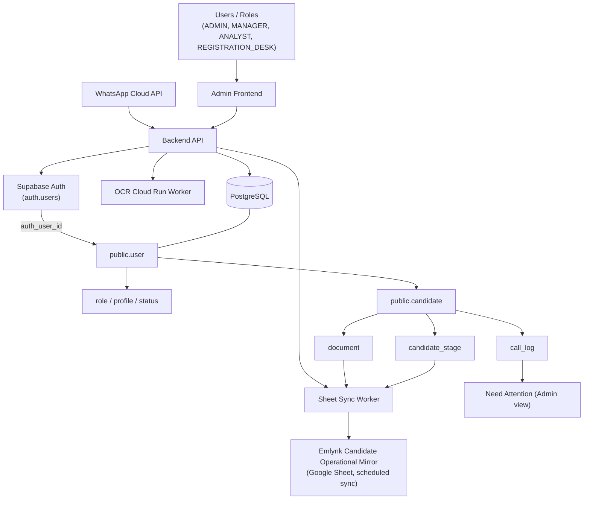
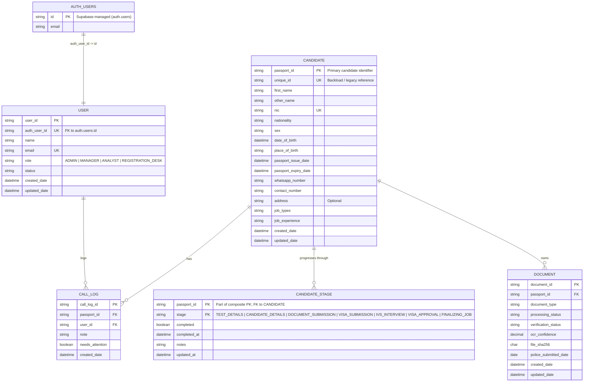
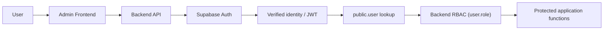
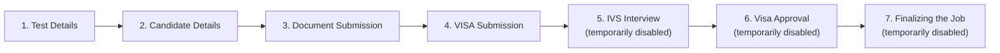
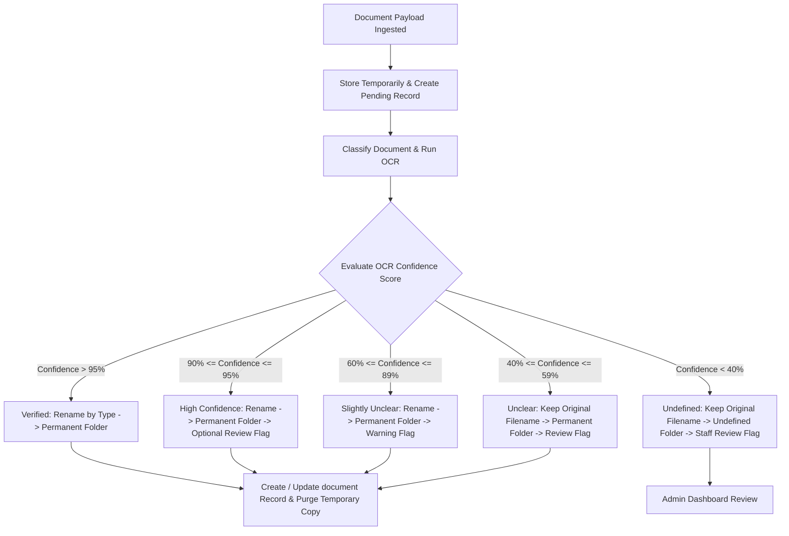
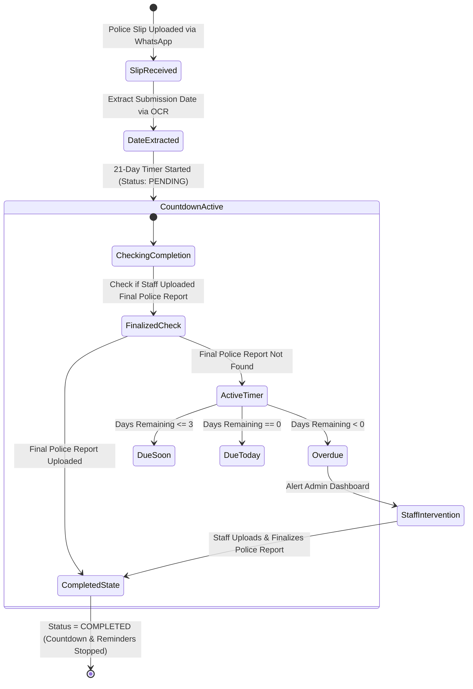
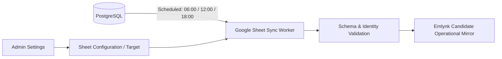

# Emlynk Candidate Recruitment & Document Automation

[](https://nodejs.org/)
[](https://expressjs.com/)
[](https://www.postgresql.org/)
[](https://www.prisma.io/)
[](https://supabase.com/)
[](https://www.docker.com/)
[](LICENSE)

> An enterprise-grade recruitment automation platform. Candidates submit verification documents over WhatsApp; staff manage the full recruitment pipeline — registration, document review, interviews and visa processing — from an admin dashboard backed by Supabase Auth, role-based authorization, OCR extraction, and a one-way Google Sheet operational mirror.

> [!NOTE]
> This README defines the target architecture and approved product specification. Some implementation changes described here are scheduled for migration and may not yet exist in the current codebase.

---

## Table of Contents

- [Project Overview](#project-overview)
  - [Business Problem](#business-problem)
  - [Solution Architecture](#solution-architecture)
- [Key Capabilities](#key-capabilities)
- [User Roles](#user-roles)
- [High-Level Architecture](#high-level-architecture)
- [Database Architecture](#database-architecture)
  - [candidate](#candidate)
  - [user](#user)
  - [document](#document)
  - [candidate_stage](#candidate_stage)
  - [call_log](#call_log)
  - [Supabase-Managed Identity (auth.users)](#supabase-managed-identity-authusers)
- [ER Diagram](#er-diagram)
- [Authentication & Authorization](#authentication--authorization)
  - [Authentication — Supabase Auth](#authentication--supabase-auth)
  - [Authorization — Backend RBAC](#authorization--backend-rbac)
- [User Invitation Flow](#user-invitation-flow)
- [Candidate Registration](#candidate-registration)
  - [WhatsApp Number Format](#whatsapp-number-format)
  - [Required & Optional Fields](#required--optional-fields)
  - [Field Hints](#field-hints)
- [Candidate Progress Flow](#candidate-progress-flow)
- [Document Processing](#document-processing)
  - [Single Scan Rule](#single-scan-rule)
  - [Document Confidence Decision Engine](#document-confidence-decision-engine)
  - [Police Report 21-Day Countdown Workflow](#police-report-21-day-countdown-workflow)
- [WhatsApp Integration](#whatsapp-integration)
- [OCR Service](#ocr-service)
- [Google Sheet Operational Mirror](#google-sheet-operational-mirror)
  - [Scheduled Sync](#scheduled-sync)
  - [Multi-Sheet Configuration](#multi-sheet-configuration)
  - [Document Status Mapping](#document-status-mapping)
  - [Sync Safety Principles](#sync-safety-principles)
- [Call Logs & Need Attention](#call-logs--need-attention)
- [Daily Reports](#daily-reports)
- [Settings & Administration](#settings--administration)
- [Security](#security)
- [Technology Stack](#technology-stack)
- [Project Structure](#project-structure)
- [Environment & Setup](#environment--setup)
  - [Prerequisites](#prerequisites)
  - [Environment Configuration](#environment-configuration)
  - [Database & Docker Setup](#database--docker-setup)
  - [Running the Application](#running-the-application)
- [Available API Endpoints](#available-api-endpoints)
- [Development Roadmap](#development-roadmap)
- [Development Workflow & Git Conventions](#development-workflow--git-conventions)
- [Documentation Reference](#documentation-reference)
- [Project Status & License](#project-status--license)

---

## Project Overview

**Emlynk** streamlines recruitment candidate onboarding, document collection and deployment tracking. Candidates submit verification documents — passports, police reports/slips, medical certificates and other required forms — directly through WhatsApp. Staff (ADMIN, MANAGER, ANALYST, REGISTRATION_DESK) manage the candidate through a single pipeline: registration, document review, interviews, visa processing and job finalization, from one admin dashboard.

The system receives document payloads via WhatsApp webhooks, performs OCR/Document AI extraction, reconciles candidate records against existing entries, routes documents by OCR confidence, tracks the police report 21-day deadline, and mirrors operational state to a Google Sheet for staff who work outside the dashboard.

### Business Problem

Manual processing of candidate verification documents via messaging channels presents severe operational challenges:

1. **High Error & Misplacement Risk**: Manual downloading, renaming, and filing leads to lost records and misidentified documents.
2. **Data Overwrite & Identity Conflict**: Unchecked updates can silently overwrite verified candidate data with incorrect information from new submissions.
3. **Tracking Police Report Deadlines**: Police report slips require follow-up within a strict 21-day window. Tracking these manually across hundreds of candidates causes compliance failures.
4. **Poor Document Quality**: Unclear or low-resolution document uploads stall processing without a clear audit trail or manual fallback.
5. **Fragmented Visibility**: Staff who track candidates in a spreadsheet lose sync with the system of record, and call notes that need follow-up get lost in long histories.

### Solution Architecture

- **Automated Webhook Receiver**: Captures incoming WhatsApp media payloads securely via the official Meta WhatsApp Business API.
- **Asynchronous Background Processing**: Moves file downloads, OCR, and storage tasks to background queues to maintain low endpoint latency.
- **Smart Identity Reconciliation**: Uses dual identifiers (`candidate.passport_id` as the primary key, `candidate.unique_id` as a backload/legacy reference) and matches incoming WhatsApp sender numbers to safeguard existing records.
- **Multi-Tier Confidence Engine**: Routes documents based on OCR confidence thresholds, preserving unclear or undefined files for manual staff review rather than discarding or misfiling them.
- **21-Day Police Report Scheduler**: Extracts submission dates from police slips, starts a 21-day timer, and tracks status until staff upload and finalize the completed police report.
- **Candidate Progress Pipeline**: A fixed sequence of stages (registration through job finalization) staff advance a candidate through, each independently trackable.
- **Supabase-Backed Identity**: Supabase Auth owns authentication; the application's own `user` table owns staff profile, role and authorization.
- **One-Way Operational Mirror**: A scheduled worker mirrors candidate/document/stage state to a Google Sheet for staff who need a spreadsheet view; the database is always the source of truth.

---

## Key Capabilities

- 📥 **WhatsApp Candidate Intake**: Meta webhook verification (`hub.verify_token`) and event ingestion for candidate-submitted documents.
- 🔍 **Passport OCR & Extraction**: Extracts Passport ID, full name, DOB, expiry date and place of birth via a dedicated OCR service.
- 🛡️ **Conflict-Aware Identity Matching**: Reconciles candidate identity using WhatsApp number and Passport ID; prevents silent overwriting of trusted records.
- 📊 **Multi-Level Confidence Matrix**: 5-tier OCR confidence rules (>95%, 90–95%, 60–89%, 40–59%, <40%) drive auto-renaming vs. warning flags vs. manual review routing.
- ⏱️ **Police Slip 21-Day Countdown**: Tracks police report slip submission dates; suppresses reminders once staff mark the final police report `COMPLETED`.
- 📁 **Single-Scan Document Model**: One scan slot per candidate — no separate agreement/affidavit/contract slots to manage.
- 🔐 **Supabase-Secured Admin Portal**: Supabase Auth identity plus backend role-based authorization (`ADMIN` / `MANAGER` / `ANALYST` / `REGISTRATION_DESK`) guards every protected route.
- 🧭 **Candidate Progress Pipeline**: Test Details → Candidate Details → Document Submission → VISA Submission → IVS Interview → Visa Approval → Finalizing the Job.
- 📞 **Call Logs with Need Attention**: Any call note can be escalated to a dedicated Admin "Need Attention" view without leaving the candidate's history.
- 📄 **Google Sheet Operational Mirror**: Scheduled, one-way database → Sheet sync (06:00 / 12:00 / 18:00) for staff who work from a spreadsheet.
- 📈 **Role-Scoped Daily Reports**: Summary, Analyst, Registration Desk and Admin report views, plus a full operational export.

---

## User Roles

Staff are never uniformly "admins" — every staff member is a `user` with exactly one role, enforced per-endpoint by backend RBAC:

| Role | Access |
|---|---|
| `ADMIN` | Full access, including staff/user management, Settings and Sheet configuration |
| `MANAGER` | Full access except staff/user management |
| `ANALYST` | Reads, plus review actions and candidate workflow updates (stages, call logs, document review) |
| `REGISTRATION_DESK` | Full access to the **Candidate** section — registration, candidate details, progress stages, documents and call logs for the complete candidate process. No access to Admin-only functions (staff management, Settings, Sheet configuration) |

Use "staff", "user", or the specific role name (e.g. "an ANALYST") rather than describing every system user as "an admin".

---

## High-Level Architecture


```mermaid
flowchart TD
    Roles["Users / Roles<br/>(ADMIN, MANAGER, ANALYST, REGISTRATION_DESK)"] --> Frontend[Admin Frontend]
    WA[WhatsApp Cloud API] --> Backend[Backend API]
    Frontend --> Backend

    Backend --> SupaAuth["Supabase Auth<br/>(auth.users)"]
    Backend --> OCR["OCR Cloud Run Worker"]
    Backend --> DB[(PostgreSQL)]
    Backend --> SheetWorker["Sheet Sync Worker"]

    SupaAuth -->|auth_user_id| PublicUser["public.user"]
    DB --- PublicUser
    PublicUser --> RoleProfile["role / profile / status"]
    PublicUser --> Candidate["public.candidate"]

    Candidate --> Document["document"]
    Candidate --> Stage["candidate_stage"]
    Candidate --> CallLog["call_log"]

    SheetWorker --> SheetMirror["Emlynk Candidate Operational Mirror<br/>(Google Sheet, scheduled sync)"]
    Document --> SheetWorker
    Stage --> SheetWorker
    CallLog --> NeedAttention["Need Attention (Admin view)"]
```

Separate services behind this diagram:

- **Admin Frontend** — React/TypeScript dashboard used by staff.
- **Backend API** — Express/Prisma REST API; the only service with database and Supabase service-role access.
- **Supabase Auth** — authentication identity provider (see [Authentication & Authorization](#authentication--authorization)).
- **OCR Cloud Run Worker** (`ocr-worker/`) — isolated text-extraction service (see [OCR Service](#ocr-service)).
- **Sheet Sync Worker** — scheduled job that mirrors candidate data to Google Sheets (see [Google Sheet Operational Mirror](#google-sheet-operational-mirror)).

---

## Database Architecture

The application database uses singular table names. There are no legacy tables, compatibility views, or parallel old/new schemas — the system is pre-production and existing data is test data, so the migration goes directly to this schema.

### candidate

Candidate identity, contact details, passport information and recruitment data. `passport_id` is the primary identifier used throughout the application; `unique_id` is a separate backload/legacy reference and must never be treated as interchangeable with `passport_id` in code, routes, or queries.

### user

Staff profiles: name, email, role, status. Authenticated via Supabase Auth; linked by `user.auth_user_id` → `auth.users.id`. Holds no password or session data of its own — that belongs to `auth.users`.

### document

One row per submitted file: document type, verification/processing status, OCR confidence, and (for police slips) the submitted date that drives the 21-day countdown. See [Single Scan Rule](#single-scan-rule) — a candidate has one scan slot, not a growing set of document types.

### candidate_stage

One row per candidate per pipeline stage (see [Candidate Progress Flow](#candidate-progress-flow)): completion state, timestamp, and staff notes. Stages are independent — any can be completed in any order, except where the UI temporarily disables a stage.

### call_log

Staff call notes for a candidate, with an optional `needs_attention` flag (see [Call Logs & Need Attention](#call-logs--need-attention)). Flagging a call never moves or deletes it — it stays in the candidate's history and additionally appears in the Admin "Need Attention" view.

### Supabase-Managed Identity (`auth.users`)

Supabase owns `auth.users` — authentication identity, credentials, sessions, JWTs, invitation/auth flows and password recovery. It is **not** renamed or restructured by this application; `user.auth_user_id` references `auth.users.id`, and `auth.users` never stores application profile, role, or candidate data.

Operational/support tables (rate-limit counters, Sheet sync queue and run state) exist alongside this core schema as infrastructure, not business data, and are not part of the diagrams above.

---

## ER Diagram


```mermaid
erDiagram
    AUTH_USERS {
        string id PK "Supabase-managed (auth.users)"
        string email
    }

    USER {
        string user_id PK
        string auth_user_id UK "FK to auth.users.id"
        string name
        string email UK
        string role "ADMIN | MANAGER | ANALYST | REGISTRATION_DESK"
        string status
        datetime created_date
        datetime updated_date
    }

    CANDIDATE {
        string passport_id PK "Primary candidate identifier"
        string unique_id UK "Backload / legacy reference"
        string first_name
        string other_name
        string nic UK
        string nationality
        string sex
        datetime date_of_birth
        string place_of_birth
        datetime passport_issue_date
        datetime passport_expiry_date
        string whatsapp_number
        string contact_number
        string address "Optional"
        string job_types
        string job_experience
        datetime created_date
        datetime updated_date
    }

    DOCUMENT {
        string document_id PK
        string passport_id FK
        string document_type
        string processing_status
        string verification_status
        decimal ocr_confidence
        char file_sha256
        date police_submitted_date
        datetime created_date
        datetime updated_date
    }

    CANDIDATE_STAGE {
        string passport_id PK "Part of composite PK; FK to CANDIDATE"
        string stage PK "TEST_DETAILS | CANDIDATE_DETAILS | DOCUMENT_SUBMISSION | VISA_SUBMISSION | IVS_INTERVIEW | VISA_APPROVAL | FINALIZING_JOB"
        boolean completed
        datetime completed_at
        string notes
        datetime updated_at
    }

    CALL_LOG {
        string call_log_id PK
        string passport_id FK
        string user_id FK
        string note
        boolean needs_attention
        datetime created_date
    }

    AUTH_USERS ||--|| USER : "auth_user_id -> id"
    CANDIDATE ||--o{ DOCUMENT : "owns"
    CANDIDATE ||--o{ CANDIDATE_STAGE : "progresses through"
    CANDIDATE ||--o{ CALL_LOG : "has"
    USER ||--o{ CALL_LOG : "logs"
```

---

## Authentication & Authorization

Authentication (who you are) and authorization (what you can do) are handled by two different layers.


```mermaid
flowchart LR
    U[User] --> Frontend[Admin Frontend]
    Frontend --> Backend[Backend API]
    Backend --> SupaAuth[Supabase Auth]
    SupaAuth --> JWT["Verified identity / JWT"]
    JWT --> Lookup["public.user lookup"]
    Lookup --> RBAC["Backend RBAC (user.role)"]
    RBAC --> Functions["Protected application functions"]
```

### Authentication — Supabase Auth

Supabase Auth is the sole identity provider: it issues and verifies JWTs, manages sessions, and handles invitation and password-recovery emails. The backend never stores a password or session token of its own. No service-role keys, tokens, or other credentials are documented here — they are runtime secrets, not README content.

### Authorization — Backend RBAC

Once a request carries a verified Supabase identity, the backend resolves the matching `public.user` row and authorizes the action against `user.role` — one of `ADMIN`, `MANAGER`, `ANALYST`, `REGISTRATION_DESK` (see [User Roles](#user-roles)). Backend RBAC is the application's security boundary for every protected route; Supabase confirms identity, the backend decides access.

---

## User Invitation Flow

Staff invitations are not limited to admins — any of the four roles can be invited. The sidebar/menu action is **"Invite User"**, not "Invite Admin".

```
Admin
    ->
Invite User
    ->
enter email
    ->
select role (ADMIN, MANAGER, ANALYST, or REGISTRATION_DESK)
    ->
backend uses trusted Supabase Auth admin functionality
    ->
Supabase sends invite/setup link
    ->
invited user opens link
    ->
user sets password
    ->
Supabase authenticates user
    ->
application loads the matching public.user profile and role
```

"Invite User" lives inside [Settings & Administration](#settings--administration), alongside role management and Sheet configuration.

---

## Candidate Registration

### WhatsApp Number Format

The WhatsApp number field is **not** hardcoded to `+94`. The rule:

- the field always starts with a fixed, non-removable `+`
- the candidate's own country code and number are entered after it
- any valid international number is supported, e.g. `+94771234567`, `+447911123456`, `+61412345678`

### Required & Optional Fields

| Field | Requirement |
|---|---|
| WhatsApp number | Required |
| NIC | Required |
| Address | **Optional** |
| Passport issue date | **Required** |
| Passport expiry date | **Required** |
| Job type(s) | Required |
| Job experience | Required |

Other existing candidate field validations not listed above (e.g. NIC format, date ordering) remain unchanged.

### Field Hints

Candidate registration fields support short, unobtrusive hints — a small info/exclamation icon next to the field, revealed on hover or click, never a full inline paragraph. For example, the Passport Number field explains the accepted passport-number format.

---

## Candidate Progress Flow


```mermaid
flowchart LR
    S1["1. Test Details"] --> S2["2. Candidate Details"]
    S2 --> S3["3. Document Submission"]
    S3 --> S4["4. VISA Submission"]
    S4 --> S5["5. IVS Interview<br/>(temporarily disabled)"]
    S5 --> S6["6. Visa Approval<br/>(temporarily disabled)"]
    S6 --> S7["7. Finalizing the Job<br/>(temporarily disabled)"]
```

Stages are tracked independently in `candidate_stage`; a candidate can have any subset completed. **VISA Submission** is a new stage whose primary action is document upload (the candidate's scan, routed through the same [Single Scan Rule](#single-scan-rule) as every other document). IVS Interview, Visa Approval and Finalizing the Job remain part of the architecture and schema but are **temporarily disabled** in the UI — shown, not removed, and not selectable until re-enabled.

---

## Document Processing

### Single Scan Rule

**There is only one scan.** A candidate has a single scan slot in `document`, not separate agreement, affidavit or contract slots. Do not introduce additional scan categories; a new document requirement is a new `document_type` value on the same single slot, not a new slot.

### Document Confidence Decision Engine


```mermaid
flowchart TD
    Doc[Document Payload Ingested] --> Temp[Store Temporarily & Create Pending Record]
    Temp --> Classify[Classify Document & Run OCR]
    Classify --> ConfCheck{Evaluate OCR Confidence Score}

    ConfCheck -->|Confidence > 95%| Clear[Verified: Rename by Type -> Permanent Folder]
    ConfCheck -->|90% <= Confidence <= 95%| High[High Confidence: Rename -> Permanent Folder -> Optional Review Flag]
    ConfCheck -->|60% <= Confidence <= 89%| Mid[Slightly Unclear: Rename -> Permanent Folder -> Warning Flag]
    ConfCheck -->|40% <= Confidence <= 59%| Unclear[Unclear: Keep Original Filename -> Permanent Folder -> Review Flag]
    ConfCheck -->|Confidence < 40%| Undefined[Undefined: Keep Original Filename -> Undefined Folder -> Staff Review Flag]

    Clear --> UpdateDB[Create / Update document Record & Purge Temporary Copy]
    High --> UpdateDB
    Mid --> UpdateDB
    Unclear --> UpdateDB
    Undefined --> StaffReview[Admin Dashboard Review]
```

### Police Report 21-Day Countdown Workflow


```mermaid
stateDiagram-v2
    [*] --> SlipReceived: Police Slip Uploaded via WhatsApp
    SlipReceived --> DateExtracted: Extract Submission Date via OCR
    DateExtracted --> CountdownActive: 21-Day Timer Started (Status: PENDING)

    state CountdownActive {
        [*] --> CheckingCompletion
        CheckingCompletion --> FinalizedCheck: Check if Staff Uploaded Final Police Report
        FinalizedCheck --> CompletedState: Final Police Report Uploaded
        FinalizedCheck --> ActiveTimer: Final Police Report Not Found

        ActiveTimer --> DueSoon: Days Remaining <= 3
        ActiveTimer --> DueToday: Days Remaining == 0
        ActiveTimer --> Overdue: Days Remaining < 0
    }

    CompletedState --> [*]: Status = COMPLETED (Countdown & Reminders Stopped)
    Overdue --> StaffIntervention: Alert Admin Dashboard
    StaffIntervention --> CompletedState: Staff Uploads & Finalizes Police Report
```

1. **Slip Ingestion**: Candidate uploads a police report slip/receipt via WhatsApp.
2. **Date Extraction**: OCR extracts the official submission date from the slip.
3. **Countdown Trigger**: A 21-day timer begins based on the submission date.
4. **Completion Checking**: Before sending reminders, the system checks whether staff have uploaded and finalized the actual police report.
5. **Staff Completion**: Once the finalized police report record is created, the status transitions to `COMPLETED`.
6. **Automatic Warning Suppression**: Transitioning to `COMPLETED` halts the countdown and cancels all due-soon, due-today and overdue notifications.

---

## WhatsApp Integration

The backend exposes a dedicated webhook router compatible with the official Meta WhatsApp Business API:

1. **Verification Request (`GET /whatsapp/webhook`)**: Meta sends `hub.mode`, `hub.verify_token` and `hub.challenge`; the route validates `hub.mode === "subscribe"` and checks the token against `WHATSAPP_VERIFY_TOKEN`, returning `hub.challenge` as raw text on match.
2. **Event Ingestion (`POST /whatsapp/webhook`)**: Meta posts incoming messages, document attachments, sender numbers and timestamps. The handler acknowledges with HTTP 200 immediately, offloading media download and OCR to background processing so Meta's delivery never waits on it.
3. **Signature Verification**: Every webhook payload is validated against Meta's HMAC SHA-256 signature before processing.
4. **Candidate Matching**: The sending WhatsApp number is matched against `candidate.whatsapp_number` (see [WhatsApp Number Format](#whatsapp-number-format) for the accepted format), with Passport ID as the secondary identifier for conflict detection.

---

## OCR Service

Text extraction (OCR and scanned-PDF text) runs in its own service, `ocr-worker/`, deployed on Google Cloud Run — isolated from the main backend so OCR load and dependencies never affect webhook latency or the admin API. The backend's submission queue sends each document to it over a Google-signed identity token; the webhook never waits for a result.

- Extracts Passport ID, full name, date of birth, expiry date and place of birth from passport scans (MRZ + printed-field extraction with check digits).
- Extracts the police slip submission date for the 21-day countdown.
- Runs OCR and PDF text extraction for police reports and medical certificates.

Document and OCR architecture details: [`Docs/05-ocr-document-processing.md`](Docs/05-ocr-document-processing.md).

---

## Google Sheet Operational Mirror

The operational Google Sheet is **`Emlynk Candidate Operational Mirror`**. The database is always the source of truth; the Sheet is a **one-way** mirror:

```
Database -> Google Sheet
```

Edits made directly in the Sheet never update candidate database records.

### Scheduled Sync

Sync runs on a fixed schedule, **not** continuously or in real time:


```mermaid
flowchart LR
    DB[(PostgreSQL)] -->|"Scheduled: 06:00 / 12:00 / 18:00"| Worker["Google Sheet Sync Worker"]
    Worker --> Validate["Schema & Identity Validation"]
    Validate --> Sheet["Emlynk Candidate Operational Mirror"]

    Settings["Admin Settings"] --> Config["Sheet Configuration / Target"]
    Config --> Worker
```

Candidate and database updates made between scheduled runs are consolidated and written together at the next run.

### Multi-Sheet Configuration

Sheet targeting is configurable from **Settings**, admin-only:

- An initial/default Sheet is configured out of the box.
- Admins can change the target Sheet for the active mirror.
- The architecture allows additional Sheets to be configured later (e.g. per office or region) without a schema change.
- Google credentials are never exposed to the frontend; the frontend only sends/receives a Sheet identifier and sync status, never a credential.

The exact configuration UI/storage is intentionally undecided here and will be documented once implemented, rather than invented in this specification.

### Document Status Mapping

Every mirrored document field follows one rule:

- **Submitted** → show the relevant submitted/updated date.
- **Not submitted** → show `Not Submitted`.

| Document field | Submitted | Not submitted |
|---|---|---|
| Passport | Submission date | `Not Submitted` |
| Police Slip | Submission date | `Not Submitted` |
| Police Report | Submission date | `Not Submitted` |
| Medical Certificate | Submission date | `Not Submitted` |

This rule applies consistently across every document type mirrored to the Sheet — no document field is ever left blank.

### Sync Safety Principles

- The database is always authoritative; the Sheet never writes back to it.
- Candidate matching never relies on manually editable values (Passport ID, NIC) entered directly in the Sheet.
- The internal candidate ID (not a Sheet row position) is the identity used to match rows across syncs.
- A changed or blanked Sheet value is repaired by the next scheduled sync, overwritten from the database.
- Schema or column changes in the Sheet are detected safely (the worker validates structure before writing) rather than silently corrupting data.
- Manual changes made directly in the Sheet must never modify the application database.

---

## Call Logs & Need Attention

The candidate Call Log records staff notes about calls made to a candidate. Any call log entry can be marked **Need Attention** for high-priority follow-up:

```
Candidate Call Log
    ->
staff marks a call as Need Attention
    ->
original call log entry remains in the candidate's history
    ->
the same entry also appears in the Admin "Need Attention" view
```

Marking a call Need Attention **never** deletes or moves the original record — it is a flag on the existing `call_log` row, surfaced in a dedicated Admin navigation view (`Need Attention`) so high-priority follow-ups are not lost in a long call history.

---

## Daily Reports

Daily reports describe **Candidates**, not "Clients". The report view uses stronger card borders and clearer visual separation between sections, and groups incomplete candidates by process/pipeline stage rather than as one flat list.

Report views:

- **Summary** — headline counts: visa-completed candidates, calls taken, documents submitted.
- **Analyst Summary** — detailed calls, documents and related activity, broken down by analyst.
- **Registration Desk Summary** — daily registration-desk activity (new registrations, candidates progressed).
- **Admin Summary** — daily admin-level activity across the system.

**Export** produces a complete daily operational report: candidate activity, completed candidates, calls, documents, police reports, and other operational document/report totals, plus a structured completed-candidate table with each candidate's related document and process information.

---

## Settings & Administration

Administration functions are consolidated under a single **Settings** area to reduce sidebar complexity, rather than scattered as separate top-level sidebar items:

- Configuration
- Change Roles
- Invite User
- Google Sheet configuration / sync controls
- Other administrative functions, as they are added

There is no separate "Invite Admin" or "Change Roles" sidebar item once these live inside Settings; every user-facing reference to "Invite Admin" is renamed to **"Invite User"**.

---

## Security

- 🔑 **Credential Isolation**: Environment variables, database connection strings, and API/Supabase secrets are loaded exclusively from the server environment, never committed to Git, and never sent to the frontend.
- 🔐 **Supabase-Managed Credentials**: Supabase Auth owns password handling and session tokens; the application never stores a password or raw session token of its own.
- 🛡️ **Backend RBAC**: Every protected route authorizes against `user.role`, independent of whether the caller's identity came from Supabase Auth — see [Authorization — Backend RBAC](#authorization--backend-rbac).
- 🙅 **Generic Error Responses**: Authentication failures never reveal whether a given email exists in the system.
- 🛑 **Data Overwrite Prevention**: Low-confidence OCR results or unverified identity matches never silently overwrite existing trusted candidate data.
- 📝 **Append-Only Audit Trail**: Review actions and corrections on candidate records are recorded in an append-only audit log; audit entries are never edited or deleted.
- 🔒 **Google Sheet Isolation**: Google service credentials are confined to the Sheet Sync worker and never reach the admin frontend (see [Sync Safety Principles](#sync-safety-principles)).

---

## Technology Stack

| Layer | Technology | Purpose / Details |
|---|---|---|
| **Runtime** | Node.js `^22.18.0 || >=23.6.0` (ES Modules) | Loads the generated TypeScript Prisma client directly |
| **Web Framework** | Express.js (v5.2+) | HTTP routing & REST API backend |
| **Database** | PostgreSQL 16 | Relational data store |
| **ORM** | Prisma ORM | Type-safe query engine & migration tool |
| **Authentication** | Supabase Auth (`auth.users`) | Identity, credentials, sessions, JWTs, invitations, password recovery — see [Authentication & Authorization](#authentication--authorization) |
| **Object Storage** | Supabase Storage, private bucket | Candidate document storage |
| **OCR** | Dedicated `ocr-worker/` service on Google Cloud Run (Tesseract OCR, PDF text extraction) | Passport/police/medical text extraction, isolated from the main backend |
| **Messaging Channel** | Meta WhatsApp Business API | Official cloud API webhook integration |
| **Google Sheet Sync** | Google Sheets API, scheduled sync worker | One-way database → Sheet operational mirror |
| **Admin Dashboard** | React, TypeScript, Vite, Tailwind CSS | `admin/` frontend |
| **Containerization** | Docker & Docker Compose | Local PostgreSQL service |

---

## Project Structure

```text
EmlynkWABot/
├── .env                          # Local environment variables (git-ignored)
├── .gitignore                    # Version control exclusion rules
├── docker-compose.yml            # PostgreSQL 16 container definition
├── package.json                  # Node.js dependencies & scripts
├── package-lock.json             # Dependency lockfile
├── prisma7.config.ts             # Prisma CLI config (schema, migrations, datasource)
├── README.md                     # Project documentation
│
├── admin/                        # Admin dashboard (React + TypeScript + Vite), served at /admin
│   ├── vite.config.ts            # base /admin/, dev proxy to the backend, Vitest
│   └── src/                      # api/, auth/, layout/, pages/, components/, test/
│
├── ocr-worker/                   # Separate OCR text-extraction service (Google Cloud Run)
│
├── Docs/                         # Project design specs & progress logs
│   ├── 01-initial-backend-database-setup.md
│   ├── 02-seed-data.md
│   ├── 03-admin-authentication.md
│   ├── 05-ocr-document-processing.md
│   ├── Updates.txt
│   ├── WhatsApp-Document-Submission-Proposal.pdf
│   └── WhatsApp_Document_Processing_Project_Proposal_Final.md
│
├── scripts/                      # Operator tools (not part of the server)
│   ├── createAdmin.js
│   ├── checkDatabaseConnection.js
│   └── diagnoseDocument.js
│
├── prisma/                       # Database schema & migrations
│   ├── schema.prisma             # Core models: Candidate, User, Document, CandidateStage, CallLog
│   ├── seed.js                   # Idempotent database seed script
│   └── migrations/               # SQL migration files
│
└── src/                          # Application source code
    ├── app.js                    # Express application entry point & routes
    ├── config/                   # Configuration adapters
    ├── middleware/                # HTTP middleware (auth, RBAC, WhatsApp signature verification)
    ├── routes/                    # API route definitions
    ├── services/                  # Business logic & integration services
    └── utils/                     # Utility functions
```

---

## Environment & Setup

### Prerequisites

- [Node.js](https://nodejs.org/) 22.18+ (or 23.6+). The server checks this at startup: the generated Prisma client is TypeScript that Node loads directly.
- [npm](https://www.npmjs.com/) (v9.0.0 or higher)
- [Docker Desktop](https://www.docker.com/products/docker-desktop/) (with Docker Compose)
- [Git](https://git-scm.com/)

### Environment Configuration

Create a `.env` file in the project root (copy values from `.env.example` if available):

```env
# Server Configuration
PORT=3000

# PostgreSQL Connection String (Docker Container)
DATABASE_URL="Add database URL here"

# Supabase project (Auth + Storage share the same project)
SUPABASE_URL="Add Supabase project URL here"
SUPABASE_SERVICE_ROLE_KEY="Add Supabase service-role key here"
SUPABASE_BUCKET="Add Supabase storage bucket name here"

# WhatsApp Business API Webhook Verification Token
WHATSAPP_VERIFY_TOKEN="Add whatsapp verify token here"

# OCR service (ocr-worker/): locally http://127.0.0.1:8080, in production the Cloud Run URL
OCR_SERVICE_URL="http://127.0.0.1:8080"

# Optional: documents every candidate must have (must include PASSPORT;
# allowed: PASSPORT, POLICE_SLIP, POLICE_REPORT, MEDICAL). Invalid values stop the server.
# REQUIRED_DOCUMENT_TYPES=PASSPORT,POLICE_REPORT,MEDICAL
```

`.env.example` lists every setting the server checks at startup.

> [!CAUTION]
> Never commit `.env` files or real production credentials to Git repositories. Supabase service-role keys and other secrets are runtime configuration only — they are never documented with real values here.

### Database & Docker Setup

1. **Start PostgreSQL Container**:
   ```bash
   docker compose up -d
   docker ps
   ```

2. **Generate Prisma Client**: `npm install` (and `npm ci --omit=dev` in production) runs this automatically (`postinstall`). Run it by hand after changing `schema.prisma`, or if dependencies were installed with `--ignore-scripts`:
   ```bash
   npx prisma generate
   ```
   The client goes to `generated/prisma` (not in git). Without it the server stops at startup with "The Prisma client is not generated".

3. **Run Database Migrations**:
   ```bash
   npx prisma migrate dev --name init_schema
   ```

4. **Seed Database with Sample Data**:
   ```bash
   npx prisma db seed
   ```

5. **(Optional) Inspect Database via Prisma Studio**:
   ```bash
   npx prisma studio
   ```

### Running the Application

Start the Express backend server:

```bash
npm start
```

Verify backend health at `http://localhost:3000/health`:
```json
{
  "status": "OK",
  "message": "Emlynk backend is running..!"
}
```

**OCR Service** (`ocr-worker/`) runs locally alongside the backend:

```bash
npm run ocr:install     # once; also needed by the backend tests
npm run ocr:start       # http://127.0.0.1:8080, with OCR_SERVICE_URL=http://127.0.0.1:8080
npm run ocr:test
```

**Admin Dashboard**:

```bash
npm run admin:install   # once
npm run admin:dev       # development: http://localhost:5173/admin/ (proxies /auth and /api to :3000)
npm run admin:build     # production build into admin/dist, then `npm start`
                        # and open http://localhost:3000/admin/
npm run admin:test      # frontend tests
```

---

## Available API Endpoints

### System & Health

| Method | Endpoint | Protection | Description |
|---|---|:---:|---|
| `GET` | `/health` | Public | Returns service status and health message |
| `GET` | `/admin/*` | Public page, data behind auth | Admin dashboard (built React app); client-side routes fall back to `index.html` |

### Authentication (`/auth`)

Backed by Supabase Auth (see [Authentication & Authorization](#authentication--authorization)); the backend resolves the caller's `public.user` profile and role on every request.

| Method | Endpoint | Protection | Description |
|---|---|:---:|---|
| `POST` | `/auth/login` | Public | Authenticates via Supabase Auth and establishes the session |
| `GET` | `/auth/me` | Protected | Returns the current authenticated user's profile and role |

### Admin Dashboard API (`/api/admin`)

Every route requires an authenticated, active `user`; access to each route is additionally scoped by role (see [User Roles](#user-roles)). Reads, plus review actions and corrections — each writes an append-only audit entry.

| Method | Endpoint | Description |
|---|---|---|
| `GET` | `/api/admin/overview` | KPIs, candidate completeness, police counts, submission summaries, recent documents, review-queue summary |
| `GET` | `/api/admin/documents` | Paginated, filterable, sortable list of stored documents |
| `GET` | `/api/admin/documents/missing` | Incomplete candidates and their missing required documents |
| `POST` | `/api/admin/documents/:documentId/police-date` | Set or correct a stored police slip's submitted date (reason required; audited) |
| `GET` | `/api/admin/candidates` | Candidate directory: search, complete/incomplete, missing type, paging |
| `GET` | `/api/admin/candidates/:passportId` | Candidate profile, documents, stage status, call logs |
| `GET` | `/api/admin/candidates/:passportId/call-logs` | A candidate's call log history |
| `POST` | `/api/admin/candidates/:passportId/call-logs` | Log a call; optionally flag it `needs_attention` |
| `GET` | `/api/admin/need-attention` | Call logs flagged `needs_attention`, across all candidates |
| `GET` | `/api/admin/reports/daily` | Daily report (`?date=YYYY-MM-DD`) — see [Daily Reports](#daily-reports) for the view breakdown |
| `GET` | `/api/admin/review` | Review queue: waiting files and documents needing review |
| `POST` | `/api/admin/review/:reviewId/approve` | Approve a reviewed item; audit entry |
| `POST` | `/api/admin/review/:reviewId/keep-pending` | Keep pending with a required reason; audit entry |
| `POST` | `/api/admin/review/:reviewId/remove` | Remove from review (reason required); never removes a verified document; audit entry kept |
| `GET` | `/api/admin/police` | Every candidate's 21-day police-report status |
| `GET` | `/api/admin/users` | Staff directory (ADMIN only) |
| `POST` | `/api/admin/users/invite` | Invite User — enter email, select role; triggers the Supabase invitation flow |
| `PUT` | `/api/admin/users/:userId/role` | Change a staff member's role (ADMIN only) |
| `GET`/`PUT` | `/api/admin/settings/sheet-sync` | Google Sheet configuration and sync controls (ADMIN only) |

### WhatsApp Webhooks (`/whatsapp`)

| Method | Endpoint | Protection | Description |
|---|---|:---:|---|
| `GET` | `/whatsapp/webhook` | Meta Token | Verifies the Meta WhatsApp webhook integration token |
| `POST` | `/whatsapp/webhook` | Meta Webhook (HMAC) | Ingests incoming WhatsApp candidate messages & document events |

---

## Development Roadmap

| Phase | Area | Status | Key Deliverables |
|:---:|---|:---:|---|
| **1** | Core Document Pipeline | ✅ Completed | WhatsApp ingestion, OCR extraction, confidence engine, police 21-day workflow |
| **2** | Admin Dashboard Foundation | ✅ Completed | Overview, Documents, Review Queue, Candidate directory, Police Workflow |
| **3** | Candidate Management Pipeline | ✅ Completed | Candidate registration, progress stages, call logs, single-scan document model |
| **4** | Google Sheet Operational Mirror | ✅ Completed | One-way database → Sheet mirror |
| **5** | Role-Based Staff Management | 🚧 In Progress | Four-role model (`ADMIN`/`MANAGER`/`ANALYST`/`REGISTRATION_DESK`), backend RBAC |
| **6** | Supabase Auth Migration | ⏳ Planned | Replace custom credential/session handling with Supabase Auth; migrate Invite User and password recovery to Supabase's admin functionality |
| **7** | Candidate Progress Expansion | ⏳ Planned | Add VISA Submission stage; temporarily disable IVS Interview, Visa Approval, Finalizing the Job in the UI |
| **8** | Scheduled Sheet Sync & Multi-Sheet Config | ⏳ Planned | Replace continuous sync with 06:00/12:00/18:00 scheduled runs; admin-configurable Sheet target; per-field submitted-date/"Not Submitted" mapping |
| **9** | Call Logs: Need Attention | ⏳ Planned | `needs_attention` flag and dedicated Admin navigation view |
| **10** | Daily Report Redesign | ⏳ Planned | Summary / Analyst / Registration Desk / Admin report views; full operational export |
| **11** | Settings Consolidation | ⏳ Planned | Single Settings area for Configuration, Change Roles, Invite User, Sheet configuration |
| **12** | Security, QA & Deployment | ⏳ Planned | Load testing, production deployment hardening |

---

## Development Workflow & Git Conventions

The project enforces a process-level, checkpoint-based Git development workflow:

```text
Implement Single Process -> Test & Verify -> Update Docs -> Git Commit Checkpoint -> Next Process
```

### Commit Message Standards

| Prefix | Category | Example |
|---|---|---|
| `feat:` | New feature | `feat: add candidate VISA submission stage` |
| `fix:` | Bug fix | `fix: handle missing authorization header gracefully` |
| `chore:` | Setup / Tooling | `chore: setup PostgreSQL container in docker-compose` |
| `docs:` | Documentation | `docs: document the Supabase Auth migration` |
| `test:` | Testing | `test: add unit test for password hashing utility` |
| `refactor:` | Restructuring | `refactor: extract prisma client initialization into config` |

---

## Documentation Reference

Setup logs, implementation history and architectural proposals are maintained under the [`Docs/`](Docs/) directory:

- 📄 [`Docs/01-initial-backend-database-setup.md`](Docs/01-initial-backend-database-setup.md): Node.js init, Docker PostgreSQL, & Prisma setup log.
- 📄 [`Docs/02-seed-data.md`](Docs/02-seed-data.md): Database seeding documentation and sample entity records.
- 📄 [`Docs/03-admin-authentication.md`](Docs/03-admin-authentication.md): Legacy authentication log, superseded by [Authentication & Authorization](#authentication--authorization).
- 📄 [`Docs/05-ocr-document-processing.md`](Docs/05-ocr-document-processing.md): OCR and document-processing architecture.
- 📄 [`Docs/13-security-overview.md`](Docs/13-security-overview.md): Security status, controls and findings.
- 📄 [`Docs/14-phase-10-admin-dashboard.md`](Docs/14-phase-10-admin-dashboard.md): Admin dashboard development log.
- 📄 [`Docs/15-admin-dashboard-reference.md`](Docs/15-admin-dashboard-reference.md): Admin dashboard reference — every screen, action, rule and setting.
- 📄 [`Docs/WhatsApp_Document_Processing_Project_Proposal_Final.md`](Docs/WhatsApp_Document_Processing_Project_Proposal_Final.md): Original technical design proposal & specification.

---

## Project Status & License

- **Project Status**: Active development. This README is the approved target specification; see [Development Roadmap](#development-roadmap) for what is implemented versus scheduled for migration.
- **License**: ISC License (Internal Project for Emlynk)
